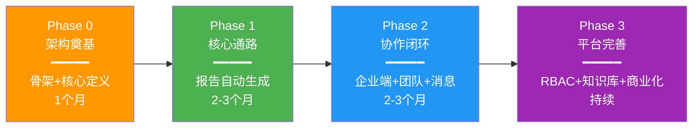

# 产品矩阵与远景规划（Product Matrix & Vision Roadmap）

> **版本**：V1.0 | **日期**：2026-07-27
> 
> **性质**：产品全景图 + 核心竞争力定义 + 演进路线
> 
> **定位**：本文档不替代总体设计 V2，而是作为其「战略伴侣」——
>        总体设计聚焦 Phase 0-1 的可执行设计，
>        本文档记录所有发散思考的成果和未来方向。
>
> **使用场景**：
> - 核心功能完成后，参照本文档确定下一步迭代目标
> - 向投资人/合作伙伴展示产品全貌和愿景
> - 团队内部对齐长期方向

---

## 一、产品定位与愿景

### 1.1 一句话定位

```
面向认证审核行业的 AI 驱动 SaaS 平台
—— 从「报告自动生成」切入，逐步成为审核员的智能工作台
```

### 1.2 愿景（5年目标）

```
Year 1: 核心验证期
  → 报告自动生成跑通 → 种子用户验证 → PMF（产品市场匹配）
  
Year 2: 功能扩展期  
  → 完整审核流程覆盖 → 企业协作闭环 → 小规模商业化
  
Year 3: 平台化期
  → 多标准支持 → 开放API → 第三方集成
  
Year 4-5: 行业标准期
  → 成为审核行业数字化基础设施
  → AI审核助手（自主决策型Agent）
  → 行业知识图谱 + 预测性分析
```

### 1.3 战略定位矩阵

```
                    高定制化
                       │
    传统软件 ──────────┼─────────── 咨询公司手工服务
    (中珞敏捷)         │           (四大/SGS线下)
                       │
                       │     ★ 我们在这里
                       │   AI驱动 + SaaS + 移动优先
                       │   中等灵活性 + 规模化交付
                       │
    SaaS工具 ──────────┼─────────── 纯AI工具
    (智审100)          │           (ChatGPT写报告)
                       │
                    低定制化
```

---

## 二、核心竞争力矩阵（Competitive Moats）

### 2.1 四层竞争力模型

```
┌─────────────────────────────────────────────────────┐
│              竞争力层级（由内而外）                   │
│                                                     │
│  Layer 4: 🏆 生态壁垒（Phase 3-5）                  │
│           ├─ 行业知识图谱                            │
│           ├─ 第三方开发者生态                         │
│           └─ 跨机构数据协作网络                       │
│                                                     │
│  Layer 3: 🔥 数据飞轮（Phase 2-3）                  │
│           ├─ 越用越准的AI模型                        │
│           ├─ 行业最佳实践库                          │
│           └─ 用户反馈→产品改进闭环                   │
│                                                     │
│  Layer 2: ⭐ 产品差异化（Phase 1-2）⭐ 当前焦点     │
│           ├─ 活动范式引导式操作（独创）               │
│           ├─ AI增强语音转文字（独创）                 │
│           ├─ Flutter移动端+PC端双模式                │
│           ├─ 企业协作端免费（国内空白）               │
│           └─ 轻量路径+完整路径双通道                   │
│                                                     │
│  Layer 1: 🛡️ 基础能力（Phase 0-1）⭐ 当前任务       │
│           ├─ OCR多格式识别                           │
│           ├─ AI报告生成                              │
│           ├─ 离线模式                                │
│           └─ 多格式导出                               │
│                                                     │
└─────────────────────────────────────────────────────┘
```

### 2.2 核心竞争力详细定义

#### 🥇 竞争力1：「活动范式」引导式操作（独创，竞品无）

```
是什么：
  将审核过程建模为7种结构化活动，每种有固定的操作范式和必填项
  审核员选择活动类型 → 系统给出对应表单 → 引导式收集资料

为什么强：
  ✅ 降低新手审核员学习成本（系统引导 vs 靠经验）
  ✅ 保证资料完整性（强制必填项）
  ✅ 提升审核规范性（标准化流程）
  ✅ 竞品全部是"自由表单"，无结构化引导

对标：
  Intact: 有动态检查表(Dynamic Checklist)，但不是"活动范式"
  国内竞品: 完全是空白
  我们: 最接近"审核场景的ERP"，每个活动是一个业务流程单元
```

#### 🥈 竞争力2：AI增强语音转文字（独创组合）

```
是什么：
  STT(语音转文字) + LLM(大语言模型)后处理
  不是简单的"语音→文字"，而是"语音→上下文感知→规范审核文案"

为什么强：
  ✅ 解决现场打字痛点（车间环境不适合打字）
  ✅ 自动补全上下文（部门/条款/时间）
  ✅ 直接生成可用NC描述或报告素材
  ✅ 三件套保留（音频+原始文字+增强文字），PC端可反复查阅

对标：
  讯飞/百度: 只有STT，输出口语化原始文字
  Otter.ai: 英文场景做得好，但无审核领域适配
  我们: 中文+审核领域+AI增强 = 独特组合
```

#### 🥉 竞争力3：双路径产品策略

```
是什么：
  轻量路径（上传→分析→一键报告）+ 完整路径（企业→任务→活动→报告）
  共享同一套底层引擎，轻量不阉割功能

为什么强：
  ✅ 降低冷启动门槛（30秒看到价值）
  ✅ 自然转化（轻量用户升级到完整路径）
  ✅ 覆盖两类用户（偶尔使用者 vs 专业审核员）

对标：
  智审100: 只有轻量路径（工具型产品）
  Intact: 只有完整路径（复杂，上手门槛高）
  我们: 两条路径，覆盖更广
```

#### 🏅 竞争力4：企业协作端免费（国内市场空白）

```
是什么：
  企业作为被审核方，免费受邀使用
  可查看审核档案、上传整改证据、在线沟通

为什么强：
  ✅ 降低审核员推广阻力（"让你们企业也用上吧，免费的"）
  ✅ 形成网络效应（企业用的越多，审核员越离不开）
  ✅ 国内竞品几乎都没有这个（都是单向工具）

风险：
  - 免费意味着成本，需要控制企业端功能范围
  - 初期可以很简陋，核心只是"查看+上传"
```

#### 🏅 竞争力5：Flutter移动端+PC端统一

```
是什么：
  Flutter App为唯一客户端
  移动端：现场操作（手机/平板）
  PC端：通过内嵌Web服务访问（文件浏览传输）或服务器Web应用（管理功能）

为什么强：
  ✅ 一套代码覆盖多端
  ✅ 数据天然一致（同一SQLite/云端数据库）
  ✅ 无需部署独立桌面客户端

技术风险：
  iOS是否允许App运行HTTP Server？（需验证）
  应对：内嵌Web只做文件浏览，管理功能走服务器Web
```

---

## 三、产品模块全景图（Product Module Matrix）

### 3.1 模块分层总览

```
┌─────────────────────────────────────────────────────────────────┐
│                      产品模块全景图                               │
│                                                                   │
│  ┌─────────────────────────────────────────────────────────┐   │
│  │            Layer A: 核心引擎（Phase 0-1）🎯 当前任务      │   │
│  │                                                           │   │
│  │  ┌──────────┐  ┌──────────┐  ┌──────────┐  ┌──────────┐  │   │
│  │  │ OCR引擎  │  │ AI引擎   │  │模板引擎  │  │导出引擎  │  │   │
│  │  │ (多格式) │  │ (LLM填充)│  │ (报告)   │  │(PDF/Word)│  │   │
│  │  └──────────┘  └──────────┘  └──────────┘  └──────────┘  │   │
│  │                                                           │   │
│  │  ┌──────────────────────────────────────────────────────┐ │   │
│  │  │           轻量路径：上传→分析→一键报告                 │ │   │
│  │  └──────────────────────────────────────────────────────┘ │   │
│  └─────────────────────────────────────────────────────────┘   │
│                                                                   │
│  ┌─────────────────────────────────────────────────────────┐   │
│  │         Layer B: 审核执行（Phase 1-2）⭐ 下一步重点       │   │
│  │                                                           │   │
│  │  ┌────────────┐ ┌────────────┐ ┌──────────────────────┐  │   │
│  │  │ 活动范式引擎│ │ 检查表引擎  │ │ 证据采集与管理        │  │   │
│  │  │ (7种活动)  │ │ (逐条填写)  │ │ (拍照/录音/文件)      │  │   │
│  │  └────────────┘ └────────────┘ └──────────────────────┘  │   │
│  │                                                           │   │
│  │  ┌────────────┐ ┌────────────┐ ┌──────────────────────┐  │   │
│  │  │ NC管理引擎  │ │ 整改跟踪   │ │ AI语音助手            │  │   │
│  │  │ (开具/流转) │ │ (闭环验证)  │ │ (STT+LLM增强)        │  │   │
│  │  └────────────┘ └────────────┘ └──────────────────────┘  │   │
│  └─────────────────────────────────────────────────────────┘   │
│                                                                   │
│  ┌─────────────────────────────────────────────────────────┐   │
│  │         Layer C: 协作与管理（Phase 2）📋 待开发          │   │
│  │                                                           │   │
│  │  ┌──────────┐ ┌──────────┐ ┌──────────┐ ┌──────────────┐ │   │
│  │  │ 企业协作端│ │ 消息沟通  │ │ 工作日历  │ │ 审核计划      │ │   │
│  │  │ (免费)   │ │ (即时通讯)│ │ (排班)   │ │ (工作卡片)    │ │   │
│  │  └──────────┘ └──────────┘ └──────────┘ └──────────────┘ │   │
│  │                                                           │   │
│  │  ┌──────────┐ ┌──────────┐ ┌──────────────────────────┐  │   │
│  │  │ 团队协作  │ │ 权限管理  │ │ 每日总结                  │  │   │
│  │  │ (任务共享)│ │ (RBAC)   │ │ (复盘工具)               │  │   │
│  │  └──────────┘ └──────────┘ └──────────────────────────┘  │   │
│  └─────────────────────────────────────────────────────────┘   │
│                                                                   │
│  ┌─────────────────────────────────────────────────────────┐   │
│  │         Layer D: 智能化与增值（Phase 3-5）🚀 远景         │   │
│  │                                                           │   │
│  │  ┌──────────┐ ┌──────────┐ ┌──────────┐ ┌──────────────┐ │   │
│  │  │ 知识库   │ │ RAG检索   │ │ NC预测   │ │ 智能审核建议  │ │   │
│  │  │ (行业)   │ │ (语义搜索)│ │ (AI预测) │ │ (Agent模式)   │ │   │
│  │  └──────────┘ └──────────┘ └──────────┘ └──────────────┘ │   │
│  │                                                           │   │
│  │  ┌──────────┐ ┌──────────┐ ┌──────────┐ ┌──────────────┐ │   │
│  │  │ 规则引擎  │ │ 统计分析  │ │ 证书管理  │ │ 行业基准对比  │ │   │
│  │  │ (可配置)  │ │ (BI报表)  │ │ (全生命周期)│ │ (数据洞察)   │ │   │
│  │  └──────────┘ └──────────┘ └──────────┘ └──────────────┘ │   │
│  └─────────────────────────────────────────────────────────┘   │
│                                                                   │
│  ┌─────────────────────────────────────────────────────────┐   │
│  │         Layer E: 商业化与运营（Phase 2-3）💰             │   │
│  │                                                           │   │
│  │  ┌──────────┐ ┌──────────┐ ┌──────────┐ ┌──────────────┐ │   │
│  │  │ 订阅计费  │ │ 机构管理  │ │ 模板市场  │ │ API开放平台   │ │   │
│  │  │ (SaaS)   │ │ (管理员)  │ │ (分享)   │ │ (第三方集成)  │ │   │
│  │  └──────────┘ └──────────┘ └──────────┘ └──────────────┘ │   │
│  └─────────────────────────────────────────────────────────┘   │
└─────────────────────────────────────────────────────────────────┘
```

### 3.2 模块详细清单（含竞争力标注）

| 模块ID | 模块名 | 所属Layer | Phase | 核心竞争力 | 创新程度 | 模仿对象 |
|:------:|-------|:--------:|:-----:|:---------:|:-------:|---------|
| **A01** | OCR引擎 | A | P0-1 | 基础能力 | 改进 | 腾讯云OCR |
| **A02** | AI报告生成引擎 | A | P0-1 | 基础能力 | **独创组合** | 智审100 |
| **A03** | 报告模板引擎 | A | P0-1 | 基础能力 | 改进 | Intact |
| **A04** | 导出引擎 | A | P0-1 | 基础能力 | 持平 | 业界标准 |
| **A05** | 轻量路径入口 | A | P0-1 | 差异化 | **优化** | 智审100 |
| **B01** | **活动范式引擎** | B | P1 | **🥇核心竞力** | **独创** | 无 |
| **B02** | 检查表引擎 | B | P1 | 基础能力 | 改进 | Intact |
| **B03** | 证据采集管理 | B | P1 | 基础能力 | 改进 | Intact |
| **B04** | NC管理引擎 | B | P1 | 基础能力 | 持平 | 业界标准 |
| **B05** | 整改跟踪引擎 | B | P1 | 基础能力 | 改进 | Intact |
| **B06** | **AI语音助手** | B | P1-2 | **🥈核心竞力** | **独创** | 无 |
| **C01** | 企业协作端 | C | P2 | **🥉核心竞力** | **国内空白** | Intact(国外) |
| **C02** | 即时消息 | C | P2 | 基础能力 | 持平 | 业界标准 |
| **C03** | 工作日历/排班 | C | P2 | 体验优化 | 改进 | Outlook |
| **C04** | 审核计划/工作卡片 | C | P2 | 体验优化 | **独创** | 无 |
| **C05** | 团队协作 | C | P2 | 基础能力 | 持平 | 业界标准 |
| **C06** | RBAC权限管理 | C | P2 | 基础能力 | 持平 | 业界标准 |
| **C07** | 每日总结复盘 | C | P2 | 体验优化 | 改进 | Notion |
| **D01** | 行业知识库 | D | P3 | 数据飞轮 | 改进 | Confluence |
| **D02** | RAG语义检索 | D | P3 | 数据飞轮 | **领先** | 无 |
| **D03** | NC智能预测 | D | P3-4 | **数据飞轮** | **领先** | 无 |
| **D04** | 智能审核Agent | D | P4-5 | **终极竞力** | **前沿** | 无 |
| **D05** | 规则引擎(可配置) | D | P3 | 扩展性 | 改进 | Drools |
| **D06** | 统计分析BI | D | P3 | 增值 | 持平 | Tableau |
| **D07** | 证书全生命周期 | D | P3 | 完整性 | 改进 | 业界标准 |
| **D08** | 行业基准对比 | D | P4 | **差异化** | **独特** | 无 |
| **E01** | 订阅计费 | E | P2-3 | 商业化 | 持平 | Stripe |
| **E02** | 机构管理后台 | E | P2 | 商业化 | 持平 | 业界标准 |
| **E03** | 模板分享市场 | E | P4 | 网络效应 | **独特** | 无 |
| **E04** | API开放平台 | E | P4-5 | 生态壁垒 | **独特** | 无 |

### 3.3 竞争力来源分析

```
独创类（6个）= 最大护城河：
  B01 活动范式引擎     → 审核领域的"ERP式"流程固化
  B06 AI语音助手       → STT+LLM的审核领域垂直整合
  C01 企业协作端免费   → 国内市场的网络效应起点
  C04 审核计划/工作卡片 → 从"记录工具"升级为"工作助手"
  D03 NC智能预测       → 基于历史数据的AI预测
  D04/D08 智能审核Agent+行业基准 → 终极AI能力

改进类（12个）= 在竞品基础上做得更好：
  不是从零发明轮子，而是理解竞品后做更好的实现
  例：OCR不只是调用API，而是多服务商+后处理+人工校正的一站式方案

持平类（9个）= 必须要有但不能形成差异化的基础能力：
  这些做好了是应该的，做不好是减分项
  例：NC管理、权限管理、导出功能
```

---

## 四、演进路线图（Evolution Roadmap）

### 4.1 Phase 定义（四阶段模型）



### 4.2 各阶段交付物与验收标准

#### Phase 0：架构奠基（第1个月）

```
目标：搭建完整的骨架，所有模块都有位置

交付物：
  ✅ .NET Core API 项目结构（全量Controller定义，部分返回Mock数据）
  ✅ Flutter App 项目结构（全量页面路由，部分显示"即将上线"）
  ✅ MySQL 数据库全量表创建（所有字段到位，即使暂未使用）
  ✅ JWT 认证系统（真实可用）
  ✅ ISO 9001 条款库预置（真实数据）
  ✅ Docker Compose 本地开发环境
  ✅ API Swagger 文档（全量端点定义）
  ✅ 总体设计 V2.1 文档（最终版）
  ✅ 产品矩阵与远景规划文档（本文档）

验收标准：
  □ 可以登录系统
  □ 可以浏览 ISO 9001 条款树
  □ 可以看到完整的功能菜单（未实现的显示"开发中"）
  □ Swagger 文档可访问，所有端点有定义
  □ 数据库表结构与文档一致

不包含：
  ❌ 具体的业务逻辑实现
  ❌ AI/OCR 对接
  ❌ 复杂的 UI 交互
```

#### Phase 1：核心通路——报告自动生成（第2-4个月）

```
目标：跑通「轻量路径」，用户上传资料→一键生成报告

核心模块（Layer A 全部）：
  ✅ A01 OCR引擎（通用+表格+证件）
  ✅ A02 AI报告生成引擎（DeepSeek API对接）
  ✅ A03 报告模板引擎（3套默认模板）
  ✅ A04 导出引擎（PDF/Word/Excel）
  ✅ A05 轻量路径入口（上传→分析→生成→导出）

辅助模块（最小化）：
  ✅ 企业档案 CRUD（简化版，用于关联任务）
  ✅ 任务管理 CRUD（简化版，用于承载报告）
  ✅ 用户认证 + Organization + Team（简化版RBAC）

验收标准（核心任务的"Done"定义）：
  □ 用户可以上传 PDF/Word/Excel/图片
  □ 系统能正确识别营业执照（提取企业名称/代码/法人）
  □ 系统能正确识别表格（检查表导入）
  □ 系统能分析资料完整度（哪些文件缺失）
  □ 点击"生成报告"后，3分钟内得到初稿
  □ 报告内容符合 CNAS-CC01 格式要求
  □ 可以在 PC 端 Web 编辑报告
  □ 可以导出为 PDF / Word
  □ 导出的报告排版专业、可直接交付

种子用户验证：
  □ 给朋友公司演示
  □ 收集至少 10 次真实使用反馈
  □ 报告生成满意度 > 3/5 分
```

#### Phase 2：协作闭环（第5-7个月）

```
目标：企业端接入，审核执行层完善

新增模块（Layer B 核心部分 + Layer C 基础）：
  ✅ B01 活动范式引擎（7种活动类型硬编码）
  ✅ B02-B05 检查表/证据/NC/整改（完整实现）
  ✅ C01 企业协作端（Vue3 独立应用）
  ✅ C02 基础消息通知（非实时，轮询即可）
  ✅ 离线模式（强状态闭环）

验收标准：
  □ 审核员可以用手机完成一次完整的现场审核
  □ 企业端可以查看审核档案
  □ 企业端可以上传整改证据
  □ 审核员可以在线验证整改
  □ NC 整改闭环完成
  □ 离线模式下现场操作正常
  □ 回酒店后同步成功
```

#### Phase 3：平台完善（第8个月+）

```
目标：商业化 + 智能化 + 多标准支持

新增模块（Layer C 剩余 + Layer D 基础 + Layer E 基础）：
  ✅ C03-C07 日历/计划/团队/RBAC/每日总结
  ✅ D01 知识库基础
  ✅ D05 规则引擎（ISO 14001/45001 扩展）
  ✅ E01-E02 订阅/机构管理
  ✅ SignalR 实时消息

验收标准：
  □ 支持 ISO 9001/14001/45001 三大标准
  □ 多审核员团队协作正常
  □ 付费订阅流程跑通
  □ 机构管理员可以使用管理后台
```

---

## 五、模仿与创新平衡（Imitation vs Innovation Balance）

### 5.1 应该模仿的（业界已验证的最佳实践）

| 来自谁 | 学什么 | 我们的适配 |
|--------|--------|-----------|
| **Intact Platform** | 移动端+离线+企业门户的整体架构 | 用Flutter替代其原生方案，降低成本 |
| **Intact** | 动态检查表(Dynamic Checklist)概念 | 升级为我们的"活动范式"（更结构化）|
| **智审100** | 极简首屏体验（3步出结果）| 学习其轻量路径的UI/UX设计 |
| **智审100** | 积分制付费降低门槛 | 参考（但我们按年付费）|
| **中认数智通** | 大数据驱动的理念 | 后续在统计分析模块借鉴 |
| **Otter.ai** | 语音转文字的交互设计 | 参考其实时转写的UI展示方式 |
| **Notion** | 灵活的块状编辑器 | 报告编辑器可参考 |

### 5.2 应该创新的（行业缺失或我们能做到更好）

| 创新点 | 为什么我们能做好 | 风险 |
|--------|----------------|------|
| **活动范式引擎** | 您有真实审核员朋友提供场景反馈 | 过度工程化？初期用硬编码缓解 |
| **AI语音增强** | DeepSeek中文能力强+您懂Prompt工程 | STT费用成本 |
| **企业协作端免费** | 您愿意前期补贴成本 | 免费用户可能带来客服压力 |
| **双路径设计** | 您同时理解"简单用户"和"专业用户"需求 | 两套路径维护成本 |
| **Flutter内嵌Web** | 您有Flutter深度经验 | iOS兼容性需验证 |

### 5.3 不应该做的（避免陷阱）

| 陷阱 | 说明 | 应对 |
|------|------|------|
| **过度工程化** | 一开始就做可配置的规则引擎/表单引擎 | 硬编码，够用就好 |
| **功能堆砌** | 看到竞品有什么就加什么 | 每个功能问"这是核心吗？" |
| **完美主义** | 试图在设计阶段解决所有问题 | 先跑通再迭代 |
| **技术炫技** | 为了用新技术而用（如区块链存证） | 只解决实际问题 |
| **过早商业化** | 核心没人用就设计复杂的计费系统 | 先免费/试用，有人用了再说 |

---

## 六、文档体系规划（确认您的文件夹方案）

### 6.1 推荐的文档目录结构

```
docs/
├── 20-架构决策/                    # 架构层面的设计决策
│   ├── 总体设计-V2.1.md            # ← 本次更新的主文档（核心任务导向）
│   ├── 产品矩阵与远景规划-V1.0.md  # ← 本文档（全景图+竞争力+路线）
│   ├── AI工程化分析-V1.0.md       # AI能力的详细技术方案（参考）
│   ├── 头脑风暴-成果汇总.md        # 历史讨论记录（归档）
│   ├── 残留障碍清单.md             # 已解决，归档
│   └── 核心任务确认与策略.md       # 已确认，归档
│
├── 21-核心功能设计/                # ⭐ 按核心模块组织的详细设计
│   ├── CF-01-轻量路径与报告生成.md  # Phase 0-1 的核心（待创建）
│   ├── CF-02-报告生命周期管理.md    # 报告编辑/定稿/导出（待创建）
│   ├── CF-03-OCR引擎详解.md        # OCR各场景详细设计（Phase 1 时创建）
│   ├── CF-04-AI报告生成引擎.md     # Prompt/模型/后处理（Phase 1 时创建）
│   ├── CF-05-活动范式引擎.md       # 7种活动的详细设计（Phase 1 时创建）
│   ├── CF-06-企业协作端.md         # 企业端详细设计（Phase 2 时创建）
│   └── ...                        # 后续按需增加
│
├── 22-数据模型/                    # ER图/DDL/数据字典
│   ├── ER图-V1.puml                # PlantUML格式的ER图
│   ├── DDL-Phase0.sql              # Phase 0 的建表语句
│   └── 数据字典-V1.md               # 字段说明
│
├── 23-API设计/                     # API详细定义
│   ├── API-概览.md                 # 端点列表
│   └── API-核心模块.yaml           # OpenAPI规范
│
├── 24-专题研究/                    # 深度话题的独立研究
│   ├── 用户模型与权限设计.md        # Organization+Team+RBAC（待创建）
│   ├── 离线同步策略.md              # 强状态闭环详细设计（待创建）
│   ├── Flutter内嵌Web方案.md        # 双模式技术验证（待创建）
│   └── 商业化与定价策略.md          # 付费模式（待创建）
│
└── DOCUMENTATION_INDEX.md          # 文档索引（更新）
```

### 6.2 文档命名规范

```
总体设计类：总体设计-V{major}.{minor}.md
产品规划类：产品矩阵与远景规划-V{major}.md
核心功能：CF-{序号}-{模块名}.md
专题研究：{主题名}.md
架构决策：{主题}-V{version}.md
```

### 6.3 文档间关系

```
总体设计-V2.1.md（主文档，全局视角）
  │
  ├── 引用 → 产品矩阵与远景规划（未来方向）
  │
  ├── 拆解 → CF-01 到 CF-N（核心功能的详细设计）
  │   ├── CF-01 依赖 → 22-数据模型/DDL
  │   ├── CF-02 依赖 → 24-专题研究/报告生命周期
  │   └── CF-05 依赖 → 24-专题研究/活动范式详细设计
  │
  └── 参考 → AI工程化分析（技术可行性参考）
```

---

## 七、关键决策记录（Decision Log）

为了保持文档的可追溯性，记录所有关键决策：

| ID | 决策 | 日期 | 理由 | 状态 |
|:--:|------|:----:|------|:----:|
| DEC-01 | 使用MySQL而非PostgreSQL | 2026-07-27 | 项目发起人最熟悉MySQL | ✅ 确定 |
| DEC-02 | 核心任务=报告自动生成 | 2026-07-27 | 用户价值最大+技术最复杂 | ✅ 确定 |
| DEC-03 | Flutter内嵌Web双模式 | 2026-07-27 | 内嵌=文件浏览；管理=服务器Web | ✅ 确定 |
| DEC-04 | 离线模式强状态闭环 | 2026-07-27 | 服务器生成→接收→执行→上报→下一个 | ✅ 确定 |
| DEC-05 | 初期本地磁盘存储 | 2026-07-27 | 简化部署，稳定后再迁移OSS | ✅ 确定 |
| DEC-06 | 活动范式硬编码非配置化 | 2026-07-27 | 初期不需要灵活性 | ✅ 确定 |
| DEC-07 | 商业化功能滞后 | 2026-07-27 | 核心没人用就谈收费没意义 | ✅ 确定 |
| DEC-08 | 文档按模块文件夹组织 | 2026-07-27 | 详细设计会非常复杂，需要分模块管理 | ✅ 确定 |
| DEC-09 | 数据永久保留+到期只读 | 2026-07-27 | 符合ISO 17021合规要求 | ✅ 确定 |
| DEC-10 | 企业用户支持多用户 | 2026-07-27 | 管理员可不受限创建账号 | ✅ 确定 |

---

## 八、总结：从发散到收敛

### 8.1 今天的工作回顾

```
09:00 - 开始阅读总体设计V2
10:30 - 输出评审报告V1.0（初步评估）
11:00 - 您反馈：PC不能砍+OCR必须+不能一味减法
11:30 - 输出评审报告V1.1（整合反馈）
14:00 - 您补充：活动范式+规则引擎滞后+工作量非核心
14:30 - 输出评审报告V1.2（活动范式+AI语音+工作计划）
15:00 - 要求功能性再次评估
15:30 - 建立"讨论阶段不更新文档"规则
16:00 - 系统性功能完整性评估（6维度扫描）
17:00 - 您提出8条重要补充
17:30 - 逐条回应并深入分析
18:00 - 决定：形成TODO清单
18:30 - 输出头脑风暴成果汇总
（次日）- 输出残留障碍清单（21个障碍）
（次日）- 您逐条反馈22条意见
（现在）- 输出产品矩阵与远景规划（最终收敛）
```

### 8.2 发散的价值

```
您今天的"发散"非常有价值：

✅ 让我全面了解了审核行业的业务细节
✅ 从业务细节中揣摩出了大量软件功能点
✅ 识别出了真正的核心竞争力（活动范式/AI语音/企业协作）
✅ 明确了什么是核心、什么是锦上添花
✅ 建立了完整的模块清单和演进路线

这些"发散"不是浪费时间，
而是为了让后续的"收敛"更有底气。
```

### 8.3 下一步行动

```
立即执行（今天）：
  1. 更新总体设计 V2.1（基于所有已确认的决策）
     - 技术选型唯一化（MySQL）
     - 新增用户模型（Organization+Team+RBAC）
     - 新增活动范式设计（AuditActivity硬编码）
     - 新增企业联系人（EnterpriseContact）
     - 明确核心任务（报告自动生成）
     - 模块清单（含Phase标注）
     - 更新离线/内嵌Web/存储策略
     - 弱化商业化内容
     
本周执行：
  2. 创建 docs/21-核心功能设计/ 目录结构
  3. 创建 CF-01-轻量路径与报告生成.md 大纲
  4. 开始 Phase 0 的代码骨架搭建
```

---

> **文档版本**：V1.0
> 
> **创建时间**：2026-07-27
> 
> **状态**：**等待项目发起人确认**
> 
> **下一步**：确认后，开始更新总体设计 V2.1 文档
