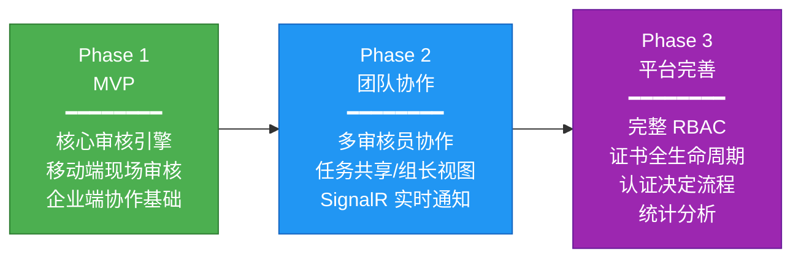
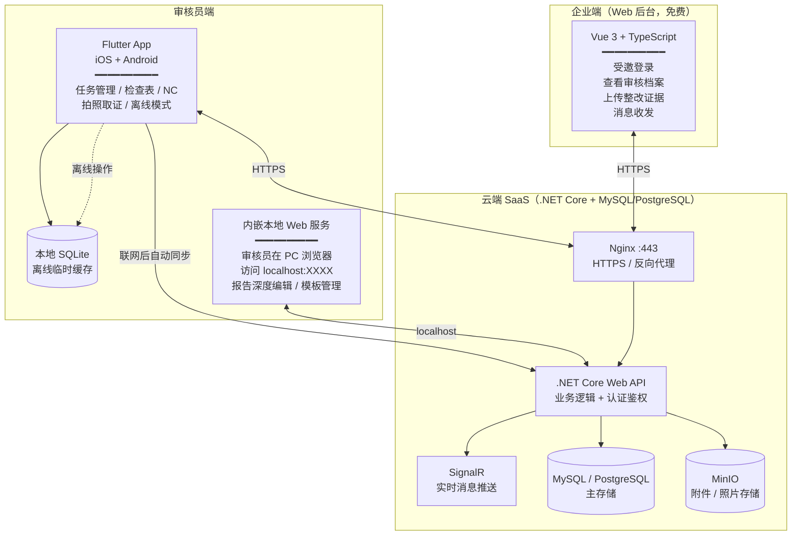
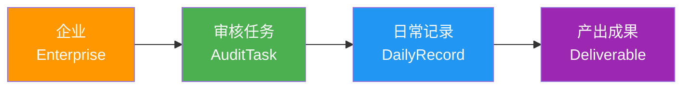
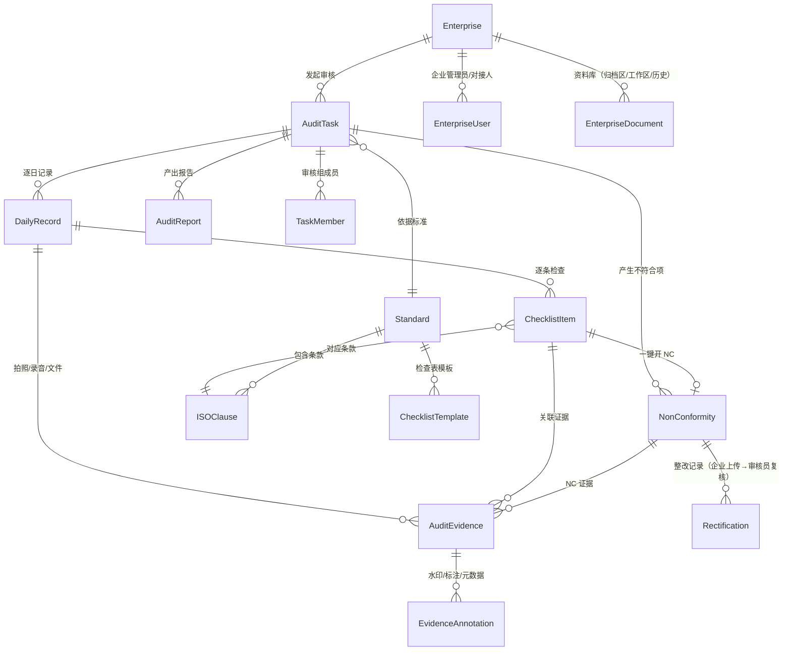
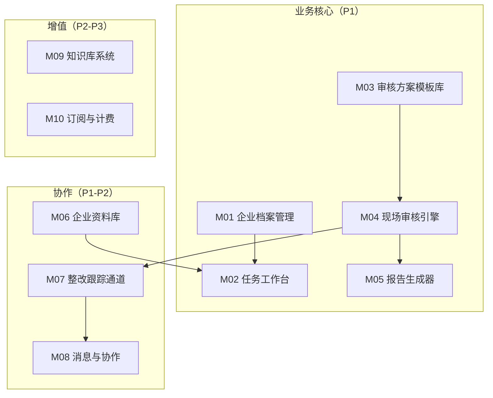

---
AIGC:
    Label: "1"
    ContentProducer: 001191440300708461136T1XGW3
    ProduceID: 9a16bac6e27d25132787d930f50d9879_575320d1899711f18108525400287e28
    ReservedCode1: IAJ60xaGIcWkCUTERr2JXn/oLF9FG+mQjjrHV6Wgs9G5W/Lo5SKyggMmWTubn9I0gp1DMMUOkq5rnt/z+v1OdorJ8GZxfC4o8w8QL/0LDBlO32+kQlnYmhNkQ+FjyWJD9EfO8PMf3zo+mtRVr/z5SuzLdbTuo4GbYOvnpKKVqnzkuWrFC4W6vA+TBt8=
    ContentPropagator: 001191440300708461136T1XGW3
    PropagateID: 9a16bac6e27d25132787d930f50d9879_575320d1899711f18108525400287e28
    ReservedCode2: IAJ60xaGIcWkCUTERr2JXn/oLF9FG+mQjjrHV6Wgs9G5W/Lo5SKyggMmWTubn9I0gp1DMMUOkq5rnt/z+v1OdorJ8GZxfC4o8w8QL/0LDBlO32+kQlnYmhNkQ+FjyWJD9EfO8PMf3zo+mtRVr/z5SuzLdbTuo4GbYOvnpKKVqnzkuWrFC4W6vA+TBt8=
---

# 体系认证审核平台——总体设计（V2.0）

> **版本**：V2.0 | **日期**：2026-07-27 | **状态**：成熟态
>
> **背景**：V1 阶段将总体设计拆分为"企业方案"和"个人工具"两条路线。经过多轮讨论，两条路线收敛为统一的 **SaaS 平台方案**——面向审核员和认证机构的按年付费 SaaS，企业为协作方（免费受邀使用）。本文档为收敛后的全新总体设计，替换此前的分路线文档。
>
> **前置文档**：
> - 总体设计-V1.md（已归档至 docs/历史文档/）
> - 总体设计-企业方案-V1.md（本 V2 发布后归档）
> - 总体设计-个人工具-V1.md（本 V2 发布后归档）
> - 系统定位与演进路线-V1.md（三阶段演进路线）
> - 术语表-V1.md（领域术语定义）
>
> **变更记录**：
> | 版本 | 日期 | 变更说明 |
> |------|------|---------|
> | V1.0 | 2026-07-27 | 初版，两条路线的分别设计 |
> | V2.0 | 2026-07-27 | 收敛为统一 SaaS 平台方案；新增商业模式、企业端设计、Flutter 内嵌 Web 服务方案、核心领域模型重建 |
| V2.0 | 2026-07-27 | 补充双路径使用模式、OCR 智能录入方案、企业定制导出、功能模块化设计 |

---

## 目录

1. [背景与定位](#一背景与定位)
2. [系统架构图](#二系统架构图)
3. [核心领域模型](#三核心领域模型)
4. [模块划分与功能清单](#四模块划分与功能清单)
5. [数据库设计概要](#五数据库设计概要)
6. [API 设计总纲](#六api-设计总纲)
7. [移动端设计](#七移动端设计)
8. [企业端设计](#八企业端设计)
9. [部署架构](#九部署架构)
10. [Phase 1 MVP 实施清单与工作量估算](#十phase-1-mvp-实施清单与工作量估算)
11. [附录：竞品分析摘要与市场机会](#附录竞品分析摘要与市场机会)

---

## 一、背景与定位

### 1.1 产品定位

**面向审核员和认证机构的 SaaS 平台，企业为协作方（免费受邀使用）。**

| 维度 | 说明 |
|------|------|
| **目标客户** | 认证机构（CB）和独立审核员/审核团队——按年付费订阅使用 |
| **企业端** | 免费受邀使用——作为审核对象的协作方，查看审核档案、上传整改证据、消息沟通 |
| **审核员端** | Flutter App（移动端）作为第一操作平台，内嵌本地 Web 服务供 PC 浏览器访问（报告编辑等深度操作） |
| **核心价值** | 覆盖审核全流程：计划 → 现场执行 → NC 管理 → 整改跟踪 → 报告生成 → 证书管理 → 资料归档 |
| **市场竞争** | 国内缺乏面向中小认证机构/独立审核员的移动优先 SaaS 审核平台，有企业协作端的产品几乎空白 |

### 1.2 商业模式

| 维度 | 方案 |
|------|------|
| **收费模式** | 按年付费 SaaS（不按报告次数收费） |
| **付费方** | 认证机构 / 审核团队（按机构/团队账号数计费） |
| **企业端** | 免费——作为协作对象受邀使用，不计入付费账号 |
| **过期策略** | 订阅到期后 3 个月缓冲期，期间数据保留但不可新建任务；超过 3 个月服务器数据清空 |
| **独立审核员** | 初期可提供免费试用或低价个人版，降低获客门槛 |

### 1.3 三阶段演进路线

沿用系统定位与演进路线-V1.md 的三阶段规划，V2 不再区分"企业方案"与"个人工具"两条路线，而是统一平台内按功能迭代：



| Phase | 定位 | 关键交付 |
|-------|------|---------|
| **P1** | MVP——单审核员可用 + 企业可协作 | 审核任务 CRUD、检查表逐条填写、NC 开具与管理、拍照取证（水印/GPS）、离线模式、报告一键生成、企业端查看档案+上传整改 |
| **P2** | 团队协作 | 任务共享与指派、组长视图、SignalR 消息推送、MySQL/Redis/MinIO 云端化 |
| **P3** | 平台完善 | 完整 RBAC、审核员资质管理、证书全生命周期、认证决定流程、统计分析 |

### 1.4 不做什么（明确边界）

| 不做 | 原因 | 
|------|------|
| 审核员内部管理（排班/考勤/薪资） | 属于机构 HR/OA 范畴 |
| 出差审批 / 费用报销 | OA 范畴 |
| 电子签章对接（CA 认证） | P1-P2 使用图片签名即可 |
| 知识图谱分析 | 数据量不足时无意义 |
| 多语言 | 初期仅中文 |

### 1.5 双路径使用模式

系统设计两条并行的使用路径，共享底层引擎但入口和交互完全不同。

#### 1.5.1 轻量路径：「上传资料 → 自动分析完整度 → 一键生成报告」

- 首页显著「快速出报告」入口，降低首次使用门槛
- 用户无需提前建企业、建任务
- 上传审核资料（支持批量上传 + OCR 提取）
- 系统后台自动创建临时企业和临时任务（对用户透明）
- 引擎分析资料完整度（哪些检查项已有证据、哪些缺失、缺失项风险等级）
- 一键生成审核报告
- 用户可随时点「转为正式任务」升级到完整路径（自动补全企业和任务信息）

#### 1.5.2 完整路径：「企业档案 → 创建任务 → 现场记录 → 整改跟踪 → 报告归档」

- 标准工作台入口
- 覆盖企业 → 任务 → 日常 → 成果全闭环
- 企业协作、方案模板、知识库等增强模块在此路径可用

#### 1.5.3 共用底层引擎

两条路径共享以下核心引擎，确保输出一致：

| 引擎 | 说明 |
|------|------|
| OCR 资料提取引擎 | 识别上传资料中的关键信息 |
| 完整度分析引擎 | 检查表 vs 已有证据的覆盖率分析，标记缺失项及风险等级 |
| 报告生成引擎 | 同一套模板系统，轻量与完整路径产出相同格式的报告 |
| 整改跟踪引擎 | NC 管理与整改闭环 |

#### 1.5.4 设计原则

轻量路径不阉割功能，而是自动填补用户跳过的步骤。轻量用户看到的与完整用户拿到的是同一份报告。

---

## 二、系统架构图

### 2.1 分层架构总览



### 2.2 核心技术选型

| 层 | 技术栈 | 说明 |
|----|--------|------|
| **移动端** | Flutter | 唯一客户端，涵盖手机/平板/PC（通过内嵌 Web 服务） |
| **后端** | .NET Core Web API | 业务逻辑、认证鉴权、数据同步 |
| **数据库** | MySQL / PostgreSQL（云端主存储）+ SQLite（移动端离线缓存） | 云端为主，SQLite 仅作为离线采集临时存储，联网自动同步 |
| **前端 Web** | Vue 3 + TypeScript | 审核员 PC 管理后台（通过 Flutter 内嵌 Web 服务访问）+ 企业端 |
| **对象存储** | MinIO | 云端附件/照片存储 |
| **消息推送** | SignalR（实时通知）+ 短信/邮件备份通道 | 关键动作双方收到推送 |
| **离线同步** | 增量同步 + 冲突检测 | 移动端本地 SQLite → 联网后自动同步到云端 |

### 2.3 Flutter 内嵌 Web 服务方案

审核员在 PC 端的使用场景（报告深度编辑、模板管理、历史档案查阅）通过 Flutter App 内嵌的本地 Web 服务实现：

```
┌──────────────────────────────────────────────────────────┐
│              Flutter App（运行在 Mac/PC 或手机上）           │
│                                                          │
│  ┌────────────────────────────────────────────────────┐  │
│  │         内嵌 Web Server（如 shelf 包）               │  │
│  │  监听 localhost:XXXX                                │  │
│  │                                                    │  │
│  │  ┌──────────────────────────────────────────────┐  │  │
│  │  │  Vue 3 前端静态资源（打包内置于 Flutter App）    │  │  │
│  │  │  - SPA 路由（审核管理 / 报告编辑 / 模板管理）    │  │  │
│  │  │  - 通过 API 代理访问云端 .NET Core 后端         │  │  │
│  │  └──────────────────────────────────────────────┘  │  │
│  └────────────────────────────────────────────────────┘  │
│                          │                               │
│          审核员在 PC 浏览器输入                           │
│          http://<手机IP>:XXXX 即可访问                    │
└──────────────────────────────────────────────────────────┘
```

| 组件 | 技术 | 说明 |
|------|------|------|
| Web 服务 | Flutter `shelf` 包 | 轻量 HTTP 服务，监听 localhost |
| 前端资源 | Vue 3 SPA 构建产物 | 嵌入 Flutter assets，由 shelf 托管 |
| API 代理 | shelf 中间件 | 将 `/api/*` 请求转发到云端 .NET Core 后端，携带 JWT |
| 访问方式 | 手机热点 + 局域网 IP | 审核员在 PC 浏览器访问 `http://192.168.x.x:8080` |

**优势**：无需部署独立的 PC 客户端或 Web 服务；审核员只需一部安装了 App 的手机，现场用手机、回酒店用 PC 浏览器，数据始终一致。

---

## 三、核心领域模型

### 3.1 主线：企业 → 任务 → 日常 → 成果



### 3.2 核心实体关系（ER 概要）



### 3.3 四大核心实体详述

#### 3.3.1 Enterprise（企业）——核心实体

| 字段 | 类型 | Phase | 说明 |
|------|------|:---:|------|
| id | UUID PK | P1 | |
| name | VARCHAR(200) | P1 | 企业全称 |
| short_name | VARCHAR(100) | P1 | 简称 |
| credit_code | VARCHAR(50) | P2 | 统一社会信用代码 |
| legal_person | VARCHAR(50) | P2 | 法人代表 |
| address | TEXT | P1 | 企业地址 |
| cert_scope | TEXT | P1 | 认证范围描述 |
| employee_count | INT | P2 | 体系覆盖人数 |
| contact_name_1 | VARCHAR(50) | P1 | 对接人 1 |
| contact_phone_1 | VARCHAR(20) | P1 | 对接人 1 电话 |
| contact_name_2 | VARCHAR(50) | P2 | 对接人 2 |
| contact_phone_2 | VARCHAR(20) | P2 | 对接人 2 电话 |
| status | ENUM | P1 | normal / under_audit / rectifying / suspended / terminated |
| audit_timeline | JSON | P2 | 历史审核时间线 [{date, audit_type, result}] |
| created_at / updated_at | TIMESTAMP | P1 | 审计字段 |

**资料库三层结构**：

```
企业资料库
├── 归档区（AuditTask 关闭后自动迁移）
│   ├── 任务一归档（报告 + NC 清单 + 证据包）
│   └── 任务二归档（...）
├── 工作区（进行中的 AuditTask 产生的临时资料）
│   └── 当前任务工作文件
└── 历史沉淀（企业基础资料、体系文件）
    ├── 营业执照
    ├── 体系文件
    └── 过往证书
```

#### 3.3.2 AuditTask（审核任务）——生命周期

| 字段 | 类型 | Phase | 说明 |
|------|------|:---:|------|
| id | UUID PK | P1 | |
| task_no | VARCHAR(30) UNIQUE | P1 | 任务编号 |
| enterprise_id | UUID FK | P1 | 被审核企业 |
| standard_id | UUID FK | P1 | 认证标准 |
| audit_type | ENUM | P1 | 初审 Stage1 / 初审 Stage2 / 监督审核 / 再认证 / 特殊审核 |
| planned_date_from | DATE | P1 | 计划开始日期 |
| planned_date_to | DATE | P1 | 计划结束日期 |
| actual_date_from | DATE | P2 | 实际开始日期 |
| actual_date_to | DATE | P2 | 实际结束日期 |
| departments | JSON | P1 | 审核部门列表 [{name, date, contacts}] |
| clause_coverage | JSON | P2 | 条款覆盖范围 |
| task_status | ENUM | P1 | pending → in_progress → completed → closed |
| audit_conclusion | ENUM | P2 | 推荐认证 / 有条件推荐 / 不推荐 |
| notes | TEXT | P1 | 备注（首次/末次会议纪要） |
| created_at / updated_at | TIMESTAMP | P1 | |

**生命周期与状态流转**：

```
┌──────────┐    ┌───────────┐    ┌───────────┐    ┌──────────┐
│ pending  │───→│in_progress│───→│ completed │───→│  closed  │
│ 待实施   │    │  进行中   │    │  已完成   │    │  已关闭  │
└──────────┘    └───────────┘    └───────────┘    └──────────┘
                     │                                 ▲
                     │                 ┌───────────┐   │
                     └────────────────→│ rectifying │───┘
                                       │  整改跟踪  │
                                       └───────────┘
```

**关闭前强制检查**：
- 所有 NC 已关闭（状态 = closed）
- 审核报告已生成并确认
- 双方确认（审核员 + 企业对接人）
- 资料工作区自动归档到企业资料库归档区

#### 3.3.3 DailyRecord（日常记录）——现场审核核心

| 字段 | 类型 | Phase | 说明 |
|------|------|:---:|------|
| id | UUID PK | P1 | |
| task_id | UUID FK | P1 | 所属审核任务 |
| record_date | DATE | P1 | 记录日期 |
| department | VARCHAR(100) | P1 | 审核部门 |
| summary | TEXT | P1 | 当日小结 |

每条 DailyRecord 下包含多个 ChecklistItem：

| 字段 | 类型 | Phase | 说明 |
|------|------|:---:|------|
| id | UUID PK | P1 | |
| daily_record_id | UUID FK | P1 | 所属日常记录 |
| clause_id | UUID FK | P1 | 对应标准条款 |
| result | ENUM | P1 | 符合 / 不符合 / 不适用 |
| remark | TEXT | P1 | 审核备注 |
| evidence_ids | JSON | P1 | 关联证据 ID 列表 |
| nc_id | UUID FK NULL | P1 | 关联的 NC ID（一键开 NC） |
| sort_order | INT | P1 | 排序号 |
| is_offline | BOOL | P1 | 是否离线采集 |
| synced_at | TIMESTAMP | P1 | 同步时间 |

**核心操作流**：按检查表逐条记录 → 拍照关联检查项 → 发现问题一键开 NC → 离线模式无网环境正常工作 → 联网后自动同步

#### 3.3.4 Deliverable（产出成果）

| 成果物 | 说明 | Phase |
|--------|------|:---:|
| **审核报告** | 一键生成（汇总 NC + 检查表 + 审核结论），导出 PDF/Word | P1 |
| **不符合项清单（NC List）** | 按严重度分类的 NC 汇总表 | P1 |
| **整改证据包** | 企业上传整改证据 → 审核员复核确认后的最终版，版本锁定 | P1 |
| **证书建议** | 基于审核结论的证书建议（P3 接入完整认证决定流程） | P2 |

### 3.4 NonConformity（不符合项）

| 字段 | 类型 | Phase | 说明 |
|------|------|:---:|------|
| id | UUID PK | P1 | |
| nc_no | VARCHAR(30) UNIQUE | P1 | NC 编号 |
| task_id | UUID FK | P1 | 所属审核任务 |
| clause_id | UUID FK | P1 | 引用条款 |
| severity | ENUM | P1 | major / minor / observation |
| description | TEXT | P1 | 不符合事实描述 |
| evidence_ids | JSON | P1 | 关联证据 ID 列表 |
| nc_status | ENUM | P1 | opened → enterprise_acknowledged → rectifying → pending_verification → closed / rejected |
| due_date | DATE | P1 | 整改截止日 |
| closed_at | TIMESTAMP | P1 | 关闭时间 |

### 3.5 Rectification（整改记录）

| 字段 | 类型 | Phase | 说明 |
|------|------|:---:|------|
| id | UUID PK | P1 | |
| nc_id | UUID FK | P1 | 所属 NC |
| submitted_by | ENUM | P1 | enterprise（企业）/ auditor（审核员补充） |
| correction | TEXT | P1 | 纠正描述 |
| corrective_action | TEXT | P1 | 纠正措施（含根因分析） |
| evidence_ids | JSON | P1 | 整改证据 ID 列表 |
| version | INT | P1 | 版本号（退回后重新提交递增） |
| verified_result | ENUM NULL | P1 | 通过 / 退回 |
| verified_remark | TEXT | P1 | 审核员验证说明 |
| submitted_at | TIMESTAMP | P1 | 提交时间 |
| verified_at | TIMESTAMP | P1 | 验证时间 |

### 3.6 AuditEvidence（审核证据）

| 字段 | 类型 | Phase | 说明 |
|------|------|:---:|------|
| id | UUID PK | P1 | |
| task_id | UUID FK | P1 | 所属审核任务 |
| evidence_type | ENUM | P1 | photo / voice / file |
| file_path_local | VARCHAR(500) | P1 | 本地文件路径 |
| file_path_remote | VARCHAR(500) | P1 | MinIO 路径（同步后） |
| file_hash | VARCHAR(64) | P1 | SHA-256 哈希 |
| file_size | BIGINT | P1 | 文件大小 |
| content_text | TEXT | P1 | 文字描述 |
| geo_location | VARCHAR(200) | P1 | GPS 坐标（JSON: {lat, lng}） |
| recorded_at | TIMESTAMP | P1 | 证据采集时间 |
| sync_status | ENUM | P1 | local_only / syncing / synced / sync_failed |
| device_model | VARCHAR(100) | P1 | 设备型号（EXIF） |
| exif_valid | BOOL | P1 | EXIF 完整性 |

---

## 四、模块划分与功能清单

### 4.1 十大核心模块总览



### 4.2 模块职责与 Phase 归属

| 编号 | 模块 | 职责 | 核心功能 | Phase |
|------|------|------|---------|:---:|
| M01 | **企业档案管理** | 企业信息、对接人、资料库三层结构、审核时间线 | 创建企业 → 自动生成企业管理员账号；资料库（归档区/工作区/历史沉淀）；企业状态管理 | P1 |
| M02 | **任务工作台** | 审核任务的创建、执行、关闭全生命周期 | 进行中任务 / 待处理 / 快捷操作；引导式界面；任务进度；关闭前强制检查 | P1 |
| M03 | **审核方案模板库** | 预置主流标准方案，审核员可自定义 | 预置 ISO 9001/14001/45001 等检查表模板；模板自定义；模板分享 | P1 |
| M04 | **现场审核引擎** | 检查表逐条记录 + 拍照关联 + NC 开具 + 离线同步 | 检查表逐条填写；拍照关联检查项；一键开 NC；离线模式 | P1 |
| M05 | **报告生成器** | 一键合成审核报告 | 汇总 NC + 检查表 + 结论 → 填充模板 → 导出 PDF/Word | P1 |
| M06 | **企业资料库** | 企业端文件管理 | 归档区/工作区/历史沉淀三层结构；任务关闭时自动归档 | P1 |
| M07 | **整改跟踪通道** | 企业上传证据 → 审核员复核的闭环 | 企业上传整改证据（关联 NC）；审核员复核通过/打回；版本锁定 | P1 |
| M08 | **消息与协作** | 系统通知替代微信 | SignalR 实时推送 + 短信/邮件备份；关键动作双方收到推送 | P2 |
| M09 | **知识库系统** | 体系文件/历史报告/培训材料/行业标准检索 | 分类检索；全文搜索；标准条款库 | P2 |
| M10 | **订阅与计费** | 按年付费、到期提醒、过期数据保留策略 | 订阅管理；到期提醒；过期 3 个月数据清空 | P2 |

### 4.3 Phase 1 核心功能清单

| 编号 | 功能 | 说明 | 归属模块 |
|------|------|------|---------|
| F01 | 企业创建与管理 | 企业基本信息 CRUD、对接人管理、自动生成企业管理员账号 | M01 |
| F02 | 审核任务创建 | 选择企业/标准/日期/部门，生成任务编号 | M02 |
| F03 | 检查表模板 | 预置 ISO 9001/14001/45001 条款，审核员按模板生成检查表 | M03 |
| F04 | 检查表填写 | 逐条判定（符合/不符合/不适用）+ 备注 + 拍照关联 | M04 |
| F05 | NC 开具与管理 | 一键开 NC、关联条款、严重度判定、事实描述 | M04 |
| F06 | 拍照取证 | 原生相机 + 水印叠加（时间/GPS/审核员）+ EXIF 校验 | M04 |
| F07 | 离线模式 | 本地 SQLite 离线记录，联网后自动同步，冲突检测 | M04 |
| F08 | 报告一键生成 | 汇总 NC + 检查表 + 结论 → 导出 PDF/Word | M05 |
| F09 | 企业端受邀登录 | 邮箱/短信链接登录，查看本企业审核档案 | M01/M06 |
| F10 | 企业端整改上传 | 关联指定 NC 上传整改证据，版本可追溯 | M07 |
| F11 | 审核员复核整改 | 查看整改证据 → 通过/打回 → NC 关闭 | M07 |
| F12 | 资料库浏览 | 企业端查看归档区/工作区资料 | M06 |
| F13 | Flutter App | iOS + Android，移动端全功能 | M04 |
| F14 | 内嵌 Web 服务 | Flutter shelf 托管 Vue 3 前端，PC 浏览器访问 | M02/M05 |

### 4.4 OCR 智能录入方案

为降低审核员手动输入工作量，系统在多个场景集成 OCR 能力：

| 场景 | 技术方案 | Phase |
|------|---------|:---:|
| 拍企业文件封面 → 自动填入档案 | 结构化 OCR（模板匹配） | P1 |
| 拍表格/检查表 → 自动导入检查项 | 表格 OCR | P1 |
| 拍上次报告 → 提取关键字段填充任务 | 语义 OCR（LLM） | P2 |
| 批量导入历史资料 → 自动归入资料库 | 通用 OCR + 分类模型 | P2 |

**技术选型**：
- **P1**：使用腾讯云 OCR / 百度 OCR（通用文字识别 + 表格识别），覆盖结构化 OCR 和表格 OCR 场景
- **P2**：引入 LLM 做语义理解，从非结构化文档（如历史报告）中提取关键字段
- **离线降级**：离线场景使用 PaddleOCR 本地引擎作为降级方案，确保无网环境也能完成基础 OCR 录入

### 4.5 企业定制导出

导出采用「模板引擎 + 占位符」架构，机构可根据自身需求定制导出样式和内容。

**架构设计**：
- 数据库存储结构化数据（审核记录、NC、整改等），导出时按模板渲染
- 机构可保存多套模板，按审核类型选用（初审 / 监督 / 复评等）
- 模板定义项：Logo、章节顺序、字段取舍、筛选条件、水印

**分阶段交付**：

| 阶段 | 内容 | Phase |
|------|------|:---:|
| P1 | 提供 3 套默认模板：初审报告、监督审核报告、NC 清单 | P1 |
| P2 | 开放机构自定义模板编辑器（拖拽式字段配置 + 预览） | P2 |

**支持导出格式**：

| 格式 | 说明 | Phase |
|------|------|:---:|
| PDF | 正式交付格式，含水印和签章位 | P1 |
| Word (.docx) | 可编辑格式，供机构二次加工 | P1 |
| Excel (.xlsx) | NC 清单、检查表汇总等表格数据 | P1 |
| ZIP 资料包 | 报告 + NC 清单 + 证据附件打包下载 | P2 |
| JSON 原始数据 | 供机构系统对接的原始结构化数据 | P2 |

### 4.6 功能模块化设计（轻量/完整选择 + 模块开关）

各模块按依赖关系分三层（核心 / 增强 / 扩展），标注在轻量路径和完整路径中的可用性：

| 模块 | 层级 | 轻量路径 | 完整路径 |
|------|------|:---:|:---:|
| 资料上传与分析引擎 | 核心 | ✅ | ✅ |
| 报告生成器 | 核心 | ✅ | ✅ |
| OCR 录入 | 增强 | ✅ | ✅ |
| 企业档案管理 | 核心 | 🔄 自动 | ✅ |
| 任务管理 | 核心 | 🔄 自动 | ✅ |
| 现场审核引擎 | 核心 | ❌ | ✅ |
| NC 整改跟踪 | 增强 | ❌ | ✅（可关） |
| 审核方案模板库 | 增强 | ❌ | ✅（可关） |
| 企业协作门户 | 扩展 | ❌ | ✅（可关） |
| 知识库系统 | 扩展 | ❌ | ✅（可关） |
| 消息推送 | 扩展 | ❌ | ✅（可关） |
| 订阅与计费 | 核心 | ✅ | ✅ |

**图例**：✅ 可用 | 🔄 系统自动处理（对用户透明） | ❌ 不可用 | （可关）= 完整路径下机构管理员可配置关闭

**设计原则**：
- 轻量路径不阉割功能——自动化填补用户跳过的步骤（企业创建、任务创建均由系统后台完成）
- 完整路径提供完整闭环 + 可选的增强/扩展模块
- 轻量用户可随时升级到完整路径，已产生的数据和报告完整保留

---

## 五、数据库设计概要

### 5.1 核心表结构

#### Enterprise（企业）

| 字段 | 类型 | 约束 | 说明 |
|------|------|------|------|
| id | UUID | PK | |
| name | VARCHAR(200) | NOT NULL | 企业全称 |
| short_name | VARCHAR(100) | | 简称 |
| address | TEXT | | 企业地址 |
| cert_scope | TEXT | | 认证范围 |
| contact_name | VARCHAR(50) | | 对接人 |
| contact_phone | VARCHAR(20) | | 对接人电话 |
| contact_email | VARCHAR(200) | | 对接人邮箱（用于自动生成企业账号） |
| status | ENUM | NOT NULL, DEFAULT 'normal' | normal / under_audit / rectifying / suspended / terminated |
| created_at | TIMESTAMP | NOT NULL | |
| updated_at | TIMESTAMP | NOT NULL | |

#### AuditTask（审核任务）

| 字段 | 类型 | 约束 | 说明 |
|------|------|------|------|
| id | UUID | PK | |
| task_no | VARCHAR(30) | UNIQUE, NOT NULL | 任务编号 |
| enterprise_id | UUID | FK → Enterprise.id | |
| standard_id | UUID | FK → Standard.id | |
| audit_type | ENUM | NOT NULL | initial_stage1 / initial_stage2 / surveillance / recert / special |
| planned_date_from | DATE | NOT NULL | |
| planned_date_to | DATE | NOT NULL | |
| departments | JSON | | [{name, date, contact}] |
| task_status | ENUM | NOT NULL, DEFAULT 'pending' | pending / in_progress / completed / closed / archived |
| audit_conclusion | ENUM | | recommended / conditional / not_recommended |
| notes | TEXT | | 会议纪要 |
| closed_at | TIMESTAMP | | 关闭时间 |
| created_at | TIMESTAMP | NOT NULL | |
| updated_at | TIMESTAMP | NOT NULL | |

#### DailyRecord（日常记录）

| 字段 | 类型 | 约束 | 说明 |
|------|------|------|------|
| id | UUID | PK | |
| task_id | UUID | FK → AuditTask.id, NOT NULL | |
| record_date | DATE | NOT NULL | 记录日期 |
| department | VARCHAR(100) | | 审核部门 |
| summary | TEXT | | 当日小结 |
| created_at | TIMESTAMP | NOT NULL | |
| updated_at | TIMESTAMP | NOT NULL | |

**唯一约束**：(task_id, record_date) 联合唯一，一天一条记录。

#### ChecklistItem（检查项）

| 字段 | 类型 | 约束 | 说明 |
|------|------|------|------|
| id | UUID | PK | |
| daily_record_id | UUID | FK → DailyRecord.id | |
| clause_id | UUID | FK → ISOClause.id | |
| result | ENUM | NOT NULL, DEFAULT 'conformity' | conformity / non_conformity / not_applicable |
| remark | TEXT | | 审核备注 |
| evidence_ids | JSON | | [UUID, ...] |
| nc_id | UUID NULL | FK → NonConformity.id | 一键开 NC 后回填 |
| sort_order | INT | | 排序 |
| is_offline | BOOL | DEFAULT FALSE | |
| synced_at | TIMESTAMP | | |
| created_at | TIMESTAMP | NOT NULL | |
| updated_at | TIMESTAMP | NOT NULL | |

#### NonConformity（不符合项）

| 字段 | 类型 | 约束 | 说明 |
|------|------|------|------|
| id | UUID | PK | |
| nc_no | VARCHAR(30) | UNIQUE, NOT NULL | NC 编号 |
| task_id | UUID | FK → AuditTask.id | |
| clause_id | UUID | FK → ISOClause.id | 引用条款 |
| severity | ENUM | NOT NULL | major / minor / observation |
| description | TEXT | NOT NULL | 不符合事实描述 |
| evidence_ids | JSON | | |
| nc_status | ENUM | NOT NULL, DEFAULT 'opened' | opened / acknowledged / rectifying / pending_verification / closed / rejected |
| due_date | DATE | NOT NULL | 整改截止日 |
| closed_at | TIMESTAMP | | |
| created_at | TIMESTAMP | NOT NULL | |
| updated_at | TIMESTAMP | NOT NULL | |

#### Rectification（整改记录）

| 字段 | 类型 | 约束 | 说明 |
|------|------|------|------|
| id | UUID | PK | |
| nc_id | UUID | FK → NonConformity.id | |
| submitted_by | ENUM | NOT NULL | enterprise / auditor |
| correction | TEXT | NOT NULL | 纠正描述 |
| corrective_action | TEXT | | 纠正措施 |
| evidence_ids | JSON | | |
| version | INT | NOT NULL, DEFAULT 1 | 版本号 |
| verified_result | ENUM NULL | | approved / rejected |
| verified_remark | TEXT | | |
| submitted_at | TIMESTAMP | NOT NULL | |
| verified_at | TIMESTAMP | | |

#### AuditEvidence（审核证据）

| 字段 | 类型 | 约束 | 说明 |
|------|------|------|------|
| id | UUID | PK | |
| task_id | UUID | FK → AuditTask.id | |
| evidence_type | ENUM | NOT NULL | photo / voice / file |
| file_path_local | VARCHAR(500) | | 本地路径 |
| file_path_remote | VARCHAR(500) | | MinIO 路径 |
| file_hash | VARCHAR(64) | | SHA-256 |
| file_size | BIGINT | | |
| content_text | TEXT | | 文字描述 |
| geo_location | VARCHAR(200) | | {lat, lng} |
| recorded_at | TIMESTAMP | | 采集时间 |
| sync_status | ENUM | DEFAULT 'local_only' | |
| device_model | VARCHAR(100) | | |
| exif_valid | BOOL | DEFAULT TRUE | |
| created_at | TIMESTAMP | NOT NULL | |

#### Standard / ISOClause（标准与条款）

| 字段 | 类型 | 约束 | 说明 |
|------|------|------|------|
| id | UUID | PK | |
| code | VARCHAR(50) | UNIQUE | 标准编号（ISO 9001:2015） |
| name | VARCHAR(200) | | 标准名称 |
| category | VARCHAR(50) | | QMS / EMS / OHSMS / MDMS |

| 字段 | 类型 | 约束 | 说明 |
|------|------|------|------|
| id | UUID | PK | |
| standard_id | UUID | FK → Standard.id | |
| clause_no | VARCHAR(20) | | 条款号（8.2.4） |
| title | VARCHAR(200) | | 条款标题 |
| parent_id | UUID NULL | FK → ISOClause.id | 父条款 |
| level | INT | | 层级深度 |
| content | TEXT | | 条款原文 |
| keywords | VARCHAR(500) | | 关键词（AI 匹配用） |
| sort_order | INT | | |

#### EnterpriseUser（企业端用户）

| 字段 | 类型 | 约束 | 说明 |
|------|------|------|------|
| id | UUID | PK | |
| enterprise_id | UUID | FK → Enterprise.id | |
| name | VARCHAR(50) | | |
| email | VARCHAR(200) | UNIQUE | 登录凭据 |
| phone | VARCHAR(20) | | |
| role | ENUM | | admin / viewer |
| is_active | BOOL | DEFAULT TRUE | |
| last_login_at | TIMESTAMP | | |
| created_at | TIMESTAMP | NOT NULL | |

#### AuditReport（审核报告）

| 字段 | 类型 | 约束 | 说明 |
|------|------|------|------|
| id | UUID | PK | |
| task_id | UUID | FK → AuditTask.id | |
| report_no | VARCHAR(30) | UNIQUE | |
| content_json | JSON | | 结构化内容 |
| file_path | VARCHAR(500) | | PDF/Word 文件（MinIO） |
| report_status | ENUM | DEFAULT 'draft' | draft / generated / reviewed / finalized |
| generated_at | TIMESTAMP | | |
| finalized_at | TIMESTAMP | | |
| created_at | TIMESTAMP | NOT NULL | |

### 5.2 索引建议

| 表 | 索引 | 类型 |
|----|------|------|
| AuditTask | (enterprise_id, task_status) | 复合索引 |
| AuditTask | (task_status, planned_date_from) | 覆盖待办查询 |
| ChecklistItem | (daily_record_id) | 单列索引 |
| NonConformity | (task_id, nc_status) | 复合索引 |
| NonConformity | (due_date) WHERE nc_status != 'closed' | 部分索引（到期提醒） |
| AuditEvidence | (task_id, sync_status) | 复合索引 |
| Rectification | (nc_id, version) | 复合索引 |

---

## 六、API 设计总纲

### 6.1 RESTful 资源定义

| 资源 | 根路径 | Phase | 说明 |
|------|--------|:---:|------|
| 企业 | `/api/enterprises` | P1 | 企业 CRUD + 资料库 |
| 审核任务 | `/api/tasks` | P1 | 任务全生命周期 |
| 日常记录 | `/api/tasks/{taskId}/daily-records` | P1 | 按日期记录 |
| 检查项 | `/api/daily-records/{recordId}/checklist` | P1 | 逐条填写 |
| 不符合项 | `/api/tasks/{taskId}/ncs` | P1 | NC 管理 |
| 整改 | `/api/ncs/{ncId}/rectifications` | P1 | 企业上传 + 审核员复核 |
| 证据 | `/api/tasks/{taskId}/evidences` | P1 | 证据采集 |
| 报告 | `/api/tasks/{taskId}/reports` | P1 | 生成与导出 |
| 标准 | `/api/standards` | P1 | 标准与条款查询 |
| 企业端用户 | `/api/enterprise-users` | P1 | 受邀登录管理 |
| 消息 | `/api/notifications` | P2 | 消息中心 |

### 6.2 Phase 1 核心端点

#### 企业

| 方法 | 端点 | 说明 |
|------|------|------|
| `GET` | `/api/enterprises` | 企业列表 |
| `POST` | `/api/enterprises` | 创建企业（自动生成企业管理员账号） |
| `GET` | `/api/enterprises/{id}` | 企业详情 |
| `PUT` | `/api/enterprises/{id}` | 更新企业信息 |
| `GET` | `/api/enterprises/{id}/documents` | 资料库列表（归档区/工作区/历史） |

#### 审核任务

| 方法 | 端点 | 说明 |
|------|------|------|
| `GET` | `/api/tasks` | 任务列表（按状态/日期筛选） |
| `POST` | `/api/tasks` | 创建审核任务 |
| `GET` | `/api/tasks/{id}` | 任务详情（含进度统计） |
| `PUT` | `/api/tasks/{id}` | 更新任务 |
| `PATCH` | `/api/tasks/{id}/status` | 状态流转 |
| `POST` | `/api/tasks/{id}/close` | 关闭任务（触发强制检查+自动归档） |
| `GET` | `/api/tasks/{id}/progress` | 条款覆盖率进度 |

#### 日常记录与检查表

| 方法 | 端点 | 说明 |
|------|------|------|
| `GET` | `/api/tasks/{taskId}/daily-records` | 按日期获取记录列表 |
| `POST` | `/api/tasks/{taskId}/daily-records` | 创建当日记录 |
| `GET` | `/api/daily-records/{recordId}/checklist` | 获取检查项列表 |
| `PUT` | `/api/daily-records/{recordId}/checklist/{itemId}` | 更新单条检查项 |
| `POST` | `/api/daily-records/{recordId}/checklist/batch` | 批量更新 |

#### NC 管理

| 方法 | 端点 | 说明 |
|------|------|------|
| `GET` | `/api/tasks/{taskId}/ncs` | 任务下所有 NC |
| `POST` | `/api/tasks/{taskId}/ncs` | 开具 NC |
| `GET` | `/api/ncs/{id}` | NC 详情 |
| `PUT` | `/api/ncs/{id}` | 更新 NC |
| `PATCH` | `/api/ncs/{id}/status` | 状态流转 |

#### 整改（企业端 + 审核员端共用）

| 方法 | 端点 | 说明 |
|------|------|------|
| `POST` | `/api/ncs/{ncId}/rectifications` | 提交整改（企业端） |
| `GET` | `/api/ncs/{ncId}/rectifications` | 整改历史（含版本追溯） |
| `POST` | `/api/rectifications/{id}/verify` | 审核员验证（通过/退回） |

#### 证据管理

| 方法 | 端点 | 说明 |
|------|------|------|
| `GET` | `/api/tasks/{taskId}/evidences` | 证据列表 |
| `POST` | `/api/evidences/upload` | 上传证据（分片/断点续传） |
| `GET` | `/api/evidences/{id}` | 证据详情 |
| `GET` | `/api/evidences/{id}/download` | 下载证据文件 |

#### 报告

| 方法 | 端点 | 说明 |
|------|------|------|
| `POST` | `/api/tasks/{taskId}/reports/generate` | 生成报告（异步） |
| `GET` | `/api/reports/{reportId}/status` | 查询生成进度 |
| `GET` | `/api/tasks/{taskId}/reports/export` | 导出 PDF/Word |
| `PUT` | `/api/reports/{reportId}` | 编辑报告内容 |

#### 数据同步

| 方法 | 端点 | 说明 |
|------|------|------|
| `POST` | `/api/sync/push` | 上传离线数据（批量） |
| `GET` | `/api/sync/pull` | 拉取服务端更新（增量） |
| `POST` | `/api/sync/conflict-resolve` | 冲突解决 |
| `GET` | `/api/sync/status` | 同步状态 |

### 6.3 统一响应格式

```json
{
  "code": 0,
  "message": "success",
  "data": {},
  "timestamp": 1753315200
}
```

| code | 含义 |
|------|------|
| 0 | 成功 |
| 40001 | 参数校验失败 |
| 40100 | 未登录/Token 过期 |
| 40300 | 权限不足 |
| 40400 | 资源不存在 |
| 50000 | 服务端错误 |

### 6.4 认证方案

| Phase | 方案 |
|-------|------|
| P1 | JWT Bearer Token（审核员）+ 企业端邮箱/短信链接 Token（短期有效） |
| P2 | JWT + Refresh Token（7 天） |
| P3 | 完整 RBAC（JWT + 角色 + 数据权限隔离） |

---

## 七、移动端设计

### 7.1 移动端定位

审核员在审核现场 90% 时间使用移动设备。Flutter App 是**唯一客户端**，同时通过内嵌 Web 服务满足 PC 端的深度操作需求。

| 原则 | 说明 |
|------|------|
| **现场优先** | 所有功能围绕审核现场操作设计 |
| **离线可用** | 工厂/偏远厂区网络不稳定，核心操作 100% 离线可用 |
| **证据可信** | 拍照强制原生相机 + 自动水印 + SHA-256 存证 |
| **极简交互** | 大按钮、最少输入、条款用选择而非手打 |

### 7.2 页面结构

```
├── 登录页
│   └── 账号密码 / 离线模式跳过
│
├── 首页（任务列表）
│   ├── 待审核 Tab
│   ├── 进行中 Tab
│   └── 已完成 Tab
│
├── 任务详情
│   ├── 基本信息 + 企业信息
│   ├── 审核计划（时间线）
│   ├── 日常记录列表
│   ├── NC 列表入口
│   └── 同步状态指示器
│
├── 日常记录详情
│   ├── 条款列表（按章节分组，可折叠）
│   ├── 逐条填写（符合/不符合/不适用 + 备注）
│   ├── 快速拍照关联
│   └── 进度条（已完成/总条款数）
│
├── NC 管理
│   ├── NC 列表（色标严重度）
│   ├── 开具 NC（选条款/定严重度/描述事实/拍照）
│   ├── NC 详情
│   └── 整改记录与验证
│
├── 证据采集
│   ├── 全屏相机 + 水印预览
│   ├── 录音
│   └── 证据列表与预览
│
├── 报告
│   ├── 报告预览
│   └── 导出操作
│
├── 标准查阅
│   └── 条款树（离线缓存，可搜索）
│
└── 我的
    ├── 同步状态面板
    ├── 手动触发同步
    └── 设置
```

### 7.3 离线同步策略

#### 7.3.1 离线能力矩阵

| 功能 | 离线可用？ | 说明 |
|------|:---:|------|
| 查看任务列表 | ✓ | 本地 SQLite 缓存 |
| 填写检查表 | ✓ | 本地写入 |
| 拍照取证 | ✓ | 水印叠加 + 本地存储 |
| 开具 NC | ✓ | 本地写入 |
| 查看标准条款 | ✓ | 离线缓存 |
| 生成报告 | ✗ | 需云端 AI 引擎 |
| 导出报告 | ✗ | 需云端渲染 |
| 查看企业资料库 | ✗ | 需云端 |

#### 7.3.2 离线工作流

```
出发前（在线）
  ├── 下载当天任务到本地 SQLite
  ├── 下载检查表模板 + 条款原文（离线缓存）
  └── 确认离线数据就绪 ✓

现场审核（离线）
  ├── 打开检查表，逐条审核填写
  ├── 发现问题 → 拍照（自动水印）→ 开具 NC
  ├── 所有数据实时写入本地 SQLite
  └── 顶部状态栏显示「离线 · N 条待同步」

恢复网络（自动/手动）
  ├── 检测网络恢复 → 自动触发同步
  ├── 上传照片到 MinIO（后台上传）
  ├── 同步检查表/NC/证据到云端 MySQL/PostgreSQL
  ├── 冲突检测 → 弹窗提示用户选择版本
  └── 同步完成 → 推送通知 + 状态栏更新
```

#### 7.3.3 冲突解决策略

| 场景 | 策略 | 交互 |
|------|------|------|
| 同一检查项两端均修改 | 用户选择 | 弹窗对比，选择版本 |
| 同一 NC 两端均修改 | 用户选择 | 同上 |
| 任务基本信息变更 | 云端优先 | 静默覆盖本地，通知用户 |
| 两端均有新增数据 | 自动合并 | 无交互 |
| 证据文件仅本地有 | 自动上传 | 无交互 |

### 7.4 拍照防篡改设计

| 措施 | 实现方式 |
|------|---------|
| **强制实时拍摄** | 证据照片必须调用原生相机实时拍摄，禁止从相册选取 |
| **水印叠加** | 审核员姓名 + 时间（精确到秒）+ GPS 经纬度 + 任务编号 |
| **EXIF 校验** | 校验拍摄时间/GPS/设备型号，异常标记「可疑证据」 |
| **哈希存证** | SHA-256 记录到证据元数据 |
| **原始文件保留** | 水印版用于展示，原始版同步到 MinIO 备查 |

---

## 八、企业端设计

### 8.1 定位与原则

| 维度 | 说明 |
|------|------|
| **角色** | 审核对象的协作方——被审核企业的对接人和管理员 |
| **费用** | 免费，不计入付费账号 |
| **接入方式** | 受邀登录（邮箱/短信链接）——审核员创建企业后系统自动生成管理员账号并发送邀请 |
| **技术栈** | Vue 3 + TypeScript，独立 Web 应用 |

### 8.2 核心功能

| 功能 | 说明 | Phase |
|------|------|:---:|
| **受邀登录** | 邮箱/短信魔法链接登录，无需密码 | P1 |
| **审核档案查看** | 查看本企业所有历史审核记录、报告、NC 清单 | P1 |
| **整改证据上传** | 关联指定 NC 上传整改证据（照片/文件），支持版本追溯 | P1 |
| **资料库浏览** | 查看归档区/工作区/历史沉淀三层资料 | P1 |
| **消息接收** | 接收审核相关通知（NC 开具、整改催办、任务关闭等） | P2 |
| **审核计划查看** | 查看审核计划和日程安排 | P1 |

### 8.3 页面结构

```
├── 登录页
│   └── 邮箱/短信验证码登录
│
├── 首页（概览）
│   ├── 当前审核状态
│   ├── 待整改 NC 数量
│   └── 最近消息
│
├── 审核档案
│   ├── 历史审核任务列表
│   ├── 任务详情（含 NC 清单、报告）
│   └── 审核计划查看
│
├── NC 整改
│   ├── 待整改列表（按截止日排序）
│   ├── 整改提交（上传证据 + 填写纠正措施）
│   └── 整改历史
│
├── 资料库
│   ├── 归档区
│   ├── 工作区
│   └── 历史沉淀
│
└── 消息
    └── 系统通知列表
```

### 8.4 安全设计

| 措施 | 说明 |
|------|------|
| **数据隔离** | 企业用户仅能查看本企业的审核数据 |
| **Token 有效期** | 登录链接 Token 有效期 30 分钟，登录后 JWT 有效期 24 小时 |
| **操作审计** | 所有整改上传/查看操作记录审计日志 |
| **IP 限制** | 可选：限制企业端仅特定 IP 网段访问 |

---

## 九、部署架构

### 9.1 云端为主 + 移动端离线缓存

```
┌────────────────────────────────────────────────────┐
│                  云端 SaaS                           │
│                                                    │
│  ┌──────────────────────────────────────────────┐  │
│  │          Docker Compose (单机 / 集群)          │  │
│  │                                              │  │
│  │  ┌─────────┐  ┌──────────────┐               │  │
│  │  │ Nginx   │  │ .NET Core    │               │  │
│  │  │ :443    │──│ Web API × N  │               │  │
│  │  │ HTTPS   │  │ (负载均衡)    │               │  │
│  │  └─────────┘  └──────┬───────┘               │  │
│  │                      │                        │  │
│  │        ┌─────────────┼─────────────┐          │  │
│  │        ▼             ▼             ▼          │  │
│  │  ┌──────────┐ ┌──────────┐ ┌──────────┐     │  │
│  │  │ MySQL /  │ │  MinIO   │ │ SignalR  │     │  │
│  │  │PostgreSQL│ │ 对象存储  │ │ 实时推送  │     │  │
│  │  └──────────┘ └──────────┘ └──────────┘     │  │
│  └──────────────────────────────────────────────┘  │
│                                                    │
│  审核员 & 企业 Web 端 ──── HTTPS ────→              │
└────────────────────────────────────────────────────┘
         │                            │
         │ HTTPS                      │ HTTPS
         ▼                            ▼
┌──────────────────┐      ┌──────────────────┐
│  Flutter App     │      │  企业端 Web       │
│  (审核员端)       │      │  (Vue 3 SPA)     │
│                  │      │                  │
│  ┌────────────┐  │      │  受邀登录         │
│  │ SQLite     │  │      │  轻量级          │
│  │ (离线缓存)  │  │      │                  │
│  └────────────┘  │      └──────────────────┘
│                  │
│  ┌────────────┐  │
│  │ 内嵌 Web   │  │
│  │ 服务       │  │
│  │ (shelf)    │──┼──→ 审核员 PC 浏览器
│  └────────────┘  │     localhost:8080
└──────────────────┘
```

### 9.2 三阶段部署演进

| 阶段 | 部署规模 | 数据存储 | 外网访问 |
|------|---------|---------|---------|
| **P1** | 单机 Docker Compose（云服务器 2C4G） | MySQL/PostgreSQL + MinIO | 域名 HTTPS |
| **P2** | Docker Compose 双实例（负载均衡） | 同上 + Redis 缓存 | 域名 HTTPS + SignalR WebSocket |
| **P3** | 集群化部署（K8s 可选） | 主从复制 + 每日备份 + 读写分离 | 完整生产环境 |

### 9.3 P1 最小 Docker Compose

```yaml
version: '3.8'
services:
  nginx:
    image: nginx:1.25-alpine
    ports:
      - "443:443"
    volumes:
      - ./nginx.conf:/etc/nginx/nginx.conf
      - ./ssl:/etc/nginx/ssl
    depends_on:
      - api

  api:
    image: audit-platform:latest
    environment:
      - ASPNETCORE_ENVIRONMENT=Production
      - ConnectionStrings__Default=Host=db;Database=audit;Username=audit;Password=${DB_PASSWORD}
      - MinIO__Endpoint=minio:9000
      - MinIO__AccessKey=${MINIO_ACCESS_KEY}
      - MinIO__SecretKey=${MINIO_SECRET_KEY}
    depends_on:
      - db
      - minio

  db:
    image: postgres:16-alpine
    environment:
      - POSTGRES_DB=audit
      - POSTGRES_USER=audit
      - POSTGRES_PASSWORD=${DB_PASSWORD}
    volumes:
      - db-data:/var/lib/postgresql/data

  minio:
    image: minio/minio:latest
    command: server /data --console-address ":9001"
    environment:
      - MINIO_ROOT_USER=${MINIO_ACCESS_KEY}
      - MINIO_ROOT_PASSWORD=${MINIO_SECRET_KEY}
    volumes:
      - minio-data:/data

volumes:
  db-data:
  minio-data:
```

### 9.4 移动端发布

| 平台 | 方式 | 说明 |
|------|------|------|
| iOS | TestFlight → App Store | 初期 TestFlight 内测 |
| Android | APK → 应用商店 | 初期 APK 分发 |

---

## 十、Phase 1 MVP 实施清单与工作量估算

### 10.1 功能清单

| 编号 | 功能 | 说明 | 人天 | 依赖 |
|------|------|------|:---:|------|
| **基础框架** | | | | |
| F00 | 项目骨架搭建 | .NET Core API + Flutter 项目初始化 + Docker Compose + 数据库初始化 | 3 | — |
| F01 | 审核员认证 | 注册/登录、JWT 签发、Token 刷新 | 1.5 | F00 |
| F02 | 标准条款库 | ISO 9001/14001/45001 条款数据预置 | 1 | F00 |
| **审核员端（Flutter App + 内嵌 Web）** | | | | |
| F03 | 企业创建与管理 | 企业 CRUD + 自动生成企业管理员账号 + 发送邀请 | 2 | F00,F01 |
| F04 | 任务管理 | 任务 CRUD、状态流转、进度统计 | 3 | F03 |
| F05 | 检查表模板 | 预置检查表模板，审核员按模板生成检查表 | 2 | F02,F04 |
| F06 | 检查表填写 | 逐条判定 + 备注 + 拍照关联 | 3 | F04,F05 |
| F07 | NC 开具与管理 | 一键开 NC、关联条款、严重度、NC 列表与状态流转 | 3 | F04,F06 |
| F08 | 拍照取证 | 原生相机 + 水印叠加 + EXIF 校验 + 本地存储 | 3 | F04 |
| F09 | 离线模式 | SQLite 本地读写、网络检测、离线/在线切换 | 4 | F06,F07,F08 |
| F10 | 数据同步 | 增量同步 + 冲突检测 + 照片分片后台上传 | 4 | F09 |
| F11 | 报告生成 | 汇总 NC + 检查表 → 导出 PDF/Word | 4 | F06,F07 |
| F12 | 内嵌 Web 服务 | Flutter shelf 托管 Vue 3 SPA + API 代理 | 3 | F00 |
| F13 | PC Web 管理界面 | Vue 3 + TypeScript 管理后台（报告编辑/模板/历史） | 3 | F12 |
| **企业端（Web）** | | | | |
| F14 | 企业端登录 | 邮箱/短信链接登录 | 1.5 | F00,F03 |
| F15 | 企业端档案查看 | 审核档案、报告、NC 清单查看 | 2 | F04,F11,F14 |
| F16 | 企业端整改上传 | 关联 NC 上传证据 + 版本记录 | 2 | F07,F14 |
| F17 | 审核员复核整改 | 查看整改证据 → 通过/打回 → NC 关闭 | 1.5 | F07,F16 |

### 10.2 工作量汇总

| 分类 | 项目数 | 人天 |
|------|:---:|:---:|
| 基础框架 | 3 | 5.5 |
| 审核员端 | 11 | 34 |
| 企业端 | 4 | 7 |
| **合计** | **18** | **46.5** |

> 2 人团队约 **5-6 周**可完成 Phase 1 MVP。

### 10.3 建议开发顺序

```
Week 1: 基础框架
  F00 (项目骨架) → F01 (认证) → F02 (标准条款库)

Week 2-3: 审核员端核心（并行）
  串行链: F03 (企业) → F04 (任务) → F05 (模板) → F06 (检查表) → F07 (NC)
  并行链: F08 (拍照取证)
  汇合点: F09 (离线模式) → F10 (数据同步)

Week 4: 报告 + 内嵌 Web
  F11 (报告生成) → F12 (内嵌 Web 服务) → F13 (PC Web 后台)

Week 5: 企业端 + 整改闭环
  F14 (企业端登录) → F15 (档案查看) → F16 (整改上传) → F17 (复核整改)

Week 6: 全流程端到端联调 + Bug 修复
```

---

## 附录：竞品分析摘要与市场机会

> 以下分析仅供内部设计参考，不在正式文档中展示。

### A.1 竞品概览

| 竞品 | 类型 | 核心特点 | 不足 |
|------|------|---------|------|
| **Intact Platform**（国际） | 全生命周期 SaaS | 移动+Web、离线、企业门户、AI 驱动、一键报告、动态检查表、模块化分阶段实施 | 价格高、中文本地化不足 |
| **中珞敏捷审核系统**（国内） | PC 桌面软件 | 图形化计划制定、模板条款对应、一键报表 | 无移动端、无企业协作端 |
| **中认数智通**（国内） | CQC 官方移动 App | 大数据驱动、全生命周期数字化 | 偏官方工具，非商业化 SaaS |

### A.2 市场机会

- 国内 **中小认证机构/独立审核员** 缺乏可用的移动优先 SaaS 审核平台
- 现有产品以 PC 端为主，审核员现场仍然依赖纸笔 + 事后整理
- **企业协作端**在国内产品中几乎空白——企业方通过微信/邮件接收 NC、提交整改，流程碎片化
- Intact Platform 的成功验证了"从审核执行模块切入 → 逐步扩展"的 SaaS 路线可行

### A.3 差异化策略

| 维度 | 本平台 |
|------|--------|
| **移动优先** | Flutter App 为第一操作平台，PC 通过内嵌 Web 服务访问，无需额外部署 |
| **企业协作** | 免费企业端，受邀即可使用——降低企业方阻力，同时增强审核员端的价值 |
| **离线能力** | 本地 SQLite + 增量同步，工厂/偏远厂区无网络照样工作 |
| **商业模式** | 按年付费（非按报告次数），降低高频使用者的心理负担 |
| **起步策略** | 从审核执行模块切入（Intact 验证的成功路径），不追求大而全 |

---

> **文档版本**：V2.0
> **创建时间**：2026-07-27
> **创建依据**：总体设计-V1.md、总体设计-企业方案-V1.md、总体设计-个人工具-V1.md、系统定位与演进路线-V1.md、术语表-V1.md
> **下一步**：团队评审确认 Flutter + 内嵌 Web 服务方案可行性；确认数据库选型（MySQL vs PostgreSQL）；评审通过后按 §10.3 开发顺序启动 Phase 1 实施
*（内容由AI生成，仅供参考）*
