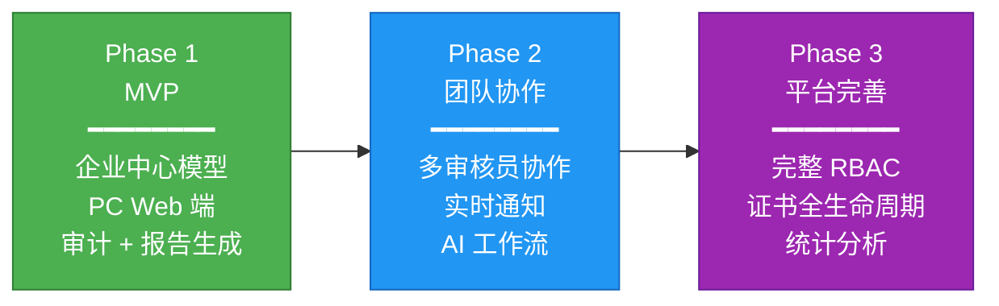
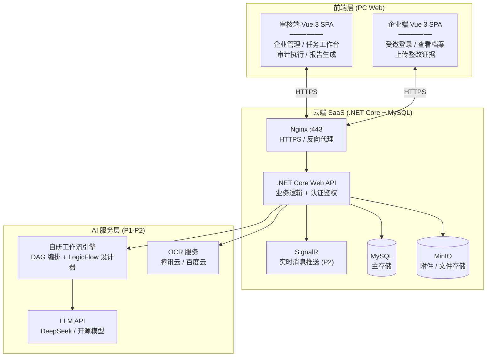
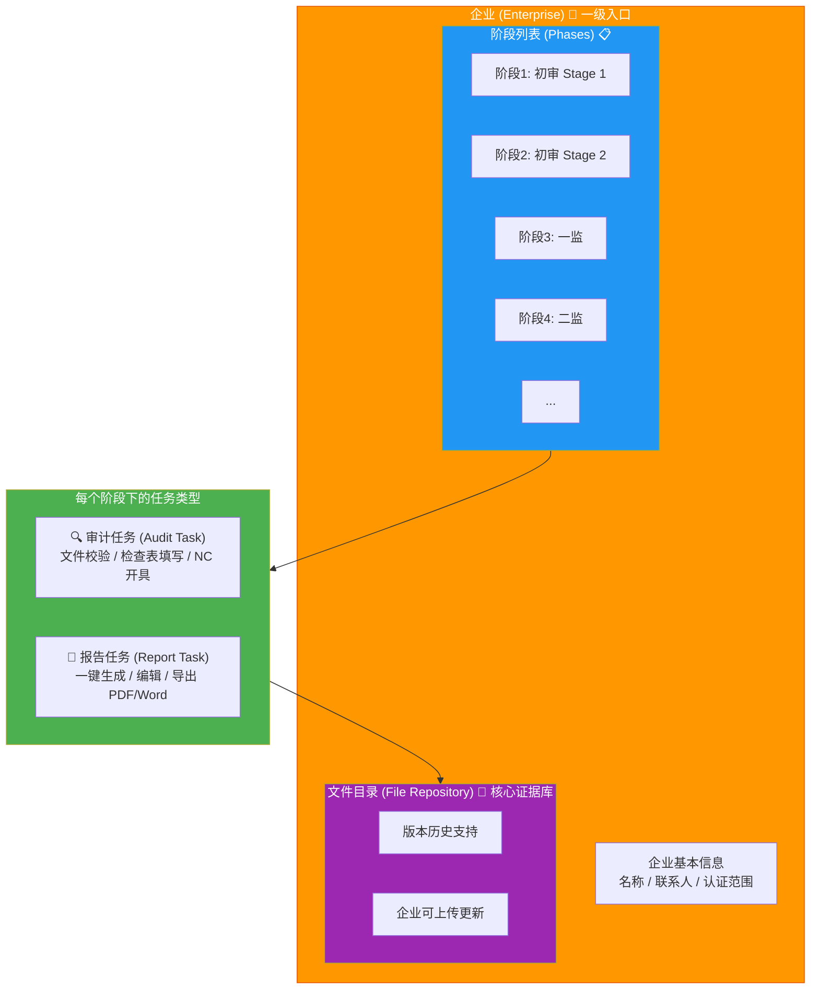
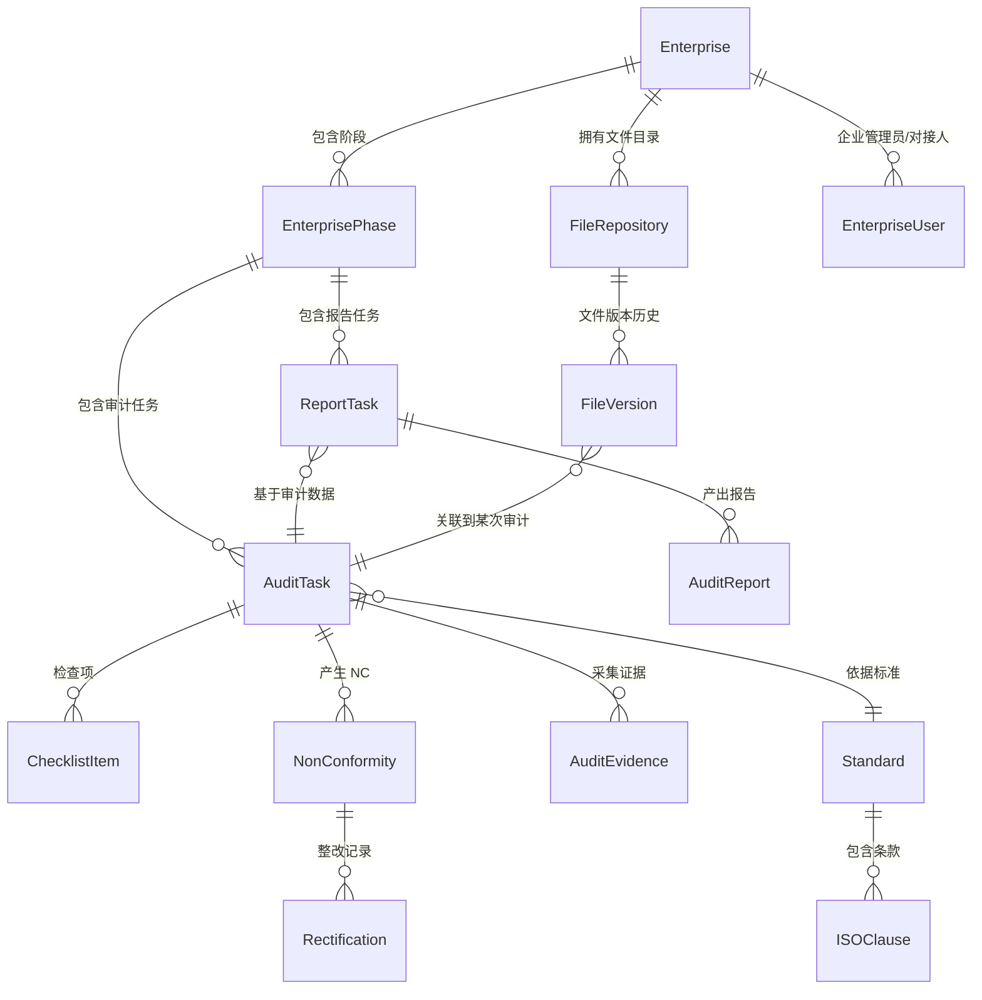
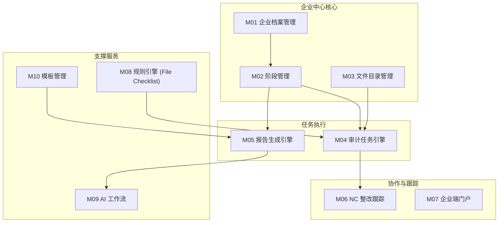

# 体系认证审核平台——总体设计（V3.1）

> **版本**：V3.1 | **日期**：2026-08-10 | **状态**：重构态
>
> **重大变更说明**：V3.0 基于 V2.0 进行**领域模型重构**——从"任务中心"转向**"企业中心"**的任务模型。核心变化：
> - 企业成为一级入口和核心组织单元
> - 引入"阶段"(Phase)概念，表达认证生命周期中的不同时期
> - 任务归属于阶段，分为"审计"和"报告生成"两类
> - 文件目录作为核心证据库，支持版本历史
> - 企业维度归档：待执行 vs 已归档
>
> **V3.1 更新说明（2026-08-10）**：全量文档审计同步——AI 编排选型由 "Dify/n8n" 对齐为 **自研工作流引擎（DAG + LogicFlow）**，与 `70-当前执行/工作流引擎选型与技术研究-V1.md` 结论一致；部署端口说明与 `项目全局规则.md`（V1.7）对齐。
>
> **前置文档**：
> - 总体设计-V2.md（V2.0，任务中心模型）
> - 已确认架构决策汇总-V1.0.md
>
> **变更记录**：
> | 版本 | 日期 | 变更说明 |
> |------|------|---------|
> | V1.0 | 2026-07-27 | 初版 |
> | V2.0 | 2026-07-27 | 收敛为统一 SaaS 平台方案 |
> | V3.0 | 2026-07-28 | 🔄 重构：以企业为中心的任务模型 |
> | **V3.1** | **2026-08-10** | **🔧 审计同步：AI 编排选型对齐自研 DAG + LogicFlow** |

---

## 目录

1. [背景与定位](#一背景与定位)
2. [系统架构图](#二系统架构图)
3. [核心领域模型：企业中心架构](#三核心领域模型企业中心架构)
4. [模块划分与功能清单](#四模块划分与功能清单)
5. [数据库设计概要](#五数据库设计概要)
6. [API 设计总纲](#六api-设计总纲)
7. [PC Web 端设计](#七pc-web-端设计)
8. [部署架构](#八部署架构)
9. [Phase 1 MVP 实施清单与工作量估算](#九phase-1-mvp-实施清单与工作量估算)

---

## 一、背景与定位

### 1.1 产品定位

**面向审核员和认证机构的 PC Web SaaS 平台，企业为协作方（免费受邀使用）。**

| 维度 | 说明 |
|------|------|
| **目标客户** | 认证机构（CB）和独立审核员/审核团队——按年付费订阅 |
| **企业端** | 免费受邀使用——作为审核对象的协作方 |
| **核心形态** | **PC Web 端优先**（审核端 + 后台管理端），不含移动端（Phase 1） |
| **核心价值** | 覆盖审核全流程：企业管理 → 阶段规划 → 审计/报告任务 → 归档 |
| **技术栈** | .NET Core + Vue 3 + MySQL + MinIO |

### 1.2 商业模式

| 维度 | 方案 |
|------|------|
| **收费模式** | 按年付费 SaaS（不按报告次数收费） |
| **付费方** | 认证机构 / 审核团队 |
| **企业端** | 免费——作为协作对象受邀使用 |
| **过期策略** | 付费结束后不可新建项目或编辑原项目，数据只读保留（符合 ISO 17021 要求保存 5 年+） |

### 1.3 三阶段演进路线



### 1.4 不做什么（明确边界）

| 不做 | 原因 |
|------|------|
| 移动端 App | Phase 1 聚焦 PC Web 端，降低初期复杂度 |
| 审核员内部管理 | 属于机构 HR/OA 范畴 |
| 电子签章对接 | Phase 1 使用图片签名即可 |
| 知识图谱分析 | 数据量不足时无意义 |
| 多语言 | 初期仅中文 |

---

## 二、系统架构图

### 2.1 分层架构总览（PC Web 优先）



### 2.2 核心技术选型

| 层 | 技术栈 | 说明 |
|----|--------|------|
| **前端** | Vue 3 + TypeScript + Element Plus | 审核端 + 企业端均为 PC Web SPA |
| **后端** | .NET Core Web API | 业务逻辑、认证鉴权 |
| **数据库** | MySQL 8.0 | 主存储 |
| **对象存储** | MinIO | 文件/附件存储 |
| **工作流** | 自研 DAG 解释器 + LogicFlow 设计器 | 数据加工流水线（提取/校验/报告）；审批流与 DAG 并行共存（见 `70-当前执行/工作流引擎选型与技术研究-V1.md`） |
| **LLM** | DeepSeek API / Ollama 开源模型 | AI 能力 |
| **OCR** | 腾讯云 OCR / 百度 OCR | 文字识别 |
| **消息推送** | SignalR（Phase 2） | 实时通知 |

---

## 三、核心领域模型：企业中心架构

### 3.1 核心层级：企业 → 阶段 → 任务

这是 V3.0 最根本的变化。**企业(Enterprise) 成为一级入口和组织核心**，所有审核活动都围绕企业展开。



### 3.2 用户操作流程（企业中心视角）

```
┌─────────────────────────────────────────────────────────────┐
│                     主页面（企业列表）                        │
├─────────────────────────────────────────────────────────────┤
│  ┌──────────┐  ┌──────────┐  ┌──────────┐  ┌──────────┐   │
│  │ 企业 A   │  │ 企业 B   │  │ 企业 C   │  │ + 新建   │   │
│  │ 待执行:2 │  │ 已归档   │  │ 待执行:1 │  │  企业    │   │
│  └──────────┘  └──────────┘  └──────────┘  └──────────┘   │
│                                                             │
│  筛选: [全部] [待执行] [已归档]                              │
└─────────────────────────────────────────────────────────────┘
                            │ 点击企业
                            ▼
┌─────────────────────────────────────────────────────────────┐
│                   企业详情页（企业 A）                        │
├─────────────────────────────────────────────────────────────┤
│  📋 基本信息          📁 文件目录     📊 概览               │
│  名称: XXX公司       [上传文件]      阶段数: 4              │
│  联系人: 张三        [查看历史]      任务总数: 12           │
│  认证范围: QMS       版本: v3        已完成: 10             │
├─────────────────────────────────────────────────────────────┤
│  📋 阶段时间线                                               │
│  ┌────────┐   ┌────────┐   ┌────────┐   ┌────────┐        │
│  │初审 S1 │ → │初审 S2 │ → │ 一监  │ → │ 二监  │        │
│  │✅ 完成 │   │✅ 完成 │   │🔄 进行│   │⏳ 待开始│        │
│  └────────┘   └────────┘   └────────┘   └────────┘        │
├─────────────────────────────────────────────────────────────┤
│  当前阶段：一监                                             │
│  ┌────────────────────┐  ┌────────────────────┐           │
│  │ 🔍 审计任务         │  │ 📄 报告任务         │           │
│  │ 状态: 排队中        │  │ 状态: —             │           │
│  │ [新建审计] [查看]   │  │ [新建报告]          │           │
│  └────────────────────┘  └────────────────────┘           │
└─────────────────────────────────────────────────────────────┘
```

### 3.3 核心实体关系（ER 图）



### 3.4 核心实体详述

#### 3.4.1 Enterprise（企业）—— 一级核心实体

| 字段 | 类型 | 约束 | Phase | 说明 |
|------|------|------|:---:|------|
| id | UUID | PK | P1 | |
| name | VARCHAR(200) | NOT NULL | P1 | 企业全称 |
| short_name | VARCHAR(100) | | P1 | 简称 |
| credit_code | VARCHAR(50) | UNIQUE | P1 | 统一社会信用代码 |
| legal_person | VARCHAR(50) | | P2 | 法人代表 |
| address | TEXT | | P1 | 企业地址 |
| cert_scope | TEXT | | P1 | 认证范围描述 |
| employee_count | INT | | P2 | 体系覆盖人数 |
| contact_name_1 | VARCHAR(50) | | P1 | 对接人 1 |
| contact_phone_1 | VARCHAR(20) | | P1 | 对接人 1 电话 |
| contact_email_1 | VARCHAR(200) | | P1 | 对接人 1 邮箱（用于邀请） |
| contact_name_2 | VARCHAR(50) | | P2 | 对接人 2 |
| contact_phone_2 | VARCHAR(20) | | P2 | 对接人 2 电话 |
| status | ENUM | DEFAULT 'active' | P1 | active / archived |
| archive_date | DATE | | P1 | 归档日期（所有阶段完成后） |
| notes | TEXT | | P1 | 备注 |
| created_at | TIMESTAMP | NOT NULL | P1 | |
| updated_at | TIMESTAMP | NOT NULL | P1 | |

**企业状态流转**：

```
active（活跃）
  │
  ├── 所有阶段均已完成 → archived（已归档）
  │
  └── 手动激活归档企业 → active（重新活跃，如监督审核）
```

#### 3.4.2 EnterprisePhase（企业阶段）—— 新增核心实体

| 字段 | 类型 | 约束 | Phase | 说明 |
|------|------|------|:---:|------|
| id | UUID | PK | P1 | |
| enterprise_id | UUID | FK → Enterprise.id | P1 | 所属企业 |
| phase_type | ENUM | NOT NULL | P1 | initial_stage1 / initial_stage2 / surveillance_1 / surveillance_2 / recertification / special |
| phase_name | VARCHAR(100) | | P1 | 阶段显示名称（如"初次审核第一阶段"） |
| sequence_order | INT | NOT NULL | P1 | 阶段顺序（用于排序显示） |
| planned_date_from | DATE | | P1 | 计划开始日期 |
| planned_date_to | DATE | | P1 | 计划结束日期 |
| status | ENUM | DEFAULT 'pending' | P1 | pending / in_progress / completed |
| completed_at | TIMESTAMP | | P1 | 完成时间 |
| notes | TEXT | | P1 | 阶段备注 |
| created_at | TIMESTAMP | NOT NULL | P1 | |
| updated_at | TIMESTAMP | NOT NULL | P1 | |

**预置阶段类型**：

| phase_type | 名称 | 说明 |
|------------|------|------|
| `initial_stage1` | 初审 Stage 1 | 文件审查 + 体系策划审核 |
| `initial_stage2` | 初审 Stage 2 | 现场审核 |
| `surveillance_1` | 第一次监督审核 | 年度监督 |
| `surveillance_2` | 第二次监督审核 | 年度监督 |
| `recertification` | 再认证审核 | 证书到期前 |
| `special` | 特殊审核 | 投诉/变更等 |

**阶段状态流转**：

```
pending（待开始）
    │
    ▼
in_progress（进行中）
    │
    ├── 该阶段下所有任务完成 → completed（已完成）
    │
    └── 可回退到 pending（调整计划）
```

#### 3.4.3 AuditTask（审计任务）

| 字段 | 类型 | 约束 | Phase | 说明 |
|------|------|------|:---:|------|
| id | UUID | PK | P1 | |
| phase_id | UUID | FK → EnterprisePhase.id | P1 | 所属阶段 |
| task_no | VARCHAR(30) | UNIQUE | P1 | 任务编号（自动生成） |
| task_type | ENUM | NOT NULL | P1 | file_audit（文件审计）/ site_audit（现场审计）/ document_review（文档审查） |
| standard_id | UUID | FK → Standard.id | P1 | 认证标准 |
| departments | JSON | | P1 | 审核部门列表 [{name, date, contacts}] |
| task_status | ENUM | DEFAULT 'queued' | P1 | queued / in_progress / completed / failed |
| priority | INT | DEFAULT 5 | P1 | 优先级（1-10） |
| progress | INT | DEFAULT 0 | P1 | 进度百分比（0-100） |
| result_summary | TEXT | | P1 | 审计结果摘要 |
| started_at | TIMESTAMP | | P1 | 开始执行时间 |
| completed_at | TIMESTAMP | | P1 | 完成时间 |
| created_by | UUID | FK → User.id | P1 | 创建人 |
| created_at | TIMESTAMP | NOT NULL | P1 | |
| updated_at | TIMESTAMP | NOT NULL | P1 | |

**审计任务状态机**：

```
queued（排队中）
    │
    ▼
in_progress（执行中） ← 可手动排队
    │
    ├── 成功 → completed（已完成）
    │
    └── 失败 → failed（失败，可重试）
```

#### 3.4.4 ReportTask（报告任务）—— 新增独立实体

| 字段 | 类型 | 约束 | Phase | 说明 |
|------|------|------|:---:|------|
| id | UUID | PK | P1 | |
| phase_id | UUID | FK → EnterprisePhase.id | P1 | 所属阶段 |
| task_no | VARCHAR(30) | UNIQUE | P1 | 任务编号 |
| report_type | ENUM | NOT NULL | P1 | audit_report（审核报告）/ nc_list（NC 清单）/ certificate_proposal（证书建议） |
| based_on_audit_id | UUID | FK → AuditTask.id | P1 | 基于哪个审计任务（可为空表示手动创建） |
| template_id | UUID | FK → ReportTemplate.id | P1 | 使用的模板 |
| task_status | ENUM | DEFAULT 'queued' | P1 | queued / in_progress / completed / failed |
| output_file_path | VARCHAR(500) | | P1 | 生成的文件路径（MinIO） |
| output_format | ENUM | | P1 | pdf / word / excel |
| version | INT | DEFAULT 1 | P1 | 报告版本号 |
| started_at | TIMESTAMP | | P1 | |
| completed_at | TIMESTAMP | | P1 | |
| created_by | UUID | FK → User.id | P1 | |
| created_at | TIMESTAMP | NOT NULL | P1 | |
| updated_at | TIMESTAMP | NOT NULL | P1 | |

#### 3.4.5 FileRepository（文件目录）—— 核心证据库

| 字段 | 类型 | 约束 | Phase | 说明 |
|------|------|------|:---:|------|
| id | UUID | PK | P1 | |
| enterprise_id | UUID | FK → Enterprise.id | P1 | 所属企业 |
| parent_id | UUID | FK → FileRepository.id | | P1 | 父节点（NULL 表示根目录） |
| name | VARCHAR(200) | NOT NULL | P1 | 目录/文件名 |
| type | ENUM | NOT NULL | P1 | folder / file |
| file_path | VARCHAR(500) | | P1 | MinIO 存储路径（type=file 时） |
| file_size | BIGINT | | P1 | 文件大小 |
| file_hash | VARCHAR(64) | | P1 | SHA-256（去重用） |
| mime_type | VARCHAR(100) | | P1 | MIME 类型 |
| current_version | INT | DEFAULT 1 | P1 | 当前版本号 |
| uploaded_by | ENUM | | P1 | auditor（审核员上传）/ enterprise（企业上传） |
| tags | JSON | | P1 | 标签 ["QMS手册", "程序文件"] |
| created_at | TIMESTAMP | NOT NULL | P1 | |
| updated_at | TIMESTAMP | NOT NULL | P1 | |

**FileVersion（文件版本历史）**：

| 字段 | 类型 | 约束 | Phase | 说明 |
|------|------|------|:---:|------|
| id | UUID | PK | P1 | |
| file_repo_id | UUID | FK → FileRepository.id | P1 | 所属文件 |
| version_number | INT | NOT NULL | P1 | 版本号 |
| file_path | VARCHAR(500) | | P1 | 该版本的 MinIO 路径 |
| file_hash | VARCHAR(64) | | P1 | 该版本的哈希 |
| file_size | BIGINT | | P1 | 该版本大小 |
| change_description | TEXT | | P1 | 变更说明 |
| uploaded_by | UUID | FK → User.id | P1 | 上传人 |
| uploaded_at | TIMESTAMP | NOT NULL | P1 | |

**文件目录预置结构**：

```
企业文件目录
├── 体系文件/
│   ├── 质量手册
│   ├── 程序文件
│   └── 作业指导书
├── 运行记录/
│   ├── 管理评审记录
│   ├── 内审记录
│   └── 培训记录
├── 证书文件/
│   ├── 营业执照
│   ├── 组织机构代码证
│   └── 以往证书
├── 整改证据/
│   └── （按 NC 分组）
└── 其他/
    └── （用户自建目录）
```

#### 3.4.6 其他核心实体（沿用 V2.0，适配新模型）

**NonConformity（不符合项）**：

| 字段 | 类型 | 约束 | Phase | 说明 |
|------|------|------|:---:|------|
| id | UUID | PK | P1 | |
| nc_no | VARCHAR(30) | UNIQUE | P1 | NC 编号 |
| audit_task_id | UUID | FK → AuditTask.id | P1 | 所属审计任务 |
| clause_id | UUID | FK → ISOClause.id | P1 | 引用条款 |
| severity | ENUM | NOT NULL | P1 | major / minor / observation |
| description | TEXT | NOT NULL | P1 | 不符合事实描述 |
| evidence_ids | JSON | | P1 | 关联证据 ID 列表 |
| nc_status | ENUM | DEFAULT 'opened' | P1 | opened / rectifying / pending_verification / closed |
| due_date | DATE | NOT NULL | P1 | 整改截止日 |
| closed_at | TIMESTAMP | | P1 | |
| created_at | TIMESTAMP | NOT NULL | P1 | |
| updated_at | TIMESTAMP | NOT NULL | P1 | |

**AuditEvidence（审核证据）**：

| 字段 | 类型 | 约束 | Phase | 说明 |
|------|------|------|:---:|------|
| id | UUID | PK | P1 | |
| audit_task_id | UUID | FK → AuditTask.id | P1 | 所属审计任务 |
| evidence_type | ENUM | NOT NULL | P1 | photo / document / voice |
| file_path | VARCHAR(500) | | P1 | MinIO 路径 |
| file_hash | VARCHAR(64) | | P1 | SHA-256 |
| content_text | TEXT | | P1 | 文字描述/OCR 结果 |
| metadata | JSON | | P1 | {gps, timestamp, device} |
| created_at | TIMESTAMP | NOT NULL | P1 | |

**ChecklistItem（检查项）**：

| 字段 | 类型 | 约束 | Phase | 说明 |
|------|------|------|:---:|------|
| id | UUID | PK | P1 | |
| audit_task_id | UUID | FK → AuditTask.id | P1 | 所属审计任务 |
| clause_id | UUID | FK → ISOClause.id | P1 | 对应条款 |
| result | ENUM | | P1 | conformity / non_conformity / not_applicable / not_checked |
| remark | TEXT | | P1 | 审核备注 |
| evidence_ids | JSON | | P1 | 关联证据 |
| nc_id | UUID | FK | P1 | 关联 NC（如有） |
| sort_order | INT | | P1 | 排序 |
| created_at | TIMESTAMP | NOT NULL | P1 | |
| updated_at | TIMESTAMP | NOT NULL | P1 | |

**Rectification（整改记录）**：

| 字段 | 类型 | 约束 | Phase | 说明 |
|------|------|------|:---:|------|
| id | UUID | PK | P1 | |
| nc_id | UUID | FK → NonConformity.id | P1 | 所属 NC |
| submitted_by | ENUM | NOT NULL | P1 | enterprise / auditor |
| correction | TEXT | NOT NULL | P1 | 纠正描述 |
| corrective_action | TEXT | | P1 | 纠正措施 |
| evidence_ids | JSON | | P1 | 整改证据 ID 列表 |
| version | INT | DEFAULT 1 | P1 | 版本号 |
| verified_result | ENUM | | P1 | approved / rejected |
| verified_remark | TEXT | | P1 | 验证说明 |
| submitted_at | TIMESTAMP | NOT NULL | P1 | |
| verified_at | TIMESTAMP | | P1 | |

**Standard / ISOClause（标准与条款）**—— 预置数据，同 V2.0。

### 3.5 企业维度视图

系统提供两个核心视图来组织企业数据：

#### 3.5.1 待执行视图（Active View）

展示当前有活动阶段/任务的企业：

```
待执行企业列表
├── 企业 A
│   ├── 当前阶段: 一监（进行中）
│   │   ├── 🔍 审计任务: 执行中 (进度 60%)
│   │   └── 📄 报告任务: 排队中
│   └── 待整改 NC: 2 个（1 个即将到期）
├── 企业 B
│   ├── 当前阶段: 初审 S2（进行中）
│   │   ├── 🔍 审计任务: 排队中
│   │   └── 📄 报告任务: —
│   └── 待整改 NC: 0 个
└── ...
```

#### 3.5.2 已归档视图（Archived View）

展示所有阶段均已完成的企业：

```
已归档企业列表
├── 企业 C（归档于 2026-03-15）
│   ├── ✅ 初审 S1 → ✅ 初审 S2 → ✅ 一监 → ✅ 二监
│   ├── 最终报告: 4 份
│   ├── 累计 NC: 12 个（全部关闭）
│   └── [取档] [查看完整档案]
├── 企业 D（归档于 2026-06-20）
│   └── ...
```

**取档机制**：已归档的企业可以"取档"回到活跃状态（例如需要做监督审核），取档后自动添加新的阶段。

---

## 四、模块划分与功能清单

### 4.1 核心模块总览（基于企业中心模型）



### 4.2 模块职责详述

| 编号 | 模块 | 职责 | 核心功能 | Phase |
|------|------|------|---------|:---:|
| M01 | **企业档案管理** | 企业 CRUD、联系人管理、状态管理、归档/取档 | 创建企业 → 自动生成邀请；企业列表（待执行/已归档）；取档重新激活 | P1 |
| M02 | **阶段管理** | 企业下阶段的创建、排序、状态流转 | 预置阶段模板（初审S1/S2、一监、二监等）；阶段时间线视图；阶段完成判定 | P1 |
| M03 | **文件目录管理** | 企业文件的上传、组织、版本管理 | 树形目录结构；文件上传（支持多格式）；版本历史查看/对比；标签分类；企业端也可上传 | P1 |
| M04 | **审计任务引擎** | 审计任务的创建、执行、进度追踪 | 新建审计任务（选阶段/标准）；检查表逐条填写；拍照/文件取证；一键开 NC；任务队列与状态机 | P1 |
| M05 | **报告生成引擎** | 基于审计数据一键生成报告 | 新建报告任务（选阶段/模板）；AI 辅助填充；在线预览与编辑；导出 PDF/Word/Excel；版本管理 | P1 |
| M06 | **NC 整改跟踪** | NC 全生命周期管理与整改闭环 | NC 开具 → 企业确认 → 整改提交 → 审核员验证 → 关闭；到期提醒；整改证据版本追溯 | P1 |
| M07 | **企业端门户** | 企业用户查看档案、上传证据 | 受邀登录；查看本企业审核进度；上传整改证据；查看 NC 与报告；文件目录只读（或指定目录可写） | P1 |
| M08 | **规则引擎** | File Checklist 规则配置与校验 | 按标准/阶段定义应提交文件清单；自动校验完整性；缺失项标记与风险等级 | P1 |
| M09 | **工作流引擎** | 自研 DAG 工作流（提取/校验/报告编排） | OCR 文字识别；语音转文字；报告智能生成；标准条款推荐；Prompt 模板管理 | P1-P2 |
| M10 | **模板管理** | 报告模板与检查表模板 | 内置默认模板（初审报告/监督报告/NC 清单）；模板变量定义；自定义模板（P2） | P1 |

### 4.3 Phase 1 核心功能清单

| 编号 | 功能 | 说明 | 归属模块 |
|------|------|------|---------|
| **企业管理** | | | |
| F01 | 企业创建与管理 | 企业基本信息 CRUD、联系人管理、自动发送邀请 | M01 |
| F02 | 企业列表与筛选 | 待执行/已归档视图切换、搜索、排序 | M01 |
| F03 | 企业归档与取档 | 所有阶段完成后归档；取档重新激活并新建阶段 | M01 |
| **阶段管理** | | | |
| F04 | 阶段创建与配置 | 选择阶段类型、设置计划日期、关联标准 | M02 |
| F05 | 阶段时间线视图 | 可视化展示企业所有阶段及状态 | M02 |
| F06 | 阶段状态流转 | pending → in_progress → completed | M02 |
| **文件目录** | | | |
| F07 | 文件目录树形展示 | 浏览企业文件目录结构 | M03 |
| F08 | 文件上传与管理 | 支持多格式上传、拖拽上传、批量上传 | M03 |
| F09 | 文件版本历史 | 查看文件的所有版本、对比差异、回滚 | M03 |
| F10 | 文件标签与搜索 | 标签分类、关键词搜索 | M03 |
| **审计任务** | | | |
| F11 | 新建审计任务 | 选择阶段、选择标准、设置部门 | M04 |
| F12 | 审计任务队列 | 查看 queued/in_progress/completed 任务列表 | M04 |
| F13 | 检查表填写 | 逐条判定（符合/不符合/不适用）+ 备注 | M04 |
| F14 | 证据关联 | 关联文件/照片到检查项 | M04 |
| F15 | NC 开具 | 从检查项一键开 NC、关联条款、严重度 | M04 |
| F16 | 审计进度追踪 | 实时显示完成百分比、条款覆盖率 | M04 |
| **报告生成** | | | |
| F17 | 新建报告任务 | 选择阶段、选择模板、选择基于的审计任务 | M05 |
| F18 | 报告一键生成 | 汇总审计数据 + AI 增强 → 填充模板 | M05 |
| F19 | 报告在线编辑 | 富文本编辑器修改报告内容 | M05 |
| F20 | 报告导出 | 导出为 PDF / Word / Excel 格式 | M05 |
| F21 | 报告版本管理 | 多版本报告、版本对比 | M05 |
| **NC 整改** | | | |
| F22 | NC 列表与详情 | 按企业/阶段/任务筛选 NC | M06 |
| F23 | 企业端整改提交 | 上传整改证据、填写纠正措施 | M06 |
| F24 | 审核员验证 | 查看整改证据 → 通过/退回 | M06 |
| **规则引擎** | | | |
| F25 | File Checklist 配置 | 按标准/阶段定义应提交文件清单 | M08 |
| F26 | 文件完整性校验 | 自动比对实际文件 vs 应提交清单 | M08 |
| **企业端** | | | |
| F27 | 企业端受邀登录 | 邮箱/短信魔法链接登录 | M07 |
| F28 | 企业端档案查看 | 查看审核进度、NC 清单、报告 | M07 |
| F29 | 企业端文件查看 | 只读浏览文件目录（或指定目录可上传） | M07 |
| **AI 能力** | | | |
| F30 | OCR 文字识别 | 证件/表格/文档 OCR 提取 | M09 |
| F31 | 报告 AI 增强 | AI 辅助填充报告内容 | M09 |

---

## 五、数据库设计概要

### 5.1 核心表结构（企业中心模型）

#### Enterprise（企业）

```sql
CREATE TABLE enterprises (
    id CHAR(36) PRIMARY KEY,
    name VARCHAR(200) NOT NULL,
    short_name VARCHAR(100),
    credit_code VARCHAR(50) UNIQUE,
    legal_person VARCHAR(50),
    address TEXT,
    cert_scope TEXT,
    employee_count INT,
    contact_name_1 VARCHAR(50),
    contact_phone_1 VARCHAR(20),
    contact_email_1 VARCHAR(200),
    contact_name_2 VARCHAR(50),
    contact_phone_2 VARCHAR(20),
    status ENUM('active', 'archived') DEFAULT 'active',
    archive_date DATE,
    notes TEXT,
    created_at TIMESTAMP NOT NULL DEFAULT CURRENT_TIMESTAMP,
    updated_at TIMESTAMP NOT NULL DEFAULT CURRENT_TIMESTAMP ON UPDATE CURRENT_TIMESTAMP,

    INDEX idx_enterprises_status (status),
    INDEX idx_enterprises_credit_code (credit_code)
);
```

#### EnterprisePhase（企业阶段）

```sql
CREATE TABLE enterprise_phases (
    id CHAR(36) PRIMARY KEY,
    enterprise_id CHAR(36) NOT NULL,
    phase_type ENUM('initial_stage1', 'initial_stage2', 'surveillance_1', 'surveillance_2', 'recertification', 'special') NOT NULL,
    phase_name VARCHAR(100),
    sequence_order INT NOT NULL,
    planned_date_from DATE,
    planned_date_to DATE,
    status ENUM('pending', 'in_progress', 'completed') DEFAULT 'pending',
    completed_at TIMESTAMP,
    notes TEXT,
    created_at TIMESTAMP NOT NULL DEFAULT CURRENT_TIMESTAMP,
    updated_at TIMESTAMP NOT NULL DEFAULT CURRENT_TIMESTAMP ON UPDATE CURRENT_TIMESTAMP,

    FOREIGN KEY (enterprise_id) REFERENCES enterprises(id) ON DELETE CASCADE,
    INDEX idx_phases_enterprise (enterprise_id),
    INDEX idx_phases_status (status)
);
```

#### AuditTask（审计任务）

```sql
CREATE TABLE audit_tasks (
    id CHAR(36) PRIMARY KEY,
    phase_id CHAR(36) NOT NULL,
    task_no VARCHAR(30) UNIQUE,
    task_type ENUM('file_audit', 'site_audit', 'document_review') NOT NULL,
    standard_id CHAR(36),
    departments JSON,
    task_status ENUM('queued', 'in_progress', 'completed', 'failed') DEFAULT 'queued',
    priority INT DEFAULT 5,
    progress INT DEFAULT 0,
    result_summary TEXT,
    started_at TIMESTAMP,
    completed_at TIMESTAMP,
    created_by CHAR(36),
    created_at TIMESTAMP NOT NULL DEFAULT CURRENT_TIMESTAMP,
    updated_at TIMESTAMP NOT NULL DEFAULT CURRENT_TIMESTAMP ON UPDATE CURRENT_TIMESTAMP,

    FOREIGN KEY (phase_id) REFERENCES enterprise_phases(id) ON DELETE CASCADE,
    FOREIGN KEY (standard_id) REFERENCES standards(id),
    INDEX idx_tasks_phase (phase_id),
    INDEX idx_tasks_status (task_status)
);
```

#### ReportTask（报告任务）

```sql
CREATE TABLE report_tasks (
    id CHAR(36) PRIMARY KEY,
    phase_id CHAR(36) NOT NULL,
    task_no VARCHAR(30) UNIQUE,
    report_type ENUM('audit_report', 'nc_list', 'certificate_proposal') NOT NULL,
    based_on_audit_id CHAR(36),
    template_id CHAR(36),
    task_status ENUM('queued', 'in_progress', 'completed', 'failed') DEFAULT 'queued',
    output_file_path VARCHAR(500),
    output_format ENUM('pdf', 'word', 'excel'),
    version INT DEFAULT 1,
    started_at TIMESTAMP,
    completed_at TIMESTAMP,
    created_by CHAR(36),
    created_at TIMESTAMP NOT NULL DEFAULT CURRENT_TIMESTAMP,
    updated_at TIMESTAMP NOT NULL DEFAULT CURRENT_TIMESTAMP ON UPDATE CURRENT_TIMESTAMP,

    FOREIGN KEY (phase_id) REFERENCES enterprise_phases(id) ON DELETE CASCADE,
    FOREIGN KEY (based_on_audit_id) REFERENCES audit_tasks(id),
    FOREIGN KEY (template_id) REFERENCES report_templates(id),
    INDEX idx_report_tasks_phase (phase_id)
);
```

#### FileRepository（文件目录）

```sql
CREATE TABLE file_repositories (
    id CHAR(36) PRIMARY KEY,
    enterprise_id CHAR(36) NOT NULL,
    parent_id CHAR(36),
    name VARCHAR(200) NOT NULL,
    type ENUM('folder', 'file') NOT NULL,
    file_path VARCHAR(500),
    file_size BIGINT,
    file_hash VARCHAR(64),
    mime_type VARCHAR(100),
    current_version INT DEFAULT 1,
    uploaded_by ENUM('auditor', 'enterprise'),
    tags JSON,
    created_at TIMESTAMP NOT NULL DEFAULT CURRENT_TIMESTAMP,
    updated_at TIMESTAMP NOT NULL DEFAULT CURRENT_TIMESTAMP ON UPDATE CURRENT_TIMESTAMP,

    FOREIGN KEY (enterprise_id) REFERENCES enterprises(id) ON DELETE CASCADE,
    FOREIGN KEY (parent_id) REFERENCES file_repositories(id) ON DELETE CASCADE,
    INDEX idx_files_enterprise (enterprise_id),
    INDEX idx_files_parent (parent_id),
    INDEX idx_files_hash (file_hash)
);
```

#### FileVersion（文件版本）

```sql
CREATE TABLE file_versions (
    id CHAR(36) PRIMARY KEY,
    file_repo_id CHAR(36) NOT NULL,
    version_number INT NOT NULL,
    file_path VARCHAR(500),
    file_hash VARCHAR(64),
    file_size BIGINT,
    change_description TEXT,
    uploaded_by CHAR(36),
    uploaded_at TIMESTAMP NOT NULL DEFAULT CURRENT_TIMESTAMP,

    FOREIGN KEY (file_repo_id) REFERENCES file_repositories(id) ON DELETE CASCADE,
    INDEX idx_versions_file (file_repo_id),
    UNIQUE INDEX idx_versions_unique (file_repo_id, version_number)
);
```

#### NonConformity（不符合项）、AuditEvidence（证据）、ChecklistItem（检查项）、Rectification（整改）

这些表结构与 V2.0 基本一致，主要变化是外键从 `task_id` 改为 `audit_task_id`，不再赘述。

### 5.2 索引建议

| 表 | 索引 | 类型 | 说明 |
|----|------|------|------|
| Enterprise | (status) | 单列 | 待执行/已归档筛选 |
| EnterprisePhase | (enterprise_id, sequence_order) | 复合 | 阶段排序查询 |
| EnterprisePhase | (enterprise_id, status) | 复合 | 活跃阶段查找 |
| AuditTask | (phase_id, task_status) | 复合 | 阶段下任务筛选 |
| ReportTask | (phase_id, task_status) | 复合 | 阶段下报告筛选 |
| NonConformity | (audit_task_id, nc_status) | 复合 | 任务下 NC 状态 |
| FileRepository | (enterprise_id, parent_id) | 复合 | 目录树查询 |
| FileRepository | (file_hash) | 单列 | 文件去重 |

---

## 六、API 设计总纲

### 6.1 RESTful 资源定义（企业中心模型）

| 资源 | 根路径 | Phase | 说明 |
|------|--------|:---:|------|
| 企业 | `/api/enterprises` | P1 | 企业 CRUD + 归档/取档 |
| 企业阶段 | `/api/enterprises/{id}/phases` | P1 | 阶段管理 |
| 审计任务 | `/api/phases/{id}/audit-tasks` | P1 | 审计任务全生命周期 |
| 报告任务 | `/api/phases/{id}/report-tasks` | P1 | 报告任务全生命周期 |
| 文件目录 | `/api/enterprises/{id}/files` | P1 | 文件目录 CRUD + 版本 |
| 检查项 | `/api/audit-tasks/{id}/checklist` | P1 | 检查表填写 |
| 不符合项 | `/api/audit-tasks/{id}/ncs` 或 `/api/enterprises/{id}/ncs` | P1 | NC 管理 |
| 整改 | `/api/ncs/{id}/rectifications` | P1 | 整改提交与验证 |
| 证据 | `/api/audit-tasks/{id}/evidences` | P1 | 证据采集 |
| 标准 | `/api/standards` | P1 | 标准与条款 |
| 报告模板 | `/api/report-templates` | P1 | 模板管理 |
| 企业端用户 | `/api/enterprise-users` | P1 | 受邀用户管理 |

### 6.2 Phase 1 核心端点

#### 企业管理

| 方法 | 端点 | 说明 |
|------|------|------|
| `GET` | `/api/enterprises` | 企业列表（支持 status=active/archived 筛选） |
| `POST` | `/api/enterprises` | 创建企业 |
| `GET` | `/api/enterprises/{id}` | 企业详情（含阶段摘要、任务统计） |
| `PUT` | `/api/enterprises/{id}` | 更新企业信息 |
| `POST` | `/api/enterprises/{id}/archive` | 归档企业 |
| `POST` | `/api/enterprises/{id}/reactivate` | 取档激活 |

#### 阶段管理

| 方法 | 端点 | 说明 |
|------|------|------|
| `GET` | `/api/enterprises/{id}/phases` | 阶段列表（按顺序排列） |
| `POST` | `/api/enterprises/{id}/phases` | 创建阶段 |
| `GET` | `/api/phases/{id}` | 阶段详情（含任务统计） |
| `PUT` | `/api/phases/{id}` | 更新阶段 |
| `PATCH` | `/api/phases/{id}/status` | 阶段状态流转 |

#### 审计任务

| 方法 | 端点 | 说明 |
|------|------|------|
| `GET` | `/api/phases/{id}/audit-tasks` | 阶段下审计任务列表 |
| `POST` | `/api/phases/{id}/audit-tasks` | 新建审计任务 |
| `GET` | `/api/audit-tasks/{id}` | 任务详情（含进度） |
| `PATCH` | `/api/audit-tasks/{id}/status` | 任务状态流转 |
| `GET` | `/api/audit-tasks/{id}/progress` | 进度详情 |

#### 报告任务

| 方法 | 端点 | 说明 |
|------|------|------|
| `GET` | `/api/phases/{id}/report-tasks` | 阶段下报告任务列表 |
| `POST` | `/api/phases/{id}/report-tasks` | 新建报告任务 |
| `POST` | `/api/report-tasks/{id}/generate` | 触发报告生成（异步） |
| `GET` | `/api/report-tasks/{id}` | 报告任务详情 |
| `GET` | `/api/report-tasks/{id}/preview` | 在线预览报告 |
| `GET` | `/api/report-tasks/{id}/export` | 导出 PDF/Word |

#### 文件目录

| 方法 | 端点 | 说明 |
|------|------|------|
| `GET` | `/api/enterprises/{id}/files` | 文件目录树 |
| `POST` | `/api/enterprises/{id}/files` | 创建目录或上传文件 |
| `GET` | `/api/files/{id}` | 文件/目录详情 |
| `GET` | `/api/files/{id}/versions` | 版本历史 |
| `GET` | `/api/files/{id}/download` | 下载文件 |
| `PUT` | `/api/files/{id}` | 更新文件（上传新版本） |

#### NC 与整改

| 方法 | 端点 | 说明 |
|------|------|------|
| `GET` | `/api/enterprises/{id}/ncs` | 企业下所有 NC |
| `POST` | `/api/audit-tasks/{id}/ncs` | 开具 NC |
| `PATCH` | `/api/ncs/{id}/status` | NC 状态流转 |
| `POST` | `/api/ncs/{id}/rectifications` | 提交整改（企业端） |
| `POST` | `/api/rectifications/{id}/verify` | 验证整改（审核员端） |

### 6.3 统一响应格式

```json
{
  "code": 0,
  "message": "success",
  "data": {},
  "timestamp": 1753315200
}
```

---

## 七、PC Web 端设计

### 7.1 审核端页面结构

```
├── 登录页
│   └── 账号密码登录
│
├── 主页（工作台）
│   ├── 快捷操作：[新建企业] [快速出报告]
│   ├── 待执行企业列表
│   │   ├── 搜索框
│   │   ├── 筛选器：[全部] [有到期NC] [今日需处理]
│   │   └── 企业卡片列表
│   │       ├── 企业名称 + 认证范围
│   │       ├── 当前阶段 + 进度
│   │       ├── 待办数量（任务/NC）
│   │       └── 操作：[进入详情]
│   └── 已归档企业 Tab
│
├── 企业详情页
│   ├── 顶部：企业基本信息 + 操作按钮
│   ├── Tab 1：阶段时间线
│   │   └── 阶段卡片（横向时间轴）
│   │       ├── 阶段名称 + 状态标识
│   │       ├── 日期范围
│   │       └── 下属任务摘要
│   ├── Tab 2：文件目录
│   │   ├── 工具栏：[上传] [新建文件夹] [搜索]
│   │   ├── 面包屑导航
│   │   └── 文件/文件夹列表（表格或卡片视图）
│   ├── Tab 3：任务列表
│   │   ├── 筛选：[全部] [审计] [报告] [queued] [进行中]
│   │   └── 任务卡片
│   ├── Tab 4：NC 清单
│   │   └── NC 列表（色标严重度）
│   └── Tab 5：报告
│       └── 报告列表 + 预览 + 导出
│
├── 任务执行页（审计任务）
│   ├── 左侧：检查表导航树（按章节分组）
│   ├── 中间：当前检查项详情
│   │   ├── 条款内容
│   │   ├── 判定按钮组：[符合] [不符合] [不适用]
│   │   ├── 备注输入
│   │   ├── 关联证据区
│   │   └── [一键开 NC] 按钮
│   └── 右侧：进度面板
│       ├── 总体进度条
│       ├── 各章节完成度
│       └── NC 摘要
│
├── 报告编辑页
│   ├── 工具栏：[保存] [预览] [导出PDF] [导出Word]
│   ├── 模板选择（如未选定）
│   ├── 报告正文（富文本编辑器）
│   │   ├── 自动填充区域（来自审计数据）
│   │   └── 手动编辑区域
│   └── 右侧：数据来源面板
│       ├── NC 摘要
│       ├── 检查表汇总
│       └── 审核结论
│
├── NC 管理页
│   ├── NC 列表
│   ├── NC 详情/编辑
│   └── 整改记录时间线
│
└── 设置页
    ├── 个人设置
    ├── 模板管理
    ├── 标准条款库
    └── 规则引擎配置
```

### 7.2 企业端页面结构

```
├── 登录页（魔法链接）
│
├── 首页（概览）
│   ├── 企业信息
│   ├── 当前审核状态
│   ├── 待整改 NC 数量
│   └── 最近通知
│
├── 审核进度
│   ├── 阶段时间线（只读）
│   └── 各阶段状态
│
├── NC 整改
│   ├── 待整改列表
│   ├── 整改提交表单
│   │   ├── 纠正描述
│   │   ├── 纠正措施
│   │   └── 证据上传
│   └── 整改历史
│
├── 文件查看
│   ├── 文件目录浏览（只读）
│   └── 文件下载/预览
│
└── 报告查看
    └── 报告列表 + 在线预览
```

---

## 八、部署架构

> **端口说明（V3.1 对齐全局规则 V1.7）**：本节 Compose 为**生产形态示意**（容器内端口 443/9000/9001 等）；**开发环境**实际端口映射以 `项目全局规则.md` §7.1 为准：MySQL `3307`、Redis `6380`、MinIO `9000/9001`，连接串使用 `localhost:3307`。

### 8.1 Docker Compose（Phase 1 最小化）

```yaml
version: '3.8'
services:
  nginx:
    image: nginx:1.25-alpine
    ports:
      - "443:443"
    volumes:
      - ./nginx.conf:/etc/nginx/nginx.conf
      - ./ssl:/etc/nginx/ssl
    depends_on:
      - api

  api:
    image: audit-platform:latest
    environment:
      - ASPNETCORE_ENVIRONMENT=Production
      - ConnectionStrings__Default=Host=db;Database=audit;Username=audit;Password=${DB_PASSWORD}
      - MinIO__Endpoint=minio:9000
      - MinIO__AccessKey=${MINIO_ACCESS_KEY}
      - MinIO__SecretKey=${MINIO_SECRET_KEY}
    depends_on:
      - db
      - minio

  db:
    image: mysql:8.0
    environment:
      - MYSQL_DATABASE=audit
      - MYSQL_USER=audit
      - MYSQL_PASSWORD=${DB_PASSWORD}
      - MYSQL_ROOT_PASSWORD=${MYSQL_ROOT_PASSWORD}
    volumes:
      - db-data:/var/lib/mysql
    command: --character-set-server=utf8mb4 --collation-server=utf8mb4_unicode_ci

  minio:
    image: minio/minio:latest
    command: server /data --console-address ":9001"
    environment:
      - MINIO_ROOT_USER=${MINIO_ACCESS_KEY}
      - MINIO_ROOT_PASSWORD=${MINIO_SECRET_KEY}
    volumes:
      - minio-data:/data

volumes:
  db-data:
  minio-data:
```

### 8.2 部署拓扑

```
                    ┌─────────────────┐
                    │   云服务器       │
                    │  (2C4G 起步)    │
                    │                 │
                    │  ┌───────────┐  │
                    │  │   Nginx   │  │
                    │  │   :443    │  │
                    │  └─────┬─────┘  │
                    │        │        │
                    │  ┌─────▼─────┐  │
                    │  │ .NET Core │  │
                    │  │  Web API  │  │
                    │  └─────┬─────┘  │
                    │        │        │
                    │  ┌─────┼─────┐  │
                    │  ▼     ▼     ▼  │
                    │ MySQL  MinIO  │
                    └─────────────────┘
                         │
         ┌───────────────┼───────────────┐
         ▼               ▼               ▼
   ┌──────────┐   ┌──────────┐   ┌──────────┐
   │ 审核端   │   │ 企业端   │   │ 自研 DAG │
   │ Vue 3    │   │ Vue 3    │   │ 工作流引擎│
   │ SPA      │   │ SPA      │   │ (P1-P2)  │
   └──────────┘   └──────────┘   └──────────┘
```

---

## 九、Phase 1 MVP 实施清单与工作量估算

### 9.1 功能清单

| 编号 | 功能 | 说明 | 人天 | 依赖 |
|------|------|------|:---:|------|
| **基础框架** | | | | |
| F00 | 项目骨架搭建 | .NET Core API + Vue 3 项目初始化 + Docker Compose + 数据库初始化 | 3 | — |
| F01 | 用户认证 | 注册/登录、JWT 签发、Token 刷新 | 1.5 | F00 |
| F02 | 标准条款库预置 | ISO 9001/14001/45001 条款数据 | 1 | F00 |
| **企业中心核心** | | | | |
| F03 | 企业 CRUD | 企业创建/编辑/列表/详情/归档/取档 | 2 | F00,F01 |
| F04 | 阶段管理 | 阶段 CRUD、状态流转、时间线视图 | 2.5 | F03 |
| F05 | 文件目录管理 | 目录树 CRUD、文件上传/下载/预览、版本历史 | 4 | F03 |
| **审计任务** | | | | |
| F06 | 审计任务 CRUD | 新建/列表/详情/状态流转/队列管理 | 3 | F04 |
| F07 | 检查表填写 | 逐条判定 + 备注 + 证据关联 | 3 | F06,F02 |
| F08 | NC 开具与管理 | 一键开 NC、关联条款、严重度、状态流转 | 3 | F06,F07 |
| F09 | 证据采集 | 文件上传/关联、元数据记录 | 2 | F06 |
| F10 | 审计进度追踪 | 实时进度计算、覆盖率统计 | 1.5 | F07 |
| **报告生成** | | | | |
| F11 | 报告任务 CRUD | 新建/列表/详情/状态管理 | 2 | F04 |
| F12 | 报告生成引擎 | 汇总数据 → 模板填充 → 生成初稿 | 4 | F06,F07,F11 |
| F13 | 报告在线编辑 | 富文本编辑器集成 | 2 | F12 |
| F14 | 报告导出 | PDF/Word/Excel 导出 | 2 | F12 |
| **NC 整改闭环** | | | | |
| F15 | 企业端整改提交 | 整改表单 + 证据上传 | 2 | F08 |
| F16 | 审核员复核验证 | 通过/打回流程 | 1.5 | F08,F15 |
| **企业端** | | | | |
| F17 | 企业端登录 | 邮箱/短信魔法链接 | 1.5 | F00,F03 |
| F18 | 企业端档案查看 | 审核进度/NC/报告查看 | 2 | F04,F11,F17 |
| F19 | 企业端文件查看 | 文件目录浏览/下载/预览 | 1.5 | F05,F17 |
| **规则引擎（基础）** | | | | |
| F20 | File Checklist 配置 | 按标准/阶段定义文件清单（硬编码配置） | 2 | F02 |
| F21 | 文件完整性校验 | 自动比对 + 缺失标记 | 2 | F05,F20 |
| **AI 能力（基础）** | | | | |
| F22 | OCR 集成 | 调用云 OCR API + 结果解析 | 2 | F05 |
| F23 | 报告 AI 增强 | LLM 辅助填充报告内容 | 3 | F12 |

### 9.2 工作量汇总

| 分类 | 项目数 | 人天 |
|------|:---:|:---:|
| 基础框架 | 3 | 5.5 |
| 企业中心核心 | 3 | 8.5 |
| 审计任务 | 5 | 12.5 |
| 报告生成 | 4 | 10 |
| NC 整改闭环 | 2 | 3.5 |
| 企业端 | 3 | 5 |
| 规则引擎 | 2 | 4 |
| AI 能力 | 2 | 5 |
| **合计** | **24** | **54** |

> 2 人团队约 **6-7 周**可完成 Phase 1 MVP。

### 9.3 建议开发顺序

```
Week 1: 基础框架 + 企业中心
  F00 (项目骨架) → F01 (认证) → F02 (标准条款)
  → F03 (企业 CRUD) → F04 (阶段管理)

Week 2: 文件目录 + 审计任务基础
  F05 (文件目录) → F06 (审计任务 CRUD)

Week 3-4: 审计核心（并行）
  串行链: F07 (检查表) → F08 (NC) → F10 (进度追踪)
  并行链: F09 (证据采集)

Week 5: 报告生成
  F11 (报告任务) → F12 (报告引擎) → F13 (在线编辑) → F14 (导出)

Week 6: 整改闭环 + 企业端 + 规则/AI
  F15 (整改提交) → F16 (复核验证)
  F17 (企业端登录) → F18 (档案查看) → F19 (文件查看)
  并行: F20-F21 (规则) + F22-F23 (AI)

Week 7: 全流程端到端联调 + Bug 修复
```

---

## 附录 A：V2 → V3 变更对照

| 维度 | V2.0（任务中心） | V3.0（企业中心） |
|------|------------------|------------------|
| **一级入口** | 任务列表 / 工作台 | **企业列表** |
| **核心实体** | AuditTask（审核任务） | **Enterprise（企业）** |
| **组织方式** | 企业 → 任务（扁平） | **企业 → 阶段 → 任务（三层）** |
| **任务类型** | 混在一起（AuditTask 包含一切） | **分离：AuditTask（审计）+ ReportTask（报告）** |
| **文件管理** | EnterpriseDocument（三层：归档/工作/历史） | **FileRepository（树形目录 + 版本历史）** |
| **归档粒度** | 任务关闭即归档 | **企业维度归档（所有阶段完成）** |
| **阶段概念** | 隐含在 audit_type 字段 | **独立的 EnterprisePhase 实体** |
| **前端形态** | Flutter 移动端 + 内嵌 Web | **纯 PC Web（Vue 3 SPA）** |
| **离线模式** | 有（SQLite 本地缓存） | **无（Phase 1 聚焦 Web 端）** |

---

## 附录 B：设计决策记录（ADR）

| 编号 | 决策 | 理由 | 日期 |
|------|------|------|------|
| ADR-001 | **采用企业中心模型** | 更贴合认证行业实际工作方式；一个企业多次审核的生命周期管理更自然 | 2026-07-28 |
| ADR-002 | **引入阶段(Phase)实体** | 认证过程有明确的阶段划分（初审/监督/再认证），需要独立管理和可视化 | 2026-07-28 |
| ADR-003 | **审计/报告任务分离** | 审计和报告是不同性质的操作，分离后职责清晰、状态机简单 | 2026-07-28 |
| ADR-004 | **文件目录作为核心证据库** | 文件是审核的核心证据，需要版本历史和企业可参与上传 | 2026-07-28 |
| ADR-005 | **Phase 1 不做移动端** | 降低初期复杂度，聚焦核心价值（报告生成） | 2026-07-28 |
| ADR-006 | **采用 Dify/n8n 做 AI 编排**（已废弃） | 不自研 AI 工作流引擎，降低开发成本；**V3.1 起改为自研 DAG 解释器 + LogicFlow 设计器**（见 ADR-007） | 2026-07-28 |
| ADR-007 | **采用自研 DAG 工作流引擎** | 数据加工流水线（提取/校验/报告）自研轻量 DAG 解释器 + LogicFlow 设计器；审批流与 DAG 并行共存（替代 ADR-006） | 2026-08-10 |

---

> **文档版本**：V3.0
> **创建时间**：2026-07-28
> **创建依据**：总体设计-V2.0 + 用户反馈（2026-07-28 讨论）
> **下一步**：团队评审企业中心模型可行性；确认后按 §9.3 开发顺序启动 Phase 1 实施
*（内容由 AI 生成，仅供参考）*
