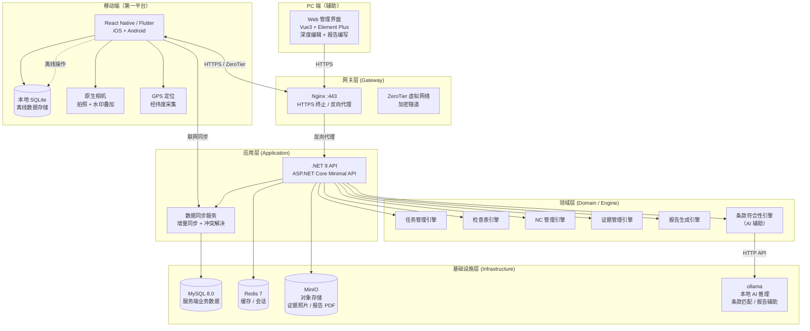
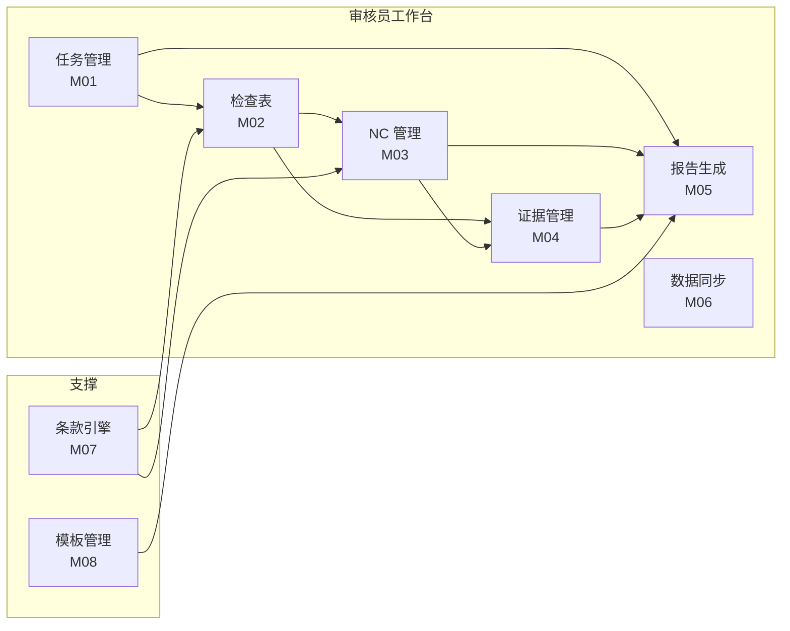
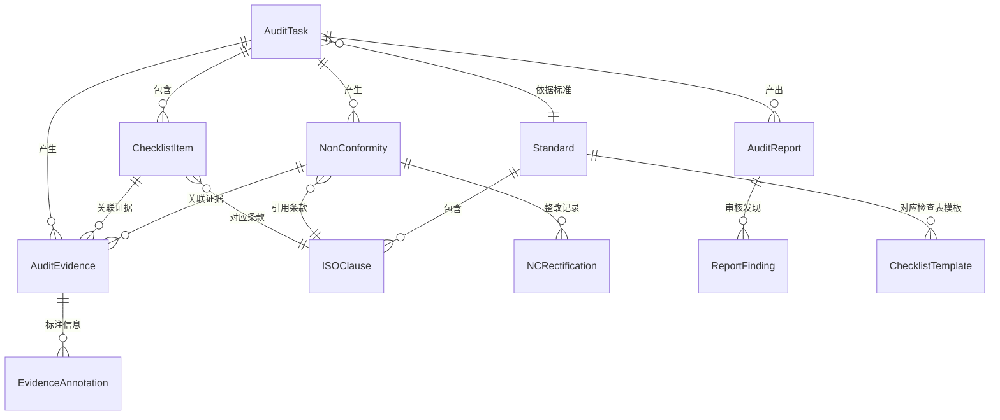

# 体系认证审核平台——总体设计（个人工具）

> **版本**：V1.0 | **日期**：2026-07-27 | **状态**：成熟态
>
> **前置文档**：总体设计-V1.md（综合总体设计） / 系统定位与演进路线-V1.md（三阶段规划） / 术语表-V1.md
>
> **适用范围**：本文档为 Phase 1「审核员个人工具」的独立总体设计。基于综合总体设计中的通用技术决策（技术栈、部署方式、AI 引擎等），以审核员个人工作视角重建领域建模和功能边界。本文档与综合总体设计并行维护——后者覆盖 Phase 1/2/3 全路线，本文档聚焦 Phase 1 个人工具的实现细节。
>
> **读者对象**：Phase 1 开发团队成员、技术决策者。阅读前建议先了解术语表中的认证行业基础概念。

---

## 目录

1. [背景与定位](#一背景与定位)
2. [系统架构图](#二系统架构图)
3. [模块划分](#三模块划分)
4. [数据模型](#四数据模型)
5. [API 设计](#五api-设计)
6. [移动端设计](#六移动端设计)
7. [部署与运维](#七部署与运维)
8. [Phase 1 实施清单](#八phase-1-实施清单)
9. [附录：与综合总体设计的差异说明](#附录与综合总体设计的差异说明)

---

## 一、背景与定位

### 1.1 产品定位

Phase 1 定位为**审核员个人的"瑞士军刀"**——一个审核员在现场能完成所有审核工作的随身工具。

| 维度 | 说明 |
|------|------|
| **目标用户** | 单个审核员（一线执行者），无需组织/公司概念 |
| **核心痛点** | 审核效率低、NC 手写易错、证据管理混乱（照片散落相册）、报告撰写耗时（现场结束后手工整理 2-4 小时） |
| **第一平台** | 移动端（手机/平板）——审核员现场 90% 时间使用移动设备 |
| **数据主权** | 审核员个人拥有全部数据，可带到不同机构使用 |
| **推广路径** | 朋友试用 → 口碑传播 → 审核员社群自然增长 |

### 1.2 与综合总体设计的关系

综合总体设计（总体设计-V1.md）覆盖 Phase 1/2/3 全路线，本文档是 Phase 1 的独立落地版本。关键差异：

| 维度 | 综合总体设计 | 本文档（个人工具） |
|------|------------|-----------------|
| 角色模型 | 5 种角色 + RBAC | 仅审核员本人，无权限系统 |
| 核心领域对象 | 审核项目（AuditProject） | 审核任务（AuditTask） |
| 第一平台 | Web 管理后台 | 移动端（手机/平板） |
| 数据存储 | MySQL 服务端 | 本地 SQLite + 远程 MySQL 同步 |
| 后端依赖 | 必须在线 | 离线可用，联网后同步 |
| 企业/证书/审核员管理 | 完整 CRUD | 不需要（Phase 3 引入） |

### 1.3 不做什么（Phase 1 边界）

| 不做 | 原因 | 计划 |
|------|------|------|
| 企业客户管理 | 个人工具不需要 | Phase 3 |
| 审核员排期与调度 | 自己排自己即可 | Phase 3 |
| 审核员资质管理 | 审核员不需要系统管理自己的资质 | Phase 3 |
| 证书生命周期管理 | 属于公司平台范畴 | Phase 3 |
| 认证决定流程 | 属于公司平台范畴 | Phase 3 |
| RBAC 角色权限 | 单用户零权限 | Phase 3 |
| 统计分析大屏 | 单人数据量不足 | Phase 3 |
| 小组协作（任务共享/组长视图） | Phase 2 | Phase 2 |
| 企业端自助门户 | Phase 2 | Phase 2 |

---

## 二、系统架构图

### 2.1 分层架构总览



### 2.2 各层职责与技术栈

| 层 | 职责 | 技术栈 | 说明 |
|----|------|--------|------|
| **移动端** | 现场审核操作：任务查看、检查表填写、NC 录入、拍照取证、离线暂存 | React Native 或 Flutter + SQLite | 第一平台，原生相机/GPS 能力 |
| **PC 端** | 报告深度编辑、审核计划导入、历史记录查阅 | Vue3 + Element Plus | 辅助平台，酒店/回家后使用 |
| **网关层** | HTTPS 终止、反向代理、ZeroTier 加密隧道 | Nginx 1.25 + ZeroTier | 复用综合总体设计网关方案 |
| **应用层** | API 路由、认证、数据同步协调 | ASP.NET Core 9 Minimal API | 单体应用，无状态设计 |
| **领域层** | 审核业务规则、AI 条款匹配、报告生成 | C# 引擎 + ollama HTTP Client | 六个引擎独立可测试 |
| **基础设施层** | 数据持久化、文件存储、AI 推理 | MySQL 8.0 + Redis 7 + MinIO + ollama | 复用综合总体设计基础设施方案 |

### 2.3 离线优先架构

```
┌─────────────────────────────────────────────────────────────────┐
│                        离线优先数据流                              │
├─────────────────────────────────────────────────────────────────┤
│                                                                 │
│  [现场操作]                                                       │
│  填写检查表 ──→ 本地 SQLite (立即保存)                              │
│  拍摄证据   ──→ 本地文件系统 + SQLite 元数据                        │
│  开具 NC   ──→ 本地 SQLite (草稿状态)                              │
│                                                                 │
│  [联网后]                                                        │
│  检测网络恢复 ──→ 增量同步服务                                     │
│       ├── 上传本地新增/修改数据 → MySQL                             │
│       ├── 上传证据照片 → MinIO（带哈希校验）                         │
│       ├── 拉取服务端更新（如审核计划变更）                           │
│       └── 冲突检测：同一条目两端均修改 → 提示用户选择版本             │
│                                                                 │
│  [同步策略]                                                       │
│  - 增量同步：仅同步 last_sync_at 之后变更的数据                      │
│  - 冲突解决：以服务端为准（审核计划）/ 用户选择（检查表填写）          │
│  - 离线时长无限制：本地 SQLite 容量足够存储数百次审核任务数据          │
└─────────────────────────────────────────────────────────────────┘
```

---

## 三、模块划分

### 3.1 核心模块总览



### 3.2 模块职责与边界

| 编号 | 模块 | 职责 | 核心功能 |
|------|------|------|---------|
| M01 | **任务管理** | 审核任务的创建、查看、状态管理 | 创建审核任务（企业名/标准/日期/部门）→ 导入审核计划（Excel/PDF解析）→ 任务列表（按状态筛选：待审核/进行中/已完成）→ 任务进度（条款覆盖率、NC 数量） |
| M02 | **检查表** | 按标准条款逐条审核、记录审核发现 | 检查表模板加载（按标准预置条款清单）→ 逐条判定（符合/不符合/不适用）→ 备注填写 → 证据关联 |
| M03 | **NC 管理** | 不符合项全流程管理 | 开具 NC（关联条款/严重度/事实描述/证据照片）→ NC 列表与状态流转（待确认→整改中→待验证→已关闭）→ 整改跟踪（截止日提醒） |
| M04 | **证据管理** | 证据采集、存储、关联 | 拍照（自动水印：时间戳+GPS+审核员）→ 录音 → 文件导入 → 证据与检查项/NC 关联 → 证据列表与预览 |
| M05 | **报告生成** | 审核报告一键生成 | 汇总 NC + 检查表 + 审核结论 → 自动填充报告模板 → 导出 Word/PDF → 报告历史归档 |
| M06 | **数据同步** | 本地与服务端数据双向同步 | 增量同步 → 冲突检测与解决 → 照片后台上传（分片+断点续传）→ 同步状态面板 |
| M07 | **条款引擎** | AI 辅助条款匹配与符合性预判 | 关键词→条款映射 → AI 语义匹配 → 条款原文离线缓存查阅 |
| M08 | **模板管理** | 检查表模板与报告模板管理 | 按标准预置检查表模板 → 报告模板导入/管理 → 模板变量定义 |

### 3.3 模块依赖关系

```
                        ┌──────────────┐
                        │  M01 任务管理  │
                        └──────┬───────┘
                               │
              ┌────────────────┼────────────────┐
              ▼                ▼                ▼
        ┌──────────┐   ┌──────────┐    ┌──────────┐
        │M02 检查表 │   │M04 证据  │    │M05 报告  │
        └────┬─────┘   └────┬─────┘    └────┬─────┘
             │              │               │
             ▼              ▼               │
        ┌──────────┐        └───────┬───────┘
        │M03 NC管理│                │
        └────┬─────┘                │
             │                      │
             └──────────┬───────────┘
                        ▼
                 ┌──────────┐
                 │M06 同步   │
                 └──────────┘

        M07 条款引擎 ──→ M02 检查表
        M07 条款引擎 ──→ M03 NC 管理
        M08 模板管理 ──→ M05 报告生成
```

---

## 四、数据模型

### 4.1 核心实体关系（审核员视角）



### 4.2 核心实体结构

#### AuditTask（审核任务）——核心聚合根

审核员视角下，一次审核任务是最核心的领域对象。它承载了"何时、去哪、审谁、按什么标准、审哪些部门"的全部上下文。

| 字段 | 类型 | 说明 |
|------|------|------|
| id | UUID PK | 雪花 ID |
| task_no | VARCHAR(30) UNIQUE | 任务编号，如 TASK-20260727-001 |
| enterprise_name | VARCHAR(200) | 被审核企业名称 |
| enterprise_address | TEXT | 企业地址 |
| standard_id | UUID FK | 认证标准（ISO 9001 / 14001 / 45001 / 13485） |
| audit_type | ENUM | 初审 Stage1 / 初审 Stage2 / 监督审核 / 再认证 / 特殊审核 |
| planned_date_from | DATE | 计划开始日期 |
| planned_date_to | DATE | 计划结束日期 |
| actual_date_from | DATE | 实际开始日期 |
| actual_date_to | DATE | 实际结束日期 |
| task_status | ENUM | pending（待审核）→ in_progress（进行中）→ completed（已完成）→ archived（已归档） |
| departments | JSON | 审核部门列表 [{name, date, contacts}] |
| clause_coverage | JSON | 条款覆盖范围 {standard_id, clause_ids[]} |
| audit_conclusion | ENUM | 推荐认证 / 有条件推荐 / 不推荐（可选，末次会议后填写） |
| notes | TEXT | 审核备注（首次/末次会议纪要等） |
| has_offline_data | BOOL | 是否有未同步的离线数据 |
| last_synced_at | TIMESTAMP | 最后同步时间 |
| created_at / updated_at | TIMESTAMP | 审计字段 |

#### Standard（认证标准）

| 字段 | 类型 | 说明 |
|------|------|------|
| id | UUID PK | |
| code | VARCHAR(50) | 标准编号，如 ISO 9001:2015 |
| name | VARCHAR(200) | 标准名称 |
| category | VARCHAR(50) | QMS / EMS / OHSMS / MDMS |
| version | VARCHAR(20) | 版本号 |

#### ISOClause（标准条款）

| 字段 | 类型 | 说明 |
|------|------|------|
| id | UUID PK | |
| standard_id | UUID FK | 所属标准 |
| clause_no | VARCHAR(20) | 条款号，如 8.2.4 |
| title | VARCHAR(200) | 条款标题 |
| parent_id | UUID FK NULL | 父条款 |
| level | INT | 层级深度 |
| content | TEXT | 条款原文 |
| keywords | VARCHAR(500) | 关键词（用于 AI 匹配） |
| sort_order | INT | 排序号 |

#### ChecklistItem（检查项）

与综合总体设计不同，这里将检查表建模为独立实体——它是审核员逐条执行的核心操作对象。

| 字段 | 类型 | 说明 |
|------|------|------|
| id | UUID PK | |
| task_id | UUID FK | 所属审核任务 |
| clause_id | UUID FK | 对应标准条款 |
| result | ENUM | 符合 / 不符合 / 不适用 |
| remark | TEXT | 审核备注/观察记录 |
| evidence_ids | JSON | 关联证据 ID 列表 |
| is_nc_generated | BOOL | 是否已生成 NC（不符合时） |
| nc_id | UUID FK NULL | 关联的 NC ID |
| sort_order | INT | 排序号（按条款顺序） |
| completed_at | TIMESTAMP | 完成时间 |
| created_at / updated_at | TIMESTAMP | |

#### NonConformity（不符合项）

| 字段 | 类型 | 说明 |
|------|------|------|
| id | UUID PK | |
| nc_no | VARCHAR(30) UNIQUE | NC 编号 |
| task_id | UUID FK | 所属审核任务 |
| clause_id | UUID FK | 引用条款 |
| severity | ENUM | 严重不符合（major）/ 一般不符合（minor）/ 观察项（observation） |
| category | ENUM | 文件不符合 / 实施不符合 / 效果不符合 |
| description | TEXT | 不符合事实描述 |
| evidence_ids | JSON | 关联证据 ID 列表 |
| nc_status | ENUM | draft → opened → enterprise_acknowledged → rectifying → pending_verification → closed / rejected |
| due_date | DATE | 整改截止日 |
| closed_at | TIMESTAMP | 关闭时间 |
| created_at / updated_at | TIMESTAMP | |

#### NCRectification（整改记录）

| 字段 | 类型 | 说明 |
|------|------|------|
| id | UUID PK | |
| nc_id | UUID FK | 所属 NC |
| correction | TEXT | 纠正措施描述 |
| corrective_action | TEXT | 纠正措施（根因分析 + 防止再发生） |
| root_cause_analysis | TEXT | 根因分析 |
| rectification_evidence_ids | JSON | 整改证据 ID 列表 |
| submitted_at | TIMESTAMP | 提交时间 |
| verified_result | ENUM | 通过 / 退回 |
| verified_remark | TEXT | 验证说明 |
| verified_at | TIMESTAMP | 验证时间 |
| retry_count | INT | 退回次数 |

#### AuditEvidence（审核证据）

| 字段 | 类型 | 说明 |
|------|------|------|
| id | UUID PK | |
| task_id | UUID FK | 所属审核任务 |
| evidence_type | ENUM | photo / voice / file |
| file_path_local | VARCHAR(500) | 本地文件路径 |
| file_path_remote | VARCHAR(500) | 服务端 MinIO 路径（同步后） |
| file_hash | VARCHAR(64) | SHA-256 哈希 |
| file_size | BIGINT | 文件大小（字节） |
| content_text | TEXT | 文字描述/备注 |
| geo_location | VARCHAR(200) | GPS 坐标（JSON: {lat, lng}） |
| recorded_at | TIMESTAMP | 证据采集时间 |
| sync_status | ENUM | local_only / syncing / synced / sync_failed |
| created_at / updated_at | TIMESTAMP | |

#### EvidenceAnnotation（证据标注）

拍照时自动叠加的水印信息，以及用户手动添加的标注。

| 字段 | 类型 | 说明 |
|------|------|------|
| id | UUID PK | |
| evidence_id | UUID FK | 所属证据 |
| watermark_text | VARCHAR(500) | 水印内容（审核员+时间+GPS+任务编号） |
| photo_taken_at | TIMESTAMP | 拍照时间（EXIF 提取） |
| device_model | VARCHAR(100) | 设备型号 |
| exif_valid | BOOL | EXIF 信息是否完整 |

#### ChecklistTemplate（检查表模板）

| 字段 | 类型 | 说明 |
|------|------|------|
| id | UUID PK | |
| standard_id | UUID FK | 对应标准 |
| name | VARCHAR(200) | 模板名称 |
| is_default | BOOL | 是否默认模板 |
| clause_ids | JSON | 包含的条款 ID 列表（有序） |
| created_at / updated_at | TIMESTAMP | |

#### AuditReport（审核报告）

| 字段 | 类型 | 说明 |
|------|------|------|
| id | UUID PK | |
| task_id | UUID FK | 所属审核任务 |
| report_no | VARCHAR(30) | 报告编号 |
| content_json | JSON | 报告结构化内容（用于预览编辑） |
| file_path | VARCHAR(500) | 导出的 PDF/Word 文件路径（MinIO） |
| report_status | ENUM | draft → generated → reviewed → finalized |
| template_id | UUID FK | 使用的报告模板 |
| generated_at | TIMESTAMP | 生成时间 |
| finalized_at | TIMESTAMP | 定稿时间 |
| created_at / updated_at | TIMESTAMP | |

### 4.3 数据存储策略

| 数据分类 | 本地存储（SQLite） | 服务端存储（MySQL） | 同步策略 |
|---------|------------------|-------------------|---------|
| 审核任务 | ✓ 完整存储 | ✓ 完整存储 | 双向增量同步 |
| 检查表数据 | ✓ 完整存储 | ✓ 完整存储 | 本地优先，同步上传 |
| NC 数据 | ✓ 完整存储 | ✓ 完整存储 | 本地优先，同步上传 |
| 证据元数据 | ✓ 完整存储 | ✓ 完整存储 | 本地优先 |
| 证据文件（照片/录音） | ✓ 原始文件 | ✓ MinIO | 后台上传 + 断点续传 |
| 标准条款 | ✓ 离线缓存 | ✓ 主数据 | 服务端→本地（仅下载） |
| 检查表模板 | ✓ 离线缓存 | ✓ 主数据 | 服务端→本地（仅下载） |
| 报告模板 | ✗ | ✓ 主数据 | PC 端在线使用 |

---

## 五、API 设计

### 5.1 设计原则

- **离线优先**：移动端所有写操作先落本地 SQLite，联网后通过同步 API 批量上传
- **最小化接口**：Phase 1 仅审核员本人使用，无需多用户/权限相关接口
- **复用综合总体设计的统一响应格式、分页规范、错误码体系**（见总体设计-V1.md §5.3-5.4）

### 5.2 RESTful 资源定义

| 资源 | 根路径 | 说明 |
|------|--------|------|
| 审核任务 | `/api/tasks` | 任务 CRUD + 状态管理 |
| 检查表 | `/api/tasks/{taskId}/checklist` | 检查项填写 |
| 不符合项 | `/api/tasks/{taskId}/ncs` | NC 管理 |
| 审核证据 | `/api/tasks/{taskId}/evidences` | 证据上传与查询 |
| 审核报告 | `/api/tasks/{taskId}/reports` | 报告生成与导出 |
| 标准条款 | `/api/standards` | 标准与条款查询 |
| 模板 | `/api/templates` | 检查表/报告模板 |
| 数据同步 | `/api/sync` | 离线数据同步 |

### 5.3 主要端点列表

#### 审核任务

| 方法 | 端点 | 说明 |
|------|------|------|
| `GET` | `/api/tasks` | 任务列表（按状态筛选） |
| `POST` | `/api/tasks` | 创建审核任务 |
| `GET` | `/api/tasks/{id}` | 任务详情（含进度统计） |
| `PUT` | `/api/tasks/{id}` | 更新任务信息 |
| `PATCH` | `/api/tasks/{id}/status` | 状态流转 |
| `POST` | `/api/tasks/{id}/import-plan` | 导入审核计划（Excel/PDF 解析） |
| `GET` | `/api/tasks/{id}/progress` | 条款覆盖率进度 |

#### 检查表

| 方法 | 端点 | 说明 |
|------|------|------|
| `GET` | `/api/tasks/{taskId}/checklist` | 获取检查项列表 |
| `PUT` | `/api/tasks/{taskId}/checklist/{itemId}` | 更新单条检查项判定 |
| `POST` | `/api/tasks/{taskId}/checklist/batch` | 批量更新检查项 |

#### NC 管理

| 方法 | 端点 | 说明 |
|------|------|------|
| `GET` | `/api/tasks/{taskId}/ncs` | 任务下所有 NC |
| `POST` | `/api/tasks/{taskId}/ncs` | 开具 NC |
| `GET` | `/api/ncs/{id}` | NC 详情 |
| `PUT` | `/api/ncs/{id}` | 更新 NC |
| `PATCH` | `/api/ncs/{id}/status` | NC 状态流转 |
| `POST` | `/api/ncs/{id}/rectification` | 记录整改信息 |
| `POST` | `/api/ncs/{id}/verify` | 验证整改（通过/退回） |

#### 证据管理

| 方法 | 端点 | 说明 |
|------|------|------|
| `GET` | `/api/tasks/{taskId}/evidences` | 证据列表 |
| `POST` | `/api/evidences/upload` | 上传证据文件（分片上传支持） |
| `GET` | `/api/evidences/{id}` | 证据详情 |
| `GET` | `/api/evidences/{id}/download` | 下载证据文件 |
| `DELETE` | `/api/evidences/{id}` | 删除证据 |

#### 报告

| 方法 | 端点 | 说明 |
|------|------|------|
| `POST` | `/api/tasks/{taskId}/reports/generate` | 生成报告（异步，返回任务 ID） |
| `GET` | `/api/reports/{reportId}/status` | 查询生成进度 |
| `GET` | `/api/tasks/{taskId}/reports/preview` | 报告预览 |
| `GET` | `/api/tasks/{taskId}/reports/export` | 导出 PDF/Word |
| `PUT` | `/api/reports/{reportId}` | 编辑报告内容 |

#### 数据同步

| 方法 | 端点 | 说明 |
|------|------|------|
| `POST` | `/api/sync/push` | 上传本地离线数据（批量） |
| `GET` | `/api/sync/pull` | 拉取服务端更新（基于 last_synced_at） |
| `POST` | `/api/sync/conflict-resolve` | 冲突解决（用户选择版本） |
| `GET` | `/api/sync/status` | 同步状态查询 |

#### 标准与模板

| 方法 | 端点 | 说明 |
|------|------|------|
| `GET` | `/api/standards` | 标准列表 |
| `GET` | `/api/standards/{id}/clauses` | 标准条款树 |
| `GET` | `/api/templates/checklists` | 检查表模板列表 |
| `GET` | `/api/templates/reports` | 报告模板列表 |
| `POST` | `/api/clauses/match` | AI 条款匹配（输入证据文本 → 返回匹配条款） |

---

## 六、移动端设计

### 6.1 移动端定位

移动端是 Phase 1 的**第一平台**，设计原则：

| 原则 | 说明 |
|------|------|
| **现场优先** | 所有功能围绕审核现场操作设计，不做复杂配置 |
| **离线可用** | 工厂车间/偏远厂区网络不稳定，核心操作 100% 离线可用 |
| **证据可信** | 拍照强制调用原生相机、自动叠加水印、哈希存证 |
| **极简交互** | 单手操作友好、大按钮、最少输入（条款用选择而非手打） |

### 6.2 技术选型

| 层 | 技术 | 说明 |
|----|------|------|
| 框架 | **React Native** 或 **Flutter** | 跨平台 iOS + Android，原生相机/GPS 能力 |
| 本地存储 | **SQLite**（通过框架插件） | 离线数据持久化 |
| 本地文件 | 设备文件系统 | 照片/录音原始文件暂存 |
| 状态管理 | 框架内置方案（Redux / Provider / Riverpod） | |
| 网络 | Axios / dio + 网络状态监听 | 自动切换在线/离线模式 |
| 拍照 | 原生 Camera API | 强制拍照 + 水印叠加 |
| 推送 | FCM / APNs | 任务到期提醒、同步完成通知 |
| 后台任务 | 框架后台服务 | 照片后台上传、数据静默同步 |

> **说明**：综合总体设计移动端选用 uni-app（Vue3），本文档推荐 React Native 或 Flutter。理由：Phase 1 移动端对原生相机、GPS、后台同步的要求远超 uni-app 的封装能力上限，选择原生跨平台框架更适合证据采集的严苛需求。如果团队 Vue 技术栈更强且评估 uni-app 原生插件可满足需求，可退回 uni-app——最终技术选型需团队评审决定。

### 6.3 页面结构

```
├── 登录页
│   └── 账号密码登录 / 离线模式跳过登录
│
├── 首页（任务列表）
│   ├── 待审核 Tab
│   ├── 进行中 Tab
│   └── 已完成 Tab
│
├── 任务详情
│   ├── 基本信息（企业名/标准/日期/部门）
│   ├── 审核计划（时间线视图）
│   ├── 检查表入口
│   ├── NC 列表入口（本任务所有 NC）
│   ├── 证据列表入口
│   └── 同步状态指示器
│
├── 检查表页面
│   ├── 条款列表（按章节分组，可折叠）
│   ├── 逐条填写（符合/不符合/不适用 + 备注）
│   ├── 快速拍照关联证据
│   └── 进度条（已完成/总条款数）
│
├── NC 管理
│   ├── NC 列表（按严重度色标）
│   ├── 开具 NC 表单
│   │   ├── 选择条款（搜索/树形选择）
│   │   ├── 严重度选择
│   │   ├── 不符合事实描述文本框
│   │   └── 关联证据（拍照/选已有）
│   ├── NC 详情
│   └── 整改跟踪（整改记录列表 + 验证操作）
│
├── 证据采集
│   ├── 拍照界面（全屏相机 + 水印预览）
│   ├── 录音界面
│   ├── 文件导入
│   └── 证据详情（预览 + 元数据）
│
├── 报告
│   ├── 报告预览（在线渲染）
│   ├── 导出操作（PDF/Word）
│   └── 历史报告列表
│
├── 标准查阅
│   └── 标准条款树（离线缓存，可搜索）
│
└── 我的
    ├── 个人信息
    ├── 同步状态面板（待上传 N 条 / 上次同步时间）
    ├── 手动触发同步
    ├── 设置（水印模板/默认标准/报告偏好）
    └── 关于
```

### 6.4 离线模式设计

#### 6.4.1 离线能力矩阵

| 功能 | 离线可用？ | 说明 |
|------|:---:|------|
| 查看任务列表 | ✓ | 本地 SQLite 已缓存 |
| 填写检查表 | ✓ | 本地写入 |
| 拍照取证 | ✓ | 照片存本地 + 水印叠加 |
| 录音取证 | ✓ | 录音存本地 |
| 开具 NC | ✓ | 本地写入 |
| 查看标准条款 | ✓ | 离线缓存 |
| 生成报告 | ✗ | 需服务端 AI 引擎 |
| 导出报告 | ✗ | 需服务端渲染 |
| 导入审核计划 | ✗ | 需服务端解析 |
| 数据同步 | ✗ | 需网络 |

#### 6.4.2 离线工作流

```
┌──────────────────────────────────────────────────────┐
│                   审核员现场离线工作流                   │
├──────────────────────────────────────────────────────┤
│                                                      │
│  1. 出发前（在线）                                     │
│     ├── 下载当天任务到本地 SQLite                       │
│     ├── 下载对应标准的检查表模板 + 条款原文（离线缓存）    │
│     └── 确认离线数据就绪状态 ✓                          │
│                                                      │
│  2. 现场审核（离线——工厂/无网环境）                      │
│     ├── 打开检查表，逐条审核填写                         │
│     ├── 发现不符合 → 拍照（自动水印）→ 开具 NC           │
│     ├── 所有数据实时写入本地 SQLite                      │
│     └── 顶部状态栏显示「离线模式 · 12 条待同步」          │
│                                                      │
│  3. 恢复网络后（自动/手动）                              │
│     ├── 检测网络恢复 → 自动触发同步                     │
│     ├── 上传照片到 MinIO（后台上传，不阻塞操作）          │
│     ├── 同步检查表/NC/证据元数据到服务端 MySQL           │
│     ├── 冲突检测：如有冲突 → 弹窗提示用户选择版本         │
│     └── 同步完成 → 推送通知 + 状态栏更新 ✅              │
│                                                      │
└──────────────────────────────────────────────────────┘
```

#### 6.4.3 同步冲突解决策略

| 冲突场景 | 策略 | 用户交互 |
|---------|------|---------|
| 同一检查项两端均修改 | 用户选择 | 弹窗展示两版内容，用户选择保留哪个 |
| 同一 NC 两端均修改 | 用户选择 | 同上 |
| 审核计划（任务基本信息）变更 | 服务端优先 | 静默覆盖本地，通知用户 |
| 证据文件仅本地有、服务端无 | 自动上传 | 无交互 |
| 两端均有新增数据 | 自动合并 | 无交互 |

### 6.5 拍照防篡改设计

| 措施 | 实现方式 |
|------|---------|
| **强制实时拍摄** | 证据照片必须调用原生相机实时拍摄，禁止从相册选取已有图片 |
| **水印叠加** | 拍摄后自动叠加：审核员姓名 + 拍摄时间（精确到秒）+ GPS 经纬度 + 任务编号 |
| **EXIF 校验** | 服务端接受照片时校验 EXIF 完整性（拍摄时间/GPS/设备型号），异常标记为「可疑证据」 |
| **哈希存证** | 上传后计算 SHA-256，记录到证据元数据 |
| **原始文件保留** | 水印版本用于展示，原始文件同步存储到 MinIO 备查 |

---

## 七、部署与运维

### 7.1 部署架构

Phase 1 部署架构完全复用综合总体设计（总体设计-V1.md §8），核心差异仅在于数据同步服务的新增。

```
                         ┌──────────────────────────┐
    审核员移动端          │   云服务器（轻量，~68元/月）  │
    (React Native/Flutter)│   阿里云 2C4G              │
         │                │                           │
         │  ZeroTier      │  ┌─────────────────────┐  │
         │  加密隧道       │  │  Nginx :443          │  │
         ├────────────────┼──┤  HTTPS 终止           │  │
         │                │  │  反向代理             │  │
    审核员 PC 端           │  └─────────────────────┘  │
    (浏览器 HTTPS)        │                           │
         │                │  ZeroTier moon 节点        │
         │  HTTPS         │                           │
         ├────────────────┤                           │
         │                └──────────────────────────┘
         │                          │
         │              ZeroTier 加密隧道 (10.147.x.x)
         │                          │
         ▼                          ▼
┌─────────────────────────────────────────────────────┐
│               自购服务器（本地机房）                    │
│                                                     │
│  Docker Compose                                    │
│  ├─ nginx (内网)                                   │
│  ├─ .NET 9 API + 同步服务                           │
│  ├─ mysql / redis / minio / ollama                 │
└─────────────────────────────────────────────────────┘
```

### 7.2 环境差异

| 维度 | 开发环境 | 测试环境 | 生产环境 |
|------|---------|---------|---------|
| 服务器 | Mac Mini M4 Pro | 自购服务器（单机） | 自购服务器（单机） |
| 部署方式 | `dotnet run` + 模拟器 | Docker Compose（单实例） | Docker Compose（单实例） |
| 数据库 | 本地 SQLite | MySQL 8.0（Docker） | MySQL 8.0（Docker + 每日备份） |
| AI 模型 | ollama（本地） | ollama（本地，小模型） | ollama（Qwen2.5:14B + GPU） |
| SSL | 自签名 | Let's Encrypt 测试 | Let's Encrypt 生产 |
| 外网访问 | localhost | 内网 IP | 域名 HTTPS → 云服务器 → ZeroTier → 本地 |

### 7.3 移动端发布

| 平台 | 发布方式 | 说明 |
|------|---------|------|
| iOS | TestFlight → App Store | 初期 TestFlight 内测，稳定后上架 |
| Android | APK 直接分发 → 应用商店 | 初期 APK 下载安装，稳定后上架各商店 |

### 7.4 运维要点

| 项目 | 说明 |
|------|------|
| 数据库备份 | MySQL 每日全量备份（Docker 定时任务 + mysqldump） |
| 证据文件备份 | MinIO 数据卷定期同步到外部存储 |
| 健康检查 | Docker healthcheck 监控所有服务 |
| 日志 | 应用日志写本地文件，按天轮转，保留 30 天 |
| 移动端崩溃监控 | 接入框架自带崩溃上报（Sentry / Firebase Crashlytics） |

---

## 八、Phase 1 实施清单

### 8.1 功能清单

> Phase 1 目标：审核员能独立使用移动端完成一次完整审核——从创建任务、填写检查表、开具 NC、拍照取证到生成报告。

| 编号 | 功能 | 说明 | 优先级 | 人天 | 依赖 |
|------|------|------|:---:|:---:|------|
| **基础框架** | | | | | |
| F00 | 项目骨架搭建 | .NET 9 API + React Native/Flutter 项目初始化、Docker Compose 环境、MySQL + Redis + MinIO 配置 | P0 | 3 | — |
| F01 | 用户认证 | 审核员注册/登录、JWT 签发、离线模式免登录 | P0 | 1 | F00 |
| **移动端核心** | | | | | |
| F02 | 任务列表 + 详情 | 任务 CRUD、状态筛选、进度统计、审核计划展示 | P0 | 3 | F00,F01 |
| F03 | 检查表填写 | 条款列表 + 逐条判定（符合/不符合/不适用）+ 备注 | P0 | 3 | F02 |
| F04 | NC 开具与管理 | 开具 NC（选条款/定严重度/描述事实/关联证据）、NC 列表、状态流转 | P0 | 3 | F02,F03 |
| F05 | 拍照取证 | 原生相机调用、水印叠加（时间+GPS+审核员）、本地存储 | P0 | 3 | F02 |
| F06 | 证据管理 | 证据列表、证据预览、证据与检查项/NC 关联 | P0 | 2 | F05 |
| F07 | 离线模式 | 本地 SQLite 读写、网络状态检测、离线/在线模式切换 | P0 | 4 | F02-F06 |
| **同步服务** | | | | | |
| F08 | 数据同步引擎 | 增量同步（上传+下载）、冲突检测与解决、同步状态面板 | P0 | 4 | F07 |
| F09 | 文件后台上传 | 照片分片上传、断点续传、后台上传队列 | P0 | 3 | F05,F08 |
| **报告与AI** | | | | | |
| F10 | 报告生成 | 汇总 NC + 检查表 + 结论 → AI 辅助生成报告初稿、Word/PDF 导出 | P0 | 4 | F03,F04 |
| F11 | 条款引擎 | 条款离线缓存、关键词搜索、AI 条款匹配接口 | P1 | 2 | F02 |
| **PC 端辅助** | | | | | |
| F12 | PC Web 界面 | Vue3 + Element Plus、任务列表/详情、报告编辑/导出 | P1 | 3 | F02,F10 |
| F13 | 审核计划导入 | Excel/PDF 审核计划解析为任务+检查表 | P1 | 2 | F02 |
| **模板与配置** | | | | | |
| F14 | 检查表模板 | 按标准预置检查表模板、模板管理 | P1 | 2 | F03 |
| F15 | 报告模板 | 报告模板管理、变量定义、预览 | P1 | 1.5 | F10 |
| F16 | 标准条款库 | ISO 9001/14001/45001/13485 条款数据初始化 | P0 | 1 | F03 |

### 8.2 优先级汇总

| 优先级 | 数量 | 人天 | 说明 |
|:---:|:---:|:---:|------|
| **P0** | 11 项 | **33** | 移动端现场审核全流程必须跑通 |
| **P1** | 5 项 | **10.5** | 增强体验但可稍后 |
| **合计** | **16 项** | **43.5** | 2 人 × 约 4-5 周 |

### 8.3 建议开发顺序

```
Week 1: 基础框架
  F00 (项目骨架) → F01 (用户认证)

Week 2-3: 移动端核心（可并行）
  F02 (任务管理) → F03 (检查表) → F04 (NC 管理)
  F05 (拍照取证) → F06 (证据管理)  ← 与 F03/F04 并行

Week 4: 离线 + 同步
  F07 (离线模式) → F08 (同步引擎) → F09 (文件上传)

Week 5: 报告 + PC 端
  F10 (报告生成) → F12 (PC Web) → F13 (审核计划导入)

Week 6: 模板 + 条款 + 联调
  F16 (标准条款库) → F14 (检查表模板) → F11 (条款引擎) → F15 (报告模板)
  + 全流程端到端测试
```

**依赖关系说明**：

```
F00 ──→ F01
F00,F01 ──→ F02 ──→ F03 ──→ F04
F02 ──→ F05 ──→ F06
F03,F04,F05,F06 ──→ F07 ──→ F08 ──→ F09
F03,F04 ──→ F10
F02,F10 ──→ F12
F02 ──→ F13
F03 ──→ F16 ──→ F14
F02 ──→ F11
F10 ──→ F15
```

### 8.4 Phase 1 不做清单

| 不做 | 原因 |
|------|------|
| 工作流引擎（Elsa） | Phase 1 手动流转即可 |
| 企业客户管理 CRUD | 个人工具仅需企业名称/地址，不需要完整客户档案 |
| 审核员管理（花名册/资质） | 仅本人使用 |
| 证书生命周期管理 | 公司平台范畴 |
| 认证决定流程 | 公司平台范畴 |
| 统计分析与大屏 | 单人数据量不足 |
| 消息通知（钉钉/邮件） | Phase 1 仅站内通知 + 本地提醒 |
| 操作审计日志 | 单用户工具暂无审计需求 |
| 知识库（RAG 语义搜索） | Phase 1 关键词匹配即可 |
| 多语言 | 仅中文 |

---

## 附录：与综合总体设计的差异说明

本附录供同时阅读两份总体设计的团队成员参考，快速定位差异点。

### A.1 架构层面

| 差异项 | 综合总体设计 | 本文档（个人工具） |
|--------|------------|-----------------|
| 前端层 | uni-app 移动端 + Vue3 PC 端 | React Native/Flutter 移动端（第一平台）+ Vue3 PC 端（辅助） |
| 离线能力 | uni-app 内置 SQLite | 完整离线优先架构：本地 SQLite + 同步引擎 + 冲突解决 |
| 同步服务 | 无 | 新增数据同步引擎 |
| 领域引擎 | 九大引擎 | 六个引擎（去掉文件完整性/日期逻辑/人员一致性/证书生命周期/证据溯源——个人工具不需要文件校验和证书管理，溯源能力融入证据管理） |

### A.2 数据模型层面

| 差异项 | 综合总体设计 | 本文档（个人工具） |
|--------|------------|-----------------|
| 核心聚合根 | AuditProject（审核项目） | AuditTask（审核任务） |
| 企业模型 | Enterprise 完整实体（含信用代码/法人/客户等级等） | 简化为 AuditTask 内的 enterprise_name + enterprise_address 字段 |
| 审核员模型 | Auditor 完整实体（含 CCAA 证书/专业代码/排班负载） | 无——审核员即系统用户本人 |
| 检查表 | 非独立实体，嵌入审核项目 | ChecklistItem 独立实体，逐条管理 |
| 证据溯源 | EvidenceSource 独立实体（含 AI sources JSON） | 不独立建模，溯源信息嵌入 AuditEvidence |
| 证书模型 | Certificate 完整实体（含生命周期状态机） | 无 |
| 用户权限 | User/Role/Permission 完整 RBAC | 单用户无 RBAC，仅需用户认证 |

### A.3 API 层面

| 差异项 | 综合总体设计 | 本文档（个人工具） |
|--------|------------|-----------------|
| 资源路径 | `/api/audit-projects` | `/api/tasks`（更贴近审核员日常用语） |
| 接口数量 | 40+ 端点 | 25+ 端点（去掉企业/审核员/证书/规则引擎/审计日志相关） |
| 同步 API | 无 | 新增 `/api/sync/*` 四个端点 |
| 权限控制 | 每端点标注所需角色 | 无（所有接口仅审核员本人访问） |
| 认证 | JWT + RBAC 数据权限隔离 | JWT 认证，无数据权限隔离需求 |

### A.4 部署与运维层面

| 差异项 | 综合总体设计 | 本文档（个人工具） |
|--------|------------|-----------------|
| API 实例数 | 双实例负载均衡 | 单实例（Phase 1 用户量 < 50） |
| 移动端发布 | uni-app 打包 | React Native/Flutter → TestFlight/APK |
| 监控 | Docker healthcheck | 同 + 移动端崩溃上报 |

### A.5 术语沿用

本文档沿用术语表中的全部审核行业术语定义，关键术语包括：

| 术语 | 术语表条目 | 本文档使用场景 |
|------|----------|--------------|
| 审核任务 | 审核计划（概念相近，以任务视角重构） | 核心领域对象 |
| 不符合项（NC） | 不符合项（NC）、严重不符合、一般不符合、观察项 | NC 管理模块 |
| 审核证据 | 审核证据 | 证据管理模块 |
| 检查表 | （术语表未独立定义，本文档建模） | 检查表模块 |
| 纠正/纠正措施 | 纠正、纠正措施、根因分析 | NC 整改跟踪 |
| 审核报告 | 审核报告 | 报告生成模块 |
| 审核结论 | 审核结论 | 报告生成 + 任务状态 |
| ISO 9001 / 14001 / 45001 / 13485 | 管理体系标准 | 标准条款库 |
| 首次会议 / 末次会议 | 首次会议、末次会议 | 任务备注 |
| 审核人天 | 审核人天 | 任务基本信息 |
| 认证范围 | 认证范围 | 任务基本信息 |

---

> **文档版本**：V1.0
> **创建时间**：2026-07-27
> **创建依据**：综合总体设计（总体设计-V1.md V1.1）、系统定位与演进路线-V1.md（Phase 1 定义）、术语表-V1.md（领域术语）
> **下一步**：团队评审确认移动端技术选型（React Native vs Flutter vs uni-app），评审通过后按 §8.3 开发顺序启动 Phase 1 实施
*（内容由AI生成，仅供参考）*
