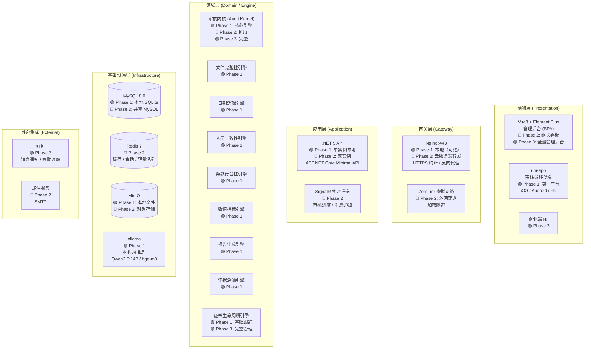
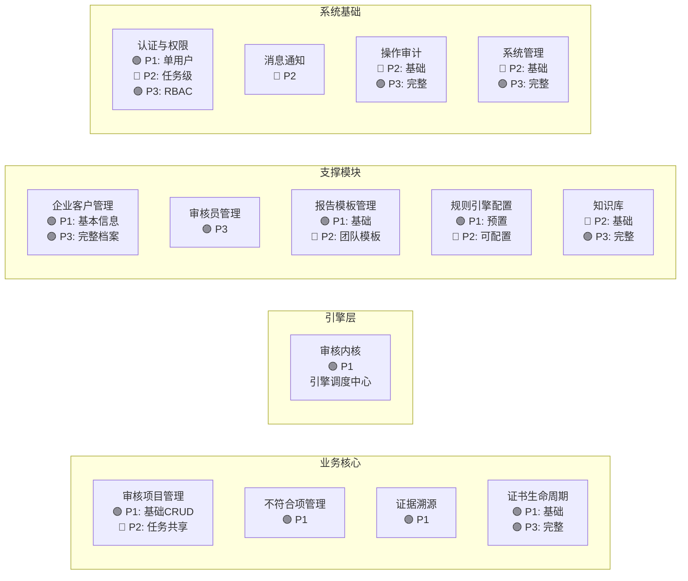
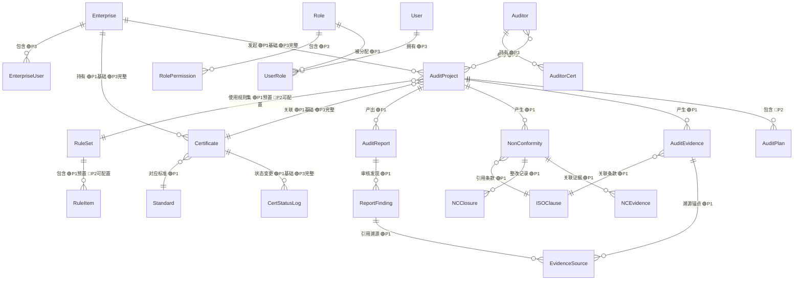
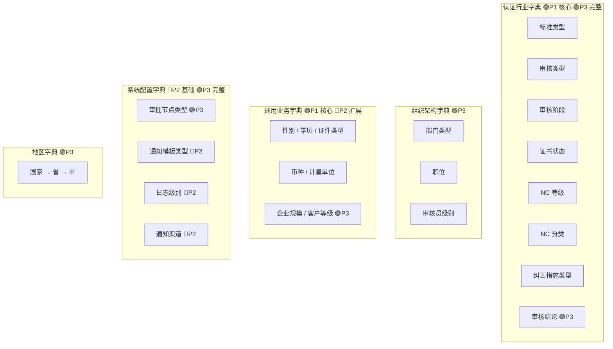
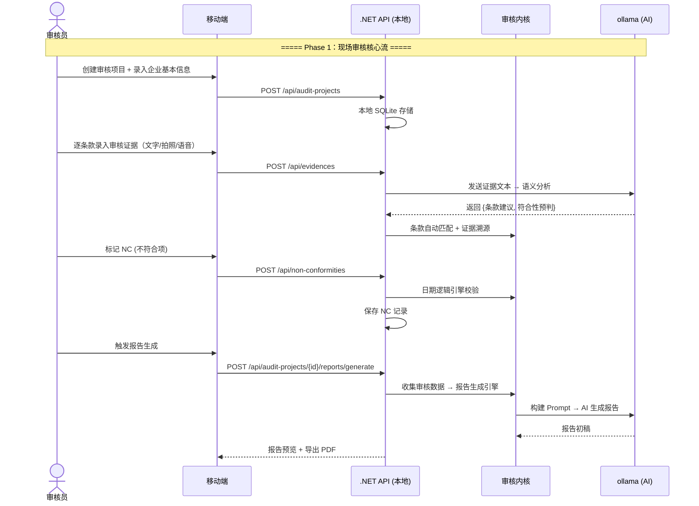

---
AIGC:
    Label: "1"
    ContentProducer: 001191440300708461136T1XGW3
    ProduceID: 9a16bac6e27d25132787d930f50d9879_137d202e897811f18108525400287e28
    ReservedCode1: OZLCXogv1lWx3ccKPLzXukE/I4tERCJzA1gaBWJQpkVKzcblFDEeu+lqQRlSwgwKnf545ZsQwOl8ltZPm/vvvJCgxHRxzMzg2jRVaO0zISFt1UH8wvIWCMDKpqGqlFKVFS4ZrVQhs7vPONDs6fwkEJNJBIopPL/ZR2GwJX5NksynpJ1KVblWmivYnoo=
    ContentPropagator: 001191440300708461136T1XGW3
    PropagateID: 9a16bac6e27d25132787d930f50d9879_137d202e897811f18108525400287e28
    ReservedCode2: OZLCXogv1lWx3ccKPLzXukE/I4tERCJzA1gaBWJQpkVKzcblFDEeu+lqQRlSwgwKnf545ZsQwOl8ltZPm/vvvJCgxHRxzMzg2jRVaO0zISFt1UH8wvIWCMDKpqGqlFKVFS4ZrVQhs7vPONDs6fwkEJNJBIopPL/ZR2GwJX5NksynpJ1KVblWmivYnoo=
---

# 体系认证审核平台——总体设计（企业方案）

> **版本**：V2.0 | **日期**：2026-07-27 | **状态**：成熟态
>
> **前置文档**：总体设计-V1.md（已归档至历史文档）/ 系统定位与演进路线-V1.md / 05-技术架构设计与ACM分析 / 06-NETCore迁移与工作流移动端设计 / 16-服务器性能与架构深度技术评估 / 07-系统边界收敛与MVP精简 / 12-证据溯源与证书全生命周期管理 / 15-规模化架构升级与优先级矩阵
>
> **适用范围**：本文件为体系认证审核平台**企业方案**的总体设计文档。沿三阶段演进路线（Phase 1 审核员个人工具 → Phase 2 小组协作 → Phase 3 公司平台），对架构决策、技术选型、模块划分、数据模型、API 设计、前端路由、移动端设计、部署方案、开发清单逐项标注 Phase 归属，是后续各阶段开发的顶层依据。
>
> **与 V1 的关系**：V1 为完整版总体设计（已移至 docs/历史文档/），本文档在 V1 基础上对所有模块/功能/设计项标注 Phase 归属，作为企业路线图的实施版本。
>
> **Phase 定义**（来源：系统定位与演进路线-V1.md）：
> | Phase | 定位 | 关键特征 |
> |-------|------|---------|
> | **Phase 1** | 审核员个人工具（MVP） | 单机可用、个人数据、移动端第一、NC录入+证据采集+检查表+报告生成 |
> | **Phase 2** | 小组协作 | 任务共享、组长视图、后端服务器引入、以"审核任务"为协作单元 |
> | **Phase 3** | 公司平台 | 完整 RBAC、资质管理、认证决定、统计报表、多项目管理、对接监管 |
>
> **变更记录**：
> | 版本 | 日期 | 变更说明 |
> |------|------|---------|
> | V1.0 | 2026-07-27 | 初版，覆盖 8 大模块 |
> | V1.1 | 2026-07-27 | 补充「数据字典体系」（第四章）、「移动端设计」（第七章）、「端到端业务流程闭环」（第十章） |
> | V2.0 | 2026-07-27 | 基于系统定位决策，对所有模块/功能/设计项标注 Phase 归属（P1/P2/P3）；原 V1 移至历史文档 |

---

## 快速定位：Phase 归属一览

| 章节 | 内容 | Phase 1 | Phase 2 | Phase 3 |
|------|------|:---:|:---:|:---:|
| 一 | 系统架构图 | 基础框架 | + SignalR 实时推送 | + 企业端 / 全量 RBAC |
| 二 | 模块划分 | M01-M09, M13（简化）, M14（基础） | + M15, M16（任务级）, M17, M18（基础）, M19（基础） | + M10, M11, M12, 完整 M16/M18/M19 |
| 三 | 数据库 ER 图 | 核心实体（AuditProject/NC/Evidence/ISOClause/Certificate基础） | + Auditor/Role/User/Certificate完整 | + Enterprise 完整 / 审计字段 |
| 四 | 数据字典体系 | 认证行业字典（核心）、通用业务字典 | + 组织架构字典、系统配置字典（部分） | + 完整系统配置字典、地区字典 |
| 五 | API 设计 | 审核项目 / 证据 / NC / 报告 / 文件（单用户） | + 任务级共享 / 组长 API | + 公司级管理 API（企业/审核员/证书完整） |
| 六 | 前端路由 | 审核管理 / 报告 / 移动端路由 | + 知识库 / 通知 | + 企业管理 / 审核员管理 / 系统管理 |
| 七 | 移动端设计 | **全部**（移动端为 Phase 1 第一平台） | 补充任务共享 | 补充审批流 |
| 八 | 部署架构 | 单机 Docker（本地） | + ZeroTier + 云服务器 | 生产全量 |
| 九 | 数据流图 | 初审 Stage 1+2 核心流程 | + NC 整改闭环完整 | + 证书全生命周期 / 认证决定 |
| 十 | 端到端业务流程 | 闭环二/三（审核执行 + NC 整改） | + 闭环三完整（审核调度） | + 闭环一完整（证书生命周期） |
| 十一 | Phase 0 开发清单 | P0 项 | P1 项 | P2 项（知识库/钉钉/ZeroTier） |

---

## 目录

1. [系统架构图](#一系统架构图)
2. [模块划分](#二模块划分)
3. [数据库 ER 图](#三数据库-er-图)
4. [数据字典体系](#四数据字典体系)
5. [API 设计总纲](#五api-设计总纲)
6. [前端路由设计](#六前端路由设计)
7. [移动端设计](#七移动端设计)
8. [部署架构](#八部署架构)
9. [数据流图](#九数据流图)
10. [端到端业务流程闭环](#十端到端业务流程闭环)
11. [Phase 0 开发清单](#十一phase-0-开发清单)

---

## 一、系统架构图

### 1.1 分层架构总览（按 Phase 标注）



### 1.2 各层职责与技术栈（按 Phase 标注）

| 层 | 职责 | 技术栈 | Phase 归属 |
|----|------|--------|-----------|
| **前端层** | 用户交互、表单录入、数据展示、文件预览 | Vue3 + Element Plus + uni-app | P1: 移动端（第一平台）；P2: Web 组长看板；P3: 全量管理后台 + 企业端 |
| **网关层** | HTTPS 终止、反向代理、静态资源、限流、跨域 | Nginx + ZeroTier | P1: 本地（可选）；P2: 云服务器 + ZeroTier |
| **应用层** | API 路由、认证鉴权、请求编排、实时推送 | ASP.NET Core 9 + SignalR | P1: 单实例本地；P2: 双实例 + SignalR |
| **领域层** | 审核规则校验、AI 证据分析、报告生成 | C# 规则引擎 + ollama | P1: 九大引擎核心；P2: 扩展；P3: 完整 |
| **基础设施层** | 数据持久化、缓存、文件存储、AI 推理 | MySQL/Redis/MinIO/ollama | P1: SQLite + 本地文件 + ollama；P2: MySQL + Redis + MinIO；P3: 生产全量 |
| **外部集成** | 消息推送、考勤对接 | 钉钉 Webhook + SMTP | P2: 邮件；P3: 钉钉 |

### 1.3 三阶段数据流向对比

**Phase 1（单机模式）**：
```
审核员移动端 → 本地 SQLite（离线）→ 联网同步 → 本地 API → ollama → 本地文件
```

**Phase 2（小组协作）**：
```
审核员移动端 → Nginx :443（云服务器）→ ZeroTier 隧道 → .NET API（自购服务器）→ MySQL/Redis/MinIO
```

**Phase 3（公司平台）**：
```
用户操作 → Nginx :443 → .NET API → 审核内核调度 → 规则引擎链
                                                    │
                                     ┌───────────────┼───────────────┐
                                     ▼               ▼               ▼
                                  MySQL           Redis           ollama
                                (持久化)      (缓存/队列)      (AI 推理)
                                     │                               │
                                     └─────────── 返回结果 ──────────┘
                                                      │
                                              SignalR 实时推送
```

---

## 二、模块划分

### 2.1 核心模块总览（按 Phase 标注）



> 图例：🟢 = Phase 1 | 🔵 = Phase 2 | 🟣 = Phase 3

### 2.2 模块职责与边界（按 Phase 标注）

| 编号 | 模块 | 职责 | Phase 归属 |
|------|------|------|-----------|
| M01 | **审核项目管理** | 审核项目全生命周期：创建 → 排期 → 文件接收 → 证据录入 → 生成报告 → NC 管理 → 关闭归档 | **P1**: 基础 CRUD、审核编号生成、个人任务列表；**P2**: 任务共享、组长看板、检查表生成、条款覆盖率统计；**P3**: 审核计划编制、排期冲突检测、多项目看板 |
| M02 | **审核内核（引擎调度）** | 九大引擎的统一调度入口：接收数据 → 流水线编排 → 分发到各引擎 → 汇总结果 → 回写 | **P1**: 核心引擎调度（文件/日期/人员/条款/数值/报告/证据）；**P2**: 扩展流水线、超时熔断；**P3**: 引擎注册/启停管理、动态流水线 |
| M03 | **文件完整性引擎** | 校验企业提交文件与应提交清单的匹配度 | **P1**: 文件清单模板管理、缺失检测、格式校验 |
| M04 | **日期逻辑引擎** | 校验所有日期字段的逻辑一致性（≥12 条规则） | **P1**: 核心日期规则（批准≤生效、培训≤考核、NC关闭≥开具等） |
| M05 | **人员一致性引擎** | 校验涉及人员的记录与企业主数据匹配（≥8 条规则） | **P1**: 人名模糊匹配、资格证书有效期检查；**P2**: 多人协作时的人员职责分离校验 |
| M06 | **条款符合性引擎** | 审核证据 → NLP 解析 → 标准条款自动匹配 → 判定符合性 | **P1**: 关键词提取、条款映射、置信度阈值 |
| M07 | **数值指标引擎** | 质量目标 vs 实际达成值自动对比 | **P1**: 目标量化检查、实际值提取、阈值告警 |
| M08 | **报告生成引擎** | 审核数据 + 模板 → 自动填充 → 排版 → 导出 PDF/Word | **P1**: 个人报告生成、模板变量替换、PDF 导出；**P2**: 多人报告合并 |
| M09 | **证据溯源引擎** | AI 结论→溯源锚点（文件+页码+行号+高亮）→可点击验证 | **P1**: sources JSON 生成、PDF 段落定位、溯源面板 UI |
| M10 | **证书生命周期引擎** | 证书全状态管理 | **P1**: 基础证书信息记录、到期提醒；**P3**: 完整状态机（Active→Suspended→Withdrawn→Expired）、监督审核窗口计算、证书 PDF 生成 |
| M11 | **企业客户管理** | 企业档案、认证范围、体系覆盖人数 | **P1**: 基本信息 CRUD（名称/联系人/认证范围）；**P3**: 完整档案（客户等级、审核历史、企业用户账号） |
| M12 | **审核员管理** | 审核员花名册、资质证书、排班负载、绩效统计 | **P3**: CCAA 证书到期提醒、专业代码授权、工作量统计 |
| M13 | **规则引擎配置** | 规则的增删改查、启停、版本管理 | **P1**: 预置规则集（硬编码配置）；**P2**: 规则列表 CRUD、关键词映射表、规则测试沙箱 |
| M14 | **报告模板管理** | 按机构/类型的模板上传、编辑、变量管理 | **P1**: 基础模板（内置 1-2 套）；**P2**: 模板 CRUD、变量列表、预览渲染 |
| M15 | **知识库** | 企业历史档案检索、标准条款库、RAG 语义搜索 | **P2**: 标准条款树、简单关键词检索；**P3**: 企业档案归档、全文搜索、NC 趋势分析、RAG |
| M16 | **认证与权限** | 用户认证、RBAC 角色权限、数据权限隔离 | **P1**: 单用户模式（无 RBAC，仅设备绑定）；**P2**: 任务级权限（组长查看组员 NC）；**P3**: 完整 RBAC（JWT/角色/菜单/数据隔离） |
| M17 | **消息通知** | 多通道通知：系统内+邮件+钉钉 | **P2**: 系统内消息 + 邮件通知；**P3**: 钉钉/短信、通知模板、催办升级 |
| M18 | **操作审计** | 全操作日志记录、敏感操作告警 | **P2**: 基础操作日志（VOL 框架自带）；**P3**: 完整审计（变更 diff、定期导出、不可删除） |
| M19 | **系统管理** | 数据字典、编号规则、备份策略 | **P2**: 编号规则、基础字典；**P3**: 完整字典体系、自动备份、机构资质配置 |

### 2.3 模块依赖关系（按 Phase 分层）

```
Phase 1（审核员个人工具）：
  M16(认证) → M01(审核项目) → M02(审核内核) → M03/M04/M05/M06/M07/M08/M09
                                             → M13(预置规则) / M14(基础模板)
                                             → M10(证书基础) / M11(企业基础)

Phase 2（小组协作）：
  Phase 1 全部 + M15(知识库基础) + M16(任务级权限) + M17(通知) + M18(基础审计) + M19(基础系统)

Phase 3（公司平台）：
  Phase 2 全部 + M10(证书完整) + M11(企业完整) + M12(审核员管理) + M16(完整RBAC) + M18/M19(完整)
```

---

## 三、数据库 ER 图

### 3.1 核心实体关系（按 Phase 标注）



> 图例：🟢P1 = Phase 1 启用 | 🔵P2 = Phase 2 启用 | 🟣P3 = Phase 3 启用

### 3.2 核心实体结构描述（按 Phase 标注）

#### Enterprise（企业客户）

| 字段 | 类型 | Phase | 说明 |
|------|------|:---:|------|
| id | UUID PK | P1 | 雪花 ID |
| name | VARCHAR(200) | P1 | 企业全称 |
| short_name | VARCHAR(100) | P1 | 简称 |
| contact_name | VARCHAR(50) | P1 | 联系人 |
| contact_phone | VARCHAR(20) | P1 | 联系电话 |
| cert_scope | TEXT | P1 | 认证范围描述 |
| credit_code | VARCHAR(50) | P3 | 统一社会信用代码 |
| legal_person | VARCHAR(50) | P3 | 法人代表 |
| address | TEXT | P3 | 注册地址 |
| employee_count | INT | P3 | 体系覆盖人数 |
| customer_level | ENUM | P3 | A/B/C 客户等级 |
| status | ENUM | P3 | active / inactive / blacklisted |
| branch_id | UUID FK | P3 | 所属分公司 |
| created_at / updated_at | TIMESTAMP | P1 | 审计字段 |

#### AuditProject（审核项目）

| 字段 | 类型 | Phase | 说明 |
|------|------|:---:|------|
| id | UUID PK | P1 | |
| audit_no | VARCHAR(30) UNIQUE | P1 | 审核编号 |
| enterprise_id | UUID FK | P1 | 被审核企业 |
| audit_type | ENUM | P1 | 初审 / 监督 / 再认证 / 特殊 |
| standard_id | UUID FK | P1 | 认证标准 |
| status | ENUM | P1 | draft → ... → archived |
| lead_auditor_id | UUID FK | P1 | 审核员本人（P1-P2）/ 审核组长（P3） |
| planned_date_from | DATE | P1 | 计划开始日期 |
| planned_date_to | DATE | P1 | 计划结束日期 |
| actual_date_from | DATE | P2 | 实际开始日期 |
| actual_date_to | DATE | P2 | 实际结束日期 |
| certificate_id | UUID FK NULL | P2 | 关联证书 |
| rule_set_id | UUID FK | P2 | 使用的规则集 |
| created_at / updated_at | TIMESTAMP | P1 | |

#### NonConformity（不符合项）

| 字段 | 类型 | Phase | 说明 |
|------|------|:---:|------|
| id | UUID PK | P1 | |
| nc_no | VARCHAR(30) UNIQUE | P1 | NC 编号 |
| audit_project_id | UUID FK | P1 | 所属审核项目 |
| severity | ENUM | P1 | major / minor / observation |
| clause_id | UUID FK | P1 | 引用条款 |
| description | TEXT | P1 | NC 描述 |
| evidence_summary | TEXT | P1 | 证据摘要 |
| status | ENUM | P1 | open → ... → closed |
| opened_by | UUID FK | P1 | 开具人 |
| due_date | DATE | P1 | 整改截止日 |
| closed_by | UUID FK | P2 | 关闭人 |
| closed_at | TIMESTAMP | P2 | 关闭时间 |

#### AuditEvidence / EvidenceSource（证据与溯源）

| 实体 | Phase | 说明 |
|------|:---:|------|
| AuditEvidence | P1 | 证据采集（文字/拍照/语音/文件）、SHA-256 哈希、GPS坐标 |
| EvidenceSource | P1 | 溯源锚点（文件路径/页码/行号/原文摘录/AI推理） |

#### Certificate（证书）

| 字段 | 类型 | Phase | 说明 |
|------|------|:---:|------|
| id | UUID PK | P1 | |
| cert_no | VARCHAR(50) UNIQUE | P1 | 证书编号 |
| enterprise_id | UUID FK | P1 | 获证企业 |
| standard_id | UUID FK | P1 | 认证标准 |
| cert_scope | TEXT | P1 | 认证范围 |
| issue_date | DATE | P1 | 颁发日期 |
| expiry_date | DATE | P1 | 到期日（3年） |
| cert_status | ENUM | P1 | active / expired（P1 简化） |
| surveillance_1_due | DATE | P3 | 一监到期日 |
| surveillance_1_done | DATE | P3 | 一监完成日 |
| surveillance_2_due | DATE | P3 | 二监到期日 |
| surveillance_2_done | DATE | P3 | 二监完成日 |
| recert_due | DATE | P3 | 再认证到期日 |
| suspended_at / suspended_reason | — | P3 | 暂停信息 |
| restored_at | DATE | P3 | 恢复日期 |
| withdrawn_at / withdrawn_reason | — | P3 | 撤销信息 |
| accreditation | VARCHAR(20) | P3 | CNAS / UKAS |
| initial_project_id | UUID FK | P3 | 初审项目 |

#### Auditor（审核员）

| 字段 | 类型 | Phase | 说明 |
|------|------|:---:|------|
| *全部字段* | — | **P3** | 审核员管理为 P3 完整启用，P1-P2 无需此表（审核员本人即用户） |

#### User / Role / Permission（用户权限体系）

| 实体 | Phase | 说明 |
|------|:---:|------|
| User | P1 | P1: 单用户（审核员本人，设备绑定）；P2: 扩展到审核组成员；P3: 完整用户体系 |
| Role | P3 | 超级管理员 / 审核组长 / 审核员 / 技术专家 / 企业管理员 |
| UserRole | P3 | 多对多 |
| Permission | P3 | 菜单+按钮级权限 |

#### ISOClause（标准条款）

| 字段 | 类型 | Phase | 说明 |
|------|------|:---:|------|
| *全部字段* | — | **P1** | 标准条款库为 P1 预置，内置常用标准（ISO 13485 / ISO 9001 等） |

### 3.3 Phase 1 最小数据模型

Phase 1 仅需以下实体即可支撑审核员个人工具全部功能：

```
Enterprise（基础） ──→ AuditProject ──→ AuditEvidence ──→ EvidenceSource
                       │
                       ├──→ NonConformity ──→ NCEvidence
                       │                     └──→ NCClosure
                       │
                       ├──→ ISOClause（预置）
                       ├──→ Standard（预置）
                       ├──→ Certificate（基础）
                       └──→ AuditReport ──→ ReportFinding
```

---

## 四、数据字典体系

### 4.1 字典分类设计（按 Phase 标注）



### 4.2 Phase 1 最小字典集

Phase 1 预置以下核心字典即可：（内容同 V1 §4.2.1 认证行业字典 + §4.2.3 通用业务字典中的性别/学历/证件类型）

Phase 2/3 逐步扩展至完整字典体系（详见 V1 §4.2 全文）。

### 4.3 字典表结构与使用规范

与 V1 §4.3、§4.4 一致，Phase 1 采用硬编码常量替代数据库字典表，Phase 2 起引入 Sys_Dictionary / Sys_DictionaryList。

---

## 五、API 设计总纲

### 5.1 RESTful 资源定义（按 Phase 标注）

| 资源 | 根路径 | Phase | 说明 |
|------|--------|:---:|------|
| 审核项目 | `/api/audit-projects` | **P1** | 个人审核项目 CRUD；P2 增加任务共享/组长视图；P3 增加多项目管理 |
| 企业客户 | `/api/enterprises` | P1 | P1: 基本信息 CRUD；P3: 完整档案管理 |
| 审核员 | `/api/auditors` | P3 | 审核员花名册（P1-P2 无此资源） |
| 不符合项 | `/api/non-conformities` | **P1** | NC 全生命周期 |
| 审核证据 | `/api/evidences` | **P1** | 证据采集与溯源 |
| 证书 | `/api/certificates` | P1 | P1: 基础记录+到期提醒；P3: 完整生命周期管理 |
| 标准条款 | `/api/standards/{id}/clauses` | **P1** | 条款查询（预置数据） |
| 规则引擎 | `/api/rules` | P1 | P1: 预置规则（只读）；P2: 规则配置与测试 |
| 报告模板 | `/api/report-templates` | P1 | P1: 内置模板（只读）；P2: 模板管理 CRUD |
| 审核报告 | `/api/audit-projects/{id}/reports` | **P1** | 报告生成与导出 |
| 文件管理 | `/api/files` | **P1** | 上传/下载/预览（P1 本地；P2 MinIO） |
| 知识库 | `/api/knowledge-base` | P2 | P2: 简单检索；P3: 全文检索 |
| 消息通知 | `/api/notifications` | P2 | 消息中心 |
| 系统管理 | `/api/system` | P2 | P2: 基础配置；P3: 字典/日志 |

### 5.2 Phase 1 最小 API 端点集

以下为 Phase 1 必须实现的端点（单用户模式，无认证鉴权或仅设备绑定验证）：

#### 审核项目管理

| 方法 | 端点 | 说明 |
|------|------|------|
| `GET` | `/api/audit-projects` | 当前审核员的所有审核项目 |
| `POST` | `/api/audit-projects` | 创建审核项目 |
| `GET` | `/api/audit-projects/{id}` | 审核项目详情 |
| `PUT` | `/api/audit-projects/{id}` | 更新审核项目 |
| `PATCH` | `/api/audit-projects/{id}/status` | 状态流转 |

#### 证据与 NC 管理

| 方法 | 端点 | 说明 |
|------|------|------|
| `POST` | `/api/audit-projects/{id}/evidences` | 录入审核证据 |
| `GET` | `/api/evidences/{id}/sources` | 证据溯源锚点 |
| `POST` | `/api/audit-projects/{id}/non-conformities` | 开具 NC |
| `GET` | `/api/non-conformities/{id}` | NC 详情 |
| `PATCH` | `/api/non-conformities/{id}/status` | NC 状态流转 |
| `POST` | `/api/non-conformities/{id}/closure` | 整改证据提交 |
| `POST` | `/api/non-conformities/{id}/verify` | 验证通过/退回 |

#### 报告

| 方法 | 端点 | 说明 |
|------|------|------|
| `POST` | `/api/audit-projects/{id}/reports/generate` | 生成报告（同步/异步） |
| `GET` | `/api/audit-projects/{id}/reports/preview` | 在线预览 |
| `GET` | `/api/audit-projects/{id}/reports/export` | 导出 PDF/Word |

#### 企业与标准

| 方法 | 端点 | 说明 |
|------|------|------|
| `GET` | `/api/enterprises` | 企业列表（个人常用） |
| `POST` | `/api/enterprises` | 快速创建企业 |
| `GET` | `/api/standards/{id}/clauses` | 标准条款查询 |

#### 引擎校验

| 方法 | 端点 | 说明 |
|------|------|------|
| `POST` | `/api/audit-projects/{id}/validate` | 对指定项目执行全引擎校验 |

> Phase 2/3 完整端点详见 V1 §4.2。

### 5.3 统一请求/响应格式、分页、错误码、认证

与 V1 §4.3、§4.4 一致。

**Phase 分级**：
- **P1**: 无 JWT（单用户模式），分页默认 page_size=20，基础错误码
- **P2**: JWT Bearer Token（任务级认证），Refresh Token 7 天
- **P3**: 完整 JWT + RBAC + 登录锁定 + API 签名防重放

---

## 六、前端路由设计

### 6.1 页面路由树（按 Phase 标注）

路由结构与 V1 §5.1 基本一致，以下标注各路由 Phase 归属：

```
/dashboard          🟢P1（个人工作台：当日任务 + 待办 NC）
/audit/*            🟢P1（审核管理核心）
  /projects         🟢P1
  /projects/create  🟢P1
  /projects/:id     🟢P1（P2 增加组长操作）
  /nc               🟢P1
  /report           🟢P1
/enterprise/*       🟢P1（基础企业信息）
/certificates/*     🟢P1（基础）🟣P3（完整看板+管理）
/auditors/*         🟣P3
/rules/*            🟢P1（只读预置）🔵P2（可配置）
/templates/*        🟢P1（只读内置）🔵P2（可管理）
/knowledge/*        🔵P2（基础检索）🟣P3（完整）
/system/*           🔵P2（基础）🟣P3（完整）
/notifications      🔵P2
```

### 6.2 Phase 1 移动端路由优先

Phase 1 以移动端为第一平台，PC 管理后台为辅助（仅报告编辑/深度操作）。移动端路由详见 §7.6。

### 6.3 路由权限矩阵

Phase 1 单用户无权限矩阵；Phase 2 引入任务级权限（组长/组员）；Phase 3 引入完整 RBAC（详见 V1 §5.2）。

### 6.4 页面与后端 API 对应关系

与 V1 §5.3 一致，P1 仅覆盖移动端+核心管理页面。

---

## 七、移动端设计

> **Phase 1 移动端为第一平台。** 审核员在现场 90% 的时间使用手机或平板，拍照、录音、GPS 定位等能力只有移动端能原生提供。

### 7.1 移动端定位

| 原则 | 说明 | Phase |
|------|------|:---:|
| **聚焦现场操作** | 不做复杂配置、不做统计分析、不做管理后台功能 | P1-P3 |
| **弱网可用** | 工厂车间、偏远厂区网络不稳定，支持离线 + 联网同步 | **P1** |
| **证据可信** | 拍照、录音等证据采集必须防篡改、可追溯 | **P1** |

### 7.2 核心功能（按 Phase 分级）

| 功能 | 描述 | Phase |
|------|------|:---:|
| 审核任务列表 | 按状态筛选，显示任务概要 | **P1** |
| 任务详情 | 查看审核计划、企业信息 | **P1** |
| 检查表填写 | 按条款逐条审核，标记符合/不符合/不适用 | **P1** |
| NC 录入 | 现场开具不符合项，关联条款，填写描述 | **P1** |
| 拍照取证 | 相机拍照 + 水印（时间戳+GPS），上传证据库 | **P1** |
| 录音取证 | 录音文件上传，关联任务 | **P1** |
| 电子签名 | 手写签名板，生成签名图片 | P2 |
| 离线模式 | 本地 SQLite 暂存，联网自动上传 | **P1** |
| 标准查阅 | 离线缓存标准条款原文 | **P1** |
| 任务接收 | 组长下发任务，移动端接收推送 | P2 |
| 组员 NC 查看 | 组长查看组员 NC 汇总 | P2 |
| 审核报告预览 | 移动端预览报告草稿 | P2 |

### 7.3 技术栈

| 层 | 技术 | Phase |
|----|------|:---:|
| 框架 | **uni-app** (Vue3) | **P1** |
| UI 组件 | uView UI 3.0 | **P1** |
| 本地存储 | SQLite（uni-app 内置） | **P1** |
| 拍照 | uni-app Camera API + 水印叠加 | **P1** |
| 签名 | Canvas 2D | P2 |
| 文件上传 | uni.uploadFile + 分片 | **P1** |
| 推送 | uni-push 2.0 | P2 |
| 网络状态 | uni.getNetworkType | **P1** |

### 7.4 PC 端与移动端功能矩阵对比

与 V1 §7.4 一致。Phase 1 移动端承载全部核心操作，PC 端仅用于报告深度编辑。

### 7.5 移动端特有设计

离线模式、断点续传、拍照防篡改——与 V1 §7.5 一致，均为 **Phase 1 必须交付**。

### 7.6 移动端路由简表

| 路由 | 页面名称 | Phase |
|------|---------|:---:|
| `/pages/login/index` | 登录 | **P1** |
| `/pages/task/list` | 审核任务列表 | **P1** |
| `/pages/task/detail` | 任务详情 | **P1** |
| `/pages/checklist/index` | 检查表 | **P1** |
| `/pages/checklist/item` | 检查项详情 | **P1** |
| `/pages/nc/create` | 开具 NC | **P1** |
| `/pages/nc/list` | NC 列表 | **P1** |
| `/pages/evidence/camera` | 拍照取证 | **P1** |
| `/pages/evidence/record` | 录音取证 | **P1** |
| `/pages/evidence/list` | 证据列表 | **P1** |
| `/pages/signature/index` | 电子签名 | P2 |
| `/pages/standard/index` | 标准查阅 | **P1** |
| `/pages/mine/index` | 我的 | **P1** |

---

## 八、部署架构

### 8.1 三阶段部署拓扑对比

| 阶段 | 部署方式 | 数据存储 | 外网访问 |
|------|---------|---------|---------|
| **Phase 1** | 移动端本地运行 / 单机 Docker（可选） | SQLite + 本地文件 + ollama | 不需要（离线可用） |
| **Phase 2** | Docker Compose 单机（自购服务器） | MySQL + MinIO + Redis | ZeroTier + 云服务器转发 |
| **Phase 3** | Docker Compose 双实例（生产） | MySQL + MinIO + Redis（持久化+备份） | 域名 HTTPS → 云服务器 → ZeroTier |

### 8.2 Phase 1 简化的 Docker Compose

Phase 1 本地运行（审核员个人电脑/Mac Mini），仅需以下服务：

```yaml
version: '3.8'
services:
  api:
    image: audit-platform:latest
    container_name: audit-api
    ports:
      - "5000:80"
    environment:
      - ASPNETCORE_ENVIRONMENT=Development
      - ConnectionStrings__Default=Data Source=/app/data/audit.db  # SQLite
    volumes:
      - ./data:/app/data
      - ./logs:/app/logs
    restart: always

  ollama:
    image: ollama/ollama:latest
    container_name: audit-ollama
    volumes:
      - ollama-models:/root/.ollama
    environment:
      - OLLAMA_HOST=0.0.0.0:11434
    restart: always

volumes:
  ollama-models:
```

> Phase 2/3 完整 Docker Compose 编排、Nginx 配置、外网访问架构（ZeroTier + 云服务器）、开发/测试/生产环境差异——详见 V1 §6.1-§6.4。

### 8.3 Nginx 反向代理配置

P2 引入（详见 V1 §6.2）；P3 增加限流 + WebSocket 代理。

---

## 九、数据流图

### 9.1 证书申请审核流程——Phase 1 核心流

Phase 1 聚焦审核员可独立完成的流程（Stage 2 现场审核 + 报告生成），不包含企业端交互和完整的 Stage 1 文件审查：



> Phase 2 增加企业端确认、NC 整改验证完整闭环、组长审核报告。
> Phase 3 增加 Stage 1 文件审查、认证决定、证书签发完整流程。
> 完整流程详见 V1 §7.1。

### 9.2 不符合项整改流程

与 V1 §7.2 一致。**Phase 1** 实现核心状态机（Open → Rectifying → Closed），Phase 2 增加企业确认环节和催办通知，Phase 3 增加升级通知和知识库归档。

### 9.3 各阶段数据存储策略

| 环节 | Phase 1 | Phase 2 | Phase 3 |
|------|---------|---------|---------|
| 证据采集 | SQLite + 本地文件 | MySQL + MinIO | MySQL + MinIO（企业级） |
| NC 管理 | SQLite | MySQL（任务共享） | MySQL（公司级） |
| 报告生成 | SQLite + 本地 PDF | MySQL + MinIO PDF | MySQL + MinIO（归档） |
| 证书管理 | SQLite（基础记录） | MySQL（基础） | MySQL（完整状态机） |
| 审计日志 | — | MySQL（VOL Sys_Log） | MySQL（扩展日志表） |

---

## 十、端到端业务流程闭环

### 10.1 闭环总览（按 Phase 标注）

| 闭环 | Phase 1 | Phase 2 | Phase 3 |
|------|:---:|:---:|:---:|
| **闭环一：证书生命周期** | 基础记录 + 到期提醒 | 基础闭环 | 完整闭环（申请→受理→签发→监督→再认证） |
| **闭环二：NC 整改** | 核心闭环（开具→整改→验证关闭） | + 企业确认 + 催办 | + 升级通知 + 知识库归档 |
| **闭环三：审核任务调度** | 个人任务管理 | + 任务共享 + 组长调度 | + 审核方案生成 + 认证决定 |

### 10.2 闭环一：证书生命周期闭环

| 阶段 | Phase | 阶段 | Phase |
|------|:---:|------|:---:|
| 1. 申请 | P3 | 6. 认证决定 | P3 |
| 2. 受理 | P3 | 7. 证书签发 | P1(基础) / P3(完整) |
| 3. 审核方案制定 | P3 | 8. 监督审核 | P3 |
| 4. 一阶段审核 | P3 | 9. 再认证/到期 | P1(到期提醒) / P3(完整) |
| 5. 二阶段审核 | **P1** | | |

> 完整流程详情见 V1 §10.2。

### 10.3 闭环二：不符合项整改闭环

| 阶段 | Phase | 阶段 | Phase |
|------|:---:|------|:---:|
| 1. 审核发现 NC | **P1** | 5. 提交整改证据 | **P1** |
| 2. 开具 NC 报告 | **P1** | 6. 审核员验证 | **P1** |
| 3. 企业确认 | P2 | 7. 关闭 NC | **P1** |
| 4. 制定纠正措施 | P2 | 7b. 退回重整改 | **P1** |

> 完整流程详情见 V1 §10.3。

### 10.4 闭环三：审核任务调度闭环

| 阶段 | Phase | 阶段 | Phase |
|------|:---:|------|:---:|
| 1. 审核方案生成 | P3 | 5. 审核发现提交 | **P1** |
| 2. 审核员指派 | P3 | 6. 审核报告编制 | **P1** |
| 3. 任务下发 | P2 | 7. 技术评审 | P3 |
| 4. 现场审核执行 | **P1** | 8. 认证决定 | P3 |

> 完整流程详情见 V1 §10.4。

### 10.5 三个闭环之间的关系

与 V1 §10.5 一致。Phase 1 仅运行闭环二（NC 整改），Phase 2 增加闭环三（审核调度），Phase 3 三个闭环完整联动。

### 10.6 闭环完整性保障机制

| 机制 | Phase 1 | Phase 2 | Phase 3 |
|------|:---:|:---:|:---:|
| **状态机约束** | 核心实体（NC/AuditProject） | + Certificate | 全实体完整状态机 |
| **强制校验点** | NC 关闭前置校验 | + 报告编制前置校验 | + 认证决定/签发证书/关闭项目 |
| **审计日志** | —（本地操作无需审计） | 基础日志（VOL Sys_Log） | 完整审计（变更 diff、定期导出、不可删除） |

> 完整机制详见 V1 §10.6。

---

## 十一、Phase 0 开发清单

### 11.1 功能清单（按 Phase 重新标注）

> Phase 0 = 基础框架搭建 + 自动审核核心引擎。目标：能让审核报告从 3 天人工变成 30 分钟 AI 生成 + 人工复核。

| 编号 | 功能 | 说明 | Phase | 人天 | 依赖 |
|------|------|------|:---:|:---:|------|
| **基础框架** | | | | | |
| F00 | VOL 框架搭建 | .NET 9 + Vue3 + Element Plus 项目骨架、Docker Compose 环境 | **P1** | 2 | — |
| F01 | 用户/角色/权限 | Phase 1: 单用户模式（设备绑定）；Phase 2: 任务级认证；Phase 3: 完整 RBAC | **P1** | 1 | F00 |
| F02 | 企业档案 CRUD | 企业基本信息（名称/联系人/认证范围） | **P1** | 1.5 | F00 |
| F03 | 审核员管理 | 花名册、CCAA 证书到期提醒、专业代码授权 | P3 | 2 | F00 |
| **审核核心** | | | | | |
| F04 | 审核项目 CRUD | 创建/编辑/状态流转、审核编号生成 | **P1** | 3 | F02 |
| F05 | 文件上传 + 预览 | 文件上传、PDF/DOCX 预览、本地存储（P1）/ MinIO（P2） | **P1** | 2 | F00 |
| F06 | 文件完整性引擎 | 应提交清单模板加载、缺失检测、格式校验 | **P1** | 3 | F05 |
| F07 | 日期逻辑引擎 | ≥12 条日期校验规则 | **P1** | 3 | — |
| F08 | 人员一致性引擎 | ≥8 条人员校验规则、人名模糊匹配 | **P1** | 2 | F02 |
| F09 | 审核证据录入 | 文字/拍照/文件上传、证据→条款关联、移动端优先 | **P1** | 4 | F04 |
| F10 | 条款符合性引擎 | 关键词→条款映射、AI 语义匹配 | **P1** | 3 | F09 |
| F11 | 证据溯源引擎 | AI 输出 sources JSON、PDF 段落定位、溯源面板 UI | **P1** | 4 | F09,F10 |
| F12 | NC 管理 | 开具/关联证据/状态流转/整改跟踪/验证关闭 | **P1** | 3 | F04,F09 |
| **报告与证书** | | | | | |
| F13 | 报告生成引擎 | Word 模板变量填充、AI 报告生成、异步队列 | **P1** | 5 | F06-F12 |
| F14 | 报告预览与导出 | 在线预览、人工复核编辑、PDF 导出 | **P1** | 2 | F13 |
| F15 | 证书生命周期引擎 | P1: 基础记录+到期提醒；P3: 完整证书管理 | **P1** | 3 | F04,F13 |
| **支撑功能** | | | | | |
| F16 | 消息通知 | 系统内消息 + 邮件 | P2 | 2 | F00 |
| F17 | 操作审计日志 | 全操作记录、不可删除 | P2 | 0.5 | F00(VOL自带) |
| F18 | 移动端基础版 | uni-app 项目搭建、审核项目列表、条款录入、拍照取证 | **P1** | 6 | F04,F09 |
| F19 | 排期冲突检测 | 审核员日历、时段冲突检测 | P3 | 1.5 | F03,F04 |
| **规则与知识** | | | | | |
| F20 | 规则引擎配置 | P1: 预置规则（硬编码）；P2: 规则列表 CRUD、启停、关键词映射 | P2 | 2 | F06-F10 |
| F21 | 报告模板管理 | P1: 内置 1-2 套模板；P2: 模板库、变量管理、预览渲染 | P2 | 2 | F13 |
| F22 | 知识库基础 | 企业档案归档、标准条款树、简单检索 | P2 | 3 | F02,F04 |
| **外部集成** | | | | | |
| F23 | 钉钉对接 | Webhook 消息通知、考勤状态读取 | P3 | 2 | F16 |
| F24 | ZeroTier 组网 | 云服务器 + ZeroTier moon + Nginx 转发 | P2 | 1.5 | — |

### 11.2 Phase 1 MVP 工作量

| 分类 | 项目数 | 人天 |
|------|:---:|:---:|
| **P1 必须交付** | 17 项 | **52** |
| P2 后续交付 | 6 项 | 9 |
| P3 远期规划 | 3 项 | 5.5 |
| **合计** | **24 项** | **66.5** |

> Phase 1 = 52 人天，2 人 × 约 5-6 周即可完成 MVP。

### 11.3 建议开发顺序（按 Phase 调整）

```
Phase 1 (Week 1-6): 审核员个人工具 MVP
  Week 1-2: 基础框架
    F00 (VOL框架) → F01 (单用户模式) → F02 (企业档案) → F05 (文件上传)
  
  Week 3-4: 规则引擎层
    F06 (文件完整性) ─┐
    F07 (日期逻辑)   ├─ 可并行开发
    F08 (人员一致性) ─┘
  
  Week 5-6: 审核核心 + 移动端
    F04 (审核项目) → F09 (证据录入) → F10 (条款符合性) → F11 (证据溯源)
    → F12 (NC 管理) → F13 (报告生成) → F14 (报告预览/导出) → F15 (证书基础)
    并行: F18 (移动端基础版)

Phase 2 (Week 7-10): 小组协作
  F16 (消息通知) → F20 (规则配置) → F21 (报告模板) → F17 (审计日志)
  → F22 (知识库基础) → F24 (ZeroTier 组网)

Phase 3 (Week 11+): 公司平台
  F03 (审核员管理) → F19 (排期冲突) → F23 (钉钉对接)
  + 完整 RBAC (F01 升级) + 完整证书管理 (F15 升级)
```

### 11.4 Phase 0 不做清单（按 Phase 归属）

| 不做 | 原因 | 计划 Phase |
|------|------|:---:|
| 工作流引擎（Elsa） | Phase 1-2 手动流转即可 | P3 |
| 企业端自助门户 | 初期企业不登录系统 | P3 |
| 统计分析大屏 | 项目量不够，无统计意义 | P3 |
| 多机构模板适配 | 首期仅 ACM | P3 |
| 知识图谱（Neo4j） | MVP 不需要关联分析 | P3 |
| RAG 语义检索（ChromaDB） | P2 用简单关键词搜索即可 | P3 |
| 考勤管理 | 钉钉已覆盖 | 不做 |
| 出差审批 / 费用报销 | OA 范畴 | 不做 |
| 多语言 | 首期仅中文 | P3 |
| 电子签章集成 | P1-P2 用图片签章模拟 | P3 |
| 审核员排期与调度 | 个人工具不需要 | P3 |
| 多项目统计分析 | 数据量不足 | P3 |
| 公司级 RBAC | 单用户零权限 | P3 |
| 认证决定流程 | 公司平台范畴 | P3 |
| 审核员资质管理 | 审核员自己不需要管理 | P3 |

---

## 附录：关键架构决策记录

与 V1 附录一致，以下补充 Phase 相关的新决策：

| 编号 | 决策 | 理由 | Phase |
|------|------|------|:---:|
| AD-010 | **移动端为 Phase 1 第一平台** | 审核员 90% 现场时间使用手机，拍照/录音/GPS 仅移动端原生支持 | P1 |
| AD-011 | **Phase 1 单用户模式（无 RBAC）** | 审核员个人工具无需多用户权限，降低初期架构复杂度 | P1 |
| AD-012 | **Phase 1 数据存储用 SQLite** | 单机可用、零运维、审核员离职数据随身带走 | P1 |
| AD-013 | **Phase 2 以"审核任务"为协作单元** | 审核员不先加入公司才能协作，而是因共同执行一次审核任务而临时协作 | P2 |

---

**文档版本**：V2.0  
**创建时间**：2026-07-27  
**变更说明**：基于系统定位与演进路线-V1.md 的三阶段决策，对所有模块/功能/设计项标注 Phase 归属（P1/P2/P3）。原总体设计-V1.md 已移至 docs/历史文档/。  
*（内容由 AI 生成，仅供参考）*
