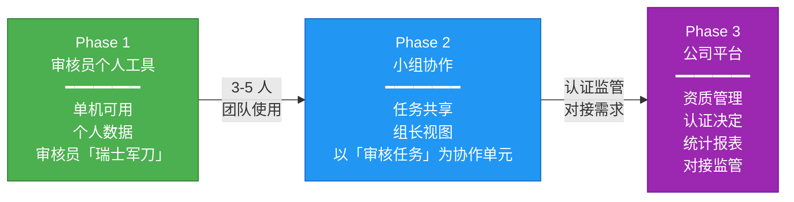
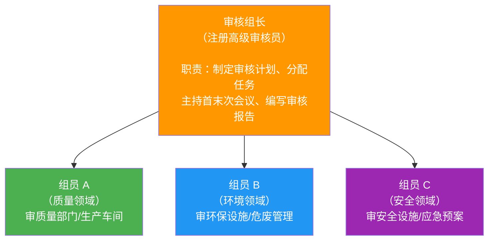
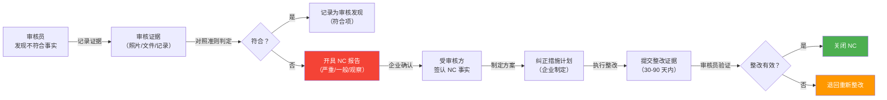

---
AIGC:
    Label: "1"
    ContentProducer: 001191440300708461136T1XGW3
    ProduceID: 9a16bac6e27d25132787d930f50d9879_f9f7fdfa898c11f18108525400287e28
    ReservedCode1: aZ/LBVkhk2vnfrtIiNJUu07iPhHty0T4kanKRM8RNaMz/Rn2ldYvUHeX7WUcLskujAAL/KtjlIWM0BSd8Nh6CfUdjsvpe5cnnuDB8fkpLCyX0s936rWjIm2s7iCH/XjxzU/hozGgPMDnIARuUNTtlRdBzGdyfEeSpeLJNgNqNqkKUHC91NA+80ueU5M=
    ContentPropagator: 001191440300708461136T1XGW3
    PropagateID: 9a16bac6e27d25132787d930f50d9879_f9f7fdfa898c11f18108525400287e28
    ReservedCode2: aZ/LBVkhk2vnfrtIiNJUu07iPhHty0T4kanKRM8RNaMz/Rn2ldYvUHeX7WUcLskujAAL/KtjlIWM0BSd8Nh6CfUdjsvpe5cnnuDB8fkpLCyX0s936rWjIm2s7iCH/XjxzU/hozGgPMDnIARuUNTtlRdBzGdyfEeSpeLJNgNqNqkKUHC91NA+80ueU5M=
---

# 系统定位与演进路线——架构决策

> **版本**：V1.0 | **日期**：2026-07-27 | **状态**：成熟态
>
> **决策背景**：在系统设计初期，面临一个影响全局架构的关键选择——以"审核公司管理平台"还是"审核员个人工具"作为系统定位。本文件记录该决策的对比分析、建议路径、对总体设计的影响及后续行动。

---

## 目录

1. [两种定位对比分析](#一两种定位对比分析)
2. [建议路径：三阶段演进](#二建议路径三阶段演进)
3. [审核现场工作模型](#三审核现场工作模型)
4. [对总体设计的直接影响](#四对总体设计的直接影响)
5. [建议的行动](#五建议的行动)

---

## 一、两种定位对比分析

### 1.1 核心差异矩阵

| 维度 | 审核公司管理平台 | 审核员个人工具 |
|------|-----------------|---------------|
| **目标用户** | 公司管理者（审核经理、技术总监、总经理） | 审核员本人（一线执行者） |
| **核心痛点** | 排期混乱、资源利用率低、项目利润不透明 | 审核效率低、NC 手写易错、证据管理混乱、报告撰写耗时 |
| **功能侧重** | 项目管理、审核员排期与调度、人天统计、利润率分析、客户关系管理 | NC 快速录入、证据拍照/录音采集、检查表管理、自动生成审核报告、个人审核记录归档 |
| **初期用户获取** | 需要说服公司决策层，采购流程长，决策链涉及老板/技术总监/财务 | 审核员个人即可下载使用，零决策成本 |
| **付费意愿** | 公司预算，单笔金额大但决策链长（通常 1-3 个月） | 个人效率工具，决策链短（试用→购买，通常 1-7 天），但单笔金额小 |
| **数据主权** | 公司拥有所有审核数据，审核员离职后数据归属公司 | 审核员拥有自己的数据，可带到不同机构使用 |
| **扩展路径** | 自上而下：公司平台 → 强制审核员使用 → 补充移动端 | 自下而上：审核员工具 → 小组协作 → 公司平台 |
| **竞争壁垒** | 功能全面，但切换成本高，需要公司级推广 | 先占领审核员心智，形成使用习惯后向上突破 |
| **技术复杂度** | 初期就需要 RBAC、多租户、公司级数据隔离 | 初期单用户、单机可用，架构轻量 |

### 1.2 决策结论

**选择"审核员个人工具"作为系统起点。** 核心理由：

1. **先活下来**：创业初期说服认证公司采购一套未经验证的系统极其困难，但作为朋友间的工作工具零阻力
2. **先验证价值**：审核员每天用，反馈即时，迭代快；公司管理者不一定天天打开系统
3. **先占领心智**：审核员是整个认证链条的核心执行者，他们用习惯了，向上推广才有群众基础
4. **技术风险低**：单用户工具架构简单，出问题影响范围可控

---

## 二、建议路径：三阶段演进

### 2.1 演进路线总览



### 2.2 Phase 1：审核员个人工具（MVP）

- **定位**：审核员的"瑞士军刀"——一个人在现场能完成所有审核工作的随身工具
- **核心功能**：

| 功能模块 | 具体能力 | 优先级 |
|---------|---------|--------|
| NC 快速录入 | 选择条款 → 填写事实描述 → 判定等级 → 拍照留存 → 一键生成 NC 报告 | P0 |
| 证据采集 | 拍照（自动加水印/时间戳/GPS）、录音、文件导入 | P0 |
| 检查表管理 | 按标准条款预设检查表模板，逐项打勾+备注 | P0 |
| 审核报告生成 | 汇总 NC + 检查表 + 审核结论 → 自动生成 Word/PDF 审核报告 | P0 |
| 个人审核记录归档 | 按审核任务归档：哪家企业、哪天、什么标准、开了哪些 NC | P1 |
| 审核计划导入 | 导入组长下发的审核计划表（Excel/PDF），解析为每日任务清单 | P1 |

- **技术特征**：
  - 单机可用，无需服务器即可完成核心操作
  - 数据存储在审核员本地设备或个人云盘（如 iCloud）
  - 移动端（手机/平板）为第一平台，PC 端为辅助（现场用手机远多于电脑）
- **推广方式**：朋友试用 → 口碑传播 → 审核员社群（微信群/行业论坛）→ 自然增长

### 2.3 Phase 2：小组协作

- **触发条件**：已有 3-5 个审核员团队同时使用 Phase 1，且组长提出"能不能看到组员的 NC"或"能不能共享审核计划"
- **关键设计原则**：以"一次审核任务"为协作单元，而非以"公司"为组织单元——审核员不需要先加入某个公司才能协作，而是因为共同执行一次审核任务而临时协作

| 新增功能 | 说明 |
|---------|------|
| 审核计划共享 | 组长创建审核计划，指派组员，组员收到推送 |
| 任务分配 | 按部门/条款拆分审核任务，明确每人每天审哪些 |
| NC 汇总 | 组长实时查看所有组员开具的 NC，避免重复和遗漏 |
| 组长视图 | 审核进度仪表盘：谁审完了、谁落后、NC 分布统计 |
| 审核报告合并 | 自动合并多人报告为一个完整的审核报告 |
| 企业方确认通道 | 生成确认链接发给企业方，企业确认 NC 事实后电子签名 |

- **技术变化**：引入后端服务器 + 共享数据库，数据同步从"个人本地"转为"任务级共享"

### 2.4 Phase 3：公司平台

- **触发条件**：需要对接认证认可监管要求（CNAS 认可评审、认证档案抽查），或公司管理层需要统一管理多个审核项目
- **新增功能**：

| 功能模块 | 说明 |
|---------|------|
| 审核员资质管理 | 审核员注册资格、专业代码、培训记录、见证记录、资格到期提醒 |
| 审核方案管理 | 按认证周期（3 年）制定审核方案，自动生成监督审核计划 |
| 认证决定流程 | 审核报告 → 技术评审 → 认证决定 → 证书签发，全流程可追溯 |
| 统计报表 | 审核人天统计、NC 分布分析、审核员绩效、项目利润率 |
| 多项目管理 | 同时查看所有进行中的审核项目，资源冲突检测 |

- **技术变化**：引入 RBAC 角色权限、公司级数据隔离、审计日志，架构复杂度显著提升

---

## 三、审核现场工作模型

> 审核现场的真实工作模式是功能设计的基础。以下描述的每个细节都直接对应系统需要支持的场景。

### 3.1 审核小组结构



- 通常 2-4 人组成一个审核组
- 组长必须是**注册高级审核员**，组员可以是审核员或技术专家
- 各成员有各自的**专业领域代码**（如 QMS 质量、EMS 环境、OHSMS 安全），不能跨领域审核

### 3.2 审核计划制定

审核计划是现场工作的"剧本"，提前制定并在首次会议上与企业确认：

| 计划要素 | 说明 | 系统对应 |
|---------|------|---------|
| 审核日期 | 初审通常 2-5 天（取决于企业规模和认证范围） | 审核任务的时间维度 |
| 每日安排 | 上午 8:30-12:00 / 下午 13:30-17:30 | 审核任务列表按天分组 |
| 部门分配 | D1 上午：管理层；D1 下午：质量部；D2 上午：生产车间... | 每个审核员的任务清单 |
| 条款分配 | 质量部需覆盖 ISO 9001 第 4/5/6/8/9/10 章 | 检查表的条款范围 |
| 企业方配合人员 | 首次会议：总经理+管理者代表；质量部：质量经理+内审员 | 企业联系人管理 |

### 3.3 企业方协调节奏

| 阶段 | 时间 | 内容 | 涉及人员 |
|------|------|------|---------|
| 首次会议 | D1 8:30-9:00 | 介绍审核计划、确认范围、沟通配合事项 | 企业高管、管理者代表、各部门负责人 |
| 分部门审核 | D1-Dn 全天 | 按计划逐部门审核，查阅文件记录，现场巡视 | 各部门负责人及相关岗位人员 |
| 每日沟通会 | 每天 17:00-17:30 | 审核组内部碰头：今天发现了什么、明天计划调整 | 审核组内部 |
| 末次会议 | Dn 15:00-16:00 | 宣读审核发现、NC 清单、审核结论 | 企业高管、管理者代表、各部门负责人 |

**关键洞察**：不能一次性把企业所有人叫来，要循序渐进——先高层访谈了解战略方向，再逐部门深入。审核计划的制定必须考虑企业方人员的可用时间。

### 3.4 审核证据流动（NC 闭环）



### 3.5 时间跨度全景

| 阶段 | 时间线 | 关键活动 |
|------|--------|---------|
| 审核准备 | 审核前 1-2 周 | 制定审核计划、准备检查表、了解企业基本情况 |
| 现场审核 | 2-5 天（初审） | 首次会议 → 分部门审核 → 每日沟通 → 末次会议 |
| 整改验证期 | 30-90 天 | 企业提交整改证据 → 审核员验证 → NC 关闭 |
| 认证决定 | 整改关闭后 1-2 周 | 技术评审 → 认证决定 → 证书签发 |
| 监督审核 | 获证后每 12 个月 | 部分条款审核（非全量） |
| 再认证 | 证书到期前（3 年周期） | 全量审核，等同初审 |

---

## 四、对总体设计的直接影响

> 本决策直接影响 [总体设计-V1.md](</Volumes/Expand/wangqingquan/Documents/work/study/体系认证平台/docs/20-架构决策/总体设计-V1.md>) 中的多项设计，以下逐条说明。

### 4.1 角色模型调整

**原设计（总体设计-V1.md §2.4）**：设计了 5 种角色（系统管理员、审核经理、审核组长、审核员、企业用户），采用公司级 RBAC。

**调整方案**：

| Phase | 角色模型 | 说明 |
|-------|---------|------|
| Phase 1 | **仅审核员本人** | 无需 RBAC，只有一个用户，所有数据属于个人 |
| Phase 2 | + 审核组长 | 组长有权查看组员的 NC、审核进度，但无权查看组员其他任务的个人数据 |
| Phase 3 | + 审核经理、认证决定人员、技术专家 | 完整 RBAC，公司级权限管理 |

**具体操作**：总体设计-V1.md 中角色模型 5 种角色全部保留，但标注"Phase 1 仅启用审核员角色，Phase 2 启用审核组长，Phase 3 启用完整 RBAC"。在 Phase 0 开发清单中，角色管理模块标注为"P3（Phase 3 引入）"。

### 4.2 审核任务模型设计

**核心设计转变**：以"审核任务"而非"审核项目"为核心领域对象。

| 对比维度 | 以"审核项目"为核心（公司平台思路） | 以"审核任务"为核心（审核员工具思路） |
|---------|---------------------------|---------------------------|
| 审核员打开系统看到 | 公司有哪些项目？——需要先选项目再找到自己的任务 | 我今天要审哪个部门、查哪些条款？——直接呈现当日任务清单 |
| 数据粒度 | 项目 → 审核员 → 任务 | 任务 → 审核员（任务自带上下文） |
| 适用阶段 | Phase 3（公司平台） | Phase 1-2（审核员工具 + 小组协作） |

**领域模型核心对象**：

```
审核任务 (AuditTask)
├── 任务日期 (Date)
├── 审核部门 (Department)
├── 审核条款范围 (ClauseRange)
├── 受审核方配合人员 (EnterpriseContacts)
├── 检查表 (ChecklistItems)
├── 审核发现 (AuditFindings)
│   ├── 符合项 (Conformity)
│   └── 不符合项 (NonConformity)
│       ├── NC 等级 (Grade)
│       ├── 审核证据 (Evidence: Photo/Audio/File)
│       └── 整改状态 (CorrectiveStatus)
└── 任务状态 (Status: Pending/InProgress/Completed)
```

### 4.3 数据所有权策略

| Phase | 数据存储位置 | 共享范围 | 技术实现 |
|-------|------------|---------|---------|
| Phase 1 | 审核员本地设备 / 个人云盘（iCloud/OneDrive） | 仅审核员本人 | 本地 SQLite + 个人云同步 |
| Phase 2 | 共享服务器（任务级数据） | 同一审核任务的组员 | 后端 MySQL，任务级数据隔离 |
| Phase 3 | 公司服务器 | 公司内部按角色授权 | 完整的 RBAC + 审计日志 |

- Phase 1 的数据所有权属于审核员个人，审核员可将其带到任何认证机构使用
- Phase 2-3 逐步引入共享存储，但 Phase 1 的单机模式作为基础能力始终保留（离线可用）

### 4.4 移动端优先级提升

**原设计**：移动端作为 PC 管理后台的补充。

**调整**：如果以审核员工具为起点，**移动端是第一优先级**而非补充。理由：

- 审核员在现场 90% 的时间使用手机或平板
- 拍照、录音、GPS 定位等能力只有移动端能原生提供
- PC 端的作用降级为"审核报告编写和深度编辑"（通常在酒店/回家后完成）

**具体操作**：总体设计-V1.md 中前端的移动端章节已是独立章节（第七章），Phase 0 开发清单中移动端应排在 PC 管理后台之前。

### 4.5 现有文档需调整的清单

| 文档 | 需要调整的内容 | 优先级 |
|------|--------------|--------|
| 总体设计-V1.md §2.4 角色模型 | 5 种角色标注 Phase 归属，Phase 1 仅启用审核员 | 高 |
| 总体设计-V1.md §11 Phase 0 开发清单 | 重新排序：移动端优先，公司管理功能标注 P3 | 高 |
| 总体设计-V1.md §2.3 模块划分 | 按 Phase 标记模块优先级（P0/P1/P3） | 中 |
| 总体设计-V1.md §5 API 设计 | 初期 API 无需公司级接口（如公司管理、审核员排期） | 中 |
| 术语表-V1.md | 无需调整，术语定义通用 | 低 |

---

## 五、建议的行动

### 5.1 立刻决定

| # | 决策项 | 建议 | 理由 |
|---|--------|------|------|
| 1 | 系统定位 | **审核员个人工具为起点** | 本文件分析结论，先活下来再做全 |
| 2 | MVP 范围 | NC 录入 + 证据采集 + 检查表 + 报告生成 | 审核员最高频的四个动作 |
| 3 | 第一平台 | **移动端（手机/平板）** | 现场使用场景决定 |

### 5.2 Phase 1 需要立刻调整的文档

| # | 文档 | 调整内容 |
|---|------|---------|
| 1 | 总体设计-V1.md | 角色模型标注 Phase 归属；开发清单按移动端优先重排；公司级功能标记 P3 |
| 2 | 术语表-V1.md | 目前无需调整 |

### 5.3 可以暂时搁置

| # | 功能 | 搁置理由 | 预计启用 Phase |
|---|------|---------|---------------|
| 1 | 审核员排期与调度 | 个人工具不需要 | Phase 3 |
| 2 | 多项目统计分析 | 数据量不足，无统计意义 | Phase 3 |
| 3 | 公司级 RBAC | 单用户零权限 | Phase 3 |
| 4 | 认证决定流程 | 属于公司平台范畴 | Phase 3 |
| 5 | 审核员资质管理 | 审核员自己不需要管理自己的资质 | Phase 3 |
| 6 | 客户关系管理 | 非审核核心流程 | Phase 3 |

---

> **下一步**：将此决策落实到总体设计-V1.md 的修订中，明确三阶段的模块边界和优先级矩阵。
*（内容由AI生成，仅供参考）*
