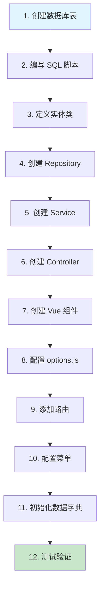

# Vol 框架完整知识库与开发流程规范

> **版本**: V1.0 | **更新日期**: 2026-07-31  
> **定位**: 基于当前项目源代码 + 官方文档的完整开发指南  
> **适用版本**: Vue3 + .NET 8 + EF Core 8（当前固定版本）

---

## 📚 目录

1. [框架概述与技术栈](#1-框架概述与技术栈)
2. [后端开发规范](#2-后端开发规范)
3. [前端开发规范](#3-前端开发规范)
4. [标准开发工作流](#4-标准开发工作流)
5. [高频问题速查](#5-高频问题速查)
6. [架构决策记录](#6-架构决策记录)

---

## 1. 框架概述与技术栈

### 1.1 技术栈组成

| 层级 | 技术 | 版本 | 用途 |
|------|------|------|------|
| **前端** | Vue.js | 3.x | UI 框架 |
| | Vite | 5.x | 构建工具 |
| | TypeScript | 5.x | 类型安全 |
| | Element Plus | 2.x | UI 组件库 |
| | Vuex/Pinia | 4.x | 状态管理 |
| | Axios | 1.x | HTTP 客户端 |
| **后端** | .NET | 8.0 | 运行时 |
| | EF Core | 8.0 | ORM（主） |
| | SqlSugar | 5.x | ORM（备选） |
| | Autofac | 7.x | DI 容器 |
| | JWT | - | 身份认证 |
| | Dapper | 2.x | 轻量查询 |
| | SignalR | 8.x | 实时通信 |
| | Quartz.NET | 3.x | 定时任务 |
| **数据库** | MySQL | 8.0 | 主数据库（本项目） |
| | Redis | 7.x | 缓存/会话 |

### 1.2 项目结构总览

```
Vue.NetCore/
├── vol.api/                    # 后端 API 主项目
│   ├── VOL.Core/               # 核心库（基础服务、过滤器、扩展）
│   │   ├── BaseProvider/       # Repository 基类
│   │   ├── Filters/            # 全局过滤器
│   │   ├── Extensions/         # 扩展方法
│   │   └── Service/            # 服务基类
│   ├── VOL.Entity/             # 实体定义
│   │   ├── SystemModels/       # 系统基类（BaseEntity）
│   │   ├── CertPlatform/       # 认证平台实体（YZHBaseEntity）
│   │   └── DomainModels/       # 领域模型（代码生成）
│   ├── VOL.Builder/            # 业务逻辑层
│   │   ├── IRepositories/      # Repository 接口
│   │   ├── Repositories/       # Repository 实现
│   │   ├── IServices/          # Service 接口
│   │   └── Services/           # Service 实现
│   │       └── Partial/        # ⭐ 业务代码扩展区（手动编写）
│   └── VOL.WebApi/             # API 控制器
│       └── Controllers/
│           └── Partial/        # ⭐ 控制器扩展区
│
├── vol.web/                    # 前端 Web 项目
│   ├── src/
│   │   ├── views/cert/         # ⭐ 认证平台页面
│   │   │   ├── CertificationBody/
│   │   │   ├── ISOStandard/
│   │   │   ├── CertApplication/
│   │   │   └── AuditTask/
│   │   ├── router/
│   │   │   └── viewGird.js    # ⭐ 路由配置文件
│   │   └── extension/          # ⭐ 页面业务扩展区
│   └── vite.config.ts
│
└── DB/mysql/                   # ⭐ SQL 脚本管理
```

### 1.3 核心设计理念

#### ✅ 代码生成优先，Partial 扩展
```
代码生成器生成的代码 → Service.cs / Controller.cs / Entity.cs
                      ↓ （禁止修改，会被覆盖）
              Partial 文件 → Service(Partial).cs / Controller(Partial).cs
                              ↓ （手动编写业务代码）
```

**关键原则**：
- 🚫 **禁止修改** `Service.cs`、`Controller.cs`、实体类（带注释标记的）
- ✅ **所有业务代码** 写在 `Partial/` 文件夹下的同名文件中
- ✅ **使用 `partial class`** 实现类的拆分

---

## 2. 后端开发规范

### 2.1 实体定义规范

#### 2.1.1 继承链（必须严格遵守）

```csharp
// ✅ 正确的继承链（本项目）
namespace VOL.Entity.CertPlatform.Cert
{
    public class CertificationBody : YZHBaseEntity  // 继承项目基类
    {
        // 业务字段...
    }
}

// YZHBaseEntity 定义位置
namespace VOL.Entity.CertPlatform
{
    public class YZHBaseEntity : BaseEntity  // 继承 Vol 框架基类
    {
        [Key]
        [DatabaseGenerated(DatabaseGeneratedOption.Identity)]
        [Column("id")]
        public long Id { get; set; }  // 必须有主键
        
        // 审计字段...
        public string? Creator { get; set; }
        public DateTime? CreateDate { get; set; }
        // ...
    }
}
```

#### 2.1.2 实体特性标注

```csharp
using System.ComponentModel.DataAnnotations;
using System.ComponentModel.DataAnnotations.Schema;
using VOL.Entity.SystemModels;

[Table("cert_certification_body")]                    // 数据库表名
[Entity(TableCnName = "认证机构", TableName = "cert_certification_body", DBServer = "VOLContext")]
public partial class CertificationBody : YZHBaseEntity
{
    [Key]                                              // 主键（如果不在基类）
    [Display(Name = "ID")]
    [Column("id")]
    public long Id { get; set; }

    [Display(Name = "机构名称")]
    [MaxLength(200)]
    [Column(TypeName = "nvarchar(200)")]
    [Editable(true)]
    [Required(AllowEmptyStrings = false)]
    public string Name { get; set; }

    [Display(Name = "状态")]
    [MaxLength(50)]
    [Column(TypeName = "varchar(50)")]
    public string Status { get; set; }
}
```

**常用特性说明**：

| 特性 | 用途 | 示例 |
|------|------|------|
| `[Key]` | 标记主键 | `[Key] public long Id { get; set; }` |
| `[Display(Name="")]` | 字段中文显示名 | `[Display(Name="机构名称")]` |
| `[Column("")]` | 数据库列名 | `[Column("org_name")]` |
| `[MaxLength(n)]` | 最大长度限制 | `[MaxLength(200)]` |
| `[Required]` | 必填验证 | `[Required(AllowEmptyStrings=false)]` |
| `[Editable(true)]` | 允许编辑 | 用于表单字段 |
| `[Table("")]` | 表名映射 | `[Table("cert_org")]` |
| `[Entity(...)]` | Vol 框架实体配置 | 指定表名、DB上下文 |

#### 2.1.3 实体文件存放规则

```
📁 VOL.Entity/CertPlatform/{Module}/{EntityName}.cs

示例：
├── Cert/                    # 认证模块
│   ├── CertificationBody.cs
│   ├── ISOStandard.cs
│   └── CertApplication.cs
├── Audit/                   # 审核模块
│   └── AuditTask.cs
├── Ent/                     # 企业模块
└── Rpt/                     # 报告模块
```

### 2.2 Repository 层规范

#### 2.2.1 接口定义

```csharp
// 📁 IRepositories/CertPlatform/ICertCertificationBodyRepository.cs
using VOL.Core.BaseProvider;

namespace VOL.Builder.IRepositories.CertPlatform
{
    public interface ICertCertificationBodyRepository : IRepository<CertificationBody>
    {
        // 自定义查询方法...
        // Task<List<CertificationBody>> GetByStatusAsync(string status);
    }
}
```

#### 2.2.2 实现类

```csharp
// 📁 Repositories/CertPlatform/CertCertificationBodyRepository.cs
using VOL.Builder.IRepositories.CertPlatform;
using VOL.Core.EFDbContext;
using VOL.Entity.CertPlatform.Cert;

namespace VOL.Builder.Repositories.CertPlatform
{
    public class CertCertificationBodyRepository : ICertCertificationBodyRepository
    {
        private readonly BaseDbContext _context;  // ✅ 使用 BaseDbContext

        public CertCertificationBodyRepository(BaseDbContext context)
        {
            _context = context;
        }

        // 继承自 IRepository<T> 的通用方法无需重写
        // FindAll, FindAsIQueryable, AddRange, Update, Delete 等
    }
}
```

**关键点**：
- ✅ 构造函数注入 `BaseDbContext`（非 `EFCoreDbContext`）
- ✅ 继承 `IRepository<T>` 获得通用 CRUD 方法
- ✅ 自定义方法在接口中声明，在实现类中完成

### 2.3 Service 层规范（核心）

#### 2.3.1 代码生成的基础 Service

```csharp
// 📁 Services/CertPlatform/CertCertificationBodyService.cs
// ⚠️ 此文件由代码生成器生成，禁止修改！

/*
 *Author：CertPlatform Generator
 *Contact：auto@certplatform.com
 *代码由框架生成,此处任何更改都可能导致被代码生成器覆盖
 *所有业务编写全部应在Partial文件夹下CertCertificationBodyService与ICertCertificationBodyService中编写
 */
using VOL.Builder.IRepositories;
using VOL.Builder.IServices;
using VOL.Builder.IRepositories.CertPlatform;
using VOL.Builder.IServices.CertPlatform;
using VOL.Core.BaseProvider;
using VOL.Core.Extensions.AutofacManager;
using VOL.Entity.CertPlatform.Cert;

namespace VOL.Builder.Services.CertPlatform
{
    public partial class CertCertificationBodyService 
        : ServiceBase<CertificationBody, ICertCertificationBodyRepository>
        , ICertCertificationBodyService, IDependency
    {
        public static ICertCertificationBodyService Instance
        {
            get { return AutofacContainerModule.GetService<ICertCertificationBodyService>(); }
        }
    }
}
```

**继承关系解析**：

```
ServiceBase<TEntity, TRepository>  ← Vol 框架服务基类
    ↓ 提供
- SaveAsync(TEntity entity)        // 新增
- UpdateAsync(TEntity entity)      // 更新
- DelAsync(object[] keys)          // 删除
- GetPageData(PageDataOptions)     // 分页查询
- Import()                         // 导入
- Export()                         // 导出
- 以及 300+ 扩展方法和属性
```

#### 2.3.2 ⭐ Partial Service（业务代码编写区）

```csharp
// 📁 Services/CertPlatform/Partial/CertCertificationBodyService.cs
// ✅ 所有业务代码在此处编写！

/*
 *所有关于CertificationBody类的业务代码应在此处编写
 *可使用repository.调用常用方法，获取EF/Dapper等信息
 *如果需要事务请使用repository.DbContextBeginTransaction
 *也可使用DBServerProvider.手动获取数据库相关信息
 *用户信息、权限、角色等使用UserContext.Current操作
 *CertCertificationBodyService对增、删、改查、导入、导出、审核业务代码扩展参照ServiceFunFilter
 */
using VOL.Core.BaseProvider;
using VOL.Core.Extensions.AutofacManager;
using VOL.Entity.CertPlatform.Cert;
using VOL.Builder.IRepositories.CertPlatform;

namespace VOL.Builder.Services.CertPlatform
{
    public partial class CertCertificationBodyService
    {
        private readonly ICertCertificationBodyRepository _repository;

        /// <summary>
        /// 获取所有启用的认证机构（下拉选择用）
        /// </summary>
        public async Task<List<CertificationBody>> GetActiveListAsync()
        {
            return await _repository.FindAsync(x => x.Status == "active")
                .OrderBy(x => x.Name)
                .ToListAsync();
        }

        /// <summary>
        /// 根据编号查询
        /// </summary>
        public async Task<CertificationBody?> GetByCodeAsync(string code)
        {
            return await _repository.FindAsyncFirst(x => x.Code == code);
        }
    }
}
```

**可用的扩展点（钩子方法）**：

| 方法名 | 触发时机 | 用途 |
|--------|----------|------|
| `AddBefore(SaveModel)` | 新增前 | 参数校验、默认值设置 |
| `AddAfter(SaveModel)` | 新增后 | 关联操作、日志记录 |
| `UpdateBefore(SaveModel)` | 编辑前 | 权限检查、数据校验 |
| `UpdateAfter(SaveModel)` | 编辑后 | 缓存更新、通知发送 |
| `DelBefore(List<object>)` | 删除前 | 引用检查、权限验证 |
| `DelAfter(List<object>)` | 删除后 | 清理关联数据 |
| `SearchBefore(PageDataOptions)` | 查询前 | 动态条件、权限过滤 |
| `SearchAfter(PageDataOptions)` | 查询后 | 结果处理、格式化 |

**使用示例**：

```csharp
public partial class CertCertificationBodyService
{
    /// <summary>
    /// 新增前校验
    /// </summary>
    public async Task AddBefore(SaveModel saveModel)
    {
        var entity = saveModel.MainData as CertificationBody;
        
        // 校验名称唯一性
        var exists = await _repository.FindAsyncFirst(x => x.Name == entity!.Name);
        if (exists != null)
        {
            return new WebResponseContent().Error("机构名称已存在");
        }
        
        // 设置默认值
        entity!.CreateDate = DateTime.Now;
        entity.Creator = UserContext.Current.UserName;
        
        return new WebResponseContent().OK();
    }
}
```

### 2.4 Controller 层规范

#### 2.4.1 基础 Controller（代码生成）

```csharp
// 📁 Controllers/CertPlatform/CertCertificationBodyController.cs
// ⚠️ 禁止修改

using Microsoft.AspNetCore.Mvc;
using VOL.Builder.Services.CertPlatform;
using VOL.Builder.IServices.CertPlatform;

namespace VOL.WebApi.Controllers.CertPlatform
{
    [Route("api/[controller]")]
    [ApiController]
    public class CertCertificationBodyController 
        : BaseController<CertCertificationBodyService, ICertCertificationBodyService>
    {
        public CertCertificationBodyController(
            ICertCertificationBodyService service) : base(service)
        {
        }
    }
}
```

#### 2.4.2 ⭐ Partial Controller（自定义 API）

```csharp
// 📁 Controllers/CertPlatform/Partial/CertCertificationBodyController.cs
// ✅ 自定义 API 端点在此处编写

using Microsoft.AspNetCore.Mvc;
using VOL.Core.Filters;
using VOL.Builder.Services.CertPlatform;

namespace VOL.WebApi.Controllers.CertPlatform
{
    public partial class CertCertificationBodyController
    {
        /// <summary>
        /// 获取启用的机构列表（下拉框用）
        /// GET: api/CertCertificationBody/ActiveList
        /// </summary>
        [HttpGet("ActiveList")]
        [ApiActionPermission(ActionPermissionOptions.Search)]
        public async Task<IActionResult> GetActiveList()
        {
            var data = await service.GetActiveListAsync();
            return Json(new { code = 200, data, message = "ok" });
        }
    }
}
```

### 2.5 常用 using 速查表

```csharp
// === Service 层 ===
using VOL.Core.BaseProvider;                    // ServiceBase, IRepository
using VOL.Core.Extensions.AutofacManager;       // IDependency
using VOL.Core.Filters;                         // ApiActionPermissionAttribute
using VOL.Core.Utilities;                       // WebResponseContent
using VOL.Entity.DomainModels.Core;             // PageDataOptions, SaveModel
using VOL.Entity.CertPlatform;                  // 业务实体
using System.Collections.Generic;              // List<T>
using System.Threading.Tasks;                  // Task<T>

// === Controller 层 ===
using Microsoft.AspNetCore.Mvc;                // ControllerBase, [HttpGet]
using VOL.Core.Filters;                        // 权限特性
using VOL.Builder.IServices.Xxx;               // Service 接口

// === Repository 层 ===
using VOL.Core.EFDbContext;                     // BaseDbContext
using Microsoft.EntityFrameworkCore;            // DbSet<T>, DbContext
```

---

## 3. 前端开发规范

### 3.1 页面结构标准

每个业务页面由 **3 个文件** 组成：

```
views/cert/{ModuleName}/
├── {ComponentName}.vue    # Vue 组件（模板）
├── options.js             # ViewGrid 配置（核心）
└── index.jsx              # 业务逻辑扩展（可选）
```

### 3.2 Vue 组件模板（标准化）

#### ⚠️ 关键注意事项（必须遵守）

1. **必须使用 `reactive()` 包装 options**（Vol 框架要求）
   ```javascript
   // ✅ 正确：使用 reactive 包装（与官方示例一致）
   const { table, columns, ... } = reactive(viewOptions());
   
   // ❌ 错误：直接解构会导致 ViewGrid 无法读取配置
   const { table, columns, ... } = viewOptions();
   ```

2. **`<script setup>` 必须加 `lang="jsx"`**
   ```vue
   <!-- ✅ 正确：Vol 框架要求使用 JSX 语法 -->
   <script setup lang="jsx">
   
   <!-- ❌ 错误：缺少 lang="jsx" 可能导致解析问题 -->
   <script setup>
   ```

3. **必须导入 extension 文件**（即使为空）
   ```javascript
   // ✅ 正确：导入 extension 文件
   import extend from "@/extension/cert/CertificationBody.jsx";
   
   // ⚠️ 注意：options.js 也返回 extend，解构时要避免冲突
   const { table, columns, ... } = reactive(viewOptions());  // 不要解构 extend
   
   // 同时需要创建对应的 .jsx 文件（可以为空）
   ```

4. **禁止在 `onInit` 中直接修改字符串属性**
   ```javascript
   // ❌ 错误：searchFormFields.keyword 是空字符串，不能设置 .extra
   const onInit = async ($vm) => {
     $vm.searchFormFields.keyword.extra = true;  // TypeError!
   };
   
   // ✅ 正确：只在需要时读取或替换整个对象
   const onInit = async ($vm) => {
     gridRef = $vm;  // 只保存引用
   };
   ```

#### 标准模板

```vue
<!--
 *Author：{YourName}
 *Date：{Date}
 *Contact：your@email.com
 *业务请在@/extension/cert/{ModuleName}/{ComponentName}.jsx或{ComponentName}.vue文件编写
 *新版本支持vue或【表.jsx】文件编写业务,文档见:https://v3.volcore.xyz/docs/view-grid
 -->
<template>
  <view-grid
    ref="grid"
    :columns="columns"
    :detail="detail"
    :details="details"
    :editFormFields="editFormFields"
    :editFormOptions="editFormOptions"
    :searchFormFields="searchFormFields"
    :searchFormOptions="searchFormOptions"
    :table="table"
    :extend="extend"
    :onInit="onInit"
    :onInited="onInited"
    :searchBefore="searchBefore"
    :searchAfter="searchAfter"
    :addBefore="addBefore"
    :updateBefore="updateBefore"
    :rowClick="rowClick"
    :modelOpenBefore="modelOpenBefore"
    :modelOpenAfter="modelOpenAfter"
  >
    <!-- 自定义组件数据槽扩展 -->
    <template #gridHeader>
      <!-- 顶部区域（按钮、标题等） -->
    </template>
    
    <template #btnLeft>
      <!-- 左侧按钮区域 -->
    </template>
  </view-grid>
</template>

<script setup>
import options from './options.js';
import { ref } from 'vue';

const grid = ref(null);

// ViewGrid 配置
const { table, columns, detail, details, editFormFields, editFormOptions,
        searchFormFields, searchFormOptions, extend } = options();

// 生命周期钩子
const onInit = (data) => {
  console.log('页面初始化', data);
};

const onInited = (data) => {
  console.log('页面初始化完成', data);
};

// 操作钩子
const searchBefore = (params) => {
  // 查询前参数处理
  return params;
};

const addBefore = (formData) => {
  // 新增前校验
  return true;  // 返回 false 可阻止提交
};

const updateBefore = (formData) => {
  // 编辑前校验
  return true;
};

const rowClick = ({ row, column, event }) => {
  // 行点击事件
  console.log('点击行:', row);
};

const modelOpenBefore = async ({ row, index }) => {
  // 弹窗打开前
  return true;
};

const modelOpenAfter = ({ row, index }) => {
  // 弹窗打开后
};
</script>
```

### 3.3 Options.js 配置详解

```javascript
/**
 * {页面名称} - ViewGrid 配置
 * 表名：{database_table_name}
 * 基于Vol框架标准view-grid模式
 */

export default function () {
  return {
    // ========== 1. 表格基本配置 ==========
    const table = {
      name: '{EntityName}',           // 实体名（必须与后端一致）
      cnName: '{中文表名}',            // 中文显示名
      url: '/api/{EntityName}/',      // API 路径前缀
      sortName: 'id',                 // 默认排序字段
      key: 'Id',                      // ✅ 主键字段（Vol 框架必需）
      footer: 'Foots',                // ✅ 页脚标识（Vol 框架必需）
      pagination: { 
        pageSize: 20,                 // 默认每页条数
        pageSizes: [10, 20, 50, 100]  // 可选分页大小
      },
    };
    
    // ✅ Vol 框架必需字段
    const tableName = table.name;
    const tableCNName = table.cnName;
    const newTabEdit = false;
    const key = table.key;

    // ========== 2. 编辑表单字段 ==========
    editFormFields: {
      field1: '',                     // 字段默认值
      field2: '',
    },

    // ========== 3. 编辑表单布局 ==========
    editFormOptions: [
      [                               // 第一行
        { title: '标签', field: 'field1', type: 'text', required: true, colSize: 12 },
      ],
      [                               // 第二行
        { title: '下拉', field: 'field2', type: 'select', dataKey: 'dic_xxx', data: [], colSize: 6 },
        { title: '日期', field: 'field3', type: 'date', colSize: 6 },
      ],
    ],

    // ========== 4. 搜索表单字段 ==========
    searchFormFields: {
      keyword: '',                    // 搜索关键字
      status: '',                     // 状态筛选
    },

    // ========== 5. 搜索表单布局 ==========
    searchFormOptions: [
      [
        { title: '关键词', field: 'keyword', placeholder: '请输入...', colSize: 8 },
        { title: '状态', field: 'status', type: 'select', dataKey: 'dic_status', data: [], colSize: 4 },
      ],
    ],

    // ========== 6. 表格列定义 ==========
    columns: [
      {
        field: 'id',
        title: 'ID',
        width: 70,
        hidden: true,                // 隐藏列
        align: 'center',
      },
      {
        field: 'name',
        title: '名称',
        width: 200,
        sortable: true,              // 允许排序
        link: true,                  // 显示为链接
      },
      {
        field: 'status',
        title: '状态',
        width: 100,
        bind: { key: 'dic_status', value: 'status' },  // 字典绑定
        render: (h, { row }) => {     // 自定义渲染
          return h('el-tag', { props: { type: 'success' } }, row.status);
        },
      },
      {
        field: 'create_date',
        title: '创建时间',
        width: 160,
        sortable: true,
        formatter: true,             // 自动日期格式化
      },
    ],

    // ========== 7. 明细表配置（主子表）==========
    detail: { columns: [] },        // ✅ 必须是对象，不能是 null
    details: [],                     // 多明细表数组

    // ========== 8. 扩展配置 ==========
    extend: {
      buttons: [],                   // 自定义按钮
      methods: {},                   // 自定义方法
    },
  };

  // ✅ 必须返回这些字段（Vol 框架必需）
  return {
    table,
    key,
    tableName,
    tableCNName,
    newTabEdit,
    editFormFields,
    editFormOptions,
    searchFormFields,
    searchFormOptions,
    columns,
    detail,
    details,
  };
}
```

### 3.4 字段类型对照表

| 类型 | type 值 | 说明 | 示例 |
|------|---------|------|------|
| 文本输入 | `text` 或省略 | 单行文本 | `{ type: 'text' }` |
| 文本域 | `textarea` | 多行文本 | `{ type: 'textarea', rows: 3 }` |
| 数字 | `number` | 数字输入 | `{ type: 'number' }` |
| 下拉选择 | `select` | 下拉框 | `{ type: 'select', dataKey: 'xxx' }` |
| 日期 | `date` | 日期选择 | `{ type: 'date' }` |
| 日期时间 | `datetime` | 日期时间 | `{ type: 'datetime' }` |
| 开关 | `switch` | 开关切换 | `{ type: 'switch' }` |
| 复选框 | `checkbox` | 多选 | `{ type: 'checkbox' }` |
| 单选框 | `radio` | 单选 | `{ type: 'radio' }` |
| 文件上传 | `file` | 文件上传 | `{ type: 'file' }` |
| 图片上传 | `img` | 图片上传 | `{ type: 'img' }` |
| 富文本 | `editor` | 富文本编辑器 | `{ type: 'editor' }` |
| 隐藏字段 | `hidden` | 不显示 | `{ type: 'hidden' }` |

### 3.5 字典绑定（自动加载下拉选项）

```javascript
// 使用 dataKey 绑定数据字典
{
  title: '状态',
  field: 'status',
  type: 'select',
  dataKey: 'org_status',    // 对应 Sys_Dictionary.DicNo
  data: [],                 // 框架自动填充
}

// 在 columns 中使用 bind 进行显示转换
{
  field: 'status',
  title: '状态',
  bind: { key: 'org_status', value: 'status' },  // 自动将值转为中文
}
```

### 3.6 路由配置规范

```javascript
// 📁 router/viewGird.js

const viewgird = [
  // ... 其他路由 ...

  // ==================== 认证平台模块 ====================
  {
    path: '/Cert{EntityName}',           // 路径（大写开头）
    name: 'Cert{EntityName}',            // 名称（必须唯一）
    component: () => import('@/views/cert/{ModuleName}/{ComponentName}.vue')  // 懒加载
  },
]

export default viewgird  // ⚠️ 必须导出！
```

**⚠️ 路由注意事项**：
1. **只添加实际存在的 Vue 组件**
2. **path 与数据库 Sys_Menu.Url 一致**
3. **必须以 `export default viewgird` 结尾**
4. **JS 数组/对象括号必须正确配对**

---

## 4. 标准开发工作流

### 4.1 新建完整页面流程（12 步）



#### Step 1: 创建数据库表

```sql
-- 📁 DB/mysql/cert_{module}_{entity}.sql

CREATE TABLE IF NOT EXISTS cert_new_table (
  id BIGINT AUTO_INCREMENT PRIMARY KEY COMMENT '主键',
  code VARCHAR(100) COMMENT '业务编码',
  name VARCHAR(200) NOT NULL COMMENT '名称',
  status VARCHAR(50) DEFAULT 'active' COMMENT '状态',
  creator VARCHAR(50) COMMENT '创建人',
  create_date DATETIME COMMENT '创建时间',
  modifier VARCHAR(50) COMMENT '修改人',
  modify_date DATETIME COMMENT '修改时间',
  deleted TINYINT(1) DEFAULT 0 COMMENT '删除标记'
) ENGINE=InnoDB DEFAULT CHARSET=utf8mb4 COMMENT='新业务表';
```

#### Step 2: 定义实体类

```csharp
// 📁 VOL.Entity/CertPlatform/{Module}/NewEntity.cs
namespace VOL.Entity.CertPlatform.{Module}
{
    public class NewEntity : YZHBaseEntity
    {
        [Display(Name = "名称")]
        [MaxLength(200)]
        [Required]
        public string Name { get; set; }

        [Display(Name = "状态")]
        [MaxLength(50)]
        public string Status { get; set; }
    }
}
```

#### Step 3: 创建 Repository

**接口** (`IRepositories/CertPlatform/INewEntityRepository.cs`)：
```csharp
public interface INewEntityRepository : IRepository<NewEntity> { }
```

**实现** (`Repositories/CertPlatform/NewEntityRepository.cs`)：
```csharp
public class NewEntityRepository : INewEntityRepository
{
    private readonly BaseDbContext _context;
    public NewEntityRepository(BaseDbContext context) => _context = context;
}
```

#### Step 4: 创建 Service

**接口** (`IServices/CertPlatform/INewEntityService.cs`)：
```csharp
public interface INewEntityService : IService<NewEntity> { }
```

**基础实现** (`Services/CertPlatform/NewEntityService.cs`) - 由代码生成器生成或复制模板

**Partial 扩展** (`Services/CertPlatform/Partial/NewEntityService.cs`)：
```csharp
public partial class NewEntityService
{
    private readonly INewEntityRepository _repository;
    // 业务方法...
}
```

#### Step 5: 创建 Controller

**基础** (`Controllers/CertPlatform/NewEntityController.cs`)
**Partial** (`Controllers/CertPlatform/Partial/NewEntityController.cs`)

#### Step 6: 创建前端页面

```
views/cert/{Module}/
├── NewEntity.vue
└── options.js
```

#### Step 7: 添加路由

```javascript
// router/viewGird.js
{
  path: '/CertNewEntity',
  name: 'CertNewEntity',
  component: () => import('@/views/cert/{Module}/NewEntity.vue')
}
```

#### Step 8: 配置菜单

```sql
INSERT INTO Sys_Menu (ParentId, MenuName, Url, ...) 
VALUES (305, '新功能菜单', '/CertNewEntity', ...);
```

#### Step 9: 验证

```bash
# 后端编译
dotnet build VOL.sln

# 前端语法检查
node -c vol.web/src/router/viewGird.js

# 浏览器测试
http://localhost:9990/#/CertNewEntity
```

### 4.2 SQL 脚本管理规范

| 规则 | 说明 |
|------|------|
| **存储路径** | `src/server/Vue.NetCore/DB/mysql/` |
| **命名规范** | `cert_{phase}_{module}_{function}.sql` |
| **幂等性** | 使用 `IF NOT EXISTS`、`INSERT IGNORE` |
| **执行记录** | 更新 `DB/mysql/README.md` |
| **分类存储** | 字典、测试数据、表结构分开 |

---

## 5. 高频问题速查

### 5.1 后端问题

| 问题 | 原因 | 解决方案 |
|------|------|----------|
| CS0311 类型推断失败 | 实体基类错误 | 继承 `YZHBaseEntity` → `BaseEntity` |
| EF Core 主键错误 | 缺少 `[Key]` | 在基类添加 `Id` 字段并标记 |
| 循环依赖 | 跨层引用 | 将基类复制到本地，修改命名空间 |
| CS0246 类型找不到 | 缺少 using | 添加对应命名空间的 using |
| DI 注册失败 | 缺少 IDependency | Service 实现 `IDependency` 接口 |

### 5.2 前端问题

| 问题 | 原因 | 解决方案 |
|------|------|----------|
| 路由 404 | 组件不存在 | 只为存在组件添加路由 |
| 导出错误 | 缺少 export default | 文件末尾添加 `export default viewgird` |
| JS 语法错误 | 括号不匹配 | 使用 `node -c` 验证 |
| 字典不显示 | SQL 未执行 | 执行数据字典初始化脚本 |
| 样式异常 | colSize 错误 | 总计应为 24（Element Plus 栅格） |

### 5.3 快速诊断命令

```bash
# ===== 后端 =====
dotnet build VOL.sln                          # 编译检查
dotnet run --project VOL.WebApi               # 启动后端

# ===== 前端 =====
cd vol.web && npm run dev                     # 启动前端
node -c src/router/viewGird.js                # JS 语法检查
ls src/views/cert/                            # 检查组件是否存在

# ===== 数据库 =====
docker exec -i yzh-mysql mysql -uroot -pYzh123456. yzh_cert_platform -e "SELECT COUNT(*) FROM Sys_Dictionary;"
```

---

## 6. 架构决策记录

### ADR-001: 使用 YZHBaseEntity 作为统一业务基类

**状态**: 已采用  
**日期**: 2026-07-31  
**背景**: Vol 框架 BaseEntity 无内置主键和审计字段  
**决策**: 创建 YZHBaseEntity，添加 Id 主键 + 审计字段 + 业务编码  
**影响**: 所有认证平台实体必须继承此类

### ADR-002: Partial 类扩展模式

**状态**: 已采用  
**日期**: 2026-07-31  
**背景**: 代码生成器会覆盖非 Partial 文件  
**决策**: 所有业务代码写在 `Partial/` 子目录  
**影响**: Service/Controller 都需要创建 Partial 版本

### ADR-003: 前端路由严格匹配原则

**状态**: 已采用  
**日期**: 2026-07-31  
**背景**: 路由定义与实际组件不一致导致 404  
**决策**: 只为存在的 Vue 组件添加路由，未开发页面临时指向占位页  
**影响**: 减少运行时错误，提高开发体验

---

## 📖 参考资源

### 官方文档
- **Vue3 文档**: http://v3.volcore.xyz/
- **Vue2 文档**: http://v2.volcore.xyz/document/guide
- **App/小程序**: http://app.volcore.xyz/
- **GitHub**: https://github.com/cq-panda/Vue.NetCore
- **Gitee**: https://gitee.com/x_discoverer/Vue.NetCore

### 本项目内部文档
- **项目全局规则.md**: 最高优先级规范
- **vol-framework-troubleshooting.md**: 高频问题速查
- **DB/mysql/README.md**: SQL 脚本指南

---

## 📝 更新日志

| 版本 | 日期 | 更新内容 |
|------|------|----------|
| V1.0 | 2026-07-31 | 初始版本，基于源代码分析建立完整开发流程 |

---

> **维护说明**: 此文档是团队开发的"宪法"，每次遇到新问题时同步更新。如有疑问，优先查阅官方文档，其次查看此指南。
