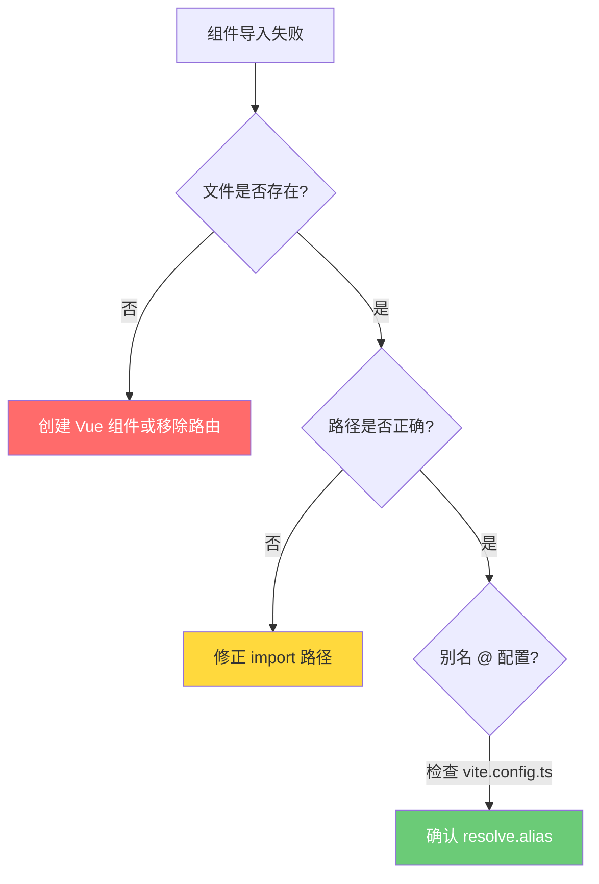
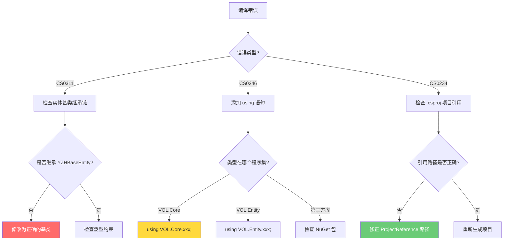

# Vol 框架高频问题速查手册

> **版本**: V1.0 | **更新日期**: 2026-07-31  
> **定位**: 前后端分离的快速排查指南，避免重复分析

---

## 📋 目录

- [前端篇（Vue/Vite）](#前端篇vuevite)
  - [路由 404 错误](#1-路由-404-错误)
  - [Vite 编译错误](#2-vite-编译错误)
  - [数据字典不显示](#3-数据字典不显示)
  - [组件导入失败](#4-组件导入失败)
- [后端篇（.NET/C#）](#后端篇netc)
  - [实体基类继承错误](#1-实体基类继承错误)
  - [EF Core 主键约束](#2-ef-core-主键约束)
  - [循环依赖问题](#3-循环依赖问题)
  - [Repository/Service 注册失败](#4-repositoryservice-注册失败)
  - [编译错误 CS0311/CS0246](#5-编译错误-cs0311cs0246)

---

## 🎨 前端篇（Vue/Vite）

### 1. 路由 404 错误

#### **现象**
```
[plugin:vite:import-analysis] Failed to resolve import "@/views/cert/xxx/xxx.vue"
```

#### **根因分析（3 步诊断）**

| 检查项 | 命令/方法 | 预期结果 |
|--------|-----------|----------|
| ① Vue 组件是否存在？ | `ls vol.web/src/views/cert/` | 必须看到对应文件夹 |
| ② 路由 path 是否匹配？ | 查看 `viewGird.js` 中的 `path` | 与数据库 `Sys_Menu.Url` 一致 |
| ③ 数据库菜单 URL 是否正确？ | SQL 查询 `Sys_Menu` 表 | 与路由 `path` 完全一致 |

#### **解决方案**

```bash
# Step 1: 检查实际存在的组件
ls -la src/server/Vue.NetCore/vol.web/src/views/cert/

# Step 2: 只为存在的组件添加路由（viewGird.js）
{
  path: '/CertCertificationBody',
  name: 'CertCertificationBody',
  component: () => import('@/views/cert/CertificationBody/CertificationBody.vue')  // ✅ 文件存在
}

# Step 3: 更新数据库菜单 URL
docker exec -i yzh-mysql mysql -uroot -pYzh123456. yzh_cert_platform \
  -e "UPDATE Sys_Menu SET Url = '/CertAuditTask' WHERE Url LIKE '/CertPlatform/%';"
```

#### **预防措施**
- ✅ **添加路由前先确认文件存在**
- ✅ **使用 TODO 注释标记待开发页面**
- ✅ **统一临时方案：未开发页面指向已存在的占位页面**

---

### 2. Vite 编译错误

#### **现象**
```
SyntaxError: Unexpected token '}'
SyntaxError: Unexpected token 'export'
```

#### **常见原因与修复**

| 错误类型 | 原因 | 修复方法 |
|----------|------|----------|
| `Unexpected token '}'` | 数组/对象未正确关闭 | 检查 `]` 或 `}` 是否缺失 |
| `Unexpected token 'export'` | 数组未关闭就 export | 在 `export default` 前添加 `]` |
| 缺少逗号 | 对象字面量元素间缺少 `,` | 在每个属性后添加逗号 |

#### **快速验证命令**
```bash
# JS 语法检查（必须在项目根目录执行）
cd src/server/Vue.NetCore/vol.web
node -c src/router/viewGird.js && echo "✅ 语法检查通过"

# 如果检查失败，查看行号定位问题
node -c src/router/viewGird.js  # 会输出具体行号
```

#### **最佳实践**
```javascript
// ✅ 正确：每个路由对象后加逗号，数组最后无逗号
[
  { path: '/A', component: A },  // ✅ 有逗号
  { path: '/B', component: B }   // ✅ 最后一个无逗号
]

// ❌ 错误：缺少闭合符
[
  { path: '/A', component: A }
// ❌ 这里缺少 ]
export default routes
```

---

### 3. 数据字典不显示

#### **现象**
- 下拉框无选项
- 字典数据为空

#### **诊断步骤**

```bash
# 1. 检查 SQL 脚本是否执行
docker exec -i yzh-mysql mysql -uroot -pYzh123456. yzh_cert_platform \
  -e "SELECT COUNT(*) FROM Sys_Dictionary;"

# 2. 检查字典分类是否存在
docker exec -i yzh-mysql mysql -uroot -pYzh123456. yzh_cert_platform \
  -e "SELECT DicNo, DicName FROM Sys_Dictionary WHERE ParentId = 0;"

# 3. 执行数据字典初始化脚本
docker exec -i yzh-mysql mysql -uroot -pYzh123456. yzh_cert_platform < DB/mysql/cert_phase2_data_dictionary.sql
```

#### **SQL 脚本规范**
- 📁 **存储位置**: `src/server/Vue.NetCore/DB/mysql/`
- 📝 **命名规范**: `cert_phase{N}_{功能名}.sql`
- ⚡ **幂等性**: 使用 `INSERT IGNORE` 或 `WHERE NOT EXISTS`
- 🔗 **执行记录**: 更新 `DB/mysql/README.md`

---

### 4. 组件导入失败

#### **现象**
```
Failed to resolve import "@/views/cert/Enterprise/Enterprise.vue"
```

#### **快速修复流程**



#### **Vol 框架路径别名配置**
```typescript
// vite.config.ts
export default defineConfig({
  resolve: {
    alias: {
      '@': fileURLToPath(new URL('./src', import.meta.url))
      // @ 指向 src 目录
    }
  }
})
```

---

## ⚙️ 后端篇（.NET/C#）

### 1. 实体基类继承错误

#### **现象**
```
Error CS0311: The type '...' cannot be used as type parameter 'TEntity'...
```

#### **Vol 框架实体继承链（必须严格遵守）**

```
VOL.Entity.SystemModels.BaseEntity  ← Vol 框架基类（必须）
    └── VOL.Entity.CertPlatform.YZHBaseEntity  ← 项目业务基类（可选）
        └── CertificationBody / ISOStandard ...  ← 业务实体
```

#### **正确示例**

```csharp
// ✅ 正确：继承 YZHBaseEntity（已继承 BaseEntity）
namespace VOL.Entity.CertPlatform.Cert
{
    public class CertificationBody : YZHBaseEntity
    {
        // 业务字段...
    }
}

// ❌ 错误：直接继承自定义基类
public class CertificationBody : BaseEntity  // ❌ 这个 BaseEntity 不是 Vol 的！
{
    // ...
}
```

#### **YZHBaseEntity 定义位置**
```
📁 src/server/Vue.NetCore/vol.api/VOL.Entity/CertPlatform/YZHBaseEntity.cs
```

**关键特性**：
- 包含 `[Key] public long Id { get; set; }` 主键
- 包含审计字段（Creator, CreateDate, Modifier, ModifyDate, Deleted）
- 继承 `VOL.Entity.SystemModels.BaseEntity`

---

### 2. EF Core 主键约束

#### **现象**
```
The entity type 'XXX' requires a primary key to be defined.
```

#### **解决方案**

```csharp
// YZHBaseEntity.cs 中必须定义主键
using System.ComponentModel.DataAnnotations;
using System.ComponentModel.DataAnnotations.Schema;

namespace VOL.Entity.CertPlatform
{
    public class YZHBaseEntity : VOL.Entity.SystemModels.BaseEntity
    {
        [Key]  // ✅ EF Core 主键特性
        [DatabaseGenerated(DatabaseGeneratedOption.Identity)]
        [Column("id")]
        public long Id { get; set; }  // ✅ 必须有主键
        
        // 审计字段...
        public string? Creator { get; set; }
        public DateTime? CreateDate { get; set; }
        // ...
    }
}
```

#### **注意事项**
- ⚠️ **所有基类都必须定义主键**，即使子类会覆盖
- ⚠️ 使用 `[Key]` 特性标记主键属性
- ⚠️ 使用 `[DatabaseGenerated(DatabaseGeneratedOption.Identity)]` 自增

---

### 3. 循环依赖问题

#### **现象**
```
Circular dependency detected: VOL.Entity → YZH.Core → VOL.Entity
```

#### **解决方案**

| 方案 | 适用场景 | 操作 |
|------|----------|------|
| **A. 复制基类到本地** | 基类简单，无外部依赖 | 将 `YZHBaseEntity` 复制到 `VOL.Entity` 内部 |
| **B. 提取接口** | 需要共享契约 | 创建 `IYZHBaseEntity` 接口 |
| **C. 反转依赖** | 架构层面调整 | 使用 DI 和接口抽象 |

#### **本项目采用方案 A**

```
修改前:
VOL.Entity → 引用 YZH.Core → 引用 VOL.Entity  ❌ 循环！

修改后:
VOL.Entity → 内部定义 YZHBaseEntity → 无外部引用  ✅ 打破循环
```

**操作步骤**：
1. 复制 `YZHBaseEntity.cs` 到 `VOL.Entity/CertPlatform/`
2. 修改命名空间为 `VOL.Entity.CertPlatform`
3. 移除 `using YZH.Core.Entities;`
4. 移除 `VOL.Entity.csproj` 对 `YZH.Core` 的引用

---

### 4. Repository/Service 注册失败

#### **现象**
```
Unable to resolve service for type 'ICertCertificationBodyRepository'
```

#### **诊断清单**

| 检查项 | 文件位置 | 验证方法 |
|--------|----------|----------|
| ① 接口定义 | `VOL.Builder/IRepositories/CertPlatform/` | 存在 `ICertXxxRepository` |
| ② 接口实现 | `VOL.Builder/Repositories/CertPlatform/` | 类实现接口 |
| ③ Service 注入 | `VOL.Builder/Services/CertPlatform/Partial/` | 构造函数注入 |
| ④ DI 注册 | Autofac 配置 | 扫描程序集 |

#### **Repository 构造函数规范**

```csharp
// ✅ 正确：使用 BaseDbContext
public class CertCertificationBodyRepository : ICertCertificationBodyRepository
{
    private readonly BaseDbContext _context;
    
    public CertCertificationBodyRepository(BaseDbContext context)  // ✅ BaseDbContext
    {
        _context = context;
    }
}

// ❌ 错误：使用 EFCoreDbContext（可能导致类型不匹配）
public CertCertificationBodyRepository(EFCoreDbContext context)  // ❌
```

---

### 5. 编译错误 CS0311/CS0246

#### **常见错误代码**

| 错误码 | 含义 | 常见原因 |
|--------|------|----------|
| **CS0311** | 类型参数无法推断 | 实体基类继承错误 |
| **CS0246** | 类型或命名空间找不到 | 缺少 using 或项目引用 |
| **CS0234** | 命名空间不存在 | 项目引用路径错误 |

#### **快速修复流程**



#### **常用 using 速查表**

```csharp
// Service 层常用
using VOL.Core.Filters;                    // ApiActionPermissionAttribute
using VOL.Core.Services;                   // Service 基类
using VOL.Entity.DomainModels.Core;         // PageDataOptions, SaveModel
using VOL.Entity.CertPlatform;             // 业务实体
using System.Collections.Generic;          // List<T>
using System.Threading.Tasks;              // Task<T>

// Controller 层常用
using VOL.Core.Filters;                    // 权限特性
using Microsoft.AspNetCore.Mvc;            // ControllerBase, [HttpGet]
using VOL.Builder.IServices.CertPlatform;  // Service 接口

// Repository 层常用
using VOL.Core.EFDbContext;                // BaseDbContext
using VOL.Builder.IRepositories;           // Repository 接口
using Microsoft.EntityFrameworkCore;       // DbSet<T>, DbContext
```

---

## 🔧 开发工作流检查清单

### 新建页面标准流程（前端）

```bash
□ 1. 创建 Vue 组件
   mkdir -p vol.web/src/views/cert/{ModuleName}
   touch vol.web/src/views/cert/{ModuleName}/{ComponentName}.vue

□ 2. 添加路由定义（viewGird.js）
   { path: '/CertXxx', name: 'CertXxx', 
     component: () => import('@/views/cert/{ModuleName}/{ComponentName}.vue') }

□ 3. 验证 JS 语法
   node -c vol.web/src/router/viewGird.js

□ 4. 更新数据库菜单
   UPDATE Sys_Menu SET Url = '/CertXxx' WHERE Menu_Id = xxx;

□ 5. 浏览器测试
   http://localhost:9990/#/CertXxx
```

### 新建实体标准流程（后端）

```bash
□ 1. 定义实体类（继承 YZHBaseEntity）
   Location: VOL.Entity/CertPlatform/{Module}/{EntityName}.cs

□ 2. 创建 Repository 接口和实现
   Interface: VOL.Builder/IRepositories/CertPlatform/IXxxRepository.cs
   Implement: VOL.Builder/Repositories/CertPlatform/XxxRepository.cs

□ 3. 创建 Service（Partial Class）
   Location: VOL.Builder/Services/CertPlatform/Partial/XxxService.cs

□ 4. 创建 Controller（Partial Class）
   Location: VOL.WebApi/Controllers/CertPlatform/Partial/XxxController.cs

□ 5. 编译验证
   dotnet build VOL.sln
```

---

## 📊 问题统计与趋势

### 已解决问题（截至 2026-07-31）

| # | 问题类别 | 发生次数 | 解决状态 | 最终方案 |
|---|----------|----------|----------|----------|
| 1 | 路由 404（组件不存在） | 3 次 | ✅ 已解决 | 只为存在组件添加路由 |
| 2 | JS 语法错误（括号不匹配） | 2 次 | ✅ 已解决 | node -c 验证 + 仔细配对 |
| 3 | 实体基类继承错误 | 1 次 | ✅ 已解决 | 统一继承 YZHBaseEntity |
| 4 | EF Core 主键缺失 | 1 次 | ✅ 已解决 | 添加 [Key] Id 字段 |
| 5 | 循环依赖 | 1 次 | ✅ 已解决 | 复制基类到本地 |
| 6 | using 引用缺失 | 多次 | ✅ 已解决 | 添加常用 using |
| 7 | 数据字典未加载 | 1 次 | ✅ 已解决 | 执行 SQL 初始化脚本 |

### 预防措施总结

1. **前端**：添加路由前 `ls` 确认文件存在，编辑后 `node -c` 验证语法
2. **后端**：新建实体必须继承 `YZHBaseEntity`，编译前检查 using
3. **数据库**：SQL 脚本统一管理，执行后更新 README.md
4. **架构**：避免跨层引用，必要时复制代码打破循环依赖

---

## 📝 更新日志

| 版本 | 日期 | 更新内容 |
|------|------|----------|
| V1.0 | 2026-07-31 | 初始版本，包含前后端分离的高频问题速查 |

---

> **维护说明**: 此文档随着项目开发持续更新，每次遇到新问题时补充解决方案。
