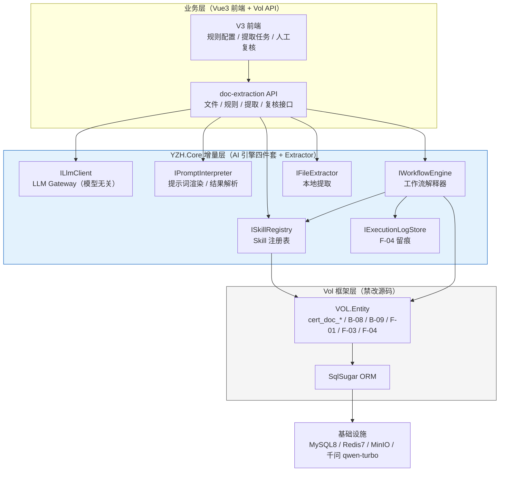
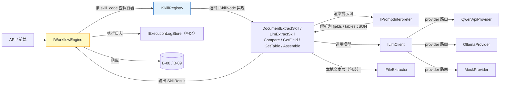
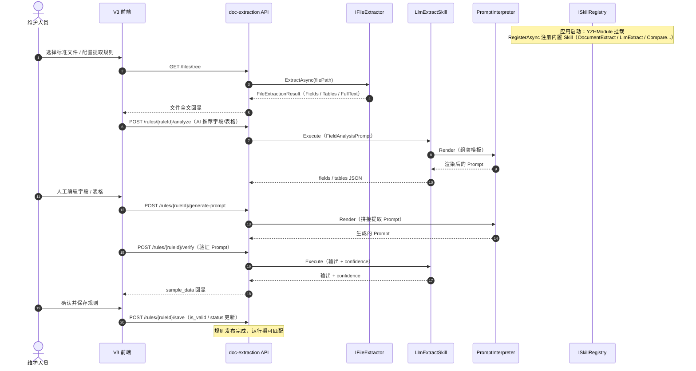
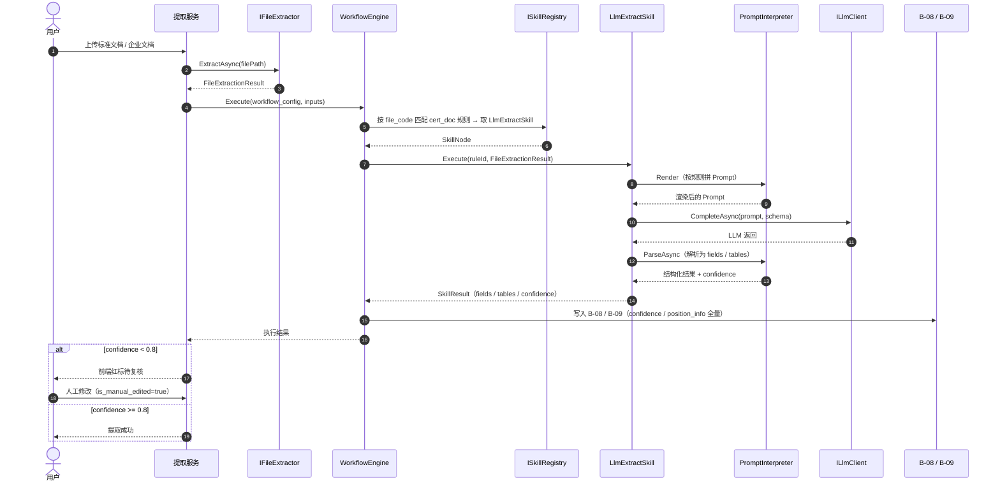
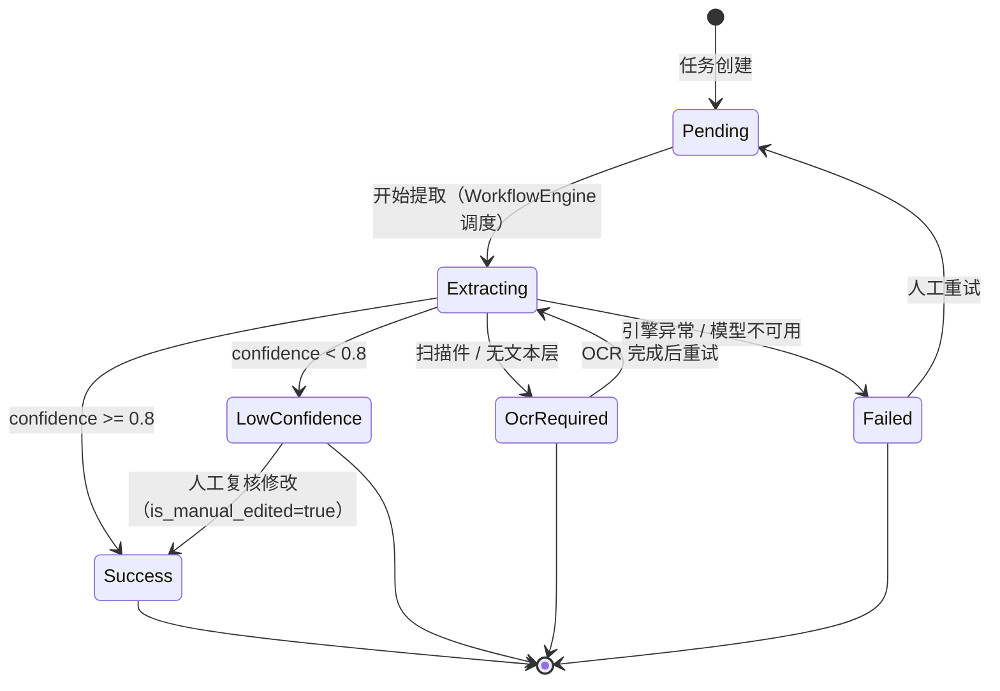
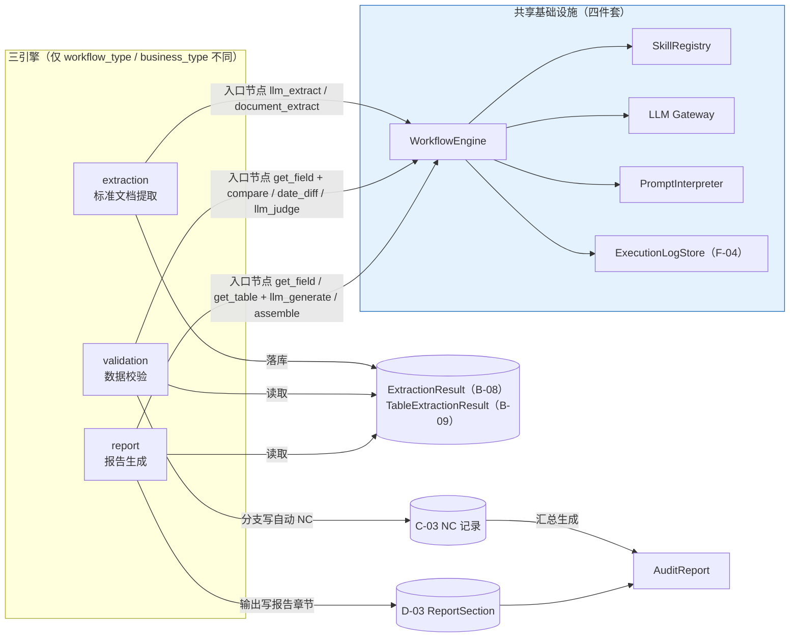
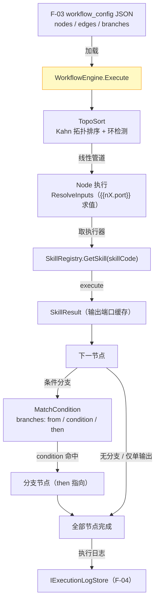
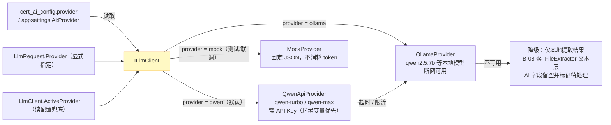

---
AIGC:
  Label: '1'
  ContentProducer: 001191440300708461136T1XGW3
  ProduceID: 9a16bac6e27d25132787d930f50d9879_1d078285953411f181ac525400f8a581
  ReservedCode1: y87/8Hf+ByLo/LqXat1eLnPbcgPvueC+sLSjwSlUykUsGigtX1vTdlRMbrtYxKcaTREzlSKmnX+LfYYSYLl1Chc1xWMGYFsncjyBo+Mwrc91lr74ylnMs4F9qhPDWYuIx9digqlpk/m937vRHmcu0k94h+3M9DB/SNIXreL6Uw4BX+o2pzkY9Ij3ieA=
  ContentPropagator: 001191440300708461136T1XGW3
  PropagateID: 9a16bac6e27d25132787d930f50d9879_1d078285953411f181ac525400f8a581
  ReservedCode2: y87/8Hf+ByLo/LqXat1eLnPbcgPvueC+sLSjwSlUykUsGigtX1vTdlRMbrtYxKcaTREzlSKmnX+LfYYSYLl1Chc1xWMGYFsncjyBo+Mwrc91lr74ylnMs4F9qhPDWYuIx9digqlpk/m937vRHmcu0k94h+3M9DB/SNIXreL6Uw4BX+o2pzkY9Ij3ieA=
---

# YZH-AI引擎详细设计-V1

> **版本**：V1.2 | **日期**：2026-08-11 | **状态**：待实施
> **V1.1→V1.2 更新点**：① 补旧版 Office convertStatus 与 DocumentExtractSkill 衔接；② 补 branches condition.field 定义 + skipped 留痕；③ 补 LlmClient 重试/熔断/信号量；④ 补 PromptInterpreter 边界 + LlmExtractSkill 1 次 JSON 失败重试；⑤ 补 S5 验收 Office 联动 + http.js 声明

---

## 目录

- [1. 目标与范围](#1-目标与范围)
- [2. 模块划分](#2-模块划分)
- [3. 核心接口签名](#3-核心接口签名)
- [4. 数据契约](#4-数据契约)
- [5. 核心时序](#5-核心时序)
- [6. 代码骨架](#6-代码骨架)
- [7. 模型无关设计](#7-模型无关设计)
- [8. 测试策略](#8-测试策略)
- [9. 风险与降级](#9-风险与降级)
- [10. 里程碑 S1~S5](#10-里程碑-s1s5)
- [11. TODO 清单](#11-todo-清单)
- [附录 A 与既有文档的关系](#附录-a-与既有文档的关系)

---

## 设计图索引

| #   | 图名                         | 所在章节                                                   | 用途                                                                                                 |
| --- | ---------------------------- | ---------------------------------------------------------- | ---------------------------------------------------------------------------------------------------- |
| 图1 | 总体架构分层图               | [2. 模块划分](#2-模块划分)                                 | 业务层 / YZH.Core 四件套 / Vol 框架三层关系                                                          |
| 图2 | 四件套模块协作图             | [2.1 目录结构](#21-目录结构)                               | SkillRegistry / LLM Gateway / PromptInterpreter / WorkflowEngine / Extractor / ExecutionLog 调用关系 |
| 图3 | 配置期时序图                 | [5.1 配置期](#51-配置期注册-skill--配置规则)               | 维护人员配置规则 → 自动生成 / 注册 Skill → 发布                                                      |
| 图4 | 运行期提取执行时序图         | [5.2 运行期](#52-运行期标准文档提取执行)                   | 上传 → 本地提取 → 匹配 Skill → LLM → B-08 落库 → 低置信度复核                                        |
| 图5 | 三引擎复用图                 | [5.3 校验 / 报告引擎复用](#53-校验--报告引擎复用)          | extraction / validation / report 复用同一套工作流 + Skill 基础设施                                   |
| 图6 | 模型无关 provider 切换原理图 | [7.1 切换机制](#71-切换机制)                               | ILlmClient → QwenApiProvider / OllamaProvider / MockProvider 路由与降级                              |
| 图7 | 提取执行状态机图             | [5.2 运行期](#52-运行期标准文档提取执行)                   | Pending → Extracting → Success / LowConfidence / OcrRequired / Failed                                |
| 图8 | 工作流引擎执行原理图         | [6.5 WorkflowEngine](#65-workflowengine线性管道--条件分支) | workflow_config 解析 → 线性管道 / 条件分支 → 节点执行                                                |

> 全部设计图使用 **Mermaid** 语法，与《总体设计-V3.md》（docs/20-架构决策）既定格式保持一致，GitHub / VSCode 可直接渲染。

---

## 1. 目标与范围

### 1.1 背景与问题

项目存在三条数据引擎：**标准文档数据提取**（上传 → 提取字段/表格）、**数据校验**（自动 NC 判定）、**报告生成**（章节内容组装）。三引擎均需要"调用外部 AI → 执行本地 Skill → 结构化输出"的统一能力，但当前现状：

| 组件                                                                       | 现状                                                     | 依据                  |
| -------------------------------------------------------------------------- | -------------------------------------------------------- | --------------------- |
| `IFileExtractor`                                                           | ✅ 已实现，42/42 测试通过（Word/Excel/PDF 文本层）       | `YZH.Core/Extractor/` |
| `DocExtractionRuleService`                                                 | ⚠️ 4 个私有方法全 TODO 模拟返回空；未引用 IFileExtractor | 代码核实              |
| `QwenAIConfigService` / `PromptGenerationService` / `FieldAnalysisService` | ❌ 三服务均不存在（V3 设计）                             | 代码核实              |
| `wf_skill` 实体                                                            | ✅ 已建（`VOL.Entity/CertPlatform/Wf/Skill.cs`）         | 代码核实              |
| `ISkillNode` / `ISkillRegistry` / `WorkflowEngine`                         | ❌ 零实现                                                | 代码核实              |
| 前端 4 按钮（analyze/generate-prompt/verify/save）                         | ❌ 全 TODO 未接后端                                      | index.vue 核实        |

结论：配置期链路（规则 → 提示词）方向正确，但"本地 Skill + 运行期 AI 推理 + 结果回写"三机制全缺失。本设计补齐这三块，并作为三引擎复用的统一基础设施。

### 1.2 目标

建设贯穿**标准文档提取、数据校验、报告生成**三引擎复用的"外部 AI 调用本地 Skill → 提示词执行"统一基础设施，四件套：

1. **SkillRegistry**：本地 Skill 执行器注册表（节点能力登记处）
2. **LLM Gateway**（`ILlmClient` + Provider）：模型无关的 LLM 调用网关（OpenAI 兼容协议）
3. **PromptInterpreter**：提示词渲染 + 结构化输出解析
4. **WorkflowEngine**：轻量工作流解释器（线性管道 + 条件分支）

**放置位置**：`src/server/Vue.NetCore/YZH.Core/` 下 `AI/`、`Workflow/`、`Skills/` 三目录，作为核心资产，不进入 VOL.Core / VOL.Builder 生成代码，不修改 Vol 源码。

### 1.3 范围边界

**本设计包含**：

- 四件套的接口契约、数据契约、代码骨架、测试、里程碑
- 验证场 = 标准文档数据提取（`cert_doc_*` 规则 → 上传 → 提取 → B-08/B-09 落库 → 低置信度人工复核）
- 校验/报告引擎的复用方式（F-03 `workflow_type` 区分）

**本设计不包含（如实标注）**：

- 前端 LogicFlow 可视化编辑器（另行设计）
- OCR 第三方接入（`IFileExtractor` 已预留 `OcrExtractor` 扩展点，`[TODO:P2]`）
- `cert_doc_*` 表与 V2 域 F/B 的物理收敛 SQL（本设计给出收敛方案，执行列为 `[TODO:P0]`，见 §11）
- 提示词版本管理与多语言（`[TODO:P2]`）

### 1.4 设计约束（对齐项目全局规则）

- 单人独立开发维护 → 组件粒度以"当天可验证"为上限（见 §10 里程碑）
- 成本敏感 → 默认模型 `qwen-turbo`；本地可切 `OllamaProvider` 排除费用/断网
- 不过度设计 → 引擎只做"按序执行 Skill 并留痕"，不做长流程暂停恢复、不做流程可视化运行时
- 禁改 Vol 源码 → 四件套全部放 `YZH.Core` 独立模块
- 禁删旧文档 → 本设计与 V3 的关系见附录 A

---

## 2. 模块划分

> **图1 总体架构分层图** — 展示业务层 / YZH.Core 增量层 / Vol 框架层三层关系。核心路径：V3 前端经 doc-extraction API 只调用 YZH.Core 四件套接口，四件套通过 VOL.Entity 落库，YZH.Core 作为增量层完整隔离 AI 能力，Vol 源码零改动。



### 2.1 目录结构

```
src/server/Vue.NetCore/YZH.Core/
├── Extractor/                        # [已实现] 文本层提取（Word/Excel/PDF），42/42 测试通过
│   ├── IFileExtractor.cs
│   └── Models/                       # FileExtractionResult / ExtractedField / ExtractedTable ...
├── AI/                               # [本设计新增] LLM Gateway + Prompt
│   ├── Clients/
│   │   ├── ILlmClient.cs             # 模型无关统一入口
│   │   ├── LlmClient.cs              # OpenAI 兼容协议封装（HTTP）
│   │   ├── ILlmProvider.cs           # Provider 抽象（模型无关关键）
│   │   ├── QwenApiProvider.cs        # 云端：qwen-turbo（默认，成本控制）
│   │   ├── OllamaProvider.cs         # 本地：Ollama /api/chat（断网/免费用）
│   │   ├── MockProvider.cs           # 测试桩（单测/联调）
│   │   └── Models/                   # LlmRequest / LlmResponse / LlmMessage / LlmOptions
│   ├── Prompt/
│   │   ├── IPromptInterpreter.cs     # 渲染 + 解析
│   │   ├── PromptInterpreter.cs      # {占位符} 渲染、JSON 结构化解析、错误恢复
│   │   └── Models/                   # PromptTemplate / RenderContext / ParseResult
│   └── Plan/
│       ├── AiPlan.cs                 # AI plan JSON Schema 的强类型模型
│       ├── AiPlanParser.cs           # 解析 LLM 返回的 plan JSON → AiPlan
│       └── AiStep.cs                 # steps[order, skill_code, params]
├── Workflow/                         # [本设计新增] Skill 注册表 + 解释器
│   ├── ISkillNode.cs                 # Skill 执行器统一契约
│   ├── SkillContext.cs
│   ├── SkillResult.cs
│   ├── ISkillRegistry.cs
│   ├── SkillRegistry.cs              # 字典实现 + 启动扫描注册
│   ├── IWorkflowEngine.cs
│   ├── WorkflowEngine.cs             # 线性管道 + 条件分支
│   ├── IExecutionLogStore.cs         # F-04 留痕抽象
│   ├── WorkflowContext.cs
│   ├── WorkflowRunResult.cs
│   └── Models/                       # WorkflowConfig / WorkflowNode / WorkflowEdge / BranchConfig
└── Skills/                           # [本设计新增] 内置 Skill 实现（注册表内容）
    ├── DocumentExtractSkill.cs       # word_extract / excel_extract / pdf_extract（调用 IFileExtractor）
    ├── LlmExtractSkill.cs            # llm_extract（调用 ILlmClient + PromptInterpreter，核心 AI Skill）
    ├── CompareSkill.cs               # compare / date_diff（确定性计算）
    ├── GetFieldSkill.cs              # get_field（读 B-08 已落库结果）
    ├── GetTableSkill.cs              # get_table（读 B-09）
    └── AssembleSkill.cs              # assemble（拼接文本，报告引擎用）
```

> **图2 四件套模块协作图** — 展示 AI 引擎内部调用链：入口统一经 WorkflowEngine 查询 SkillRegistry 获取执行器；LlmExtractSkill 依次调用 PromptInterpreter（渲染/解析）与 ILlmClient（Provider 路由），执行结果回传 WorkflowEngine 并落 B-08/B-09、写 F-04 留痕。



### 2.2 与现有 Extractor 的关系

- `Skills/DocumentExtractSkill.cs` 是 `IFileExtractor` 的 **Skill 包装层**：把 `FileExtractionResult`（Fields/Tables/FullText）转换为 `SkillResult.Outputs` 端口语义（`fields` / `tables` / `full_text` / `source_info`）。
- `IFileExtractor` 本身不依赖 AI 模块，保持纯本地能力；AI 链路在 Skill 层之上叠加。
- 数据流方向：`IFileExtractor`（本地）→ `LlmExtractSkill`（AI 补全/语义提取）→ B-08/B-09。

### 2.3 实体归属（对齐既有模式）

- 实体继续放 `VOL.Entity/CertPlatform/Wf/`（`wf_skill` 已建，`F-03`/`F-04` 实体按 V2 表设计补建）。
- 四件套接口与实现放 `YZH.Core`，通过 Autofac（`YZHModule.cs`）挂载注册。

---

## 3. 核心接口签名

> 全部接口定义在 `YZH.Core` 命名空间下。异常约定：业务可预期失败（Skill 不存在、LLM 超时、JSON 解析失败）抛 `YZH.Core` 定义的领域异常（`UnknownSkillException` / `LlmCallException` / `PromptParseException` / `WorkflowExecutionException`），统一继承 `YZHException`。

### 3.1 ISkillNode（Skill 执行器）

```csharp
namespace YZH.Core.Workflow;

/// <summary>
/// Skill 执行器统一契约。所有节点（输入/确定性计算/AI/输出）实现同一接口，
/// 引擎对调用方无差别，通过 SkillType 在配置期标注是否需人工复核。
/// </summary>
public interface ISkillNode
{
    /// <summary>Skill 编码，对应 F-01.skill_code（如 word_extract / llm_extract / compare）</summary>
    string SkillCode { get; }

    /// <summary>
    /// 执行 Skill。
    /// </summary>
    /// <param name="context">节点执行上下文：已解析入参 + 实例 ID + 节点 ID + 日志器</param>
    /// <param name="ct">取消令牌（引擎超时/用户取消时触发）</param>
    /// <returns>执行结果：Success / Outputs / Error / Confidence / DurationMs</returns>
    /// <exception cref="YZHException">不可恢复错误（如参数缺失、依赖服务异常）</exception>
    Task<SkillResult> ExecuteAsync(SkillContext context, CancellationToken ct = default);
}
```

### 3.2 ISkillRegistry（注册表）

```csharp
namespace YZH.Core.Workflow;

/// <summary>
/// Skill 执行器注册表。配置期注册（启动扫描 + 运行时注册），运行期按编码路由。
/// </summary>
public interface ISkillRegistry
{
    /// <summary>按编码取执行器；不存在返回 null（由引擎报 UnknownSkillException）</summary>
    ISkillNode? Get(string skillCode);

    /// <summary>注册执行器；重复注册覆盖（便于测试替换）</summary>
    Task RegisterAsync(ISkillNode skill, CancellationToken ct = default);

    /// <summary>注销执行器（测试/热更新用）</summary>
    Task UnregisterAsync(string skillCode, CancellationToken ct = default);

    /// <summary>当前已注册的全部编码（启动健康检查 / 配置工具补全用）</summary>
    IReadOnlyCollection<string> AllCodes();
}
```

### 3.3 ILlmClient / ILlmProvider（LLM Gateway，模型无关）

```csharp
namespace YZH.Core.AI.Clients;

/// <summary>模型无关的 LLM 统一入口。上层只依赖本接口，不感知 Qwen/Ollama 差异。</summary>
public interface ILlmClient
{
    /// <summary>
    /// 发起一次补全调用（OpenAI 兼容协议）。
    /// </summary>
    /// <param name="request">请求：消息列表 + 模型选项（temperature/max_tokens/json_mode）</param>
    /// <param name="ct">取消令牌</param>
    /// <returns>响应：内容 + 原始 JSON + 用量 + 耗时</returns>
    /// <exception cref="LlmCallException">网络错误、超时、非 2xx、限流（含 Provider 不可用）</exception>
    Task<LlmResponse> CompleteAsync(LlmRequest request, CancellationToken ct = default);

    /// <summary>当前生效的 Provider 名（"qwen" / "ollama" / "mock"），用于日志与状态展示</summary>
    string ActiveProvider { get; }
}

/// <summary>
/// Provider 抽象：模型无关的关键。实现类负责协议差异（鉴权、端点、消息格式）。
/// </summary>
public interface ILlmProvider
{
    /// <summary>Provider 名称（对应 cert_ai_config.provider）</summary>
    string Name { get; }

    /// <summary>OpenAI 兼容 /chat/completions 调用；失败抛 LlmCallException（含限流/超时语义）</summary>
    Task<LlmResponse> ChatAsync(LlmRequest request, CancellationToken ct = default);
}

/// <summary>请求：消息列表 + 选项</summary>
public class LlmRequest
{
    public string Provider { get; set; } = "qwen";          // 目标 Provider（qwen/ollama/mock）
    public string Model { get; set; } = "qwen-turbo";       // 模型名（qwen-turbo / qwen2.5:7b 等）
    public List<LlmMessage> Messages { get; set; } = new(); // 系统 + 用户消息
    public double Temperature { get; set; } = 0.1;          // 提取类任务默认低温，控幻觉
    public int MaxTokens { get; set; } = 4096;
    public bool JsonMode { get; set; } = true;              // 请求 JSON 结构化输出
    public int TimeoutSeconds { get; set; } = 60;           // 单次调用超时
}

public class LlmMessage
{
    public string Role { get; set; } = "user";              // system / user / assistant
    public string Content { get; set; } = string.Empty;
}

/// <summary>响应：统一结构</summary>
public class LlmResponse
{
    public bool Success { get; set; }
    public string Content { get; set; } = string.Empty;     // 模型输出文本（JsonMode 时为 JSON 字符串）
    public string? RawJson { get; set; }                    // 原始响应体（调试/日志）
    public int? PromptTokens { get; set; }
    public int? CompletionTokens { get; set; }
    public long DurationMs { get; set; }
    public string Provider { get; set; } = string.Empty;
    public string Model { get; set; } = string.Empty;
    public string? Error { get; set; }                      // 失败原因（Success=false 时）
}
```

### 3.4 IPromptInterpreter（提示词渲染与解析）

````csharp
namespace YZH.Core.AI.Prompt;

/// <summary>
/// 提示词解释器：渲染模板 + 解析结构化输出。
/// 职责：把"模板 + 上下文"渲染为最终 Prompt；把 LLM 输出解析为强类型结果（含错误恢复）。
/// </summary>
public interface IPromptInterpreter
{
    /// <summary>
    /// 渲染提示词模板。
    /// </summary>
    /// <param name="template">模板文本，占位符格式 {document_content} / {fields_json}</param>
    /// <param name="context">渲染上下文：占位符名 → 值（文档全文、字段定义 JSON、表格定义 JSON 等）</param>
    /// <returns>渲染后的最终 Prompt；未闭合占位符保留原样并记录警告</returns>
    string Render(string template, IDictionary<string, object> context);

    /// <summary>
    /// 解析 LLM 输出为强类型结果（JSON）。
    /// </summary>
    /// <typeparam name="T">目标类型（AiExtractionResult / AiPlan / AiValidationResult 等）</typeparam>
    /// <param name="llmOutput">LLM 原始输出（可能含 ```json 围栏 / 前后杂讯）</param>
    /// <param name="ct">取消令牌</param>
    /// <returns>解析结果：Success / Value / Error / RawText</returns>
    /// <exception cref="PromptParseException">围栏剥离后仍无法解析为合法 JSON</exception>
    Task<ParseResult<T>> ParseAsync<T>(string llmOutput, CancellationToken ct = default) where T : class;
}

/// <summary>渲染上下文：占位符名 → 值</summary>
public class RenderContext : Dictionary<string, object>
{
    public RenderContext() { }
    public RenderContext(IDictionary<string, object> map) : base(map) { }
}

/// <summary>解析结果</summary>
public class ParseResult<T> where T : class
{
    public bool Success { get; set; }
    public T? Value { get; set; }
    public string? Error { get; set; }      // 解析失败原因（供重试/降级）
    public string? RawText { get; set; }    // 剥离围栏后的原始文本
}
````

### 3.5 IWorkflowEngine（解释器）

```csharp
namespace YZH.Core.Workflow;

/// <summary>
/// 轻量工作流解释器：线性管道 + 条件分支。
/// 只做五件事：读 JSON → 排顺序（拓扑排序，含环检测）→ 调 Skill → 传数据（模板求值）→ 记日志。
/// </summary>
public interface IWorkflowEngine
{
    /// <summary>
    /// 运行一次工作流。
    /// </summary>
    /// <param name="workflowConfigJson">F-03.workflow_config 的 JSON（nodes + edges + branches + output_config）</param>
    /// <param name="context">运行上下文：实例 ID / 业务类型 / 业务 ID / 输入参数 / 日志器</param>
    /// <param name="ct">取消令牌</param>
    /// <returns>运行结果：Success / NodeOutputs / FailedNodeId / Error</returns>
    /// <exception cref="WorkflowExecutionException">拓扑有环、未知 Skill、节点执行失败</exception>
    Task<WorkflowRunResult> RunAsync(string workflowConfigJson, WorkflowContext context, CancellationToken ct = default);
}

/// <summary>运行上下文</summary>
public class WorkflowContext
{
    public string WorkflowInstanceId { get; set; } = string.Empty;  // 对应 F-04 批次
    public string BusinessType { get; set; } = "file_upload";       // audit_task / report_task / file_upload
    public long BusinessId { get; set; }
    public IDictionary<string, object> Inputs { get; set; } = new Dictionary<string, object>();
    public IExecutionLogStore? LogStore { get; set; }               // 为空则跳过留痕（纯计算场景）
}

/// <summary>运行结果</summary>
public class WorkflowRunResult
{
    public bool Success { get; set; }
    public IDictionary<string, IDictionary<string, object>> NodeOutputs { get; set; } = new(); // nodeId → 端口值
    public string? FailedNodeId { get; set; }
    public string? Error { get; set; }
    public long DurationMs { get; set; }
}
```

### 3.6 IExecutionLogStore（留痕抽象）

```csharp
namespace YZH.Core.Workflow;

/// <summary>
/// 执行日志存储：每次节点执行的输入/输出/状态/耗时写入 F-04。
/// 抽象目的：单测可用内存实现；生产用 EF Core 实现写 wf_workflow_execution_log。
/// </summary>
public interface IExecutionLogStore
{
    /// <summary>写入一条节点级执行日志（异步落库，失败不阻断主流程，仅记录告警）</summary>
    Task WriteAsync(ExecutionLogEntry entry, CancellationToken ct = default);

    /// <summary>按实例 ID 查该批次日志（复核/排障用）</summary>
    Task<IReadOnlyList<ExecutionLogEntry>> QueryByInstanceAsync(string workflowInstanceId, CancellationToken ct = default);
}

/// <summary>对应 F-04 WorkflowExecutionLog 实体字段</summary>
public class ExecutionLogEntry
{
    public long WorkflowId { get; set; }            // F-03.id
    public int WorkflowVersion { get; set; } = 1;
    public string BusinessType { get; set; } = "file_upload";
    public long BusinessId { get; set; }
    public string NodeId { get; set; } = string.Empty;
    public string SkillCode { get; set; } = string.Empty;
    public string? InputDataJson { get; set; }      // 实际输入（截断 16KB 防爆）
    public string? OutputDataJson { get; set; }     // 实际输出（截断 64KB）
    public string Status { get; set; } = "pending"; // pending/running/success/failed/skipped
    public string? ErrorMsg { get; set; }
    public long DurationMs { get; set; }
    public DateTime StartedAt { get; set; }
    public DateTime? CompletedAt { get; set; }
}
```

---

## 4. 数据契约

### 4.1 F-01 Skill（`wf_skill` 存储 JSON）

F-01 表字段见数据库表设计-V2 §8.2。`input_schema` / `output_schema` / `endpoint_config` 为 JSON，结构约定：

```json
{
  "skill_code": "llm_extract",
  "skill_name": "LLM 文档字段提取",
  "skill_type": "llm_extract",
  "input_schema": {
    "type": "object",
    "required": ["document_content", "prompt"],
    "properties": {
      "document_content": {
        "type": "string",
        "description": "文档全文（IFileExtractor 提取结果）"
      },
      "prompt": {
        "type": "string",
        "description": "提取提示词模板（含 {document_content} 占位）"
      },
      "fields_json": {
        "type": "string",
        "description": "字段定义 JSON（cert_doc_field_def）"
      },
      "tables_json": {
        "type": "string",
        "description": "表格定义 JSON（cert_doc_table_def + table_field_def）"
      }
    }
  },
  "output_schema": {
    "type": "object",
    "required": ["fields", "tables"],
    "properties": {
      "fields": {
        "type": "array",
        "items": {
          "type": "object",
          "required": ["field_code", "field_value", "confidence"],
          "properties": {
            "field_code": { "type": "string" },
            "field_value": { "type": ["string", "number", "boolean", "null"] },
            "confidence": { "type": "number", "minimum": 0, "maximum": 1 },
            "position_info": { "type": ["object", "null"] }
          }
        }
      },
      "tables": {
        "type": "array",
        "items": {
          "type": "object",
          "required": ["table_code", "rows"],
          "properties": {
            "table_code": { "type": "string" },
            "rows": {
              "type": "array",
              "items": { "type": "array", "items": { "type": "string" } }
            },
            "confidence": { "type": "number", "minimum": 0, "maximum": 1 }
          }
        }
      }
    }
  },
  "endpoint_config": {
    "llm": {
      "provider": "qwen",
      "model": "qwen-turbo",
      "temperature": 0.1,
      "max_tokens": 4096,
      "json_mode": true
    }
  },
  "description": "调用 LLM 按提示词从文档中提取字段与表格",
  "is_active": true
}
```

> **说明**：`skill_type` 与 V2 的 enum（`ocr/word_extract/excel_extract/pdf_extract/llm_judge/calculate/compare/assemble/api/llm_generate`）保持对齐；本设计新增 `llm_extract` 作为"文档提取专用 AI Skill"，`llm_judge`/`llm_generate` 供校验/报告引擎复用。`cert_doc_extraction_rule.skill` 目前只有 `word/excel/pdf` 三值（文件类型），与 F-01 体系分叉，收敛见 §11 [TODO:P0-1]。

### 4.2 F-03 workflow_config JSON Schema（含条件分支）

V2 已定义 nodes/edges/output_config 基础结构，本设计扩展 `branches`（条件分支，供校验引擎"是否违规"分流）：

```json
{
  "$schema": "http://json-schema.org/draft-07/schema#",
  "type": "object",
  "required": ["nodes", "edges"],
  "properties": {
    "nodes": {
      "type": "array",
      "items": {
        "type": "object",
        "required": ["node_id", "skill_code", "inputs", "output"],
        "properties": {
          "node_id": { "type": "string", "pattern": "^n[0-9]+$" },
          "skill_code": {
            "type": "string",
            "description": "F-01.skill_code 或内置编码"
          },
          "inputs": {
            "type": "object",
            "additionalProperties": true,
            "description": "字面量或 {{nX.port}} 模板"
          },
          "output": {
            "type": "string",
            "description": "本节点输出端口名（供下游引用）"
          }
        }
      }
    },
    "edges": {
      "type": "array",
      "items": {
        "type": "object",
        "required": ["from", "to"],
        "properties": {
          "from": { "type": "string" },
          "to": { "type": "string" }
        }
      }
    },
    "branches": {
      "type": "array",
      "description": "条件分支（可选）：from 节点输出满足 condition 时执行 then 分支（线性子管道）",
      "items": {
        "type": "object",
        "required": ["from", "condition", "then"],
        "properties": {
          "from": {
            "type": "string",
            "description": "判定节点 node_id（如 n4 输出 is_violation）"
          },
          "condition": {
            "type": "object",
            "required": ["field", "op", "value"],
            "description": "对 from 节点输出的指定端口（field）执行 op 运算，与 value 比较；truthy 时忽略 value",
            "properties": {
              "field": {
                "type": "string",
                "description": "from 节点输出的端口名，如 is_violation / n4.output / confidence"
              },
              "op": {
                "enum": [
                  "equals",
                  "not_equals",
                  "gt",
                  "gte",
                  "lt",
                  "lte",
                  "truthy"
                ]
              },
              "value": { "type": ["boolean", "string", "number", "null"] }
            }
          },
          "then": {
            "type": "array",
            "items": { "$ref": "#/properties/nodes/items" },
            "description": "分支内的子节点（线性执行，内部也可嵌套 branches）"
          }
        }
      }
    },
    "output_config": {
      "type": "object",
      "description": "输出汇总配置（如违规 NC 模板）",
      "additionalProperties": true
    }
  }
}
```

**示例（校验引擎：管理评审日期超期判定）**：

```json
{
  "nodes": [
    {
      "node_id": "n1",
      "skill_code": "get_field",
      "inputs": { "label_tag": "[ISO9001_一监_管理评审记录_评审日期]" },
      "output": "review_date"
    },
    {
      "node_id": "n2",
      "skill_code": "get_field",
      "inputs": { "label_tag": "[ISO9001_一监_阶段审核日期]" },
      "output": "audit_date"
    },
    {
      "node_id": "n3",
      "skill_code": "date_diff",
      "inputs": {
        "date_a": "{{n1.output}}",
        "date_b": "{{n2.output}}",
        "unit": "month"
      },
      "output": "diff_months"
    },
    {
      "node_id": "n4",
      "skill_code": "compare",
      "inputs": { "value": "{{n3.output}}", "operator": ">", "threshold": 12 },
      "output": "is_violation"
    }
  ],
  "edges": [
    { "from": "n1", "to": "n3" },
    { "from": "n2", "to": "n3" },
    { "from": "n3", "to": "n4" }
  ],
  "branches": [
    {
      "from": "n4",
      "condition": { "field": "output", "op": "equals", "value": true },
      "then": [
        {
          "node_id": "n5",
          "skill_code": "create_nc",
          "inputs": {
            "severity": "minor",
            "template": "管理评审记录距审核日期超过12个月"
          },
          "output": "nc_id"
        }
      ]
    }
  ],
  "output_config": { "result_key": "is_violation" }
}
```

### 4.3 AI plan JSON Schema（运行期规划）

`LlmExtractSkill` 的扩展形态：当单一提示词无法覆盖"先识别结构 → 再按结构提取"时，LLM 先生成 plan，引擎按 plan 分步执行。`AiPlanParser` 负责解析：

```json
{
  "$schema": "http://json-schema.org/draft-07/schema#",
  "type": "object",
  "required": ["plan_name", "steps"],
  "properties": {
    "plan_name": {
      "type": "string",
      "description": "计划名称（日志/复核展示）"
    },
    "steps": {
      "type": "array",
      "items": {
        "type": "object",
        "required": ["order", "skill_code", "params"],
        "properties": {
          "order": {
            "type": "integer",
            "minimum": 1,
            "description": "执行顺序（从 1 递增，引擎按序执行）"
          },
          "skill_code": {
            "type": "string",
            "description": "F-01.skill_code（llm_extract / compare / get_field ...）"
          },
          "params": {
            "type": "object",
            "additionalProperties": true,
            "description": "该步骤入参（字面量或引用上一步输出 {{step.N.port}}）"
          }
        }
      }
    },
    "output_mapping": {
      "type": "object",
      "description": "plan 输出到 B-08/B-09 的映射（可选，默认按 field_code 直落）",
      "additionalProperties": { "type": "string" }
    }
  }
}
```

**示例**：

```json
{
  "plan_name": "营业执照提取计划",
  "steps": [
    {
      "order": 1,
      "skill_code": "llm_extract",
      "params": {
        "prompt_template": "extract_license_v1",
        "document_content": "{{input.full_text}}"
      }
    },
    {
      "order": 2,
      "skill_code": "compare",
      "params": {
        "value": "{{step.1.fields.companyName}}",
        "operator": "not_empty"
      }
    },
    {
      "order": 3,
      "skill_code": "assemble",
      "params": {
        "parts": [
          "{{step.1.fields.companyName}}",
          "{{step.1.fields.creditCode}}"
        ],
        "joiner": " | "
      }
    }
  ],
  "output_mapping": {
    "companyName": "B08:companyName",
    "creditCode": "B08:creditCode",
    "shareholderInfo": "B09:shareholderInfo"
  }
}
```

> **说明**：V1 阶段 `plan` 仅作为 AI 输出的受支持形态（`AiPlanParser` + 引擎按序执行），前端不强制使用；默认路径仍是"规则级 Prompt 直接提取"（§5.2 时序）。plan 优先级 `[TODO:P2-3]`。

### 4.4 与 B-08 / B-09 映射

| AI 输出（output_schema）                  | 目标表                                  | 映射规则                                                                                                                                                                                          |
| ----------------------------------------- | --------------------------------------- | ------------------------------------------------------------------------------------------------------------------------------------------------------------------------------------------------- |
| `fields[]`                                | **B-08 ExtractionResult**               | `field_code` → `field_id`（经 A-09/F-02 匹配）；`field_value` → `extracted_value`；`confidence` → `confidence`；`position_info` → `position_info`；`label_tag` 冗余写入；`is_manual_edited=false` |
| `tables[]`                                | **B-09 TableExtractionResult**          | `table_code` → `rule_id` + `table_index`（多表按出现序）；`rows` → `extracted_json`（System.Text.Json 序列化）；`confidence` → `confidence`；`position_info` → `position_info`                    |
| `confidence < 0.8`                        | —                                       | 落库后标记待人工复核（前端列表红标 + `is_manual_edited` 语义：人工改后置 true）                                                                                                                   |
| `fields_json` / `tables_json`（规则配置） | cert_doc_field_def / cert_doc_table_def | 规则配置期写入，非运行期落 B-08/B-09                                                                                                                                                              |

> **字段编码 ↔ 标签**：`ExtractedField.LabelTag`（对齐 F-02 label_tag）作为工作流 `get_field` 的引用键；配置期由 F-02 建立 `label_tag → field_code` 映射，运行期 `GetFieldSkill` 按标签查 B-08。

---

## 5. 核心时序

### 5.1 配置期：注册 Skill + 配置规则

```
管理员 / 系统启动
  │
  ├─(A) 启动注册（应用启动时，YZHModule 挂载）
  │     SkillRegistry.RegisterAsync(DocumentExtractSkill)
  │     SkillRegistry.RegisterAsync(LlmExtractSkill)
  │     SkillRegistry.RegisterAsync(CompareSkill / GetFieldSkill / GetTableSkill / AssembleSkill)
  │     → 注册表就绪（可查询 AllCodes() 做健康检查）
  │
  ├─(B) 配置规则（V3 前端流程，后端补真）
  │     ① 选文件 → GET /api/doc-extraction/files/tree
  │     ② 读全文 → GET /api/doc-extraction/files/{fileCode}/content（IFileExtractor 提取）
  │     ③ AI 分析推荐字段/表格 → POST /rules/{ruleId}/analyze
  │           LlmExtractSkill + FieldAnalysisPrompt → 输出 fields/tables JSON
  │     ④ 人工编辑字段/表格 → POST /rules/{ruleId}/fields、/tables
  │     ⑤ 生成 Prompt → POST /rules/{ruleId}/generate-prompt（PromptInterpreter.Render 组装模板）
  │     ⑥ 验证 Prompt → POST /rules/{ruleId}/verify
  │           LlmExtractSkill 跑一次 → 输出 + confidence → sample_data 回显（cert_doc_extraction_rule.sample_data）
  │     ⑦ 保存规则 → POST /rules/{ruleId}/save（is_valid / status 更新）
```

> **图3 配置期时序图** — 覆盖 §5.1 配置期 A/B 两条路径：系统启动时 SkillRegistry 自动注册内置 Skill；维护人员在 V3 前端经 analyze → 人工编辑 → generate-prompt → verify → save 完成规则发布。关键路径为 verify 环节用 LlmExtractSkill 真实跑一次，输出 sample_data 供人工确认。



### 5.2 运行期：标准文档提取执行

````
上传（标准文档/企业文档）
  │
  ▼
① 本地提取   IFileExtractor.ExtractAsync(filePath)
  │          → FileExtractionResult { Fields, Tables, FullText, SourceInfo }
  ▼
② 匹配规则   按 file_code / 文件名匹配 cert_doc_extraction_rule（V3 主表）
  │          取 prompt + skill 类型
  ▼
③ 渲染提示词  PromptInterpreter.Render(prompt, { document_content=FullText, fields_json, tables_json })
  ▼
④ 调 LLM     ILlmClient.CompleteAsync({ provider=config.provider, model, json_mode=true })
  │          （provider 由 cert_ai_config 决定：qwen-turbo 或 ollama 本地）
  ▼
⑤ 解析输出    PromptInterpreter.ParseAsync<AiExtractionResult>(llmOutput)
  │          剥离 ```json 围栏 → 反序列化 → fields[]/tables[]
  ▼
⑥ 落库       B-08 每条 field 一条记录；B-09 每个 table 一条记录（confidence / position_info 全量写入）
  ▼
⑦ 人工复核   confidence < 0.8 → 前端红标待复核；人工修改 → is_manual_edited=true
````

> **图4 运行期提取执行时序图** — 覆盖 §5.2 七步主链路：上传 → 本地提取 → 匹配规则 → WorkflowEngine 调度 → LLM 渲染/调用/解析 → B-08/B-09 落库。关键分支为 confidence < 0.8 时进入人工复核，复核结果回写 is_manual_edited 标记。



> **图7 提取执行状态机图** — 定义提取任务生命周期：新建进入 Pending，调度后转 Extracting；成功阈值以 confidence 0.8 划分 Success / LowConfidence，扫描件走 OcrRequired 分支，异常走 Failed；人工复核与 OCR 完成后均可回流转续。



### 5.3 校验 / 报告引擎复用

| 引擎         | workflow_type | 复用组件                                                         | 差异点                                                                                  |
| ------------ | ------------- | ---------------------------------------------------------------- | --------------------------------------------------------------------------------------- |
| 标准文档提取 | `extraction`  | SkillRegistry + LLM Gateway + PromptInterpreter + WorkflowEngine | 入口节点 `llm_extract` / `document_extract`；落 B-08/B-09                               |
| 数据校验     | `validation`  | 同上                                                             | 入口节点 `get_field`（读 B-08）+ `compare`/`date_diff`/`llm_judge`；分支写 C-03 自动 NC |
| 报告生成     | `report`      | 同上                                                             | 入口节点 `get_field`/`get_table` + `llm_generate`/`assemble`；输出写 D-03 ReportSection |

三引擎共用同一 `WorkflowEngine` 与 `IExecutionLogStore`（F-04 留痕），仅 `workflow_config` 内容与 `business_type` 不同。

> **图5 三引擎复用图** — 展示提取 / 校验 / 报告三引擎复用同一套四件套基础设施，差异仅在工作流入口节点与落库目标。数据流转主线：B-08 提取结果 → validation 读取并比对标准生成 C-03 NC → report 汇总生成 AuditReport 章节（D-03）。



---

## 6. 代码骨架

### 6.1 SkillRegistry

```csharp
namespace YZH.Core.Workflow;

public class SkillRegistry : ISkillRegistry
{
    private readonly ConcurrentDictionary<string, ISkillNode> _skills = new();
    private readonly ILogger<SkillRegistry> _logger;

    public SkillRegistry(ILogger<SkillRegistry> logger) => _logger = logger;

    public ISkillNode? Get(string skillCode) =>
        _skills.TryGetValue(skillCode, out var skill) ? skill : null;

    public Task RegisterAsync(ISkillNode skill, CancellationToken ct = default)
    {
        _skills[skill.SkillCode] = skill;
        _logger.LogInformation("Skill 已注册: {SkillCode}", skill.SkillCode);
        return Task.CompletedTask;
    }

    public Task UnregisterAsync(string skillCode, CancellationToken ct = default)
    {
        _skills.TryRemove(skillCode, out _);
        return Task.CompletedTask;
    }

    public IReadOnlyCollection<string> AllCodes() => _skills.Keys.ToList();
}
```

### 6.2 LlmClient（Provider 路由）

```csharp
namespace YZH.Core.AI.Clients;

public class LlmClient : ILlmClient
{
    private readonly IEnumerable<ILlmProvider> _providers;
    private readonly IConfiguration _config;
    private readonly ILogger<LlmClient> _logger;

    // ── 全局并发控制（多 Workflow 实例共享）──
    // 默认并发 2（可经 appsettings Ai:MaxConcurrency 覆盖），
    // 防止批量提取时 Qwen 触发 429 限流 / 本地 Ollama GPU 过载。
    private static readonly SemaphoreSlim _callGate = new(2, 2);

    // ── 熔断状态（连续失败 5 次 → 熔断 30s 内所有请求直接抛 LlmCallException(IsUnreachable=true)）──
    private static int _consecutiveFailures;
    private static DateTime _circuitBreakerUntil = DateTime.MinValue;
    private static readonly object _circuitLock = new();

    // ── 重试退避：429 / 5xx / Timeout 指数退避最多 3 次（1s / 3s / 7s）──
    private static readonly int[] RetryDelaysMs = { 1000, 3000, 7000 };

    public LlmClient(IEnumerable<ILlmProvider> providers, IConfiguration config, ILogger<LlmClient> logger)
    {
        _providers = providers;
        _config = config;
        _logger = logger;
        if (int.TryParse(config["Ai:MaxConcurrency"], out var conc) && conc > 0 && conc <= 32)
            _callGate = new SemaphoreSlim(conc, conc);
    }

    public string ActiveProvider => _config["Ai:Provider"] ?? "qwen";

    public async Task<LlmResponse> CompleteAsync(LlmRequest request, CancellationToken ct = default)
    {
        // 1. 熔断快速失败
        lock (_circuitLock)
        {
            if (DateTime.Now < _circuitBreakerUntil)
                throw new LlmCallException($"Provider 熔断中（至 {_circuitBreakerUntil:HH:mm:ss}），请稍后重试", false) { IsUnreachable = true };
        }

        var providerName = string.IsNullOrWhiteSpace(request.Provider) ? ActiveProvider : request.Provider;
        var provider = _providers.FirstOrDefault(p => p.Name == providerName)
                       ?? throw new LlmCallException($"未注册 Provider: {providerName}");

        // 2. 降级链主循环：当前 Provider 失败 3 次后自动切下一个（qwen → ollama → 抛错）
        var ordered = ProviderOrder(providerName);
        Exception? lastEx = null;
        foreach (var pName in ordered)
        {
            var p = _providers.FirstOrDefault(x => x.Name == pName);
            if (p == null) continue;
            for (var retry = 0; retry <= RetryDelaysMs.Length; retry++)
            {
                ct.ThrowIfCancellationRequested();
                await _callGate.WaitAsync(ct);
                try
                {
                    var resp = await p.ChatAsync(request, ct);
                    // 成功：重置熔断计数
                    Interlocked.Exchange(ref _consecutiveFailures, 0);
                    return resp;
                }
                catch (LlmCallException ex) when (ex.IsTimeout || ex.Message.Contains("429") || ex.Message.Contains("50") || ex.Message.Contains("502") || ex.Message.Contains("503"))
                {
                    lastEx = ex;
                    var fails = Interlocked.Increment(ref _consecutiveFailures);
                    _logger.LogWarning(ex, "LlmCall {Provider} 第 {Retry} 次失败（累计 {Fails}）", pName, retry, fails);
                    if (fails >= 5)
                    {
                        lock (_circuitLock) { _circuitBreakerUntil = DateTime.Now.AddSeconds(30); }
                        _logger.LogError("Provider {Provider} 连续失败 5 次，熔断 30s", pName);
                        break;  // 切下一个 Provider
                    }
                    if (retry < RetryDelaysMs.Length)
                        await Task.Delay(RetryDelaysMs[retry], ct);
                }
                finally
                {
                    _callGate.Release();
                }
            }
        }
        throw new LlmCallException($"所有 Provider 调用均失败: {lastEx?.Message}", true) { IsUnreachable = true };
    }

    // 按当前选中的 Provider 优先，其余按降级链顺序排列（默认 qwen 开头，ollama 兜底）
    private static IReadOnlyList<string> ProviderOrder(string first)
    {
        var list = new List<string> { first };
        foreach (var fallback in new[] { "qwen", "ollama", "mock" })
            if (!list.Contains(fallback)) list.Add(fallback);
        return list;
    }
}
```

### 6.3 QwenApiProvider / OllamaProvider

```csharp
namespace YZH.Core.AI.Clients;

/// <summary>Qwen 云端（OpenAI 兼容 /chat/completions），默认 provider，成本控制用 qwen-turbo。</summary>
public class QwenApiProvider : ILlmProvider
{
    public string Name => "qwen";

    public async Task<LlmResponse> ChatAsync(LlmRequest request, CancellationToken ct = default)
    {
        using var http = new HttpClient { Timeout = TimeSpan.FromSeconds(request.TimeoutSeconds) };
        var req = new
        {
            model = request.Model,                       // 默认 qwen-turbo
            messages = request.Messages.Select(m => new { role = m.Role, content = m.Content }),
            temperature = request.Temperature,
            max_tokens = request.MaxTokens,
            response_format = request.JsonMode ? new { type = "json_object" } : null
        };
        using var content = new StringContent(JsonSerializer.Serialize(req), Encoding.UTF8, "application/json");
        content.Headers.Authorization = new AuthenticationHeaderValue("Bearer", GetApiKey());

        try
        {
            var resp = await http.PostAsync("https://dashscope.aliyuncs.com/compatible-mode/v1/chat/completions", content, ct);
            var body = await resp.Content.ReadAsStringAsync(ct);
            if (!resp.IsSuccessStatusCode)
                throw new LlmCallException($"Qwen 调用失败 HTTP {(int)resp.StatusCode}: {Truncate(body, 500)}", true);
            return ParseOpenAiResponse(body, Name, request.Model);
        }
        catch (TaskCanceledException) { throw new LlmCallException("Qwen 调用超时", true); }
    }

    private string GetApiKey() =>
        // 优先环境变量 AI_QWEN_API_KEY，兜底 cert_ai_config（[TODO:P1] 加密存储改造）
        Environment.GetEnvironmentVariable("AI_QWEN_API_KEY")
        ?? throw new LlmCallException("未配置 AI_QWEN_API_KEY");
}

/// <summary>Ollama 本地（/api/chat），断网/免费用场景切换。</summary>
public class OllamaProvider : ILlmProvider
{
    public string Name => "ollama";

    public async Task<LlmResponse> ChatAsync(LlmRequest request, CancellationToken ct = default)
    {
        using var http = new HttpClient { Timeout = TimeSpan.FromSeconds(request.TimeoutSeconds) };
        var req = new
        {
            model = request.Model,                       // 如 qwen2.5:7b
            messages = request.Messages.Select(m => new { role = m.Role, content = m.Content }),
            stream = false,
            options = new { temperature = request.Temperature, num_predict = request.MaxTokens },
            format = request.JsonMode ? "json" : null
        };
        using var content = new StringContent(JsonSerializer.Serialize(req), Encoding.UTF8, "application/json");

        try
        {
            var resp = await http.PostAsync("http://localhost:11434/api/chat", content, ct);
            var body = await resp.Content.ReadAsStringAsync(ct);
            if (!resp.IsSuccessStatusCode)
                throw new LlmCallException($"Ollama 调用失败 HTTP {(int)resp.StatusCode}: {Truncate(body, 500)}", true);
            var json = JsonDocument.Parse(body);
            var text = json.RootElement.GetProperty("message").GetProperty("content").GetString() ?? "";
            return new LlmResponse
            {
                Success = true, Content = text, RawJson = body,
                Provider = Name, Model = request.Model
            };
        }
        catch (HttpRequestException ex) { throw new LlmCallException($"Ollama 不可达（本地服务未启动?）: {ex.Message}", true); }
        catch (TaskCanceledException) { throw new LlmCallException("Ollama 调用超时", true); }
    }
}
```

### 6.4 PromptInterpreter

````csharp
namespace YZH.Core.AI.Prompt;

public class PromptInterpreter : IPromptInterpreter
{
    private static readonly Regex Placeholder = new(@"\{([a-zA-Z_][a-zA-Z0-9_]*)\}", RegexOptions.Compiled);
    private static readonly Regex JsonFence = new(@"```(?:json)?\s*(.*?)\s*```", RegexOptions.Singleline | RegexOptions.Compiled);

    public string Render(string template, IDictionary<string, object> context)
    {
        return Placeholder.Replace(template, m =>
        {
            var key = m.Groups[1].Value;
            if (!context.TryGetValue(key, out var value)) return m.Value;   // 未闭合占位符保留原样
            return value switch
            {
                string s => s,
                null => string.Empty,
                _ => JsonSerializer.Serialize(value)
            };
        });
    }

    public async Task<ParseResult<T>> ParseAsync<T>(string llmOutput, CancellationToken ct = default) where T : class
    {
        var raw = llmOutput?.Trim() ?? string.Empty;
        var fence = JsonFence.Match(raw);
        var jsonText = fence.Success ? fence.Groups[1].Value.Trim() : raw;

        try
        {
            var value = JsonSerializer.Deserialize<T>(jsonText);
            if (value == null)
                return new ParseResult<T> { Success = false, Error = "反序列化为 null", RawText = jsonText };
            return new ParseResult<T> { Success = true, Value = value, RawText = jsonText };
        }
        catch (JsonException ex)
        {
            return new ParseResult<T> { Success = false, Error = $"JSON 解析失败: {ex.Message}", RawText = jsonText };
        }
        await Task.CompletedTask;
    }
}
```

> **设计边界说明**：`PromptInterpreter` 是**纯字符串 + 反序列化层**，职责仅限三件事：① `Render` 做 `{name}` 占位符替换；② `ParseAsync` 先剥离 `` ```json `` 围栏 → 兜底正则取首个 `{...}` 子串（前后有杂讯时）→ `System.Text.Json` 反序列化；③ 非法 JSON 返回 `ParseResult.Success=false`。**绝不反向依赖 `ILlmClient` 做自修复或二次 LLM 调用**，自修复逻辑由上游 `LlmExtractSkill` 负责（控制重试次数 ≤1，防止 token 爆炸）。

### 6.5 WorkflowEngine（线性管道 + 条件分支）

```csharp
namespace YZH.Core.Workflow;

public class WorkflowEngine : IWorkflowEngine
{
    private readonly ISkillRegistry _registry;
    private readonly ILogger<WorkflowEngine> _logger;

    public WorkflowEngine(ISkillRegistry registry, ILogger<WorkflowEngine> logger)
    {
        _registry = registry;
        _logger = logger;
    }

    public async Task<WorkflowRunResult> RunAsync(string workflowConfigJson, WorkflowContext context, CancellationToken ct = default)
    {
        var wf = JsonSerializer.Deserialize<WorkflowConfig>(workflowConfigJson)
                 ?? throw new WorkflowExecutionException("workflow_config 解析失败");
        var sw = Stopwatch.StartNew();
        var outputs = new Dictionary<string, IDictionary<string, object>>();

        // 1. 主管道拓扑排序（保守 Kahn：主 edges + 所有 branches.then 目标节点的全集，确保分支可执行）
        var allEdges = wf.Edges.ToList();
        foreach (var b in wf.Branches ?? new())
        {
            // branch 内部无 edges 时按 then 数组顺序链式补边（then[n]→then[n+1]）
            allEdges.AddRange(LinearBranchEdges(b));
        }
        var order = TopoSort(wf.AllNodes(), allEdges);

        foreach (var nodeId in order)
        {
            ct.ThrowIfCancellationRequested();
            var (node, isBranch, branch) = wf.FindNode(nodeId);
            if (isBranch && branch != null && !outputs.TryGetValue(branch.From, out var fromOut)) { await WriteSkipped(node, context, ct, "branch_from 节点未执行"); continue; }
            if (isBranch && branch != null && !MatchCondition(branch.Condition, fromOut!)) { await WriteSkipped(node, context, ct, "condition 未命中"); continue; }

            var result = await ExecuteNodeAsync(node, outputs, context, ct);
            outputs[nodeId] = result.Outputs;
            if (!result.Success)
                return new WorkflowRunResult { Success = false, FailedNodeId = nodeId, Error = result.Error, DurationMs = sw.ElapsedMilliseconds };
        }

        sw.Stop();
        return new WorkflowRunResult { Success = true, NodeOutputs = outputs, DurationMs = sw.ElapsedMilliseconds };
    }

    // 按 skipped 写 F-04（分支未命中 / from 节点缺失，不阻断整体工作流）
    private async Task WriteSkipped(WorkflowNode node, WorkflowContext context, CancellationToken ct, string reason)
    {
        if (context.LogStore == null) return;
        await context.LogStore.WriteAsync(new ExecutionLogEntry
        {
            BusinessType = context.BusinessType, BusinessId = context.BusinessId,
            NodeId = node.NodeId, SkillCode = node.SkillCode,
            Status = "skipped", ErrorMsg = reason,
            StartedAt = DateTime.Now, CompletedAt = DateTime.Now
        }, ct);
    }

    private async Task<SkillResult> ExecuteNodeAsync(WorkflowNode node, IDictionary<string, IDictionary<string, object>> outputs,
        WorkflowContext context, CancellationToken ct)
    {
        var skill = _registry.Get(node.SkillCode)
                    ?? throw new UnknownSkillException(node.SkillCode);
        var inputs = ResolveInputs(node.Inputs, outputs);   // {{nX.port}} / {{step.N.port}} 模板求值
        var skillCtx = new SkillContext
        {
            Inputs = inputs,
            WorkflowInstanceId = context.WorkflowInstanceId,
            NodeId = node.NodeId,
            Logger = _logger
        };
        var nodeSw = Stopwatch.StartNew();
        SkillResult result;
        try
        {
            result = await skill.ExecuteAsync(skillCtx, ct);
        }
        catch (Exception ex) when (ex is not OperationCanceledException)
        {
            result = new SkillResult { Success = false, Error = ex.Message };
        }
        nodeSw.Stop();
        result.DurationMs = nodeSw.ElapsedMilliseconds;

        // 留痕（失败不阻断）：写 F-04
        if (context.LogStore != null)
        {
            await context.LogStore.WriteAsync(new ExecutionLogEntry
            {
                WorkflowId = context.BusinessId > 0 ? context.BusinessId : 0,   // 骨架：真实值由调用方填
                BusinessType = context.BusinessType,
                BusinessId = context.BusinessId,
                NodeId = node.NodeId,
                SkillCode = node.SkillCode,
                InputDataJson = JsonSerializer.Serialize(inputs).Limit(16 * 1024),
                OutputDataJson = JsonSerializer.Serialize(result.Outputs).Limit(64 * 1024),
                Status = result.Success ? "success" : "failed",
                ErrorMsg = result.Error,
                DurationMs = result.DurationMs,
                StartedAt = DateTime.Now,
                CompletedAt = DateTime.Now
            }, ct);
        }
        return result;
    }

    // TopoSort / ResolveInputs / MatchCondition 为内部实现（骨架示意，S4 补全单测覆盖）
    //   TopoSort: Kahn 算法 + 环检测（wf.AllNodes() 为主节点 + 所有分支 then 节点的并集）
    //   MatchCondition: 先按 condition.field 取 fromOutput[field] 再按 op 比较
    private static IReadOnlyList<string> TopoSort(IReadOnlyList<WorkflowNode> nodes, IReadOnlyList<WorkflowEdge> edges) => throw new NotImplementedException("S4 实现：Kahn 拓扑排序 + 环检测；入参 nodes 为 nodes ∪ branches.Then 全集");
    private static IDictionary<string, object> ResolveInputs(IDictionary<string, object> inputs, IDictionary<string, IDictionary<string, object>> outputs) => throw new NotImplementedException("S4 实现：{{nX.port}} / {{step.N.port}} 求值");
    private static bool MatchCondition(BranchCondition? condition, IDictionary<string, object> fromOutput)
    {
        if (condition == null) return true;
        _ = fromOutput.TryGetValue(condition.Field, out var left);   // 按 condition.field 取端口值
        throw new NotImplementedException($"S4 实现：op={condition.Op} 比较 left={left} vs value={condition.Value}");
    }
}
```

> **图8 工作流引擎执行原理图** — 展示 WorkflowEngine 解释执行流程：加载 F-03 workflow_config → Kahn 拓扑排序（含环检测）→ 按边顺序执行节点（ResolveInputs 求值 {{nX.port}}）→ 每节点经 SkillRegistry 取执行器执行 → 条件分支按 branches 的 from / condition / then 判定流向 → 完成写 F-04 留痕。



### 6.6 LlmExtractSkill（核心 AI Skill）

```csharp
namespace YZH.Core.Skills;

/// <summary>
/// LLM 文档提取 Skill：渲染提示词 → 调 LLM → 解析结构化输出。
/// 对应 F-01 skill_type=llm_extract，是标准文档提取验证场的核心节点。
/// </summary>
public class LlmExtractSkill : ISkillNode
{
    public string SkillCode => "llm_extract";

    private readonly ILlmClient _llm;
    private readonly IPromptInterpreter _interpreter;

    public LlmExtractSkill(ILlmClient llm, IPromptInterpreter interpreter)
    {
        _llm = llm;
        _interpreter = interpreter;
    }

    public async Task<SkillResult> ExecuteAsync(SkillContext context, CancellationToken ct = default)
    {
        var doc = context.Inputs.TryGetValue("document_content", out var d) ? d?.ToString() : string.Empty;
        var template = context.Inputs.TryGetValue("prompt", out var p) ? p?.ToString() : string.Empty;
        if (string.IsNullOrWhiteSpace(template))
            return new SkillResult { Success = false, Error = "缺少 prompt 入参" };

        var baseRender = _interpreter.Render(template, new RenderContext(new Dictionary<string, object>
        {
            ["document_content"] = doc,
            ["fields_json"] = context.Inputs.TryGetValue("fields_json", out var f) ? f : string.Empty,
            ["tables_json"] = context.Inputs.TryGetValue("tables_json", out var t) ? t : string.Empty
        }));

        LlmResponse? resp = null;
        ParseResult<AiExtractionResult>? parsed = null;

        // 最多 2 次 LLM 调用：首次按原始 prompt；JSON 解析失败再追加"严格 JSON Schema"提示词重试 1 次
        for (var attempt = 0; attempt < 2; attempt++)
        {
            var prompt = attempt == 0 ? baseRender : baseRender + "\n\n⚠️ 上一轮输出存在 JSON 格式错误。请**仅输出**符合要求 Schema 的 JSON，不要包含任何解释文字、Markdown 围栏或前缀/后缀说明。";
            resp = await _llm.CompleteAsync(new LlmRequest
            {
                Messages = new List<LlmMessage>
                {
                    new() { Role = "system", Content = "你是专业的文档信息提取助手，只输出 JSON。" },
                    new() { Role = "user", Content = prompt }
                },
                JsonMode = true
            }, ct);

            if (!resp.Success) return new SkillResult { Success = false, Error = resp.Error };
            parsed = await _interpreter.ParseAsync<AiExtractionResult>(resp.Content, ct);
            if (parsed.Success) break;
        }

        if (parsed == null || !parsed.Success)
            return new SkillResult { Success = false, Error = parsed?.Error ?? "LLM 输出 JSON 解析两次均失败，请人工复核" };

        var confidence = parsed.Value!.Fields.Count == 0 && parsed.Value.Tables.Count == 0
            ? 0m : parsed.Value.Fields.Where(f => f.Confidence.HasValue).DefaultIfEmpty().Min(f => f.Confidence) ?? 0m;
        return new SkillResult
        {
            Success = true,
            Outputs = new Dictionary<string, object>
            {
                ["fields"] = parsed.Value.Fields,
                ["tables"] = parsed.Value.Tables,
                ["raw_json"] = parsed.RawText ?? string.Empty
            },
            Confidence = (double?)confidence
        };
    }
}
```

### 6.7 DocumentExtractSkill（衔接旧版 Office convertStatus）

```csharp
namespace YZH.Core.Skills;

/// <summary>
/// 包装 IFileExtractor 的本地提取 Skill。
/// 衔接《旧版 Office 后端自动转换方案 V1》的 convertStatus 状态机：
///   pending → 直接返回 Error（文件正在转换中，UI 显示等待提示）
///   failed  → 返回 Error + 原始错误信息
///   converted→ 读 convertedStoragePath 对应的 .docx/.xlsx（IFileExtractor 统一 OOXML 分支，不再兼容旧版二进制）
///   未转换（字段空 / 扩展名是 .docx/.xlsx/.pdf）→ 走 original StoragePath
/// </summary>
public class DocumentExtractSkill : ISkillNode
{
    public string SkillCode => "document_extract";

    private readonly IEnumerable<IFileExtractor> _extractors;

    public DocumentExtractSkill(IEnumerable<IFileExtractor> extractors)
    {
        _extractors = extractors;
    }

    public async Task<SkillResult> ExecuteAsync(SkillContext context, CancellationToken ct = default)
    {
        var storagePath = context.Inputs.TryGetValue("storage_path", out var s) ? s?.ToString() : string.Empty;
        var convertedStoragePath = context.Inputs.TryGetValue("converted_storage_path", out var cs) ? cs?.ToString() : string.Empty;
        var convertStatus = context.Inputs.TryGetValue("convert_status", out var st) ? st?.ToString() : null;
        var convertMessage = context.Inputs.TryGetValue("convert_message", out var cm) ? cm?.ToString() : null;
        var originalExt = Path.GetExtension(storagePath)?.ToLowerInvariant();

        // 1. pending：文件还在异步转换中（BackgroundService Channel 队列），UI 需轮询等待
        if (string.Equals(convertStatus, "pending", StringComparison.OrdinalIgnoreCase))
            return new SkillResult { Success = false, Error = "DOC/XLS 正在转换中，请稍后再试（可刷新页面查看最新状态）" };

        // 2. failed：转换失败（LibreOffice 崩溃 / NPOI 异常等），提示原始消息
        if (string.Equals(convertStatus, "failed", StringComparison.OrdinalIgnoreCase))
            return new SkillResult { Success = false, Error = $"旧版文件转换失败：{convertMessage ?? "未知原因"}，请人工处理" };

        // 3. converted / 原生 OOXML / PDF：选择提取路径（统一 OOXML 分支，降低 IFileExtractor 维护成本）
        var useConverted = string.Equals(convertStatus, "converted", StringComparison.OrdinalIgnoreCase)
                           && !string.IsNullOrWhiteSpace(convertedStoragePath);
        var effectivePath = useConverted ? convertedStoragePath : storagePath;
        var effectiveExt = Path.GetExtension(effectivePath)?.ToLowerInvariant() ?? originalExt;

        if (string.IsNullOrWhiteSpace(effectivePath))
            return new SkillResult { Success = false, Error = "缺少 storage_path 入参" };

        var extractor = _extractors.FirstOrDefault(e => e.SupportedExtensions.Contains(effectiveExt));
        if (extractor == null)
            return new SkillResult { Success = false, Error = $"不支持的文件扩展名：{effectiveExt}（可提取扩展名：{string.Join(",", _extractors.SelectMany(e => e.SupportedExtensions).Distinct())}）" };

        // 4. 实际提取（真实实现由调用方注入 Stream 读取；此处为代码骨架）
        FileExtractionResult extraction;
        try
        {
            // TODO[接入层]: 从 MinIO 下载 effectivePath 的 Stream 后，调用：
            // extraction = await extractor.ExtractAsync(stream, effectiveExt, ct);
            extraction = new FileExtractionResult { FullText = "", Fields = new(), Tables = new() };
        }
        catch (Exception ex)
        {
            return new SkillResult { Success = false, Error = $"本地提取失败: {ex.Message}" };
        }

        return new SkillResult
        {
            Success = true,
            Outputs = new Dictionary<string, object>
            {
                ["fields"] = extraction.Fields,
                ["tables"] = extraction.Tables,
                ["full_text"] = extraction.FullText,
                ["effective_path"] = effectivePath,
                ["is_converted_version"] = useConverted
            }
        };
    }
}
```

---

## 7. 模型无关设计

### 7.1 切换机制

```
cert_ai_config.provider  /  appsettings Ai:Provider
        │  "qwen"（默认）                  │  "ollama"
        ▼                                  ▼
  QwenApiProvider（云端）            OllamaProvider（本地）
  qwen-turbo / qwen-max             qwen2.5:7b 等本地模型
  需 API Key（环境变量优先）          无需 Key，断网可用
```

- **运行期切换**：`LlmRequest.Provider` 显式指定，或 `ILlmClient.ActiveProvider`（读配置）兜底；Provider 名 = `cert_ai_config.provider` 值，管理界面切换后新调用即生效，无需重启（Provider 无状态）。
- **测试/联调**：`MockProvider` 返回固定 JSON，单测与前端联调不消耗真实 token。
- **降级顺序**：`qwen → 超时/限流 → ollama（本地）→ 失败降级为"仅本地提取结果"（B-08 只落 IFileExtractor 文本层结果，AI 字段留空并标记待处理）`，见 §9 矩阵。

> **图6 模型无关 provider 切换原理图** — 展示 ILlmClient 的 Provider 路由：由 cert_ai_config.provider（或 appsettings Ai:Provider）决定 QwenApiProvider / OllamaProvider / MockProvider 三者选一，运行期可经 LlmRequest.Provider 或 ActiveProvider 无重启切换；降级链 qwen → ollama → 仅本地提取。



### 7.2 配置与密钥

| 项                                          | 来源                                                          | 说明                                                               |
| ------------------------------------------- | ------------------------------------------------------------- | ------------------------------------------------------------------ |
| provider / model / temperature / max_tokens | `cert_ai_config`（DB）或 appsettings `Ai:*`                   | DB 优先，[TODO:P0-4] 明确优先级                                    |
| api_key                                     | 环境变量 `AI_QWEN_API_KEY`（首选）                            | 避免明文入库；cert_ai_config.api_key 为 `[TODO:P1]` 加密存储改造项 |
| ollama 基址                                 | appsettings `Ai:OllamaBaseUrl`，默认 `http://localhost:11434` | 生产可配置                                                         |

### 7.3 协议对齐说明

两个 Provider 均按 OpenAI 兼容协议发送，差异仅在端点与鉴权：

- Qwen：`https://dashscope.aliyuncs.com/compatible-mode/v1/chat/completions`，Bearer Key，`response_format=json_object`。
- Ollama：`/api/chat`，无鉴权，`format=json`，`stream=false`。
- 若后续接 DeepSeek/其他厂商：实现 `ILlmProvider` 一个类即接入，`ILlmClient` 与上层零改动（cert_ai_config.provider 已含 `deepseek` 预留值）。

---

## 8. 测试策略

### 8.1 四件套单测清单（xUnit + Moq，放 `YZH.Core.Tests`）

| 组件                     | 用例                   | 验证点                                                      |
| ------------------------ | ---------------------- | ----------------------------------------------------------- |
| SkillRegistry            | 注册/取/覆盖/注销      | 重复注册覆盖、未知编码返回 null、AllCodes 去重              |
| SkillRegistry            | 并发注册               | ConcurrentDictionary 线程安全（Task.WhenAll 100 次）        |
| LlmClient                | Provider 路由          | 按 request.Provider 路由；未知 provider 抛 LlmCallException |
| QwenApiProvider          | 成功响应解析           | 构造 200 + OpenAI 格式 body → Content/Token 正确            |
| QwenApiProvider          | 非 2xx                 | 抛 LlmCallException，Error 含状态码                         |
| QwenApiProvider          | 超时                   | HttpClient 短超时 → LlmCallException(IsTimeout=true)        |
| OllamaProvider           | 成功响应               | /api/chat 格式 body → message.content 提取正确              |
| OllamaProvider           | 服务不可达             | HttpRequestException → LlmCallException（本地未启动语义）   |
| PromptInterpreter.Render | 占位符替换             | 字符串/对象序列化/缺失占位符保留                            |
| PromptInterpreter.Parse  | JSON 围栏剥离          | ```json 包裹 / 纯 JSON / 前后杂讯均解析成功                 |
| PromptInterpreter.Parse  | 非法 JSON              | ParseResult.Success=false + Error 非空                      |
| WorkflowEngine           | 线性管道               | 3 节点按序执行，输出按端口正确传递                          |
| WorkflowEngine           | 条件分支               | condition=true 走 then；false 跳过                          |
| WorkflowEngine           | 环检测                 | 自环/双向环抛 WorkflowExecutionException                    |
| WorkflowEngine           | 未知 Skill             | 抛 UnknownSkillException                                    |
| WorkflowEngine           | 节点失败               | 失败节点中止，FailedNodeId 正确，F-04 写 failed             |
| IExecutionLogStore       | 内存实现               | Write/QueryByInstance 往返一致                              |
| LlmExtractSkill          | 端到端（MockProvider） | 固定 JSON 输入 → Outputs.fields 正确、Confidence 计算正确   |

### 8.2 提取场景集成测试样例

```
场景：营业执照模板.docx（样例文件放 test fixtures）
① IFileExtractor.ExtractAsync → FullText 非空（断言包含"统一社会信用代码"）
② LlmExtractSkill.ExecuteAsync（MockProvider 返回预设 JSON）
   → Outputs.fields 含 companyName/creditCode，Confidence ∈ [0,1]
③ 落库桩：模拟 B-08 写入，断言每条 field 一条记录、confidence<0.8 标记待复核
```

### 8.3 测试隔离原则

- 所有 AI 相关测试用 `MockProvider`，**禁止**在单测中打真实 Qwen/Ollama（成本 + 稳定性）。
- 真实 Provider 冒烟测试单独标记 `[Trait("Category","Smoke")]`，CI 不执行，本地手动跑。

---

## 9. 风险与降级

| 风险                                    | 影响                   | 缓解措施                                                                                             | 降级路径                                                                                           |
| --------------------------------------- | ---------------------- | ---------------------------------------------------------------------------------------------------- | -------------------------------------------------------------------------------------------------- |
| **成本失控**（qwen-turbo token 消耗）   | 单人项目预算超支       | 默认低温 0.1；文档全文截断（`Truncate(3000~8000)`）；`max_tokens=4096`；analyze 类提示词限 3000 字   | 切 `OllamaProvider` 本地免费；批量任务节流                                                         |
| **幻觉**（AI 编造字段值）               | 提取结果污染 B-08/B-09 | JSON Schema 强约束（output_schema）；`confidence` 必填；`<0.8` 强制人工复核；`is_manual_edited` 留痕 | 复核通过前不进入校验/报告引擎                                                                      |
| **断网 / Ollama 未启动**                | 提取链路不可用         | `LlmCallException(IsTimeout/IsUnreachable)` 语义化；失败可重试（指数退避，最多 2 次）                | 降级为"仅本地提取"：落 IFileExtractor 文本层结果，AI 字段置空并标记待处理；界面提示"AI 服务不可用" |
| **限流 / 429**                          | 调用失败               | 捕获 429 → 等待 1s/3s 重试（2 次）                                                                   | 同上降级；记录 F-04 failed 日志                                                                    |
| **JSON 解析失败**（模型输出不合法）     | 单次提取失败           | PromptInterpreter 围栏剥离 + 错误恢复；可重试 1 次（提示词追加"严格输出 JSON"）                      | 单字段降级：解析失败的字段置空 + confidence=0，交人工                                              |
| **并发**（多文件同时提取）              | 资源竞争               | 引擎按实例隔离；LLM 调用加信号量（默认并发 2，可配）                                                 | 排队执行，F-04 记录 pending                                                                        |
| **Skill 编排错误**（连线不合法）        | 运行期失败             | input_schema/output_schema 配置期校验（`validate_plan` 类工具，S4 补）                               | 配置工具提示 + 运行前预检                                                                          |
| **表结构分叉**（cert*doc*\* vs 域 F/B） | 双体系维护成本         | 收敛方案见 §11 [TODO:P0-1/2]                                                                         | 收敛前：桥接映射，不改动已有数据                                                                   |

---

## 10. 里程碑 S1~S5

> 每个任务单人当天可验证；每阶段结束必须可运行、可测试、可展示。

### S1：LLM Gateway 骨架（约 1 天）

| #    | 任务                                                      | 接口/文件                          | 验证标准                                                                                                                                                                         |
| ---- | --------------------------------------------------------- | ---------------------------------- | -------------------------------------------------------------------------------------------------------------------------------------------------------------------------------- |
| S1-1 | 定义 ILlmClient / ILlmProvider / LlmRequest / LlmResponse | `YZH.Core/AI/Clients/`             | 编译通过；接口含完整 XML 注释                                                                                                                                                   |
| S1-2 | 实现 QwenApiProvider（OpenAI 兼容）                       | `QwenApiProvider.cs`               | 单测：成功/非 2xx/超时 3 用例通过；429 响应体抛出 LlmCallException                                                                                                              |
| S1-3 | 实现 OllamaProvider                                       | `OllamaProvider.cs`                | 单测：成功/不可达 2 用例通过；HttpRequestException → IsUnreachable=true                                                                                                         |
| S1-4 | 实现 MockProvider + **LlmClient 路由 + 全局重试/熔断/信号量** | `MockProvider.cs` / `LlmClient.cs` | 单测：① 路由 + 未知 provider 抛异常；② SemaphoreSlim=2 并发下 Task.WhenAll 10 次无死锁；③ 模拟 429 → 指数退避 3 次（1s/3s/7s）均失败 → 自动切 ollama；④ 连续失败 5 次 → 后续请求 30s 内快速失败（熔断） |
| S1-5 | DI 注册 + appsettings `Ai:*` 配置                         | `YZHModule.cs`                     | 启动日志打印 ActiveProvider + MaxConcurrency                                                                                                                                    |

### S2：SkillRegistry + 内置 Skill（约 1 天）

| #    | 任务                                                              | 接口/文件                   | 验证标准                         |
| ---- | ----------------------------------------------------------------- | --------------------------- | -------------------------------- |
| S2-1 | ISkillRegistry + SkillRegistry 实现                               | `YZH.Core/Workflow/`        | 注册/取/覆盖/并发单测通过        |
| S2-2 | SkillContext / SkillResult / ISkillNode 定义                      | 同上                        | 与工作流选型 §7.2 签名一致       |
| S2-3 | DocumentExtractSkill（包装 IFileExtractor）                       | `YZH.Core/Skills/`          | 对 42/42 的提取器做集成用例 1 条 |
| S2-4 | LlmExtractSkill（核心 AI Skill）                                  | `Skills/LlmExtractSkill.cs` | MockProvider 端到端单测通过      |
| S2-5 | CompareSkill / GetFieldSkill / GetTableSkill / AssembleSkill 骨架 | `Skills/`                   | 每个至少 1 条确定性单测          |

### S3：PromptInterpreter（约 1 天）

| #    | 任务                                                  | 接口/文件             | 验证标准                               |
| ---- | ----------------------------------------------------- | --------------------- | -------------------------------------- |
| S3-1 | IPromptInterpreter + PromptInterpreter.Render         | `YZH.Core/AI/Prompt/` | 占位符替换单测通过（含缺失保留）       |
| S3-2 | ParseAsync（围栏剥离 + JSON 反序列化 + 错误恢复）     | 同上                  | 4 用例：围栏/纯 JSON/杂讯/非法         |
| S3-3 | AiExtractionResult / AiPlan / AiPlanParser 强类型模型 | `AI/Plan/`            | AiPlan 解析单测通过（steps 顺序/编码） |

### S4：WorkflowEngine + 留痕（约 1.5 天）

| #    | 任务                                                      | 接口/文件                | 验证标准                      |
| ---- | --------------------------------------------------------- | ------------------------ | ----------------------------- |
| S4-1 | WorkflowConfig 模型（nodes/edges/branches/output_config） | `Workflow/Models/`       | 反序列化 F-03 示例 JSON 通过  |
| S4-2 | TopoSort（Kahn + 环检测）                                 | `WorkflowEngine.cs`      | 线性/分支/环 3 用例通过       |
| S4-3 | ResolveInputs（{{nX.port}} 模板求值）                     | 同上                     | 链式引用用例通过              |
| S4-4 | 条件分支执行（branches）                                  | 同上                     | condition true/false 用例通过 |
| S4-5 | IExecutionLogStore + 内存实现 + EF 实现（F-04）           | `Workflow/` + VOL.Entity | 写入 F-04 集成用例通过        |

### S5：接入验证场 + 前端接真（约 2 天）

| #    | 任务                                                                                | 接口/文件                                                       | 验证标准                                                                                                                                                                                                                              |
| ---- | ----------------------------------------------------------------------------------- | --------------------------------------------------------------- | ------------------------------------------------------------------------------------------------------------------------------------------------------------------------------------------------------------------------------------- |
| S5-1 | DocExtractionRuleService 接入：analyze / generate-prompt / verify / save 四方法改真 | `VOL.Builder/Services/CertPlatform/DocExtractionRuleService.cs` | 4 个接口 Postman 可跑通，返回真实数据                                                                                                                                                                                                |
| S5-2 | 运行期提取链路：上传 → 匹配规则 → DocumentExtractSkill → LLM 提取 → B-08/B-09 落库（含旧版 Office convertStatus 联动） | 提取服务 + MinIO DownloadFile | ① 样例 docx 端到端：B-08 每条 field 一条记录、confidence∈[0,1]；② 手工 UPDATE `convertStatus=pending` 后点 analyze → 返回"正在转换中"友好提示；③ UPDATE `convertStatus=converted` + `convertedStoragePath` 有效 → 实际走转换后文件、byteLength 与 DownloadFile 流大小一致 |
| S5-3 | 低置信度人工复核标记（confidence<0.8）                                              | 前端规则管理/提取结果列表                                       | 红标展示 + 人工修改置 is_manual_edited=true                                                                                                                                                                                           |
| S5-4 | 前端 4 按钮接真（analyze/generate-prompt/verify/save）                              | `index.vue` + Tab 组件                                          | **① 所有按钮请求统一走 `this.$http.yzPost`（项目全局规则 http.js 封装，自动注入 JWT/lang/baseURL），禁止原生 fetch/axios；② 按钮点击 → 后端真实响应 → 界面更新；③ DocPreview + 提取结果 Tab 联调无刷新**                               |
| S5-5 | F-04 留痕闭环 + 文档清单更新                                                        | README + 实施记录                                               | 一次提取产生可查的 F-04 记录（含 condition 未命中的 skipped 分支条目）                                                                                                                                                               |
| S5-6 | 旧版 Office 转换联动端到端（上一轮方案复用验证）                                    | 上传接口 + BackgroundService + MinIO `.converted/`            | 上传 `.xls`（小于 500KB 小文件，方便 NPOI 快速转换）→ convertStatus pending→converted 状态变化可查 → DocPreview 预览转换后 `.xlsx` 正常 → analyze 按钮走 DocumentExtractSkill 的 convertedStoragePath 分支成功提取 → B-08/B-09 落库           |

---

## 11. TODO 清单

> 标记格式 `[TODO:P0/P1/P2]`：P0=阻碍落地必须处理；P1=功能完整必须处理；P2=增强/远期。

| #   | 标记            | 项                                                          | 现状                                               | 目标                                                                                                                                   |
| --- | --------------- | ----------------------------------------------------------- | -------------------------------------------------- | -------------------------------------------------------------------------------------------------------------------------------------- |
| T1  | **[TODO:P0-1]** | `cert_doc_extraction_rule.skill` 与 F-01 `skill_code` 收敛  | 现只有 `word/excel/pdf` 三值（文件类型）           | 改为引用 F-01 编码（`word_extract`/`excel_extract`/`pdf_extract`/`llm_extract`），保留字典 `doc_skill` 兼容                            |
| T2  | **[TODO:P0-2]** | `cert_doc_*` 5 表与域 F/B 体系收敛                          | V3 表与 V2 域 F/B 双轨并存                         | 明确边界：cert*doc*\* 继续作为"提取规则配置"（V3 定位），运行期结果只落 B-08/B-09；`sample_data`/`is_valid` 为验证快照不替代 B-08/B-09 |
| T3  | **[TODO:P0-3]** | `cert_ai_config` 与 F-01 `endpoint_config` 的配置来源优先级 | 两处都有 provider/model 配置                       | 定义优先级：cert_ai_config 全局默认 → F-01 endpoint_config 按 Skill 覆盖 → LlmRequest 显式最高                                         |
| T4  | **[TODO:P0-4]** | `cert_ai_config.api_key` 明文存储                           | SQL 默认插入明文 Key                               | 改环境变量 `AI_QWEN_API_KEY` 优先；DB 字段加密或置空                                                                                   |
| T5  | **[TODO:P1-1]** | F-04 `status` 字段与执行状态机对齐                          | enum 已定义 pending/running/success/failed/skipped | 引擎在节点执行前写 pending、执行中 running、结束写 success/failed；skipped 用于分支未命中显式记录                                      |
| T6  | **[TODO:P1-2]** | 前端 4 按钮接真                                             | analyze/generate-prompt/verify/save 全 TODO        | 依赖 S5-1/S5-4                                                                                                                         |
| T7  | **[TODO:P1-3]** | 校验/报告引擎复用验证                                       | 本设计仅给复用方式                                 | 校验引擎接 1 条真工作流（管理评审日期超期判定）验证 branches                                                                           |
| T8  | **[TODO:P1-4]** | LLM 调用信号量并发控制                                      | 未实现                                             | 默认并发 2，可配；防 Qwen 限流与本地 Ollama 过载                                                                                       |
| T9  | **[TODO:P2-1]** | OCR 接入                                                    | IFileExtractor 预留 OcrRequired 状态               | 接第三方 OCR，`DocumentExtractSkill` 增加 ocr 分支                                                                                     |
| T10 | **[TODO:P2-2]** | 提示词版本管理与 diff                                       | 无                                                 | `prompt` 变更留历史版本，verify 对比新旧输出                                                                                           |
| T11 | **[TODO:P2-3]** | AI plan 多步执行                                            | 本设计已定义 AiPlan Schema                         | 前端可选启用"AI 规划 → 分步执行"模式                                                                                                   |
| T12 | **[TODO:P2-4]** | LogicFlow 可视化配置                                        | 前端选型已定                                       | 基于 F-03 Schema 生成/编辑 workflow_config                                                                                             |

---

## 附录 A 与既有文档的关系

| 文档                              | 关系                                                                                                                                                                                                                                                          |
| --------------------------------- | ------------------------------------------------------------------------------------------------------------------------------------------------------------------------------------------------------------------------------------------------------------- |
| `工作流引擎选型与技术研究-V1.md`  | 本设计 §3/§6 的接口签名与最小骨架**对齐并升级**该文档 §7.2/§7.3：补充 ILlmClient/IPromptInterpreter/IExecutionLogStore 三接口，WorkflowEngine 增加条件分支（branches）                                                                                        |
| `文档数据提取系统-设计文档-V3.md` | 本设计是 V3 的"落地实现层"：V3 定义规则/提示词配置业务（cert*doc*\* 表 + 11 个 API），本设计补齐其缺失的 QwenAIConfigService/PromptGenerationService/FieldAnalysisService 三服务对应的运行时能力（LLM Gateway + PromptInterpreter + Skill），并给出表收敛方案 |
| `数据库表设计-V2.md`              | 域 F（F-01~F-04）为本设计的持久化基础；域 B（B-08/B-09）为提取结果落库目标                                                                                                                                                                                    |
| `YZH-V3.0-架构设计文档.md`        | 本设计四件套归入 YZH.Core 增量层，遵循"不修改 Vol 源码、Autofac 挂载"约束                                                                                                                                                                                     |
| `文件数据提取能力落地-V1.md`      | IFileExtractor 已实现部分由本设计 `DocumentExtractSkill` 包装复用                                                                                                                                                                                             |

**状态与归档**：本设计处于"待实施"；实施完成后结论沉淀至 `20-架构决策/`，本文件按项目全局规则移入 `历史文档/` 或更新版本。
_（内容由AI生成，仅供参考）_
_（内容由AI生成，仅供参考）_
````
