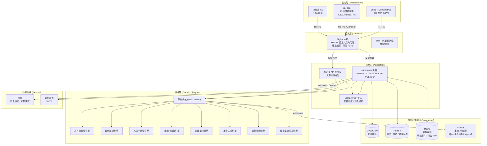
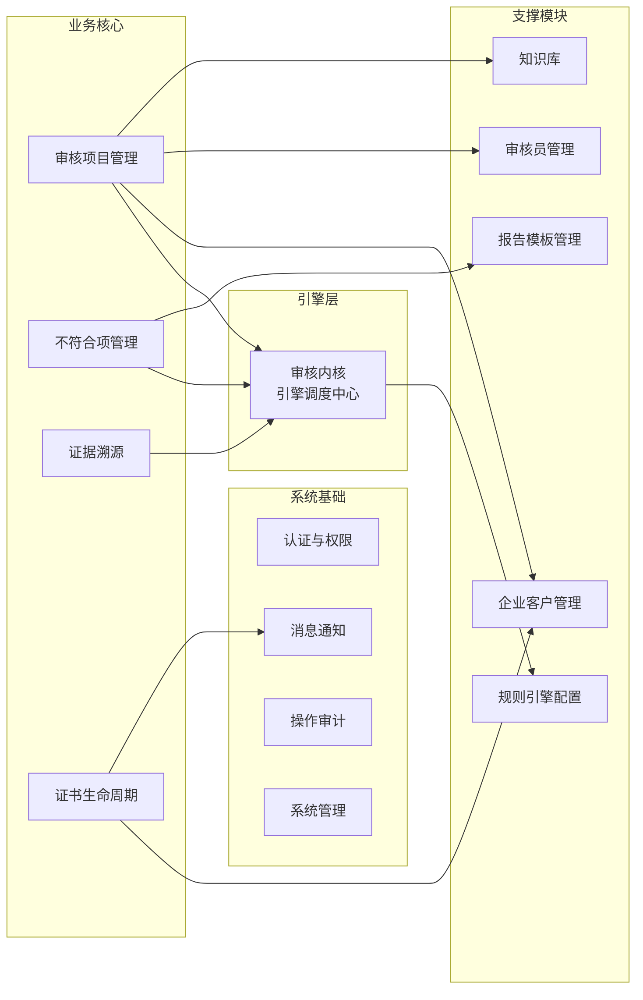
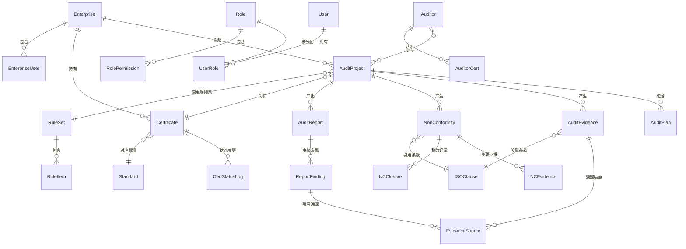
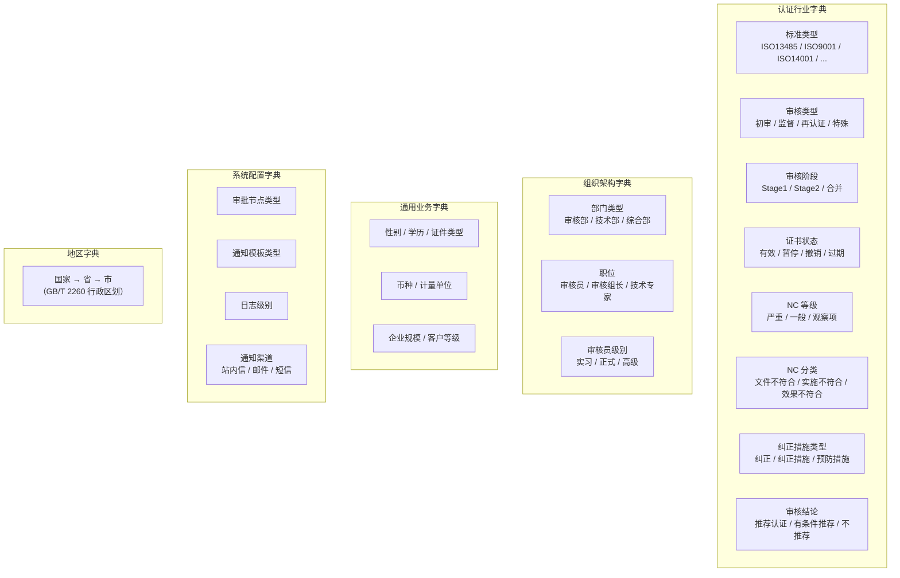
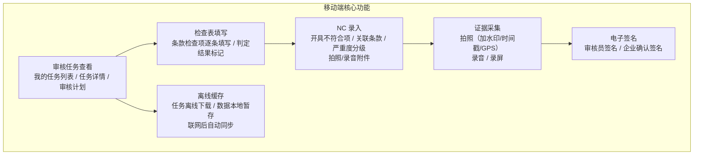
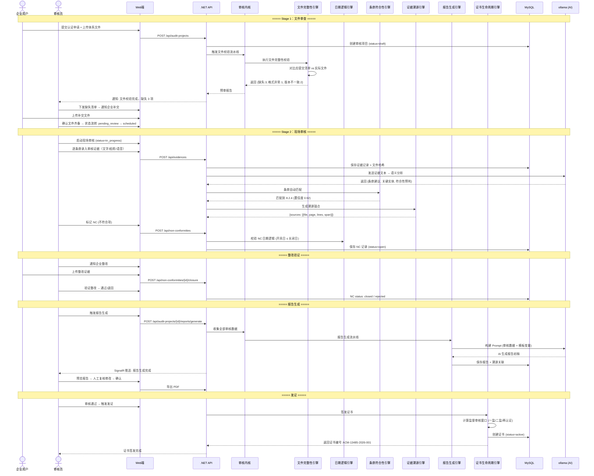
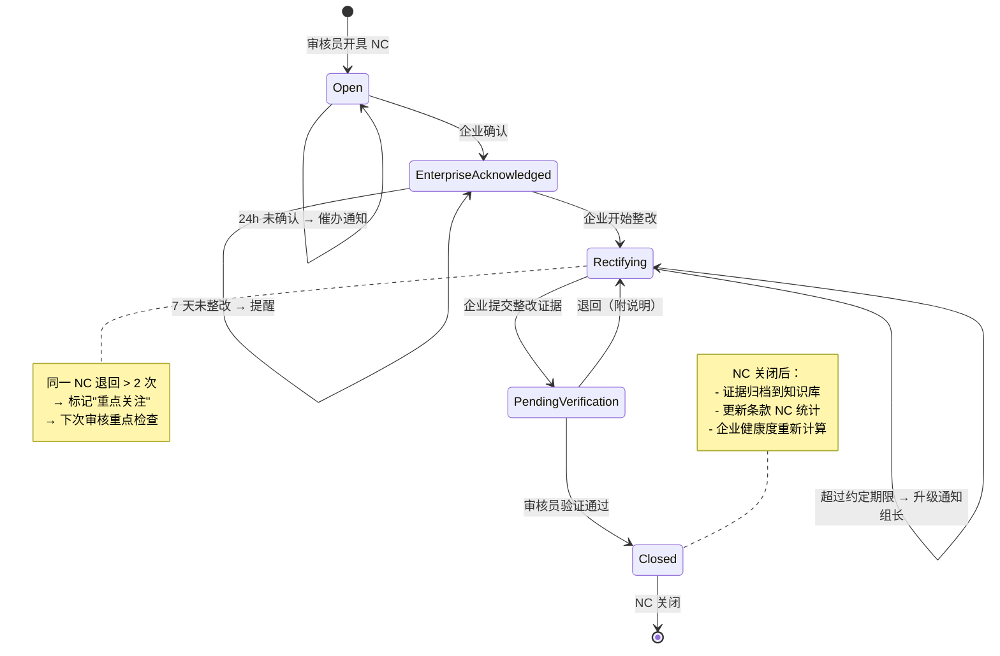
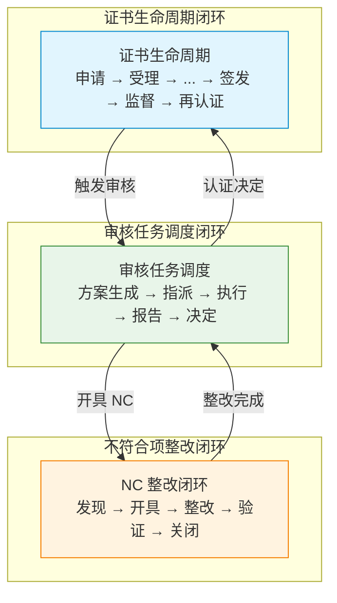

# 体系认证审核平台——总体设计

> **版本**：V1.1 | **日期**：2026-07-27 | **状态**：成熟态
>
> **前置文档**：05-技术架构设计与ACM分析 / 06-NETCore迁移与工作流移动端设计 / 16-服务器性能与架构深度技术评估 / 07-系统边界收敛与MVP精简 / 12-证据溯源与证书全生命周期管理 / 15-规模化架构升级与优先级矩阵
>
> **适用范围**：本文件为体系认证审核平台的总体设计文档，整合了架构决策、技术选型、数据模型、API 设计、部署方案和 Phase 0 开发清单，是后续所有模块开发的顶层依据。
>
> **变更记录**：
> | 版本 | 日期 | 变更说明 |
> |------|------|---------|
> | V1.0 | 2026-07-27 | 初版，覆盖 8 大模块 |
> | V1.1 | 2026-07-27 | 补充「数据字典体系」（第四章）、「移动端设计」（第七章）、「端到端业务流程闭环」（第十章）三个新章节；原有章节内容未改动，仅章节编号顺延调整 |

---

## 目录

1. [系统架构图](#一系统架构图)
2. [模块划分](#二模块划分)
3. [数据库 ER 图](#三数据库-er-图)
4. [数据字典体系](#四数据字典体系)
5. [API 设计总纲](#五api-设计总纲)
6. [前端路由设计](#六前端路由设计)
7. [移动端设计](#七移动端设计)
8. [部署架构](#八部署架构)
9. [数据流图](#九数据流图)
10. [端到端业务流程闭环](#十端到端业务流程闭环)
11. [Phase 0 开发清单](#十一phase-0-开发清单)

---

## 一、系统架构图

### 1.1 分层架构总览



### 1.2 各层职责与技术栈

| 层 | 职责 | 技术栈 | 说明 |
|----|------|--------|------|
| **前端层** | 用户交互、表单录入、数据展示、文件预览 | Vue3 + Element Plus + uni-app | Web 管理后台 + 移动端审核工具 |
| **网关层** | HTTPS 终止、反向代理、静态资源、限流、跨域 | Nginx 1.25 + ZeroTier | 仅暴露 443 端口，内部服务走 Docker 网络 |
| **应用层** | API 路由、认证鉴权、请求编排、实时推送 | ASP.NET Core 9 Minimal API + VOL 框架 + SignalR | 单体应用，无状态设计支持水平扩展 |
| **领域层** | 审核规则校验、AI 证据分析、报告生成、证书状态管理 | C# 规则引擎 + ollama HTTP Client | 九大引擎以内核模式统一调度，独立可测试 |
| **基础设施层** | 数据持久化、缓存、文件存储、AI 推理 | MySQL 8.0 + Redis 7 + MinIO + ollama | 单机部署，Docker Compose 编排 |
| **外部集成** | 消息推送、考勤对接 | 钉钉 Webhook + SMTP | 不重复造 OA 功能 |

### 1.3 数据流向

```
用户操作 → Nginx :443 → .NET API → 审核内核调度 → 规则引擎链
                                                    │
                                     ┌───────────────┼───────────────┐
                                     ▼               ▼               ▼
                                  MySQL           Redis           ollama
                                (持久化)      (缓存/队列)      (AI 推理)
                                     │                               │
                                     └─────────── 返回结果 ──────────┘
                                                      │
                                              SignalR 实时推送
                                              (进度/通知/状态变更)
```

---

## 二、模块划分

### 2.1 核心模块总览



### 2.2 模块职责与边界

| 编号 | 模块 | 职责 | 边界（属于） | 边界（不属于） |
|------|------|------|-------------|--------------|
| M01 | **审核项目管理** | 审核项目全生命周期：创建 → 排期 → 文件接收 → 证据录入 → 生成报告 → NC 管理 → 关闭归档 | 审核计划编制、检查表生成、审核进度看板、审核编号生成、条款覆盖率统计 | 考勤排班（钉钉）、出差审批（钉钉） |
| M02 | **审核内核（引擎调度）** | 九大引擎的统一调度入口：接收数据 → 流水线编排 → 分发到各引擎 → 汇总结果 → 回写 | 引擎注册/启停、流水线定义、引擎间数据传递、超时熔断 | 单个引擎的具体规则逻辑 |
| M03 | **文件完整性引擎** | 校验企业提交文件与应提交清单的匹配度 | 文件清单模板管理、缺失检测、编号格式校验、版本比对、断链检测 | 文件内容审核（条款符合性引擎） |
| M04 | **日期逻辑引擎** | 校验所有日期字段的逻辑一致性（≥12 条规则） | 批准≤生效、培训≤考核、内审<管理评审、NC 关闭≥开具、校准有效期检查 | 排期冲突检测（审核项目管理） |
| M05 | **人员一致性引擎** | 校验涉及人员的记录与企业主数据匹配（≥8 条规则） | 培训名单∈员工名册、内审员独立性、管代任命、资格证书有效期、职责分离 | 人员入职/离职管理（HR 系统） |
| M06 | **条款符合性引擎** | 审核证据 → NLP 解析 → 标准条款自动匹配 → 判定符合性 | 关键词提取、条款映射、置信度阈值、多条款关联 | 标准条款原文维护（知识库） |
| M07 | **数值指标引擎** | 质量目标 vs 实际达成值自动对比 | 目标量化检查、实际值提取、统计周期校验、阈值告警 | 企业 KPI 设定 |
| M08 | **报告生成引擎** | 审核数据 + 模板 → 自动填充 → 排版 → 导出 PDF/Word | 模板变量替换、页码目录生成、签章定位、双语输出 | 报告模板的格式设计（报告模板管理模块） |
| M09 | **证据溯源引擎** | AI 结论→溯源锚点（文件+页码+行号+高亮）→可点击验证 | sources JSON 生成、PDF 段落定位、OCR 近似行号、溯源面板 UI | 文件存储（MinIO） |
| M10 | **证书生命周期引擎** | 证书全状态管理：Active→Suspended→Withdrawn/Restored→Expired | 监督审核窗口计算、到期多级提醒、状态变更审批、证书 PDF 生成 | 审核结果判定（审核项目管理） |
| M11 | **企业客户管理** | 企业档案、认证范围、体系覆盖人数、客户等级、审核历史 | 基本信息 CRUD、认证生命周期视图、企业用户账号 | CRM 客户关系管理、销售漏斗 |
| M12 | **审核员管理** | 审核员花名册、资质证书、排班负载、绩效统计、培训记录 | CCAA 证书到期提醒、专业代码授权、工作量统计、培训记录 | 考勤打卡（钉钉）、薪资核算 |
| M13 | **规则引擎配置** | 规则的增删改查、启停、版本管理 | 规则列表管理、严重度设置、关键词映射表、规则测试沙箱 | 规则执行（审核内核） |
| M14 | **报告模板管理** | 按机构/类型的模板上传、编辑、变量管理 | 模板 CRUD、变量列表、预览渲染、机构 LOGO/水印 | 报告生成（报告生成引擎） |
| M15 | **知识库** | 企业历史档案检索、标准条款库、RAG 语义搜索 | 企业档案归档、全文搜索、标准条款树、NC 趋势分析 | 文档协同编辑 |
| M16 | **认证与权限** | 用户认证、RBAC 角色权限、数据权限隔离 | JWT 签发/刷新、角色-菜单绑定、分公司/审核组数据隔离、登录锁定 | 单点登录 SSO（Phase 3） |
| M17 | **消息通知** | 多通道通知：系统内+邮件+钉钉+短信 | 通知模板、定时触发、催办升级、免打扰时段 | 即时通讯 IM |
| M18 | **操作审计** | 全操作日志记录、敏感操作告警、不可删除 | 操作人/时间/对象/动作/IP、变更前后 diff、定期导出 | 安全事件响应 |
| M19 | **系统管理** | 数据字典、编号规则、备份策略、机构信息 | 字典维护、审核编号/NCN编号规则、自动备份周期、机构资质配置 | 服务器运维 |

### 2.3 模块依赖关系

```
                        ┌──────────────┐
                        │  M16 认证权限  │ ← 所有模块都依赖
                        └──────┬───────┘
                               │
        ┌──────────────────────┼──────────────────────┐
        ▼                      ▼                      ▼
┌──────────────┐     ┌──────────────┐      ┌──────────────┐
│ M01 审核项目  │────▶│ M02 审核内核   │      │ M11 企业客户  │
└──────┬───────┘     └──────┬───────┘      └──────────────┘
       │                    │
       │         ┌──────────┼──────────┬──────────┬──────────┐
       │         ▼          ▼          ▼          ▼          ▼
       │    M03 文件    M04 日期    M05 人员   M06 条款   M07 数值
       │    完整性      逻辑        一致性      符合性      指标
       │         │          │          │          │          │
       │         └──────────┴──────────┴──────────┴──────────┘
       │                         │
       │              ┌──────────┴──────────┐
       │              ▼                     ▼
       │        M09 证据溯源           M08 报告生成
       │              │                     │
       │              └──────────┬──────────┘
       │                         │
       ▼                         ▼
┌──────────────┐          ┌──────────────┐
│ M03 NC 管理   │          │ M10 证书生命  │
└──────────────┘          └──────────────┘
       │                         │
       └──────────┬──────────────┘
                  │
    ┌─────────────┼─────────────┐
    ▼             ▼             ▼
M17 通知      M18 审计       M15 知识库
```

---

## 三、数据库 ER 图

### 3.1 核心实体关系



### 3.2 核心实体结构描述

#### Enterprise（企业客户）

| 字段 | 类型 | 说明 |
|------|------|------|
| id | UUID PK | 雪花 ID |
| name | VARCHAR(200) | 企业全称 |
| short_name | VARCHAR(100) | 简称 |
| credit_code | VARCHAR(50) | 统一社会信用代码 |
| legal_person | VARCHAR(50) | 法人代表 |
| contact_name | VARCHAR(50) | 联系人 |
| contact_phone | VARCHAR(20) | 联系电话（加密） |
| address | TEXT | 注册地址 |
| cert_scope | TEXT | 认证范围描述 |
| employee_count | INT | 体系覆盖人数 |
| customer_level | ENUM | A/B/C 客户等级 |
| status | ENUM | active / inactive / blacklisted |
| branch_id | UUID FK | 所属分公司 |
| created_at / updated_at | TIMESTAMP | 审计字段 |

#### Standard（认证标准）

| 字段 | 类型 | 说明 |
|------|------|------|
| id | UUID PK | |
| code | VARCHAR(50) | 标准编号，如 ISO 13485:2016 |
| name | VARCHAR(200) | 标准名称 |
| category | VARCHAR(50) | QMS / EMS / OHSMS / MDMS |
| version | VARCHAR(20) | 版本号 |
| description | TEXT | 标准简介 |

#### AuditProject（审核项目）

| 字段 | 类型 | 说明 |
|------|------|------|
| id | UUID PK | |
| audit_no | VARCHAR(30) UNIQUE | 审核编号 ACM-13485-2026-001 |
| enterprise_id | UUID FK | 被审核企业 |
| audit_type | ENUM | initial_s1 / initial_s2 / surveillance_1 / surveillance_2 / recert / special / transfer |
| standard_id | UUID FK | 认证标准 |
| status | ENUM | draft→pending_review→scheduled→in_progress→pending_report→pending_nc_close→completed→archived |
| lead_auditor_id | UUID FK | 审核组长 |
| planned_date_from | DATE | 计划开始日期 |
| planned_date_to | DATE | 计划结束日期 |
| actual_date_from | DATE | 实际开始日期 |
| actual_date_to | DATE | 实际结束日期 |
| certificate_id | UUID FK NULL | 关联证书（监督/再认证） |
| rule_set_id | UUID FK | 使用的规则集 |
| created_at / updated_at | TIMESTAMP | |

#### NonConformity（不符合项）

| 字段 | 类型 | 说明 |
|------|------|------|
| id | UUID PK | |
| nc_no | VARCHAR(30) UNIQUE | NC 编号 |
| audit_project_id | UUID FK | 所属审核项目 |
| severity | ENUM | major / minor / observation |
| clause_id | UUID FK | 引用条款 |
| description | TEXT | NC 描述 |
| evidence_summary | TEXT | 证据摘要 |
| status | ENUM | open→enterprise_acknowledged→rectifying→pending_verification→closed / rejected |
| opened_by | UUID FK | 开具人 |
| opened_at | TIMESTAMP | 开具时间 |
| due_date | DATE | 整改截止日 |
| closed_by | UUID FK | 关闭人 |
| closed_at | TIMESTAMP | 关闭时间 |
| created_at / updated_at | TIMESTAMP | |

#### AuditEvidence（审核证据）

| 字段 | 类型 | 说明 |
|------|------|------|
| id | UUID PK | |
| audit_project_id | UUID FK | 所属审核项目 |
| clause_id | UUID FK | 关联条款 |
| evidence_type | ENUM | photo / voice / text / file |
| content_text | TEXT | 文字描述 |
| file_path | VARCHAR(500) | 附件路径（MinIO） |
| file_hash | VARCHAR(64) | SHA-256 哈希 |
| recorded_at | TIMESTAMP | 证据采集时间 |
| recorded_by | UUID FK | 采集人 |
| geo_location | VARCHAR(200) | GPS 坐标 |
| created_at / updated_at | TIMESTAMP | |

#### EvidenceSource（溯源锚点）

| 字段 | 类型 | 说明 |
|------|------|------|
| id | UUID PK | |
| evidence_id | UUID FK | 所属证据 |
| finding_id | UUID FK | 所属审核发现 |
| file_path | VARCHAR(500) | 源文件路径 |
| page_num | INT | 页码（近似） |
| line_start / line_end | INT | 行号范围 |
| text_span | TEXT | 原文摘录 |
| role | ENUM | primary / supporting / contrast |
| highlight_ranges | JSON | 高亮区间 |
| ai_reasoning | TEXT | AI 推断逻辑 |
| created_at | TIMESTAMP | |

#### Certificate（证书）

| 字段 | 类型 | 说明 |
|------|------|------|
| id | UUID PK | |
| cert_no | VARCHAR(50) UNIQUE | ACM-13485-2024-001 |
| enterprise_id | UUID FK | 获证企业 |
| standard_id | UUID FK | 认证标准 |
| cert_scope | TEXT | 认证范围 |
| accreditation | VARCHAR(20) | CNAS / UKAS / 无 |
| issue_date | DATE | 颁发日期 |
| expiry_date | DATE | 到期日（3 年） |
| cert_status | ENUM | active / suspended / withdrawn / restored / expired / scope_changed / transferred / cancelled |
| surveillance_1_due | DATE | 一监到期日 |
| surveillance_1_done | DATE | 一监完成日 |
| surveillance_2_due | DATE | 二监到期日 |
| surveillance_2_done | DATE | 二监完成日 |
| recert_due | DATE | 再认证到期日 |
| suspended_at / suspended_reason | — | 暂停信息 |
| restored_at | DATE | 恢复日期 |
| withdrawn_at / withdrawn_reason | — | 撤销信息 |
| initial_project_id | UUID FK | 初审项目 |
| created_at / updated_at | TIMESTAMP | |

#### Auditor（审核员）

| 字段 | 类型 | 说明 |
|------|------|------|
| id | UUID PK | 关联 User 表 |
| user_id | UUID FK | |
| employee_no | VARCHAR(30) | 工号 |
| professional_field | VARCHAR(200) | 专业领域 |
| level | ENUM | junior / senior / lead / expert |
| ccaa_cert_no | VARCHAR(50) | CCAA 注册证书号 |
| ccaa_expiry | DATE | CCAA 证书到期日 |
| specialty_codes | JSON | 专业代码授权列表 |
| status | ENUM | active / on_leave / resigned |
| max_audit_days_per_month | INT | 月最大审核天数 |
| branch_id | UUID FK | 所属分公司 |
| created_at / updated_at | TIMESTAMP | |

#### ISOClause（标准条款）

| 字段 | 类型 | 说明 |
|------|------|------|
| id | UUID PK | |
| standard_id | UUID FK | 所属标准 |
| clause_no | VARCHAR(20) | 条款号，如 8.2.4 |
| title | VARCHAR(200) | 条款标题 |
| parent_id | UUID FK NULL | 父条款 |
| level | INT | 层级深度 |
| content | TEXT | 条款原文 |
| keywords | VARCHAR(500) | 关键词（用于引擎匹配） |
| sort_order | INT | 排序号 |

#### User / Role / Permission（用户权限体系）

| 实体 | 关键字段 | 说明 |
|------|---------|------|
| User | id, username, password_hash, real_name, phone, email, status, branch_id, last_login_at | 框架自带，扩展 branch_id 实现数据权限 |
| Role | id, name, code, description | 超级管理员 / 审核组长 / 审核员 / 技术专家 / 企业管理员 |
| UserRole | user_id, role_id | 多对多 |
| Permission | id, menu_id, action_code | 菜单+按钮级权限 |


---

## 四、数据字典体系

VOL 框架内置了字典管理功能，对应数据库表 `Sys_Dictionary`（字典分类）和 `Sys_DictionaryList`（字典项明细）。平台字典体系在此基础上扩展，按业务域划分为五大类。

### 4.1 字典分类设计



### 4.2 关键字典项及候选值

#### 4.2.1 认证行业字典

| 字典编号 | 字典名称 | 字典项 | 值 | 说明 |
|---------|---------|-------|-----|------|
| `cert_standard` | 标准类型 | ISO 13485:2016 | 1 | 医疗器械质量管理体系 |
| | | ISO 9001:2015 | 2 | 质量管理体系 |
| | | ISO 14001:2015 | 3 | 环境管理体系 |
| | | ISO 45001:2018 | 4 | 职业健康安全 |
| `cert_audit_type` | 审核类型 | 初审 | 10 | 首次认证审核 |
| | | 监督审核 | 20 | 年度监督审核 |
| | | 再认证 | 30 | 证书到期前再认证 |
| | | 特殊审核 | 40 | 扩项/变更/飞行检查 |
| `cert_audit_stage` | 审核阶段 | Stage 1 | 1 | 第一阶段文件审核 |
| | | Stage 2 | 2 | 第二阶段现场审核 |
| | | 合并审核 | 3 | Stage 1+2 合并执行 |
| `cert_status` | 证书状态 | 有效 | 1 | 证书有效期内 |
| | | 暂停 | 2 | 暂停使用 |
| | | 撤销 | 3 | 证书撤销 |
| | | 过期 | 4 | 证书到期未再认证 |
| `nc_level` | NC 等级 | 严重不符合 | 1 | |
| | | 一般不符合 | 2 | |
| | | 观察项 | 3 | |
| `nc_category` | NC 分类 | 文件不符合 | 1 | 体系文件与标准不一致 |
| | | 实施不符合 | 2 | 实际运作与文件规定不一致 |
| | | 效果不符合 | 3 | 运作未达到预期效果 |
| `corrective_type` | 纠正措施类型 | 纠正 | 1 | 消除已发现的不符合 |
| | | 纠正措施 | 2 | 消除不符合的原因 |
| | | 预防措施 | 3 | 消除潜在不符合的原因 |
| `audit_conclusion` | 审核结论 | 推荐认证 | 1 | |
| | | 有条件推荐 | 2 | 需关闭 NC 后推荐 |
| | | 不推荐 | 3 | |

#### 4.2.2 组织架构字典

| 字典编号 | 字典名称 | 字典项 | 值 | 说明 |
|---------|---------|-------|-----|------|
| `org_dept_type` | 部门类型 | 审核部 | 1 | |
| | | 技术评审部 | 2 | |
| | | 综合管理部 | 3 | |
| `org_position` | 职位 | 审核员 | 10 | |
| | | 审核组长 | 20 | |
| | | 技术专家 | 30 | |
| | | 认证决定人 | 40 | |
| | | 系统管理员 | 50 | |
| `auditor_level` | 审核员级别 | 实习审核员 | 1 | |
| | | 正式审核员 | 2 | |
| | | 高级审核员 | 3 | |

#### 4.2.3 通用业务字典

| 字典编号 | 字典名称 | 字典项 | 值 | 说明 |
|---------|---------|-------|-----|------|
| `gender` | 性别 | 男 | 1 | |
| | | 女 | 2 | |
| `education` | 学历 | 博士 | 1 | |
| | | 硕士 | 2 | |
| | | 本科 | 3 | |
| | | 大专 | 4 | |
| | | 高中及以下 | 5 | |
| `id_type` | 证件类型 | 身份证 | 1 | |
| | | 护照 | 2 | |
| | | 港澳通行证 | 3 | |
| `currency` | 币种 | CNY | 1 | 人民币 |
| | | USD | 2 | 美元 |
| | | EUR | 3 | 欧元 |
| `unit` | 计量单位 | 台 | 1 | |
| | | 件 | 2 | |
| | | kg | 3 | |
| | | 人日 | 4 | 审核人日 |
| `enterprise_scale` | 企业规模 | 小型（<100人） | 1 | |
| | | 中型（100-500人） | 2 | |
| | | 大型（>500人） | 3 | |
| `customer_level` | 客户等级 | A 级 | 1 | 优质客户 |
| | | B 级 | 2 | 普通客户 |
| | | C 级 | 3 | 需关注客户 |

#### 4.2.4 系统配置字典

| 字典编号 | 字典名称 | 字典项 | 值 | 说明 |
|---------|---------|-------|-----|------|
| `approval_node` | 审批节点类型 | 审核组长审批 | 1 | |
| | | 技术评审 | 2 | |
| | | 认证决定 | 3 | |
| `notify_template` | 通知模板类型 | NC 整改提醒 | 1 | |
| | | 证书到期提醒 | 2 | |
| | | 材料催交通知 | 3 | |
| | | 审核排期确认 | 4 | |
| `log_level` | 日志级别 | DEBUG | 1 | |
| | | INFO | 2 | |
| | | WARN | 3 | |
| | | ERROR | 4 | |
| `notify_channel` | 通知渠道 | 站内信 | 1 | |
| | | 邮件 | 2 | |
| | | 短信 | 3 | |

#### 4.2.5 地区字典

地区字典采用国家标准化 GB/T 2260 行政区划代码，按层级存储：

| 字典编号 | 字典名称 | 层级 | 示例 | 
|---------|---------|------|------|
| `region_country` | 国家 | 1 | 中国（CN） |
| `region_province` | 省/直辖市 | 2 | 广东省（440000） / 北京市（110000） |
| `region_city` | 市/区 | 3 | 深圳市（440300） / 朝阳区（110105） |

地区字典通过 `parent_id` 字段建立层级关系，前端使用级联选择器（Cascader）展示。

### 4.3 字典表结构说明

基于 VOL 框架内置表结构：

**Sys_Dictionary（字典分类表）**

| 字段 | 类型 | 说明 |
|------|------|------|
| `Dic_ID` | int | 主键，自增 |
| `DicNo` | varchar(100) | 字典编号，如 `cert_standard`，唯一索引 |
| `DicName` | varchar(100) | 字典名称，如「标准类型」 |
| `Config` | text | JSON 扩展配置（如前端控件类型、排序规则） |
| `DbSql` | varchar(500) | 当字典项来自数据库查询时的 SQL（预留） |
| `DBServer` | varchar(500) | 数据库连接字符串标识（预留） |
| `ParentId` | int | 上级字典 ID，用于级联字典（如地区三级联动） |
| `OrderNo` | int | 排序号 |
| `Enable` | tinyint | 是否启用（0=禁用，1=启用） |

**Sys_DictionaryList（字典项明细表）**

| 字段 | 类型 | 说明 |
|------|------|------|
| `DicList_ID` | int | 主键，自增 |
| `Dic_ID` | int | 外键，关联 Sys_Dictionary.Dic_ID |
| `DicValue` | varchar(100) | 字典项值（存储值，如 `1`） |
| `DicName` | varchar(100) | 字典项显示名（如「ISO 13485:2016」） |
| `OrderNo` | int | 排序号 |
| `Enable` | tinyint | 是否启用 |

### 4.4 字典使用规范

**前端展示规则**：

| 场景 | 控件 | 说明 |
|------|------|------|
| 字典项 ≤ 3 个 | Radio（单选按钮组） | 选项少时直接暴露，降低操作步数 |
| 字典项 4-10 个 | Select（下拉单选） | 选项适中，下拉选择 |
| 字典项 > 10 个 | Select + 搜索 | 选项多时支持输入搜索过滤 |
| 多选场景 | Select Multiple / Checkbox | 如企业具备多个认证标准 |
| 级联字典 | Cascader | 如地区选择（省 → 市） |
| 表格列展示 | 自动翻译 | 通过 VOL 代码生成器绑定字典编号，自动将值翻译为显示名 |

**后端校验规则**：

1. **值域校验**：保存实体时校验字典字段的值是否在 `Sys_DictionaryList.DicValue` 范围内，不在则拒绝并返回错误码 `DICT_VALUE_INVALID`
2. **级联校验**：对于级联字典（如地区），校验下级值必须属于所选上级
3. **缓存策略**：字典数据写入 Redis（key：`dict:{DicNo}`），变更时主动失效。前端首次加载后缓存，减少重复请求
4. **禁止硬编码**：代码中严禁出现"if type==1"等魔法值，统一使用字典编号 + 值常量引用
5. **删除约束**：字典项只能做禁用（`Enable=0`），不可物理删除，确保历史数据可翻译


## 五、API 设计总纲

### 4.1 RESTful 资源定义

| 资源 | 根路径 | 说明 |
|------|--------|------|
| 审核项目 | `/api/audit-projects` | 审核项目全生命周期 |
| 企业客户 | `/api/enterprises` | 企业档案管理 |
| 审核员 | `/api/auditors` | 审核员花名册 |
| 不符合项 | `/api/non-conformities` | NC 管理 |
| 审核证据 | `/api/evidences` | 证据采集与溯源 |
| 证书 | `/api/certificates` | 证书生命周期 |
| 标准条款 | `/api/standards/{id}/clauses` | 条款查询 |
| 规则引擎 | `/api/rules` | 规则配置与测试 |
| 报告模板 | `/api/report-templates` | 模板管理 |
| 审核报告 | `/api/audit-projects/{id}/reports` | 报告生成与导出 |
| 文件管理 | `/api/files` | 上传/下载/预览 |
| 知识库 | `/api/knowledge-base` | 全文检索 |
| 消息通知 | `/api/notifications` | 消息中心 |
| 系统管理 | `/api/system` | 字典/配置/日志 |

### 4.2 主要端点列表（按模块分组）

#### 审核项目管理

| 方法 | 端点 | 说明 | 权限 |
|------|------|------|------|
| `GET` | `/api/audit-projects` | 分页查询审核项目列表 | 审核员+ |
| `POST` | `/api/audit-projects` | 创建审核项目 | 审核组长+ |
| `GET` | `/api/audit-projects/{id}` | 审核项目详情 | 参与审核员 |
| `PUT` | `/api/audit-projects/{id}` | 更新审核项目 | 审核组长 |
| `PATCH` | `/api/audit-projects/{id}/status` | 状态流转 | 审核组长 |
| `POST` | `/api/audit-projects/{id}/schedule` | 排期设置 + 冲突检测 | 审核组长 |
| `GET` | `/api/audit-projects/{id}/progress` | 条款覆盖率看板 | 参与审核员 |
| `POST` | `/api/audit-projects/{id}/submit-files` | 企业提交文件 | 企业用户 |
| `GET` | `/api/audit-projects/{id}/checklist` | 审核检查表 | 参与审核员 |

#### 证据与 NC 管理

| 方法 | 端点 | 说明 | 权限 |
|------|------|------|------|
| `POST` | `/api/audit-projects/{id}/evidences` | 录入审核证据 | 审核员 |
| `GET` | `/api/evidences/{id}/sources` | 证据溯源锚点 | 审核员+ |
| `POST` | `/api/audit-projects/{id}/non-conformities` | 开具 NC | 审核员 |
| `GET` | `/api/non-conformities/{id}` | NC 详情 | 参与审核员 |
| `PATCH` | `/api/non-conformities/{id}/status` | NC 状态流转 | 审核员/企业 |
| `POST` | `/api/non-conformities/{id}/closure` | 整改证据提交 | 企业用户 |
| `POST` | `/api/non-conformities/{id}/verify` | 验证通过/退回 | 审核员 |

#### 规则引擎

| 方法 | 端点 | 说明 | 权限 |
|------|------|------|------|
| `GET` | `/api/rules` | 规则列表 | 管理员+ |
| `POST` | `/api/rules` | 新增规则 | 管理员 |
| `PUT` | `/api/rules/{id}` | 编辑规则 | 管理员 |
| `PATCH` | `/api/rules/{id}/toggle` | 启用/禁用 | 管理员 |
| `POST` | `/api/rules/test` | 规则沙箱测试 | 管理员 |
| `POST` | `/api/audit-projects/{id}/validate` | 对指定项目执行全引擎校验 | 审核员 |

#### 报告

| 方法 | 端点 | 说明 | 权限 |
|------|------|------|------|
| `POST` | `/api/audit-projects/{id}/reports/generate` | 异步生成报告（返回任务 ID） | 审核组长 |
| `GET` | `/api/reports/{taskId}/status` | 查询生成进度 | 审核员+ |
| `GET` | `/api/audit-projects/{id}/reports/preview` | 报告在线预览 | 审核员+ |
| `GET` | `/api/audit-projects/{id}/reports/export` | 导出 PDF/Word | 审核员+ |

#### 证书管理

| 方法 | 端点 | 说明 | 权限 |
|------|------|------|------|
| `GET` | `/api/certificates` | 证书列表（支持状态/到期筛选） | 管理员+ |
| `POST` | `/api/certificates` | 签发证书 | 管理员 |
| `PATCH` | `/api/certificates/{id}/status` | 状态变更（暂停/恢复/撤销） | 管理员 |
| `GET` | `/api/certificates/dashboard` | 证书生命周期看板 | 管理员+ |
| `GET` | `/api/certificates/expiring` | 到期提醒列表 | 管理员+ |

### 4.3 统一请求/响应格式

**请求格式**：

```
POST /api/audit-projects
Content-Type: application/json
Authorization: Bearer {jwt_token}

{
  "enterprise_id": "...",
  "audit_type": "initial_s1",
  "standard_id": "...",
  "lead_auditor_id": "...",
  ...
}
```

**成功响应**：

```json
{
  "success": true,
  "code": 200,
  "message": "操作成功",
  "data": { ... },
  "timestamp": "2026-07-27T10:30:00Z"
}
```

**列表响应**（分页）：

```json
{
  "success": true,
  "code": 200,
  "data": {
    "items": [ ... ],
    "total": 327,
    "page": 1,
    "page_size": 20,
    "total_pages": 17
  }
}
```

**错误响应**：

```json
{
  "success": false,
  "code": 40001,
  "message": "审核员 {name} 在 {date} 已有排期冲突",
  "details": {
    "conflict_project_id": "...",
    "conflict_date": "2026-07-15"
  },
  "timestamp": "2026-07-27T10:30:00Z"
}
```

### 4.4 分页、错误码、认证

**分页**：

| 参数 | 类型 | 默认值 | 说明 |
|------|------|--------|------|
| `page` | int | 1 | 页码，从 1 开始 |
| `page_size` | int | 20 | 每页条数，最大 100 |
| `sort_by` | string | "created_at" | 排序字段 |
| `sort_dir` | enum | "desc" | asc / desc |

**错误码规范**：

| 范围 | 分类 | 示例 |
|------|------|------|
| 40000-40099 | 参数校验错误 | 40001: 必填字段缺失 |
| 40100-40199 | 认证错误 | 40101: Token 过期 |
| 40300-40399 | 权限错误 | 40301: 无此操作权限 |
| 40400-40499 | 资源不存在 | 40401: 审核项目不存在 |
| 40900-40999 | 业务冲突 | 40901: 排期冲突 |
| 42200-42299 | 业务校验失败 | 42201: NC 状态不允许此操作 |
| 50000-50099 | 服务器内部错误 | 50001: AI 引擎超时 |

**认证方式**：

- JWT Bearer Token（VOL 框架自带）
- Access Token 有效期：2 小时
- Refresh Token 有效期：7 天
- 登录失败 5 次锁定 15 分钟
- API 签名 + 时间戳防重放（敏感操作）

---

## 六、前端路由设计

### 5.1 页面路由树

```mermaid
graph TD
    Root["/"] --> Login["/login<br/>登录页 (公开)"]
    Root --> Dashboard["/dashboard<br/>工作台 (所有角色)"]
    
    Root --> Audit["/audit<br/>审核管理"]
    Audit --> AuditList["/audit/projects<br/>审核项目列表"]
    Audit --> AuditCreate["/audit/projects/create<br/>创建审核项目"]
    Audit --> AuditDetail["/audit/projects/:id<br/>审核项目详情"]
    AuditDetail --> AuditEvidence["/audit/projects/:id/evidences<br/>证据录入"]
    AuditDetail --> AuditChecklist["/audit/projects/:id/checklist<br/>审核检查表"]
    AuditDetail --> AuditNC["/audit/projects/:id/nc<br/>不符合项管理"]
    AuditDetail --> AuditReport["/audit/projects/:id/report<br/>报告预览与导出"]
    
    Root --> Enterprise["/enterprise<br/>企业管理"]
    Enterprise --> EntList["/enterprise/list<br/>企业列表"]
    Enterprise --> EntDetail["/enterprise/:id<br/>企业详情"]
    Enterprise --> EntCert["/enterprise/:id/certificates<br/>企业证书"]
    
    Root --> Cert["/certificates<br/>证书管理"]
    Cert --> CertList["/certificates/list<br/>证书列表"]
    Cert --> CertDetail["/certificates/:id<br/>证书详情"]
    Cert --> CertDashboard["/certificates/dashboard<br/>证书看板"]
    
    Root --> Auditor["/auditors<br/>审核员管理"]
    Auditor --> AudList["/auditors/list<br/>审核员花名册"]
    Auditor --> AudDetail["/auditors/:id<br/>审核员详情"]
    Auditor --> AudSchedule["/auditors/schedule<br/>排班日历"]
    
    Root --> Rules["/rules<br/>规则引擎"]
    Rules --> RuleList["/rules/list<br/>规则列表"]
    Rules --> RuleTest["/rules/test<br/>规则沙箱"]
    
    Root --> Templates["/templates<br/>报告模板"]
    Templates --> TplList["/templates/list<br/>模板库"]
    Templates --> TplEdit["/templates/:id<br/>模板编辑"]
    
    Root --> KB["/knowledge<br/>知识库"]
    KB --> KBSearch["/knowledge/search<br/>全文检索"]
    KB --> KBStandards["/knowledge/standards<br/>标准条款库"]
    
    Root --> System["/system<br/>系统管理"]
    System --> SysUsers["/system/users<br/>用户管理"]
    System --> SysRoles["/system/roles<br/>角色权限"]
    System --> SysDict["/system/dict<br/>数据字典"]
    System --> SysLog["/system/logs<br/>操作日志"]
    System --> SysConfig["/system/config<br/>系统配置"]
    
    Root --> Notifications["/notifications<br/>消息中心"]
```



### 5.2 路由权限矩阵

| 路由 | 超级管理员 | 审核组长 | 审核员 | 企业管理员 |
|------|:---:|:---:|:---:|:---:|
| `/dashboard` | R | R | R | R |
| `/audit/projects` | R/W/D | R/W/D | R | - |
| `/audit/projects/create` | W | W | - | - |
| `/audit/projects/:id` | R/W | R/W | R/W(本人) | R(本企业) |
| `/enterprise/*` | R/W/D | R/W | R | R(本企业) |
| `/certificates/*` | R/W | R/W | R | - |
| `/auditors/*` | R/W/D | R/W(本组) | R(本人) | - |
| `/rules/*` | R/W | R/W | - | - |
| `/templates/*` | R/W | R/W | - | - |
| `/knowledge/*` | R | R | R | - |
| `/system/*` | R/W | - | - | - |
| `/notifications` | R/W | R/W | R/W | R/W |

> R=查看 W=创建/编辑 D=删除 "—"=无权限 "本人"=仅本人数据 "本组"=仅本审核组

### 5.3 页面与后端 API 对应关系

| 前端页面 | 主要 API 端点 |
|---------|-------------|
| 审核项目列表 | `GET /api/audit-projects` |
| 创建审核项目 | `POST /api/audit-projects` |
| 审核项目详情 | `GET /api/audit-projects/{id}` |
| 证据录入 | `POST /api/audit-projects/{id}/evidences` |
| 审核检查表 | `GET /api/audit-projects/{id}/checklist` |
| NC 管理 | `GET/POST /api/non-conformities` |
| 报告预览 | `GET /api/audit-projects/{id}/reports/preview` |
| 证书列表 | `GET /api/certificates` |
| 证书看板 | `GET /api/certificates/dashboard` |
| 审核员排班 | `GET /api/auditors/schedule` |
| 规则配置 | `GET/POST /api/rules` |
| 规则沙箱 | `POST /api/rules/test` |
| 知识库搜索 | `GET /api/knowledge-base/search` |


---

## 七、移动端设计

### 7.1 移动端定位

移动端定位为**现场审核人员的轻量操作终端**，非全功能端。设计原则：

| 原则 | 说明 |
|------|------|
| **聚焦现场操作** | 不做复杂配置、不做统计分析、不做管理后台功能，只做现场审核过程中实际需要的操作 |
| **弱网可用** | 工厂车间、偏远厂区网络不稳定，必须支持离线操作 + 联网后自动同步 |
| **证据可信** | 拍照、录音等证据采集必须防篡改、可追溯，满足认证认可机构的取证要求 |

### 7.2 核心功能



| 功能 | 描述 | 优先级 |
|------|------|--------|
| 审核任务列表 | 按状态筛选（待审核 / 进行中 / 已完成），显示任务概要 | P0 |
| 任务详情 | 查看审核计划、企业信息、审核组成员 | P0 |
| 检查表填写 | 按条款逐条审核，标记符合/不符合/不适用 | P0 |
| NC 录入 | 现场开具不符合项，关联条款，填写描述 | P0 |
| 拍照取证 | 调用相机拍照，自动加水印（时间戳 + GPS + 审核员），上传至证据库 | P0 |
| 录音取证 | 录音文件上传，关联审核任务 | P1 |
| 电子签名 | 手写签名板，生成签名图片嵌入报告 | P1 |
| 离线模式 | 无网络时本地 SQLite 暂存，联网后自动上传 | P0 |
| 标准查阅 | 离线缓存常用标准条款原文，现场备查 | P1 |
| 审核报告预览 | 审核组长移动端预览报告草稿 | P2 |

### 7.3 技术栈

| 层 | 技术 | 说明 |
|----|------|------|
| 框架 | **uni-app** (Vue3) | 基于已有 VOL 移动端框架经验，一套代码编译 iOS / Android / H5 |
| UI 组件 | uView UI 3.0 | uni-app 生态首选组件库，适配移动端交互 |
| 本地存储 | SQLite（uni-app 内置） | 离线数据缓存，任务/检查表/NC 草稿本地暂存 |
| 拍照 | uni-app Camera API | 调用原生相机，支持水印叠加 |
| 签名 | Canvas 2D | 手写签名板，导出 PNG |
| 文件上传 | uni.uploadFile + 分片 | 大文件断点续传，支持后台上传 |
| 推送 | uni-push 2.0 | 新任务到达推送通知 |
| 网络状态 | uni.getNetworkType | 实时监测网络状态，切换在线/离线模式 |

### 7.4 PC 端与移动端功能矩阵对比

| 功能模块 | PC 管理端 | 移动端（审核员） | 说明 |
|---------|----------|----------------|------|
| **机构管理** | 完整 CRUD | — | 移动端不需要 |
| **审核员管理** | 花名册 / 排班 / 绩效 | 个人日历查看 | 移动端仅查看自己排期 |
| **企业客户管理** | 档案 / 生命周期 / 历史 | — | 移动端不需要 |
| **审核项目管理** | 创建 / 指派 / 看板 / 归档 | 任务列表 / 检查表填写 / NC 录入 / 证据采集 | PC 管理 + 移动执行 |
| **规则引擎配置** | 完整配置 | — | 移动端不需要 |
| **报告模板** | 模板管理 / 编辑器 | — | 移动端不需要 |
| **知识库** | 全文检索 / 图谱 | 标准离线查阅 | 移动端仅查阅 |
| **统计分析** | Dashboard / 报表 | — | 移动端不需要 |
| **NC 整改** | 全流程管理 | 验证关闭 | 移动端验证整改证据 |
| **证据管理** | 归档 / 检索 / 审计 | 拍照 / 录音上传 | 移动采集 → PC 管理 |
| **电子签名** | 查看 | 手写签名 | 现场签名 |
| **消息通知** | 全部 | 任务推送 | 仅任务相关 |

### 7.5 移动端特有设计

#### 7.5.1 离线模式

```
┌─────────────────────────────────────────────────────┐
│                    离线模式流程                        │
├─────────────────────────────────────────────────────┤
│                                                     │
│  [在线] ──→ 下载任务到本地 SQLite ──→ 进入厂区/无网   │
│                                                     │
│  [离线] ──→ 填写检查表 ──→ 拍摄证据 ──→ 本地暂存     │
│                                                     │
│  [恢复在线] ──→ 自动检测 ──→ 比对服务端版本           │
│                                                     │
│         ┌──────────────────────────────┐             │
│         │  版本冲突？                    │             │
│         ├── 无冲突 → 静默上传            │             │
│         └── 有冲突 → 提示用户选择        │             │
│              ├─ 保留本地版本             │             │
│              └─ 使用服务端版本           │             │
└─────────────────────────────────────────────────────┘
```

#### 7.5.2 断点续传

- 大文件（照片/录音）使用分片上传，默认分片大小 1MB
- 上传中断后自动从断点继续，不重传已完成分片
- 后台上传队列，不阻塞用户操作
- 上传状态指示：待上传 / 上传中 / 已完成 / 失败（可重试）

#### 7.5.3 拍照防篡改

| 措施 | 实现方式 |
|------|---------|
| **禁止相册选取** | 证据照片强制调用系统相机实时拍摄，不允许从相册选择已有图片 |
| **水印叠加** | 拍摄后自动在照片上叠加水印，含：审核员姓名、拍摄时间（精确到秒）、GPS 经纬度、审核任务编号 |
| **哈希存证** | 照片上传后计算 SHA-256 哈希值，记录到证据溯源表，后续任何篡改可检测 |
| **EXIF 校验** | 服务端接受照片时校验 EXIF 信息完整性（拍摄时间、GPS、设备型号），缺失或异常则标记为「可疑证据」 |

### 7.6 移动端路由简表

| 路由 | 页面名称 | 说明 |
|------|---------|------|
| `/pages/login/index` | 登录 | 账号密码 + 记住密码 |
| `/pages/task/list` | 审核任务列表 | 按状态 Tab 切换 |
| `/pages/task/detail` | 任务详情 | 审核计划 / 企业信息 / 审核组成员 |
| `/pages/checklist/index` | 检查表 | 条款列表 + 逐条填写 |
| `/pages/checklist/item` | 检查项详情 | 判定结果 / 备注 / 证据关联 |
| `/pages/nc/create` | 开具 NC | 关联条款 / 级别 / 描述 / 附件 |
| `/pages/nc/list` | NC 列表 | 本任务所有 NC 汇总 |
| `/pages/evidence/camera` | 拍照取证 | 相机界面 + 水印叠加 |
| `/pages/evidence/record` | 录音取证 | 录音界面 |
| `/pages/evidence/list` | 证据列表 | 本任务所有证据 |
| `/pages/signature/index` | 电子签名 | Canvas 手写板 |
| `/pages/standard/index` | 标准查阅 | 离线缓存的标准条款 |
| `/pages/mine/index` | 我的 | 个人信息 / 设置 / 离线同步状态 |


## 八、部署架构

### 6.1 Docker Compose 服务编排

基于 VOL (Vue.NetCore) 框架，采用 Docker Compose 单机编排：

```yaml
version: '3.8'
services:
  # ============ 网关层 ============
  nginx:
    image: nginx:1.25-alpine
    container_name: audit-nginx
    ports:
      - "443:443"
    volumes:
      - ./nginx/nginx.conf:/etc/nginx/nginx.conf
      - ./nginx/ssl:/etc/nginx/ssl
      - ./wwwroot:/usr/share/nginx/html
    depends_on:
      - api
    restart: always
    networks:
      - audit-net

  # ============ 应用层 ============
  api:
    image: audit-platform:latest
    container_name: audit-api
    build:
      context: .
      dockerfile: Dockerfile
    environment:
      - ASPNETCORE_ENVIRONMENT=Production
      - ConnectionStrings__Default=Server=mysql;Port=3306;Database=audit_platform;User=root;Password=${DB_PASSWORD}
      - Redis__ConnectionString=redis:6379
      - MinIO__Endpoint=minio:9000
      - Ollama__Endpoint=http://ollama:11434
    volumes:
      - ./logs:/app/logs
    depends_on:
      mysql:
        condition: service_healthy
      redis:
        condition: service_started
    restart: always
    networks:
      - audit-net
    deploy:
      replicas: 2  # 双实例

  # ============ 数据层 ============
  mysql:
    image: mysql:8.0
    container_name: audit-mysql
    environment:
      MYSQL_ROOT_PASSWORD: ${DB_PASSWORD}
      MYSQL_DATABASE: audit_platform
      MYSQL_CHARACTER_SET_SERVER: utf8mb4
      MYSQL_COLLATION_SERVER: utf8mb4_unicode_ci
    volumes:
      - mysql-data:/var/lib/mysql
      - ./mysql/conf.d:/etc/mysql/conf.d
      - ./mysql/backup:/backup
    healthcheck:
      test: ["CMD", "mysqladmin", "ping", "-h", "localhost"]
      interval: 10s
      timeout: 5s
      retries: 5
    restart: always
    networks:
      - audit-net

  redis:
    image: redis:7-alpine
    container_name: audit-redis
    command: redis-server --appendonly yes --maxmemory 512mb --maxmemory-policy allkeys-lru
    volumes:
      - redis-data:/data
    restart: always
    networks:
      - audit-net

  # ============ 存储层 ============
  minio:
    image: minio/minio:latest
    container_name: audit-minio
    command: server /data --console-address ":9001"
    environment:
      MINIO_ROOT_USER: ${MINIO_USER}
      MINIO_ROOT_PASSWORD: ${MINIO_PASSWORD}
    volumes:
      - minio-data:/data
    restart: always
    networks:
      - audit-net

  # ============ AI 推理层 ============
  ollama:
    image: ollama/ollama:latest
    container_name: audit-ollama
    volumes:
      - ollama-models:/root/.ollama
    environment:
      - OLLAMA_HOST=0.0.0.0:11434
    restart: always
    networks:
      - audit-net
    deploy:
      resources:
        reservations:
          devices:
            - driver: nvidia
              count: 1
              capabilities: [gpu]

volumes:
  mysql-data:
  redis-data:
  minio-data:
  ollama-models:

networks:
  audit-net:
    driver: bridge
```

### 6.2 Nginx 反向代理配置

```nginx
upstream api_backend {
    # 双实例负载均衡
    server api:80 weight=1 max_fails=3 fail_timeout=30s;
}

server {
    listen 443 ssl http2;
    server_name audit.acm-cert.com;

    ssl_certificate     /etc/nginx/ssl/fullchain.pem;
    ssl_certificate_key /etc/nginx/ssl/privkey.pem;
    ssl_protocols TLSv1.2 TLSv1.3;
    ssl_ciphers HIGH:!aNULL:!MD5;

    # 静态资源（Vue 前端）
    location / {
        root /usr/share/nginx/html;
        try_files $uri $uri/ /index.html;

        # 静态资源缓存
        location ~* \.(js|css|png|jpg|jpeg|gif|ico|svg|woff|woff2)$ {
            expires 30d;
            add_header Cache-Control "public, immutable";
        }
    }

    # API 反向代理
    location /api/ {
        proxy_pass http://api_backend;
        proxy_set_header Host $host;
        proxy_set_header X-Real-IP $remote_addr;
        proxy_set_header X-Forwarded-For $proxy_add_x_forwarded_for;
        proxy_set_header X-Forwarded-Proto $scheme;

        # 超时设置（AI 报告生成较慢）
        proxy_read_timeout 120s;
        proxy_connect_timeout 10s;

        # 限流
        limit_req zone=api_limit burst=20 nodelay;
    }

    # SignalR WebSocket
    location /hubs/ {
        proxy_pass http://api_backend;
        proxy_http_version 1.1;
        proxy_set_header Upgrade $http_upgrade;
        proxy_set_header Connection "upgrade";
        proxy_set_header Host $host;
        proxy_read_timeout 86400s;
    }

    # MinIO 文件访问
    location /files/ {
        proxy_pass http://minio:9000/;
        proxy_set_header Host $host;
        client_max_body_size 50m;
    }

    # 上传大小限制
    client_max_body_size 50m;
}

# HTTP → HTTPS 重定向
server {
    listen 80;
    server_name audit.acm-cert.com;
    return 301 https://$host$request_uri;
}

# 限流区域定义
limit_req_zone $binary_remote_addr zone=api_limit:10m rate=30r/s;
```

### 6.3 开发 / 测试 / 生产环境差异

| 维度 | 开发环境 | 测试环境 | 生产环境 |
|------|---------|---------|---------|
| **服务器** | Mac Mini M4 Pro | 自购服务器（单机） | 自购服务器（单机） |
| **部署方式** | `dotnet run` + `npm run dev` | Docker Compose（单实例） | Docker Compose（双实例） |
| **数据库** | SQLite / 本地 MySQL | MySQL 8.0（Docker） | MySQL 8.0（Docker + 持久化卷 + 每日备份） |
| **Redis** | 免（内存缓存） | Redis 7（Docker） | Redis 7（Docker + AOF 持久化） |
| **AI 模型** | ollama（本地） | ollama（本地，小模型） | ollama（Qwen2.5:14B + GPU） |
| **SSL 证书** | 自签名 | Let's Encrypt 测试 | Let's Encrypt 生产 |
| **日志级别** | Debug | Information | Warning |
| **ZeroTier** | 不需要 | 可选 | 必需（外网穿透） |
| **云服务器** | 不需要 | 不需要 | 阿里云轻量 2C4G (Nginx + ZeroTier moon) |
| **监控** | 无 | 无 | 基础健康检查（Docker healthcheck） |
| **外网访问** | localhost | 内网 IP | 域名 HTTPS → 云服务器 → ZeroTier → 本地 |

### 6.4 外网访问架构（ZeroTier + 云服务器）

```
                          ┌──────────────────────────┐
    审核员移动端          │   云服务器（轻量，~68元/月）  │
    (ZeroTier 客户端)     │   阿里云 2C4G              │
         │                │                           │
         │                │  ┌─────────────────────┐  │
         │  ZeroTier      │  │  Nginx 反向代理       │  │
         │  加密隧道       │  │  :443 SSL 终止        │  │
         ├────────────────┼──┤  proxy_pass →         │  │
         │                │  │  ZeroTier IP:内部端口  │  │
    企业端浏览器           │  └─────────────────────┘  │
    (HTTPS 公网)          │                           │
         │                │  ZeroTier moon 节点        │
         │  HTTPS         │  (加速 P2P 打洞)           │
         ├────────────────┤                           │
         │                └──────────────────────────┘
         │                          │
         │              ZeroTier 加密隧道 (10.147.x.x)
         │                          │
         ▼                          ▼
┌─────────────────────────────────────────────────────┐
│               自购服务器（本地机房）                    │
│                                                     │
│  ZeroTier 客户端 (10.147.x.x)                        │
│  ├─ Docker Compose                                  │
│  │  ├─ nginx (内网)                                 │
│  │  ├─ api × 2                                      │
│  │  ├─ mysql / redis / minio / ollama               │
│  └─ 所有业务数据在本地，不经过云服务器                 │
└─────────────────────────────────────────────────────┘
```

---

## 九、数据流图

### 7.1 证书申请审核流程（初审 Stage 1 + Stage 2）



**各环节数据输入/输出/存储**：

| 环节 | 输入数据 | 处理 | 输出数据 | 存储 |
|------|---------|------|---------|------|
| 文件接收 | 企业上传的 PDF/Word/图片 | 文件完整性引擎校验 | 缺失清单、格式异常报告 | MinIO (文件) + MySQL (校验结果) |
| 证据录入 | 审核员文字/拍照/语音 | 条款符合性引擎 + AI 语义分析 | 条款匹配建议 + 溯源锚点 | MySQL (证据) + MinIO (照片) |
| NC 标记 | 审核证据 + 条款引用 | 日期逻辑引擎 + 严重度判定 | NC 记录 + 整改截止日 | MySQL (NC) |
| 整改提交 | 企业整改证据文件 | 人工验证 | 验证结论（通过/退回） | MinIO (证据) + MySQL (状态) |
| 报告生成 | 全量审核数据 | 报告生成引擎 + AI | AI 初稿报告 | MySQL (报告) + MinIO (PDF) |
| 发证 | 审核结论 | 证书生命周期引擎 | 证书编号 + 监督审核窗口 | MySQL (证书) |

### 7.2 不符合项整改流程



**数据流说明**：

| 状态 | 数据输入 | 系统动作 | 数据输出 | 通知 |
|------|---------|---------|---------|------|
| Open → EnterpriseAcknowledged | 企业确认操作 | 记录确认时间 | status 更新 | — |
| Open（超时） | — | 24h 定时任务检查 | — | 钉钉催办 |
| EnterpriseAcknowledged → Rectifying | 企业标记"开始整改" | 更新状态 | status + 整改开始时间 | 通知审核员 |
| Rectifying → PendingVerification | 企业上传整改证据文件 | 保存文件 + 哈希 | 整改证据关联 | 通知审核员验证 |
| Rectifying（超期） | — | 截止日检查 | — | 升级通知组长 + 管代 |
| PendingVerification → Closed | 审核员验证通过 | 记录关闭信息 | status=closed + closed_at + closed_by | 通知企业 |
| PendingVerification → Rectifying | 审核员退回 + 说明 | 退回次数 +1 | status=rectifying + 退回原因 | 通知企业 |
| Closed | — | 归档证据 / 更新统计 / 重新计算健康度 | 知识库 / 统计报表 | — |


---

## 十、端到端业务流程闭环

### 10.1 闭环总览

平台核心业务围绕三条端到端闭环链路展开，每条链路从业务触发到最终完成形成完整流转，系统通过状态机约束 + 强制校验点 + 审计日志三重机制确保闭环不"断裂"。

### 10.2 闭环一：证书生命周期闭环

证书从申请到到期/再认证的完整生命周期，覆盖 9 个关键阶段。

| 阶段 | 输入 | 动作 | 输出 | 涉及模块 | 涉及角色 |
|------|------|------|------|---------|---------|
| **1. 申请** | 企业提交认证申请书 + 资质材料 | 系统受理、材料完整性校验（文件完整性引擎）、生成申请编号 | 申请受理单 + 材料缺失清单 | 企业客户管理、文件完整性引擎 | 企业管理员、认证机构受理人 |
| **2. 受理** | 申请材料齐备 | 合同评审、确定审核范围和人日、签订合同 | 合同 + 审核方案草案 | 企业客户管理、审核项目管理 | 机构市场人员、技术评审人 |
| **3. 审核方案制定** | 合同 + 审核范围 | 制定审核计划（日期/条款/分工）、生成检查表、指派审核组长+审核员 | 审核计划 + 检查表 + 任务指派单 | 审核项目管理、规则引擎 | 审核组长、技术专家 |
| **4. 一阶段审核** | 审核计划 + 企业文件 | 文件审核、现场初访（确认审核范围、收集体系文件信息）、出具 Stage 1 报告 | Stage 1 审核报告 + 问题清单 | 审核项目管理、证据采集 | 审核组长、审核员 |
| **5. 二阶段审核** | Stage 1 报告 + 检查表 | 现场全条款审核、证据采集（拍照/录音）、开具 NC | 审核发现 + NC 报告 + 证据包 | 审核项目管理、NC 管理、证据溯源 | 审核组长、审核员 |
| **6. 认证决定** | 审核报告 + NC 整改关闭证据 | 技术评审（独立于审核组）、综合评定是否推荐认证 | 认证决定书 | 审核项目管理、NC 管理 | 认证决定人 |
| **7. 证书签发** | 认证决定书（推荐认证） | 生成证书编号、制作证书、电子签章、证书生效 | 证书（纸质+电子版） | 证书管理 | 机构管理员 |
| **8. 监督审核** | 证书有效期 + 监督计划 | 按年度计划执行监督审核（流程同初审但简化）、更新证书状态 | 监督审核报告 | 审核项目管理、证书管理 | 审核组长、审核员 |
| **9. 再认证/到期** | 证书即将到期（到期前 3-6 个月） | 触发再认证流程（回到第 1 阶段）或证书到期自动标记 | 再认证申请 / 证书过期标记 | 证书管理、企业客户管理 | 企业管理员、机构人员 |

### 10.3 闭环二：不符合项整改闭环

审核现场发现 NC 到整改验证关闭的完整链路，确保问题可追溯、可验证。

| 阶段 | 输入 | 动作 | 输出 | 涉及模块 | 涉及角色 |
|------|------|------|------|---------|---------|
| **1. 审核发现 NC** | 审核检查表 + 现场证据 | 审核员发现不符合事实、判定不符合条款和严重度 | NC 草稿 | 审核项目管理、检查表 | 审核员 |
| **2. 开具 NC 报告** | NC 草稿 | 审核员正式开具 NC、填写不符合事实陈述、关联标准条款、附加证据照片 | NC 报告（带编号） | NC 管理、证据溯源 | 审核员、审核组长（审批） |
| **3. 企业确认** | NC 报告 | 受审核方确认不符合事实、签收 NC 报告 | 签收确认回执 | NC 管理 | 企业管理者代表 |
| **4. 制定纠正措施** | NC 报告 | 受审核方分析根因、制定纠正措施计划（含完成时限） | 纠正措施计划 | NC 管理 | 企业管理者代表 |
| **5. 提交整改证据** | 纠正措施计划 | 受审核方执行整改、上传整改证据（修订的文件/记录/照片） | 整改证据包 | NC 管理、证据采集 | 企业管理者代表 |
| **6. 审核员验证** | 整改证据 + NC 报告 | 审核员验证整改有效性（现场验证或远程文件审核） | 验证结论（通过/不通过） | NC 管理 | 审核员 |
| **7. 关闭 NC** | 验证结论通过 | 审核组长最终审批关闭 NC、更新状态 | NC 关闭记录 | NC 管理 | 审核组长 |
| **7b. 退回重整改** | 验证结论不通过 | NC 退回企业，要求重新整改（回到第 4 阶段） | 退回通知 + 原因说明 | NC 管理 | 审核员 |

### 10.4 闭环三：审核任务调度闭环

从审核方案生成到认证决定的审核执行调度链路。

| 阶段 | 输入 | 动作 | 输出 | 涉及模块 | 涉及角色 |
|------|------|------|------|---------|---------|
| **1. 审核方案生成** | 合同 + 企业档案 + 历史审核记录 | 系统自动生成审核方案（人日、条款覆盖、审核类型） | 审核方案 | 审核项目管理、规则引擎 | 审核组长、技术专家 |
| **2. 审核员指派** | 审核方案 + 审核员花名册 | 根据专业能力、负载、地域匹配审核员，指派审核组 | 审核组指派结果 | 审核员管理、审核项目管理 | 审核组长、机构调度员 |
| **3. 任务下发** | 审核组 + 审核计划 | 系统下发任务至审核员移动端，推送通知 | 任务通知 + 审核包 | 审核项目管理、消息通知 | 系统自动 |
| **4. 现场审核执行** | 审核包（检查表/企业信息/标准） | 审核员现场逐条款审核、采集证据、开具 NC | 审核发现 + NC + 证据 | 审核项目管理、NC 管理、证据采集 | 审核员（移动端） |
| **5. 审核发现提交** | 审核发现草稿 | 审核员提交审核发现、审核组长汇总 | 审核发现汇总 | 审核项目管理 | 审核员、审核组长 |
| **6. 审核报告编制** | 审核发现汇总 + NC 清单 | 审核组长编制审核报告（报告引擎自动填充），提交技术评审 | 审核报告草稿 | 审核项目管理、报告引擎 | 审核组长 |
| **7. 技术评审** | 审核报告 + 证据包 | 技术评审人独立评审（校验审核结论与 NC 证据一致性） | 技术评审意见 | 审核项目管理 | 技术评审人 |
| **8. 认证决定** | 技术评审意见 + NC 整改状态 | 认证决定人综合评定，做出认证决定 | 认证决定书 | 审核项目管理 | 认证决定人 |

### 10.5 三个闭环之间的关系



**关系说明**：

1. **证书生命周期 → 审核任务调度**：证书生命周期中的每个审核节点（初审、监督、再认证）都会触发一次审核任务调度。例如证书申请受理后，创建对应的初审审核项目进入调度流程。
2. **审核任务调度 → NC 整改闭环**：现场审核执行过程中发现的不符合项，启动 NC 整改闭环。一次审核任务可关联 0 个或多个 NC。
3. **NC 整改闭环 → 审核任务调度**：所有关联 NC 关闭后，审核任务方可进入"审核报告编制"阶段。NC 整改是审核任务完成的**前置条件**。
4. **审核任务调度 → 证书生命周期**：认证决定通过后，触发证书签发 / 状态更新，完成从审核执行到证书产出的闭环。

### 10.6 闭环完整性保障机制

#### 10.6.1 状态机约束

各核心实体均定义严格的状态机，禁止非法状态跳转：

| 实体 | 状态流转（合法路径） | 非法跳转示例 |
|------|---------------------|-------------|
| **审核项目** | 待指派 → 已指派 → 进行中 → 审核完成 → 技术评审中 → 认证决定中 → 已决定 → 已关闭 | 不允许从「待指派」直接跳到「进行中」（缺少审核员） |
| **NC** | 草稿 → 已开具 → 企业已确认 → 整改中 → 已提交整改 → 验证通过 → 已关闭 | 不允许从「已开具」跳到「已关闭」（未整改验证） |
| **证书** | 待签发 → 有效 → 暂停 / 撤销 / 过期 | 不允许从「暂停」直接回到「有效」而无恢复审核 |

状态机在后端通过状态枚举 + 迁移白名单实现，每次状态变更前校验合法性。

#### 10.6.2 强制校验点

| 校验点 | 前置条件 | 阻断规则 |
|--------|---------|---------|
| 进入「认证决定」 | 所有 NC 已关闭 | 存在未关闭 NC → 拒绝进入决定阶段 |
| 进入「报告编制」 | 审核发现已全部提交 | 仍有审核员未提交发现 → 提示等待 |
| 签发证书 | 认证决定为「推荐认证」 | 决定为「不推荐」→ 拒绝签发 |
| 关闭审核项目 | 报告已签发 + NC 已关闭 + 证据已归档 | 任一条件不满足 → 拒绝关闭 |
| NC 关闭 | 整改证据已上传 + 验证结论为「通过」 | 证据缺失 / 验证不通过 → 拒绝关闭 |
| 撤销证书 | 有撤销原因记录 + 审批通过 | 无原因 / 未审批 → 拒绝撤销 |

#### 10.6.3 审计日志

所有状态变更、关键操作均全量记录审计日志（基于 VOL 框架的 `Sys_Log` 扩展），记录内容：

```
[时间戳] [操作人ID+姓名] [IP地址] [操作类型: CREATE/UPDATE/DELETE/STATUS_CHANGE]
[实体类型: AuditProject/NC/Certificate/...] [实体ID]
[变更前状态] → [变更后状态]
[变更详情: JSON格式完整记录变更字段的前后值]
```

- 日志保留期：不少于 3 年（满足认证认可机构的监督审查要求）
- 日志不可删除（仅可归档）
- 状态迁移失败也记录日志（记录失败原因，用于问题排查）
- 定时对账任务（Hangfire）：每 30 分钟扫描处于中间态超过阈值时间的实体，自动告警


## 十一、Phase 0 开发清单

### 8.1 功能清单

> Phase 0 = 基础框架搭建 + 自动审核核心引擎。目标：能让审核报告从 3 天人工变成 30 分钟 AI 生成 + 人工复核。

| 编号 | 功能 | 说明 | 优先级 | 人天 | 依赖 |
|------|------|------|:---:|:---:|------|
| **基础框架** | | | | | |
| F00 | VOL 框架搭建 | .NET 9 + Vue3 + Element Plus 项目骨架、Docker Compose 环境、MySQL + Redis 配置 | P0 | 2 | — |
| F01 | 用户/角色/权限 | RBAC 配置（超级管理员/审核组长/审核员）、JWT 认证、数据权限隔离 | P0 | 1 | F00 |
| F02 | 企业档案 CRUD | 企业基本信息、认证范围、联系人、客户等级 | P0 | 1.5 | F00 |
| F03 | 审核员管理 | 花名册、CCAA 证书到期提醒、专业代码授权 | P1 | 2 | F00 |
| **审核核心** | | | | | |
| F04 | 审核项目 CRUD | 创建/编辑/状态流转、审核编号生成、审核员指派 | P0 | 3 | F02 |
| F05 | 文件上传 + 预览 | 企业体系文件上传、PDF/DOCX 在线预览、MinIO 存储 | P0 | 2 | F00 |
| F06 | 文件完整性引擎 | 应提交清单模板加载、缺失检测、格式校验、版本比对 | P0 | 3 | F05 |
| F07 | 日期逻辑引擎 | ≥12 条日期校验规则、严重度分级、可配置规则定义 | P0 | 3 | — |
| F08 | 人员一致性引擎 | ≥8 条人员校验规则、人名模糊匹配 | P0 | 2 | F02,F03 |
| F09 | 审核证据录入 | 文字/拍照/文件上传、证据→条款关联、Web + 移动端 | P0 | 4 | F04 |
| F10 | 条款符合性引擎 | 关键词→条款映射、AI 语义匹配、置信度阈值 | P0 | 3 | F09 |
| F11 | 证据溯源引擎 | AI 输出 sources JSON、PDF 段落定位、溯源面板 UI | P0 | 4 | F09,F10 |
| F12 | NC 管理 | 开具/关联证据/状态流转/整改跟踪/验证关闭 | P0 | 3 | F04,F09 |
| **报告与证书** | | | | | |
| F13 | 报告生成引擎 | Word 模板变量填充、AI 报告生成、异步队列、进度反馈 | P0 | 5 | F06-F12 |
| F14 | 报告预览与导出 | 在线预览、人工复核编辑、PDF 导出 | P0 | 2 | F13 |
| F15 | 证书生命周期引擎 | 证书签发、监督审核窗口计算、到期提醒 | P0 | 3 | F04,F13 |
| **支撑功能** | | | | | |
| F16 | 消息通知 | 系统内消息 + 邮件、任务完成/催办/到期通知 | P1 | 2 | F00 |
| F17 | 操作审计日志 | 全操作记录、不可删除、定期导出 | P1 | 0.5 | F00(VOL自带) |
| F18 | 移动端基础版 | uni-app 项目搭建、审核项目列表、条款录入、拍照取证 | P1 | 6 | F04,F09 |
| F19 | 排期冲突检测 | 审核员日历、时段冲突检测 | P1 | 1.5 | F03,F04 |
| **规则与知识** | | | | | |
| F20 | 规则引擎配置 | 规则列表 CRUD、启停、严重度设置、关键词映射 | P1 | 2 | F06-F10 |
| F21 | 报告模板管理 | 模板库、变量管理、预览渲染 | P1 | 2 | F13 |
| F22 | 知识库基础 | 企业档案归档、标准条款树、简单检索 | P2 | 3 | F02,F04 |
| **外部集成** | | | | | |
| F23 | 钉钉对接 | Webhook 消息通知、考勤状态读取 | P2 | 2 | F16 |
| F24 | ZeroTier 组网 | 云服务器 + ZeroTier moon + Nginx 转发 | P2 | 1.5 | — |

### 8.2 优先级汇总

| 优先级 | 数量 | 人天 | 说明 |
|:---:|:---:|:---:|------|
| **P0** | 15 项 | **41.5** | 自动审核核心引擎必须跑通 |
| **P1** | 7 项 | **16** | 运营必需但可稍后 |
| **P2** | 2 项 | **6.5** | 锦上添花 |
| **合计** | **24 项** | **64** | 2 人 × 约 6-7 周 |

### 8.3 建议开发顺序

```
Week 1-2: 基础框架
  F00 (VOL框架) → F01 (权限) → F02 (企业档案) → F05 (文件上传)
  
Week 3-4: 规则引擎层
  F06 (文件完整性) ─┐
  F07 (日期逻辑)   ├─ 可并行开发
  F08 (人员一致性) ─┘
  
Week 5-6: 审核核心
  F04 (审核项目) → F09 (证据录入) → F10 (条款符合性) → F11 (证据溯源)
  
Week 7-8: NC + 报告
  F12 (NC 管理) → F13 (报告生成) → F14 (报告预览/导出)
  
Week 9: 证书 + 通知
  F15 (证书生命周期) → F16 (消息通知)
  
Week 10-12: 移动端 + 运营增强
  F03 (审核员管理) → F18 (移动端) → F19 (排期) → F20 (规则配置) → F21 (报告模板)
  
Week 13+: 锦上添花
  F22 (知识库) → F23 (钉钉) → F24 (ZeroTier)
```

**依赖关系说明**：

```
F00 ──→ F01 ──→ F02 ──→ F04 ──→ F09 ──→ F10 ──→ F11
  │                         │         │
  └──→ F05 ──→ F06         │         └──→ F12 ──→ F13 ──→ F14
               F07 (独立)   │                          
               F08 ←── F02,F03                └──→ F15 ──→ F16
                                       
F03 (独立，依赖 F00)
F18 (依赖 F04,F09)
F19 (依赖 F03,F04)
F20 (依赖 F06-F10)
F21 (依赖 F13)
F22 (依赖 F02,F04)
F23 (依赖 F16)
F24 (独立部署)
```

### 8.4 Phase 0 不做清单

| 不做 | 原因 | 计划 |
|------|------|------|
| 工作流引擎（Elsa） | Phase 0 手动流转即可 | Phase 2 |
| 企业端自助门户 | 初期企业不登录系统 | Phase 2 |
| 统计分析大屏 | 项目量不够，无统计意义 | Phase 2 |
| 多机构模板适配 | 首期仅 ACM | Phase 2 |
| 知识图谱（Neo4j） | MVP 不需要关联分析 | Phase 3 |
| RAG 语义检索（ChromaDB） | MVP 用简单关键词搜索即可 | Phase 2 |
| 考勤管理 | 钉钉已覆盖 | 不做 |
| 出差审批 / 费用报销 | OA 范畴 | 不做 |
| 多语言 | 首期仅中文 | Phase 3 |
| 电子签章集成 | Phase 0 用图片签章模拟 | Phase 2 |

---

## 附录：关键架构决策记录

| 编号 | 决策 | 理由 | 来源文档 |
|------|------|------|---------|
| AD-001 | 采用 .NET 9 + VOL 框架（非 Python FastAPI） | 复用住房平台成熟经验，框架自带用户/角色/菜单/日志/代码生成器，节省约 15 人天 | 06/15/16 |
| AD-002 | 单体架构，非微服务 | 2 人团队 + 200 审核员，单机 QPS < 100，微服务复杂度远超收益 | 16 |
| AD-003 | 数据库选用 MySQL 8.0（非 PostgreSQL） | VOL 框架默认支持 MySQL，EF Core + SqlSugar 驱动成熟 | 15/16 |
| AD-004 | AI 引擎独立进程（ollama），非 .NET 内嵌 | Python AI 模型生态成熟，独立部署可升级不耦合 | 06/16 |
| AD-005 | ZeroTier + 云服务器外网方案 | 数据完全在本地满足合规要求，月费 ~230 元，不依赖公网 IP | 06 |
| AD-006 | 九大引擎合并为审核内核统一调度 | 逻辑层合并减少模块间通信，规则仍可独立开发和测试 | 15 |
| AD-007 | 报告采用"AI 初稿 + 人工复核"模式，非"AI 终稿" | 审核结论的法律责任在审核员，AI 仅提效不替代 | 16 |
| AD-008 | 文件存储先用 MinIO，非直接本地文件系统 | 对象存储接口标准化，后续无缝迁移到云 OSS | 06 |
| AD-009 | 消息队列用 Redis BRPOP/LPUSH，非 RabbitMQ | MVP 阶段任务量小（日均 < 100 个异步任务），Redis 轻量队列足够 | 07/16 |

---

**文档版本**：V1.0  
**创建时间**：2026-07-27  
**创建背景**：基于 05/06/07/12/15/16 六份前置文档的综合设计，作为体系认证审核平台的顶层技术设计文档  
*（内容由 AI 生成，仅供参考）*
