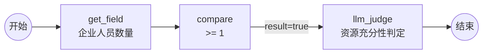

# 自定义节点（Skill）体系 - 功能设计 V1

> **版本**：V1.8 | **状态**：归档态 | **创建日期**：2026-08-17 | **归档日期**：2026-08-17 | **最近修订**：2026-08-17
>
> **归档原因**：V1.0→V1.8 讨论演进稿，已被 `80-功能设计/01-系统管理/工作流管理/自定义工作流引擎-功能设计-V1.md`（V1.2）全新重写取代（按项目全局规则 §2.4 扁平归档至 历史文档/）。
> **替代文档**：`80-功能设计/01-系统管理/工作流管理/自定义工作流引擎-功能设计-V1.md`（解释器为核心 + 节点体系 + Skill 5 表，当前唯一引擎详细设计）
>
> **关联文档**：
> - `审核规则库与工作流设计器-功能设计-V4.md`（模块总纲，**当前唯一权威**；本稿落实其 §4.4 Skill 规则、§5.6 Skill 描述结构、§6.4 Skill 管理 API、TODO #4/#6/#12）
> - `审核规则库与工作流设计器-功能设计-V4-评审报告.md`（§3.1 LabelTag 整改已完成、§3.3 GetTableSkill 占位代码、§四 缺陷整改清单 #6、§七 文档体系 05-Skill体系/）
> - `工作流引擎选型与技术研究-V1.md`（端口语义 workflow_config、Skill 四类）
> - `YZH特殊企业-工作流验证数据设计-V1.md`、`提取结果落库-功能设计-V1.md`（B-08/B-09 验证数据，已实施）
> - `核心工作原理-V1.md`（三引擎原理、Skill 组件化架构）
> - `项目全局规则.md`、`80-功能设计/README.md`（11 章模板规范）

> **本稿定位**：V4 明确"Skill 管理表独立设计延后（缺陷 F），Skill 体系完善后再设计"；本稿即该独立设计 + 自定义节点开发规范落地稿。
>
> **版本沿革**：
> - V1.1（2026-08-17）：用户四点补充——开始/结束控制流节点、循环 for-each 设计、输出类型统一 5 种、系统参数路径解析 `$sys.`、5 表结构。
> - V1.2（2026-08-17）：曾提出"AI 协调模式（LLM 驱动执行）"——**已被 V1.3 否决**。
> - V1.3（2026-08-17）：执行模型定稿——**解释器是唯一执行主体**，AI 是 Skill，提示词是解释器组装给 AI 消费的输入。
> - **V1.4（2026-08-17）三层执行架构**：联网研究 n8n / 扣子（Coze）后并入——确定性执行管道（第 1 层）→ 轨迹序列化 TRACE + Mermaid 流程图（第 2 层）→ AI 语义分析最终结果（第 3 层）。**数据提取先行**是执行计划的阶段 0。
> - **V1.5（2026-08-17）工作流三件套存储定稿**：业务行（cert_validation_rule / rpt_report_section）新增 `layout_json` 独立列（布局 UI 状态）；Markdown 流程图不落库（MermaidRenderer 按需生成，可选缓存 workflow_config.flowMarkdown）；提示词（glossary）已随 workflow_config JSON 保存；覆盖 V4“布局不入 JSON”决策；顺带废弃 rpt_report_section.section_json 冗余列。
> - **V1.6（2026-08-17）AI 节点（ai_node）引入**：内置通用 AI 节点 Skill——动态输入端口（画布节点声明）+ config.prompt 提示词组织输入 → LLM 生成结果 → 固定输出 content/json/confidence；节点带 title（作用说明）；节点独立运行（run-node 手动参数验证，解决节点测试）；与 loop 组合解决循环内逐项语义判断；不限数量。对应扣子“大模型节点”。
> - **V1.7（2026-08-17）解释器最简化 + 循环并入 ai_node**：用户定调——解释器 = 简单的确定性遍历引擎（Mermaid 流程图 + 按拓扑序灌数据/执行/传递/到 end 输出，不承载复杂业务逻辑）；**循环不再建独立引擎节点**，循环 = ai_node 的提示词用法（collection 整包 + 循环提示词 → LLM 一次调用输出 results 数组）；程序化 for-each 降级为可选增强（P2，仅当循环体需逐项执行确定性 skill 时）；控制流只剩 start/skill(含 ai_node)/branch/end。
> - **V1.8（2026-08-17）end 汇聚语义 + 参数体系重构（用户两点暴露）**：① 多分支汇聚到 end——end 为自然汇聚点（多入边），outputConfig 每引用独立解析（ref+default，未执行分支取 default/null 不整体失败）；② 静态契约不成立——输入参数是节点保存时才确定的动态命名参数（支持字面量/单引用/模板多引用拼接），输出契约分**强/弱两级**（确定性 skill 强校验 wf_skill_output；ai_node/循环弱约束，结构由提示词定义，下游引用 nX.json）；wf_skill 新增 output_strict 列；wf_skill_input 降级为"输入表单模板"。

---

## 一、功能概述

### 1.1 核心定位

Skill（自定义节点）是工作流 DAG 中节点的**唯一执行单元**。本功能建立从"开发一个新 Skill"到"画布上可拖拽使用"的完整闭环。

**执行模型（V1.4 三层架构，参照 n8n/扣子）**：

```
第 1 层  确定性执行管道（解释器 WorkflowEngine）—— 程序自动运行
         数据提取先行 → 参数注入（四级）→ 逐节点执行（skill/分支/循环）→ outputConfig
         对应 n8n 执行引擎 / 扣子图执行
第 2 层  轨迹序列化（TraceFormatter + MermaidRenderer）—— 让 AI 能"看懂"
         每节点 输入/输出/状态 → 符号包裹 TRACE；workflow → Mermaid 流程图
         对应扣子画布调试的"每节点输入输出展示"
第 3 层  AI 语义分析（PromptAssembler + AiAnalyzer）—— 产出最终结果
         Mermaid + glossary + TRACE（真实数据）+ 判定要求 → LLM → 最终判定
         对应扣子 LLM 节点 / 意图识别节点
```

```
开发一个自定义 Skill
  ① 写 C# 类实现 ISkillNode（method 型）或声明 API 端点（api 型）
  ② 前台页面登记 5 表元数据（主表/输入项/输出项/反射或API信息 + 提示词）
  ③ SkillRegistry 注册（DI 编译期 / 反射运行期 / api 包装器）
  ④ 前端节点面板自动出现（/api/skill/list-active 动态加载）
  ⑤ 画布拖入 → 连线 → 保存时生成名词解释（glossary）→ 校验 → 试运行（确定性执行）→ 保存
```

### 1.2 节点分类（总纲）

> 画布上的节点分两大类：**Skill 节点**（表注册，可扩展）与**控制流节点**（引擎内置，固定集）。

| 类别 | nodeType | 来源 | 执行方式 | 是否可扩展 |
|------|----------|------|---------|-----------|
| 功能性 Skill | skill | wf_skill 表（side_effect=1） | ISkillNode 反射 / api 包装器 | ✅ 表登记即扩展 |
| 逻辑性计算 Skill | skill | wf_skill 表（side_effect=0） | ISkillNode 反射（纯函数） | ✅ 表登记即扩展 |
| **AI 节点（通用）** | skill | wf_skill 表（ai_node，side_effect=1） | AiNodeSkill：提示词组织输入 → LLM → content/json/confidence | ✅ 每个节点实例独立配置提示词 |
| **控制流-开始** | start | 引擎内置 | 声明工作流输入，引擎注入 | 固定 |
| **控制流-结束** | end | 引擎内置 | 声明工作流输出（outputConfig） | 固定 |
| 控制流-条件分支 | branch | 引擎内置（现有 branches 机制） | 条件比较分流（确定性） | 固定 |
| **循环（AI 节点形态）** | skill（ai_node） | ai_node 提示词（V1.7 定稿：循环不建独立引擎节点） | collection 整包 + 循环提示词 → LLM 一次调用输出 results 数组；程序化 for-each 为可选增强（P2） | ✅ 提示词驱动 |

### 1.3 功能范围

| 能力 | 说明 |
|------|------|
| Skill 元数据管理 | 5 表 CRUD + 启停 + 提示词维护（主表/输入项/输出项/反射/API），全部前台页面维护 |
| Skill 注册链路 | 内置 method（DI）+ 自定义 method（反射）+ api（HttpClient 包装器）三路径 |
| Schema 契约 | 输入项/输出项表驱动，输出类型统一 5 种 |
| 系统参数解析 | `$sys.<路径>` 运行时解析（环境变量→系统配置），密钥不落库 |
| **第 1 层：解释器确定性执行** | WorkflowEngine：解析/校验/展开/拓扑排序/逐节点执行/输出收集，程序自动运行 |
| **第 2 层：轨迹序列化** | TraceFormatter（TRACE 协议，符号包裹）+ MermaidRenderer（workflow→Mermaid 流程图） |
| **第 3 层：AI 语义分析** | PromptAssembler 组装（Mermaid+glossary+TRACE+判定要求）→ AiAnalyzer → 最终结果 |
| 控制流节点 | 开始/结束/分支（现有）/循环（P2）引擎内置 |
| 前端面板动态化 | 节点面板按 category/icon/color 动态分组，端口由输入项/输出项表生成 |
| 自定义节点开发规范 | 从零开发一个 Skill 的步骤、命名、红线、验收标准 |

### 1.4 范围边界（不做）

| 事项 | 理由 |
|------|------|
| OCR 接入（IOcrExtractor 第三方实现） | V4 §0.2-10：Skill 体系不完善（OCR 未接入），本稿不解决 |
| AI 驱动执行/自动编排 | **V1.2 提出后由用户否决（V1.3）**：执行顺序由解释器决定，AI 分析的是执行结果 |
| 循环节点引擎实现 | 本稿设计结构与执行语义，实现归引擎 TODO（P2） |
| Skill 多版本管理 | V4 §4.1：一对一无多版本，`version` 列仅记录实现版本号 |
| 完整 JSON Schema 校验器 | 输出类型统一 5 种后，轻量校验已足够，完整实现后置 |
| Skill 测试沙箱 UI | V4 §0.2-8：后置（P4）；阶段 0 以 Skill 执行调试入口替代 |

---

## 二、业务背景与目标

### 2.1 现状核验结论（2026-08-17 代码/表/前端逐项核对）

| # | 核对项 | 代码/表事实 | 本稿处理 |
|---|--------|------------|---------|
| 1 | `ISkillNode` 接口 | `YZH.Core/Workflow/ISkillNode.cs` 存在：`SkillCode` + `ExecuteAsync(SkillContext, ct)` | 保留，不破坏 |
| 2 | `SkillContext` | 仅 Inputs/WorkflowInstanceId/NodeId/Logger；**缺 Config 与 BusinessContext**（V4 §5.6 契约要求） | **P0 升级** |
| 3 | `SkillResult` | Success/Outputs/Confidence/Error/DurationMs/PromptTokens/CompletionTokens | 满足，保留 |
| 4 | `SkillRegistry` | `YZH.Core/Workflow/SkillRegistry.cs` 仅支持 DI 注入 `IEnumerable<ISkillNode>`；无元数据同步、无 api 型包装、无反射加载 | **P0 升级** |
| 5 | `WorkflowEngine` | `YZH.Core/Workflow/WorkflowEngine.cs` 存在，但模型落后：snake_case（node_id/skill_code/output/from/to/output_config）、单值 Output、无 Config 字段；无 start/end/loop；无轨迹序列化 | **P0 升级 + 解释器完善**（§四） |
| 6 | 已实现 Skill | `YZH.Core/Skills/` 共 6 个类：`GetFieldSkill`(get_field)、`GetTableSkill`(get_table)、`DocumentExtractSkill`(document_extract)、`LlmExtractSkill`(llm_extract)、`CompareSkill`(compare，内含 date_diff 输入模式)、`AssembleSkill`(assemble) | 以这 6 个为准登记 |
| 7 | GetFieldSkill | **已整改**（评审报告 §3.1 方案 C）：入参 `field_code` + `enterprise_code` + `file_code`，按 enterprise_code 过滤 | 不再改 |
| 8 | GetTableSkill | **仍是占位代码**（评审报告 §3.3）：`Where(x => x.ExtractedJson != null)` 未按 table_code 过滤；实体缺 table_code 列 | **P0 修复（阶段 0 先行）** |
| 9 | wf_skill 表 | 实体 `VOL.Entity.CertPlatform.Wf.Skill` 存在（skill_code/skill_name/skill_type/input_schema/output_schema/endpoint_config/description/is_active + YZHBaseEntity 审计字段）；种子数据 10 行（phase7_workflow_engine.sql §4） | **5 表重构**（§5） |
| 10 | wf_skill 种子数据 | 种子 SkillCode：get_field/get_table/compare/date_diff/text_merge/llm_judge/llm_generate/create_nc/save_result/assemble_text —— **与实现严重不一致** | **种子整改**（§5.9） |
| 11 | skill_type 语义 | 种子用功能分类；V4 §5.6 定义为 method/api；评审报告 S4 标记严重级 | **语义归位**：skill_type=method/api，功能分类迁至 `category` 列（§5.2） |
| 12 | Skill CRUD 接口 | 全仓未检索到 WfSkillController | **新建**（§6） |
| 13 | DI 注册 | `YZHModule.RegisterWorkflowServices` 手动注册 6 个 Skill 为 `ISkillNode` | 保留，作为内置 method 型路径 |
| 14 | 前端节点面板 | `SkillPanel.vue` 分类/图标/颜色**硬编码**；`compiler.js` 已输出 camelCase 端口语义 JSON | **面板动态化**（§6.4） |
| 15 | 前端自定义节点 | `WorkflowDesigner.vue` 的 `registerSkillNode()` 是**空壳** | **通用 skillNode 注册**（§6.5） |
| 16 | 提示词体系 | 现无 AI 使用提示词、输出解读提示词、工作流名词解释概念 | **提示词落库 + PromptAssembler**（§4.9） |

### 2.2 目标

1. 5 表元数据体系落地，成为 Skill 唯一权威，全部前台页面维护。
2. Skill 清单与实现一一对应：**登记即可实现，可实现才可登记**。
3. 三条注册路径打通：内置 method（DI）/ 自定义 method（反射）/ api（HttpClient 包装器 + 系统参数鉴权）。
4. 前端节点面板与节点渲染动态化：新增 Skill 登记后画布自动可用，无需改前端代码。
5. 输出类型统一 5 种（string/number/date/boolean/json），Schema 契约可严格校验。
6. **第 1 层确定性执行**：解释器程序自动运行——数据提取先行、参数注入、逐节点执行、outputConfig。
7. **第 2 层轨迹序列化**：TRACE 协议（符号包裹真实数据）+ Mermaid 流程图，让 AI 看懂流程与结果。
8. **第 3 层 AI 语义分析**：Mermaid + glossary + TRACE + 判定要求 → LLM 产出最终结果。
9. 控制流节点（开始/结束/分支/循环）引擎内置；循环程序化 for-each（P2）。
10. 沉淀"自定义 Skill 开发规范"，让后续新增节点有章可循、可评审、可验收。

---

## 三、前置条件

> 以下为阻塞项，未完成前本模块无法正确工作。完成情况以 V4 TODO 状态为准。

| # | 前置条件 | 说明 | 阻塞点 |
|---|---------|------|--------|
| 1 | **WorkflowEngine 模型升级（V4 TODO #1）** | WorkflowNode/WorkflowEdge/WorkflowConfig 升级 camelCase + 端口语义 + nodeType + Config + Outputs 字典；ResolveInputs 解析 `ctx.*`/`nX.portName`；顶层新增 `glossary` 字段 | 节点 Config 无法传给 Skill，端口引用无法解析，glossary 无载体 |
| 2 | **SkillContext 升级** | 增加 `Config`（节点静态参数）与 `BusinessContext`（业务上下文） | 自定义 Skill 拿不到节点配置 |
| 3 | **GetTableSkill 修复 + `ent_table_extraction_result` 加 table_code 列** | 按 table_code + enterprise_code + file_code 过滤（评审 §3.3、§四-6）；**阶段 0 数据提取先行** | get_table 节点查不到正确数据 |
| 4 | **`rpt_report_section.workflow_config` 列** | V4 TODO #3，已规划 DDL | 报告章节挂接工作流 |
| 5 | **SysConfigResolver（系统参数解析器）** | `$sys.<路径>` 解析：环境变量 → 系统配置 | api 鉴权/url/默认值引用无法解析 |
| 6 | **LLM 网关（ILlmClient）** | 已有（YZH.Core/AI，Qwen/Ollama/Mock） | llm_judge/llm_extract 节点与第 3 层 AI 分析 |

> 说明：前置 1、2 属 V4 TODO #1 范畴，本稿给出 Skill 侧所需的增量规格（§4.5），具体模型对照见 V4 §5.8。前置 6 已具备。

---

## 四、业务规则

### 4.1 Skill 分类（三维度 + 控制流）

| 维度 | 取值 | 落库列 | 说明 |
|------|------|--------|------|
| 执行方式 | method（后台方法型）/ api（API 型） | `skill_type` | V4 §5.6 契约；决定 SkillRegistry 如何调用 |
| 功能分类 | data_access / data_process / ai_judge / ai_generate / output | `category` | 前端面板分组键（与现有 SkillPanel 5 分类对齐） |
| 副作用 | 功能性（有副作用）/ 逻辑性（无副作用） | `side_effect` | V4 §4.4；决定可缓存/可并行/重试策略 |
| 控制流 | start / end / branch / loop | 不落表（引擎内置） | 逻辑控制节点，非 Skill |

### 4.2 SkillCode 命名规范

- 全局唯一，snake_case（与 workflow_config JSON、前端一致）。
- 与实现类 `SkillCode => "xxx"` 常量、wf_skill 表 `skill_code` 三处一致（注册时强校验）。
- 禁止与既有 6 个 SkillCode 冲突；禁止与控制流节点保留字（start/end/branch/loop）冲突。

### 4.3 Schema 契约（输入项 / 输出项）

**输出类型统一 5 种（用户确认）**——解释器与校验器只处理这 5 种，复杂结构一律 json：

| output_type | 说明 |
|-------------|------|
| string | 字符串 |
| number | 数字（含整数/小数） |
| date | 日期/时间 |
| boolean | 布尔 |
| **json** | 一切复杂结构：数组/对象/表格/嵌套（get_table 的 rows、llm_extract 的 fields/tables） |

**输入类型**：

| input_type | 说明 | 画布表现 |
|------------|------|---------|
| text | 文本 | 文本框 |
| number | 数字 | 数字框 |
| date | 日期 | 日期选择 |
| boolean | 布尔 | 开关 |
| enum | 枚举 | 下拉（enum_values 列存选项 JSON） |
| field_ref | 自定义字段引用（cert_doc_field_def.field_code） | 数据源面板拖入 |
| table_ref | 定义表表格引用（cert_doc_table_def.table_code） | 数据源面板拖入 |
| json | JSON 结构 | JSON 编辑器 |

约束：
1. **端口名 camelCase**（全局 JSON 规范）；键名与 Skill 实现读取的 `context.Inputs` 键一致。
2. 输入项表 `is_required=1` 的端口，workflow_config 校验时（V4 §5.4 规则 3）必须被引用或由 `default_value`/`config` 提供。
3. 输入默认值与固定值可含 `$sys.<路径>` 系统参数引用（§4.8）。
4. 输入项/输出项一经登记并被 workflow_config 引用，即作为**冻结契约**；修改属破坏性变更（§八）。
5. **json 输出建议必填 output_prompt**（§4.9），供 PromptAssembler 组装 AI 解读说明。

#### 4.3.1 输入引用模板与输出契约分级（V1.8）

**a. 参数体系：命名 + 引用模板（"得到结果后替换命名"）**——每个节点 inputs 是命名参数集合，值支持三种形态，执行时 ResolveInputs 统一替换：

| 值形态 | 示例 | 说明 |
|--------|------|------|
| 字面量 | `"operator": ">="` | 直接值 |
| 单引用 | `"value": "n1.fieldValue"` | 引用一个节点输出 / `ctx.xxx` / `$sys.xxx`，执行时替换 |
| 模板（多引用拼接） | `"prompt": "条款{{ctx.clauseCode}} 分值是{{n2.fieldValue}}"` | 双大括号内多引用，整体替换 |

输入参数在**节点保存时确定**（画布上增删命名），不在 wf_skill_input 静态表中预先定义。

**b. 输出契约分级（强/弱）**：

| 级别 | 适用 | 输出定义 | 下游引用 |
|------|------|---------|---------|
| **强约束** | 确定性 skill（get_field/get_table/compare/assemble） | wf_skill_output 严格定义端口 + 5 类型，校验器强校验 | 安全：`nX.port` 类型确定 |
| **弱约束** | ai_node / 循环 | 固定通用端口 content/json/confidence，**具体结构由提示词定义** | 引用 `nX.json`，具体字段靠 TRACE 实际结果/人工/AI 理解 |

**c. 表结构影响（V1.8）**：wf_skill 主表新增 `output_strict` 列（1=严格输出校验，0=宽松放行）；wf_skill_input 定位降级为"输入表单模板"（画布生成表单用，非强校验）；校验器规则 3（端口 Schema 匹配）只对 output_strict=1 严格。

### 4.4 控制流节点设计（引擎内置）

#### 4.4.1 开始节点（start）

- 画布上可见可连线的引擎内置节点，一个工作流有且只有一个（扣子同款设计）。
- `outputs` 声明**工作流输入端口**：enterpriseCode / standardCode / phaseCode / fileCode / orgCode 等。
- 执行语义：引擎将 `WorkflowContext.Inputs` 注入 start 的输出端口，下游 skill 节点经 `start.端口名` 引用。

#### 4.4.2 结束节点（end）——多分支汇聚语义（V1.8）

- 画布上可见可连线的引擎内置节点，一个工作流有且只有一个（扣子同款设计）。
- **多入边汇聚（V1.8）**：允许多条边指向 end——"某条件不满足直接到 end"（直连边）与"所有条件满足才到 end"（汇聚）均支持。拓扑序里 end 排最后，所有前驱（含分支内节点）先执行或标记 skipped，天然满足汇聚等待，**不需要 join 节点**。
- `inputs` 声明**工作流输出端口**；`outputConfig` 每个引用**独立解析**（V1.8）：

```json
"outputConfig": {
  "isViolated": { "ref": "n4.decision", "default": false },
  "evidence":   { "ref": "n1.fieldValue" }
}
```

  - 分支未命中（n4 未执行）→ 取 `default`（默认值），**不整体失败**——"条件不满足直接到结束"天然成立
  - 无 default → 返回 null + TRACE 标记"未执行"
- 兼容策略：配置无 end 节点时，保留顶层 `outputConfig` 映射（现有行为，过渡期）。

#### 4.4.3 循环（AI 节点形态，V1.7 定稿）

> 硬需求：读取一个列表（get_table 的 rows / get_field 的 json 数组），针对列表中的人/时间逐项核验。
> **V1.7 定稿：循环不建独立引擎节点**——循环 = ai_node 的提示词用法：collection 整包 + 循环提示词（"逐项/遍历/汇总"写在 prompt 里），LLM 一次调用输出 results 数组。引擎不需要子图执行、不需要迭代防护。

```json
{
  "nodeId": "loop1",
  "title": "逐项核验培训记录",
  "skillCode": "ai_node",
  "config": {
    "prompt": "对输入的人员列表 {{input.collection}} 逐项核验：每人培训记录是否覆盖审核周期，输出 JSON 数组：[{\"name\":...,\"qualified\":bool,\"reason\":...}]",
    "jsonMode": true
  },
  "inputs": { "collection": "n1.rows" },
  "outputs": { "content": "string", "json": "json", "confidence": "number" }
}
```

| 要素 | 说明 |
|------|------|
| collection | 数组来源（上游节点输出端口，如 `n1.rows`）——数据需**整包准备好**（含逐项核验所需全部字段） |
| 循环提示词 | config.prompt 描述如何逐项处理（"逐项核验...输出 JSON 数组"） |
| 输出 | results 数组放 `json` 输出端口（jsonMode） |
| 空数组 | prompt 说明空数组返回 []，不报错 |

**执行语义**：解释器按普通 skill 节点执行（输入 collection 整包 → AiNodeSkill → LLM 一次调用 → results）——循环的"遍历"发生在 LLM 内部。

**程序化 for-each（可选增强，P2）**：仅当"循环体需要逐项执行确定性 skill（如每项单独 get_field 查 B-08）"时才需要，届时再引入子图执行；v1 的应对是把所需字段提前提取进 collection（get_table 返回含全部字段的行），不需要引擎改动。

#### 4.4.4 条件分支（branch）

- 现有机制（V4 branches），引擎内置，确定性比较判定（truthy/equals/gt/gte/lt/lte），不依赖 AI。
- 参照扣子"选择器节点"：多条件（且/或）+ 多分支 + 优先级；本稿第一版保持线性 then 子链，多分支后置。

### 4.5 SkillContext 升级规格（本稿增量）

```csharp
public class SkillContext
{
    public IDictionary<string, object> Inputs { get; set; } = new();
    public IDictionary<string, object> Config { get; set; } = new();   // 新增：节点静态参数 nodes[].config
    public string WorkflowInstanceId { get; set; } = string.Empty;
    public string NodeId { get; set; } = string.Empty;
    public ILogger? Logger { get; set; }
    public IDictionary<string, object>? BusinessContext { get; set; }   // 新增：业务上下文（企业/标准/阶段等）
}
```

- `WorkflowEngine.ExecuteNodeAsync` 构造 SkillContext 时：`Config = node.Config`、`BusinessContext = context.Inputs`。
- 向后兼容：Skill 实现读取不到新属性时按缺省处理，不抛异常。

### 4.6 注册规则（三路径）

| 路径 | 适用 | 注册方式 | SkillRegistry 加载 |
|------|------|---------|-------------------|
| 内置 method | 平台自带 Skill（现有 6 个） | YZHModule 手动 `RegisterType<XxxSkill>().As<ISkillNode>()`（现状保留） | 构造注入 `IEnumerable<ISkillNode>`（现状保留） |
| 自定义 method | 项目内新增 C# Skill | 表登记 class_path；运行期反射加载（**默认路径**，达成"只新增即可执行"） | 新增 `RegisterReflectedAsync`（DI 容器实例化，Autofac Resolve 优先） |
| api | 外部 HTTP 服务 | 仅登记 wf_skill_api 元数据，无需写 C# | 新增内置 `HttpApiSkillNode` 包装器（按元数据调 HttpClient） |

**反射必须走 DI 容器实例化**（不能裸 `Activator.CreateInstance`）：Skill 构造函数依赖 VOLContext/ILlmClient 等，由容器 Resolve 注入；参数经 `param_binding` 映射绑定。

注册校验（登记/启用时）：
1. method 型：class_path 可解析、类型实现 ISkillNode、SkillCode 一致；失败禁止启用。
2. api 型：url 非空、http_method ∈ {GET,POST}、auth_config/param_mapping/response_mapping 结构合法。
3. 与 5 表双向一致：**表内登记 ≠ 可执行**，`is_active=1` 且注册成功才算可用（校验器规则 2 依赖）。

### 4.7 评审红线（V4 §8.4）

1. 不得硬编码业务表主键。
2. 不得绕过 SkillContext 直连数据库（数据经 Inputs/Config 传入，DB 依赖经 DI 注入）。
3. 不得依赖隐式状态（每次 ExecuteAsync 幂等自足）。
4. 逻辑性 Skill（side_effect=0）禁止产生副作用；功能性 Skill 输出必须含 confidence（可空）。
5. **密钥不落库**：一切第三方凭证经 `$sys.<路径>` 运行时解析（§4.8）。

### 4.8 系统参数路径解析

**语法**：`$sys.<路径>`，如：

| 示例 | 含义 |
|------|------|
| `$sys.SKILL_API_KEY_LLM` | 环境变量（约定 `SKILL_API_KEY_<SKILL_CODE大写>`） |
| `$sys.llm.apiKey` | 系统配置（appsettings / 系统参数表，点分路径） |
| `$sys.minio.endpoint` | 系统配置嵌套路径 |

**解析器**：`ISysConfigResolver.Resolve(path)`，查找顺序：环境变量 → 系统配置（表/配置文件）→ 返回 null。

**使用位置**：

| 位置 | 说明 |
|------|------|
| wf_skill_api.url | 接口地址可含 `$sys.` 前缀（如基础地址） |
| wf_skill_api.headers | 请求头值可含 `$sys.` 引用 |
| wf_skill_api.auth_config | **token/API Key 引用**（如 `{"type":"bearer","tokenSource":"$sys.SKILL_API_KEY_LLM"}`），密钥不落库 |
| wf_skill_input.default_value | 输入默认值可含 `$sys.` 引用 |

**执行时**：api 调用 / 反射参数绑定前统一解析，解析不到返回明确错误（§八）。

### 4.9 三层执行架构（V1.4 定稿）

> **核心原则（V1.3 用户纠正 + V1.4 深化）**：解释器是唯一执行主体，程序自动运行得到真实数据与真实结果（第 1 层）；执行轨迹用符号包裹成 TRACE、工作流渲染成 Mermaid 流程图（第 2 层）；AI 分析轨迹产出最终语义结果（第 3 层）。**AI 不决定执行顺序，AI 分析的是执行结果**。

#### 4.9.1 第 1 层：解释器执行流水线（WorkflowEngine，程序自动运行）

```
输入：workflow_config JSON + WorkflowContext(Inputs/BusinessType/BusinessCode/LogStore)
① 解析       camelCase 反序列化（含 start/end/branches/loop/glossary/outputConfig）
② 校验       V4 §5.4 八项：结构/节点Skill存在/端口Schema匹配/端口引用/无环/数据源存在/输出完整/一对一
③ 展开       branches → 条件边；loop body → 子图执行单元（递归点）
④ 拓扑排序   Kahn 算法：start 最前、end 最后；成环 → 报错
⑤ 执行+输出  逐节点执行（数据提取先行 → 参数注入 → Skill 调用 → 端口输出 → 日志）
            → end 收集 → outputConfig 解析
输出：WorkflowRunResult { Success, NodeOutputs, OutputConfig, FailedNodeId, Error,
                          DurationMs, PromptTokens, Trace(TRACE 序列), Mermaid }
```

> **V1.7 确认（用户定调）**：解释器只负责"按图遍历、灌数据、执行、传递、到结束"——① 生成 AI 可读的 Mermaid 流程图；② 按拓扑顺序从第一个节点开始解析输入（灌数据）→ 执行 skill → 结果传递/逻辑判定 → 下一个节点；③ 直到 end 输出最终结果。**不生成复杂结构让 AI 读懂，不承载复杂业务逻辑**——复杂逻辑全部下沉到节点（尤其 ai_node 提示词，含循环）。

#### 4.9.2 参数注入（四级解析，每次 ResolveInputs 按序取第一个命中的值）

| 优先级 | 来源 | 示例 |
|--------|------|------|
| 1 | 节点 inputs 字面量 / config 静态参数 | `"operator": ">="` |
| 2 | 端口引用（上游输出） | `"value": "n1.fieldValue"` |
| 3 | 上下文引用（工作流输入） | `"enterpriseCode": "ctx.enterpriseCode"` |
| 4 | 系统参数 | `"threshold": "$sys.audit.minScore"` |

**V1.8 扩展——模板形态**：值还可为双大括号模板（多引用拼接），如 `"prompt": "条款{{ctx.clauseCode}} 分值是{{n2.fieldValue}}"`——按 `ctx.*`/`nX.portName`/`$sys.*` 逐段替换；纯字面量不包含 `{{`/`nX.`/`ctx.` 前缀时原样返回。

兜底：输入项表 `default_value`（表单模板提示）；`is_required=1` 且解析为空 → 校验期拦截（保存即失败，output_strict=1 的 skill 严格；ai_node 放行）。

#### 4.9.3 节点执行（5 种 nodeType）

| nodeType | 执行逻辑 |
|----------|---------|
| start | 将 `WorkflowContext.Inputs` 注入其输出端口，供下游 `start.xxx` 引用 |
| skill | ① 参数注入 ② `SkillRegistry.Get(skillCode)` ③ 构造 SkillContext ④ `ExecuteAsync` ⑤ 结果映射到输出端口 + 类型校验 ⑥ 写节点日志 |
| branch | 在 from 节点输出上判定条件 → 命中执行 then 子链；未命中整链跳过（status=skipped） |
| loop | 程序化 for-each（§4.4.3） |
| end | 收集上游输入端口值 → 组装 outputConfig |

#### 4.9.4 第 2 层：轨迹序列化（TraceFormatter + MermaidRenderer）

**TRACE 协议（符号包裹真实数据）**——每个节点执行后追加一条记录：

```
【工作流】<mermaid 图>
【节点:n1:get_field:success】
  输入: {"fieldCode":"HR_STAFF_COUNT","enterpriseCode":"YZH-STD-ENT"}
  输出: {"fieldValue":"25","confidence":0.98}
【节点:n2:compare:success】
  输入: {"value":"25","operator":">=","threshold":"1"}
  输出: {"result":true}
【分支:n3:命中】条件: n2.result=true → 执行 n4
【节点:n4:llm_judge:success】
  输出: {"decision":"资源充分","confidence":0.9}
【结束:outputConfig】{"isViolated":"false","evidence":"25"}
```

| TRACE 记录 | 内容 |
|-----------|------|
| 【工作流】 | Mermaid 流程图（结构） |
| 【节点:nodeId:skillCode:status】 | 输入参数（解析后真实值）+ 输出结果（真实值）+ 状态（success/failed/skipped） |
| 【分支:nodeId:命中/未命中】 | 判定条件 + 走向 |
| 【循环:loopId】 | items 数 + results 摘要 |
| 【结束:outputConfig】 | 最终输出映射结果 |

**MermaidRenderer（workflow → Mermaid 流程图）**：



节点标签 = `skillCode + skill_name`（skill 节点）/ `开始/结束/分支/循环`（控制流节点）；边标签 = 条件（branch）/ 端口（skill 连线）。

#### 4.9.5 第 3 层：AI 语义分析（PromptAssembler + AiAnalyzer）

AI 提示词结构（解释器组装）：

```
你是体系认证审核助手。以下是一个已执行的审核工作流：
## 工作流结构（Mermaid）
<mermaid 图>
## 名词解释（glossary）
<workflow_config.glossary>
## 执行轨迹（真实数据）
<TRACE 序列>
## 判定要求
依据 <standard_code> 条款 <clause_code>，判定是否违反，输出 JSON：
{ "isViolated": bool, "severity": "major|minor|observation", "ncDescription": "..." }
```

| 组件 | 来源 | 作用 |
|------|------|------|
| Mermaid 流程图 | MermaidRenderer | AI 理解流程结构 |
| glossary | workflow_config.glossary（保存时 AI 生成+人工编辑） | AI 理解整体意图 |
| TRACE 轨迹 | TraceFormatter（第 2 层产物） | AI 看到真实数据与结果 |
| 判定要求 | 上层业务（NC 规则 / 报告章节）组装 | AI 产出最终结果 |

**边界**：AI 分析的是执行结果（第 1 层产物），不决定执行顺序；第 3 层输出 = 上层可直接消费的最终结果（NC 判定写 audit_nonconformity、报告章节写 section_content）。

#### 4.9.6 输出契约（"得到想要的结果"）

```json
"outputConfig": {
  "isViolated": "n4.decision",
  "severity": "n5.severity",
  "description": "n5.assembledText",
  "evidence": "n1.fieldValue"
}
```

- outputConfig 值 = 端口引用，引擎执行完成后解析为最终结果字典。
- 上层消费：NC 判定 → 写 audit_nonconformity；报告章节 → 写 section_content；AI 语义分析 → 第 3 层判定。
- 端口缺失处理：end 输入引用的端口无值（分支未命中）→ 按 config 默认值 / 报"输出缺失"。

#### 4.9.7 完整执行示例（NC 7.1 资源提供）

```
start(enterpriseCode, phaseCode, fileCode)
n1 get_field   { fieldCode: "HR_STAFF_COUNT", enterpriseCode: "ctx.enterpriseCode" } → fieldValue/confidence
n2 compare     { value: "n1.fieldValue", operator: ">=", threshold: 1 } → result
n3 branch      from n2, condition { field: "result", op: "equals", value: true } → then [n4]
n4 llm_judge   { prompt: "依据人员名单判断资源是否充分", context: "n1.fieldValue" } → decision/confidence
end            { isViolated: "n4.decision", evidence: "n1.fieldValue" }
```

执行：拓扑序 `[start, n1, n2, n3, n4?, end]` → 每节点产出 TRACE 记录 → 执行完生成 Mermaid + TRACE → 第 3 层 AI 分析 → 最终判定。

### 4.10 AI 节点（ai_node，V1.6 引入）

> **定位**：内置通用 AI 节点 Skill——对应扣子"大模型节点"。确定性 skill 不好表达或不好通过解释器执行的逻辑（循环内逐项语义判断、跨数据源综合判断、文本组织/生成），都可用 ai_node 的提示词完成。**ai_node 是第 1 层的普通 Skill**（解释器按 DAG 位置调用），不驱动执行，输出照常进端口 → TRACE → 第 3 层 AI 分析。

#### 4.10.1 节点定义（动态输入 + 提示词 + 固定输出）

```json
{
  "nodeId": "n3",
  "title": "人员资质核验",                    ← 节点标题（作用说明，ai_node 必填）
  "skillCode": "ai_node",
  "config": {
    "prompt": "你是审核助手。依据输入的人员名单 {{input.staffList}} 判断资质是否满足 7.1 条款，输出 JSON：{\"qualified\":bool,\"reason\":string}",
    "jsonMode": true,
    "temperature": 0.1,
    "model": "qwen-plus",                   ← 可选，默认系统配置
    "maxTokens": 2048                        ← 可选
  },
  "inputs": { "staffList": "n1.rows" },    ← 动态输入端口（引用上游 nX.port / 上下文 ctx.xxx / 手动值）
  "outputs": { "content": "string", "json": "json", "confidence": "number" }
}
```

| 要素 | 设计 |
|------|------|
| 输入端口 | **动态**——每个节点实例在画布上自己声明（不走 wf_skill_input 静态表）；校验器对 ai_node 放行任意输入 |
| 提示词 | config.prompt，支持 `{{input.xxx}}` 引用输入；执行时渲染 + 输入数据 JSON 自动附上，AI 直接看到全部输入 |
| 输出端口 | 固定 3 个：`content`(string) + `json`(json，jsonMode 时) + `confidence`(number)，统一 5 类型约束 |
| 模型参数 | config 可覆盖 model/temperature/maxTokens，默认取系统配置；失败重试 1 次 |
| 标题 | 所有节点都加 `title` 字段（ai_node 必填）：画布显示、glossary 生成、TRACE 记录、PromptAssembler |
| 数量 | 工作流中**不限个数**，各带标题分段处理 |

#### 4.10.2 表建模

- wf_skill 主表登记一行：`skill_code=ai_node`，skill_name="AI节点(通用提示词)"，skill_type=method，category=ai_generate，side_effect=1，class_path=`YZH.Core.Skills.AiNodeSkill`，skill_prompt="用提示词组织输入数据，生成结果传递给下游；输出 content/json/confidence"
- 输入输出 schema 留空（动态）；校验器对 ai_node 特殊处理：任意输入端口合法、输出固定 3 端口
- **ai_node 与 wf_skill_input/output 解耦**：输入输出在 workflow_config 节点 JSON 上声明（V4 nodes[].inputs 本就是节点级）

#### 4.10.3 节点独立运行（手动参数验证，解决节点测试）

```
选中节点 → "运行此节点"按钮
  → POST /api/workflow-config/run-node
      { workflowConfig, nodeId, manualInputs: { "staffList": "[...]" } }
  → 只执行该节点：manualInputs 覆盖输入解析（未连线端口降级为手动值）
  → 返回该节点结果 + 单条 TRACE
```

- 不需要整条工作流连好就能测——先手动传参验证提示词效果，再连线接入
- ai_node 尤其受益：提示词写得好不好单独跑一次就知道
- 与阶段 0 的 `/api/skill/execute` 同源，run-node 是节点级扩展

#### 4.10.4 循环与复杂逻辑（V1.7 定稿：循环即 ai_node）

- **循环 = ai_node 的提示词用法**（§4.4.3）：collection 整包 + 循环提示词 → LLM 一次调用输出 results 数组；引擎无循环节点
- 复杂工作流 = 数据获取（get_field/get_table）→ ai_node 判断①（含循环）→ ai_node 判断② → assemble 组装，每段独立可测
- 程序化 for-each 为可选增强（P2），仅当循环体需逐项执行确定性 skill 时引入

---

## 五、数据设计

### 5.1 涉及表（5 表体系）

| 表 | 用途 | 关系 |
|----|------|------|
| **wf_skill** | Skill 主表（含 skill_prompt） | 1:N 输入项/输出项；1:1 反射或 API 信息 |
| **wf_skill_input** | 输入项明细 | FK → wf_skill.skill_code |
| **wf_skill_output** | 输出项明细（含 output_prompt，端口语义） | FK → wf_skill.skill_code |
| **wf_skill_reflection** | 反射信息（method 型 1:1） | FK → wf_skill.skill_code |
| **wf_skill_api** | API 信息（api 型 1:1） | FK → wf_skill.skill_code |
| cert_doc_field_def / cert_doc_table_def | 数据源引用校验（field_code/table_code） | 复用，不改 |
| ent_extraction_result (B-08) / ent_table_extraction_result (B-09) | get_field/get_table 运行时数据源 | get_table 修复需给 B-09 加 table_code 列 |
| wf_workflow_execution_log | 节点级执行日志 | 引用 skill_code，不改 |

### 5.2 wf_skill 主表

| 字段 | 类型 | 空 | 默认 | 说明 |
|------|------|----|------|------|
| id | bigint | N | 自增 | 主键（YZHBaseEntity） |
| code | varchar(100) | N | UUID | 业务编码（YZHBaseEntity） |
| **skill_code** | varchar(100) | N | — | Skill 编码，全局唯一（画布/JSON 引用键） |
| skill_name | varchar(200) | N | — | Skill 中文名（面板展示） |
| **skill_type** | varchar(20) | N | `method` | 执行方式：method / api（V4 §5.6，语义归位） |
| **category** | varchar(50) | N | `data_process` | 功能分类：data_access / data_process / ai_judge / ai_generate / output（面板分组键） |
| **side_effect** | tinyint(1) | N | `0` | 0=逻辑性（无副作用）/ 1=功能性（有副作用） |
| description | varchar(500) | Y | NULL | 作用说明 |
| **skill_prompt** | text | Y | NULL | **AI 使用提示词**：何时用/输入怎么给/输出怎么读/注意事项（PromptAssembler 使用） |
| **return_type** | varchar(20) | N | `json` | 主输出类型：string/number/date/boolean/**json**（统一约束；完整契约见输出项表） |
| **is_active** | tinyint(1) | N | `1` | 是否启用（登记/执行前提） |
| **output_strict** | tinyint(1) | N | `1` | 输出契约强度（V1.8）：1=严格按 wf_skill_output 校验（确定性 skill）；0=宽松（ai_node，放行任意输入 + 通用输出 content/json/confidence） |
| icon | varchar(50) | Y | NULL | 面板图标（emoji） |
| color | varchar(20) | Y | NULL | 节点颜色（hex） |
| sort_order | int | N | `0` | 面板排序 |
| version | varchar(20) | N | `1.0` | 实现版本（记录用，不做多版本管理） |
| enable / status / remark | — | — | — | YZHBaseEntity：系统级启停 / 业务状态 / 备注 |
| 审计字段 | — | — | — | YZHBaseEntity：create_id/creator/create_date/modify_id/modifier/modify_date/delete_id/deleter/delete_time |

> **V1.8 定位变更**：wf_skill_input / wf_skill_output 从"硬契约"降级——input 为**输入表单模板**（画布生成输入表单、提示默认值，非强校验；节点实例 inputs 是运行时真相，ai_node 完全动态）；output 为**强约束 skill 的输出契约**（output_strict=1 时强校验）；弱约束 skill（ai_node）输出不进表或只登记通用端口。

### 5.3 wf_skill_input 输入项表

| 字段 | 类型 | 空 | 默认 | 说明 |
|------|------|----|------|------|
| id / code | — | N | — | YZHBaseEntity 主键/业务编码 |
| **skill_code** | varchar(100) | N | — | 所属 Skill（FK → wf_skill.skill_code） |
| **input_name** | varchar(100) | N | — | 输入项名（端口名，camelCase） |
| input_label | varchar(200) | Y | NULL | 显示名（表单 label） |
| **input_type** | varchar(20) | N | `text` | text/number/date/boolean/enum/field_ref/table_ref/json（§4.3） |
| enum_values | text | Y | NULL | enum 选项 JSON（如 `["major","minor","observation"]`） |
| is_required | tinyint(1) | N | `0` | 是否必填 |
| default_value | varchar(500) | Y | NULL | 默认值（可含 `$sys.` 系统参数引用） |
| sort_order | int | N | `0` | 参数绑定顺序（method 反射按序/按名绑定） |
| 审计字段 | — | — | — | YZHBaseEntity |

### 5.4 wf_skill_output 输出项表

| 字段 | 类型 | 空 | 默认 | 说明 |
|------|------|----|------|------|
| id / code | — | N | — | YZHBaseEntity 主键/业务编码 |
| **skill_code** | varchar(100) | N | — | 所属 Skill（FK） |
| **output_name** | varchar(100) | N | — | 输出端口名（camelCase，edges.sourceHandle 引用） |
| **output_type** | varchar(20) | N | `json` | **统一 5 种**：string/number/date/boolean/json |
| **output_prompt** | text | Y | NULL | **输出解读提示词**：json 结构解读、字段含义、下游如何使用（PromptAssembler 使用；json 输出建议必填） |
| description | varchar(500) | Y | NULL | 输出说明 |
| sort_order | int | N | `0` | 排序 |
| 审计字段 | — | — | — | YZHBaseEntity |

### 5.5 wf_skill_reflection 反射信息表（method 型 1:1）

| 字段 | 类型 | 空 | 默认 | 说明 |
|------|------|----|------|------|
| id / code | — | N | — | YZHBaseEntity 主键/业务编码 |
| **skill_code** | varchar(100) | N | — | 所属 Skill（FK，uk） |
| **class_path** | varchar(500) | N | — | 反射的地址（程序集限定的类型全名） |
| **method_name** | varchar(200) | N | — | 反射的方法（如 ExecuteAsync） |
| **param_binding** | text | Y | NULL | 参数绑定 JSON：`{"输入项名": "方法参数名或顺序"}`；参数值经输入项传入 |
| 审计字段 | — | — | — | YZHBaseEntity |

> 实例化：DI 容器 Resolve（Autofac），构造函数依赖自动注入；反射加载失败禁止启用（§四 4.6）。

### 5.6 wf_skill_api API 信息表（api 型 1:1）

| 字段 | 类型 | 空 | 默认 | 说明 |
|------|------|----|------|------|
| id / code | — | N | — | YZHBaseEntity 主键/业务编码 |
| **skill_code** | varchar(100) | N | — | 所属 Skill（FK，uk） |
| **url** | varchar(500) | N | — | 接口地址（可含 `$sys.` 引用） |
| **http_method** | varchar(10) | N | `POST` | 接口方法：POST / GET |
| headers | text | Y | NULL | 请求头 JSON，值可含 `$sys.` 引用 |
| **auth_config** | text | Y | NULL | 鉴权 JSON：`{"type":"bearer","tokenSource":"$sys.SKILL_API_KEY_XXX"}`；**密钥不落库** |
| **param_mapping** | text | Y | NULL | 参数映射 JSON：`{"输入项名": "请求参数名"}`；GET 拼 query / POST 进 body；参数经输入项传入 |
| **response_mapping** | text | Y | NULL | 响应解析 JSON：`{"输出项名": "响应JSON路径"}`（如 `{"content":"$.data.content"}`）；输出与输出项表一致 |
| timeout_seconds | int | N | `30` | 超时（秒） |
| 审计字段 | — | — | — | YZHBaseEntity |

### 5.7 workflow_config 顶层新增字段

```json
{
  "version": 1,
  "workflowType": "validation",
  "glossary": "该工作流核验 7.1 条款：n1 读取企业营业执照企业名称；n2 比较提取分值是否>=60；n3 组装判定结论……",
  "nodes": [...],
  "edges": [...],
  "outputConfig": {...}
}
```

| 字段 | 类型 | 说明 |
|------|------|------|
| glossary | string（可空） | 工作流名词解释：各节点职责、连线含义、整体意图；PromptAssembler 组装 AI 输入时使用 |
| flowMarkdown | string（可空，可选缓存） | Mermaid 流程图缓存（保存时渲染，免重复计算）；**不建独立列**，可运行时由 MermaidRenderer 按需生成 |

> **布局不在此 JSON 内**：节点坐标/缩放/平移存业务行独立列 `layout_json`（§5.10），解释器不读；前端打开时读 layout_json 恢复位置，为空自动布局（dagre）。

### 5.8 表约束（DDL，硬保障）

```sql
-- ============ 5 表建表/升级（幂等，落 DB/mysql/phase10_wf_skill_upgrade.sql） ============

-- ① 主表：现有 wf_skill 保留，skill_type 语义归位，新增 category/side_effect/skill_prompt/return_type/icon/color/sort_order/version
ALTER TABLE wf_skill ADD COLUMN category VARCHAR(50) NOT NULL DEFAULT 'data_process' COMMENT '功能分类（面板分组）' AFTER skill_type;
ALTER TABLE wf_skill ADD COLUMN side_effect TINYINT(1) NOT NULL DEFAULT 0 COMMENT '副作用: 0=逻辑性 1=功能性' AFTER category;
ALTER TABLE wf_skill ADD COLUMN skill_prompt TEXT NULL COMMENT 'AI使用提示词: 何时用/输入怎么给/输出怎么读' AFTER description;
ALTER TABLE wf_skill ADD COLUMN return_type VARCHAR(20) NOT NULL DEFAULT 'json' COMMENT '主输出类型: string/number/date/boolean/json' AFTER skill_prompt;
ALTER TABLE wf_skill ADD COLUMN version VARCHAR(20) NOT NULL DEFAULT '1.0' COMMENT '实现版本' AFTER sort_order;
ALTER TABLE wf_skill ADD COLUMN icon VARCHAR(50) NULL COMMENT '面板图标' AFTER version;
ALTER TABLE wf_skill ADD COLUMN color VARCHAR(20) NULL COMMENT '节点颜色hex' AFTER icon;
ALTER TABLE wf_skill ADD COLUMN sort_order INT NOT NULL DEFAULT 0 COMMENT '面板排序' AFTER color;
ALTER TABLE wf_skill ADD COLUMN output_strict TINYINT(1) NOT NULL DEFAULT 1 COMMENT '输出契约强度: 1=严格按wf_skill_output校验(确定性skill) 0=宽松(ai_node放行任意输入+通用输出)' AFTER is_active;
ALTER TABLE wf_skill ADD UNIQUE KEY uk_wf_skill_code (skill_code);   -- 唯一约束：SkillCode 全局唯一
ALTER TABLE wf_skill ADD KEY idx_wf_skill_type (skill_type);
ALTER TABLE wf_skill ADD KEY idx_wf_skill_category (category);
ALTER TABLE wf_skill ADD KEY idx_wf_skill_active (is_active);

-- ② 输入项表（新建）
CREATE TABLE IF NOT EXISTS wf_skill_input (
  id BIGINT AUTO_INCREMENT PRIMARY KEY,
  code VARCHAR(100) NOT NULL COMMENT '业务编码',
  skill_code VARCHAR(100) NOT NULL COMMENT 'FK->wf_skill.skill_code',
  input_name VARCHAR(100) NOT NULL COMMENT '输入项名(端口名)',
  input_label VARCHAR(200) NULL COMMENT '显示名',
  input_type VARCHAR(20) NOT NULL DEFAULT 'text' COMMENT 'text/number/date/boolean/enum/field_ref/table_ref/json',
  enum_values TEXT NULL COMMENT 'enum选项JSON',
  is_required TINYINT(1) NOT NULL DEFAULT 0 COMMENT '是否必填',
  default_value VARCHAR(500) NULL COMMENT '默认值(可含$sys.引用)',
  sort_order INT NOT NULL DEFAULT 0 COMMENT '排序(反射参数绑定顺序)',
  enable TINYINT(1) NOT NULL DEFAULT 1, create_id INT NULL, creator VARCHAR(50) NULL, create_date DATETIME NULL,
  modify_id INT NULL, modifier VARCHAR(50) NULL, modify_date DATETIME NULL,
  delete_id INT NULL, deleter VARCHAR(50) NULL, delete_time DATETIME NULL,
  status VARCHAR(50) NULL DEFAULT 'active', remark VARCHAR(500) NULL,
  UNIQUE KEY uk_skill_input (skill_code, input_name),
  KEY idx_skill_input_skill (skill_code)
);

-- ③ 输出项表（新建，含 output_prompt）
CREATE TABLE IF NOT EXISTS wf_skill_output (
  id BIGINT AUTO_INCREMENT PRIMARY KEY,
  code VARCHAR(100) NOT NULL COMMENT '业务编码',
  skill_code VARCHAR(100) NOT NULL COMMENT 'FK->wf_skill.skill_code',
  output_name VARCHAR(100) NOT NULL COMMENT '输出端口名(edges.sourceHandle引用)',
  output_type VARCHAR(20) NOT NULL DEFAULT 'json' COMMENT '统一5种: string/number/date/boolean/json',
  output_prompt TEXT NULL COMMENT '输出解读提示词(json结构解读,PromptAssembler使用)',
  description VARCHAR(500) NULL COMMENT '输出说明',
  sort_order INT NOT NULL DEFAULT 0 COMMENT '排序',
  enable TINYINT(1) NOT NULL DEFAULT 1, create_id INT NULL, creator VARCHAR(50) NULL, create_date DATETIME NULL,
  modify_id INT NULL, modifier VARCHAR(50) NULL, modify_date DATETIME NULL,
  delete_id INT NULL, deleter VARCHAR(50) NULL, delete_time DATETIME NULL,
  status VARCHAR(50) NULL DEFAULT 'active', remark VARCHAR(500) NULL,
  UNIQUE KEY uk_skill_output (skill_code, output_name),
  KEY idx_skill_output_skill (skill_code)
);

-- ④ 反射信息表（新建，method 型 1:1）
CREATE TABLE IF NOT EXISTS wf_skill_reflection (
  id BIGINT AUTO_INCREMENT PRIMARY KEY,
  code VARCHAR(100) NOT NULL COMMENT '业务编码',
  skill_code VARCHAR(100) NOT NULL COMMENT 'FK->wf_skill.skill_code',
  class_path VARCHAR(500) NOT NULL COMMENT '反射的地址(类型全名)',
  method_name VARCHAR(200) NOT NULL COMMENT '反射的方法',
  param_binding TEXT NULL COMMENT '参数绑定JSON:{输入项名:方法参数名/顺序}',
  enable TINYINT(1) NOT NULL DEFAULT 1, create_id INT NULL, creator VARCHAR(50) NULL, create_date DATETIME NULL,
  modify_id INT NULL, modifier VARCHAR(50) NULL, modify_date DATETIME NULL,
  delete_id INT NULL, deleter VARCHAR(50) NULL, delete_time DATETIME NULL,
  status VARCHAR(50) NULL DEFAULT 'active', remark VARCHAR(500) NULL,
  UNIQUE KEY uk_skill_reflection (skill_code),
  CONSTRAINT fk_reflection_skill FOREIGN KEY (skill_code) REFERENCES wf_skill(skill_code)
);

-- ⑤ API 信息表（新建，api 型 1:1）
CREATE TABLE IF NOT EXISTS wf_skill_api (
  id BIGINT AUTO_INCREMENT PRIMARY KEY,
  code VARCHAR(100) NOT NULL COMMENT '业务编码',
  skill_code VARCHAR(100) NOT NULL COMMENT 'FK->wf_skill.skill_code',
  url VARCHAR(500) NOT NULL COMMENT '接口地址(可含$sys.引用)',
  http_method VARCHAR(10) NOT NULL DEFAULT 'POST' COMMENT 'POST/GET',
  headers TEXT NULL COMMENT '请求头JSON(值可含$sys.引用)',
  auth_config TEXT NULL COMMENT '鉴权JSON:{type,tokenSource:$sys.路径} 密钥不落库',
  param_mapping TEXT NULL COMMENT '参数映射JSON:{输入项名:请求参数名}',
  response_mapping TEXT NULL COMMENT '响应解析JSON:{输出项名:响应JSON路径}',
  timeout_seconds INT NOT NULL DEFAULT 30 COMMENT '超时秒',
  enable TINYINT(1) NOT NULL DEFAULT 1, create_id INT NULL, creator VARCHAR(50) NULL, create_date DATETIME NULL,
  modify_id INT NULL, modifier VARCHAR(50) NULL, modify_date DATETIME NULL,
  delete_id INT NULL, deleter VARCHAR(50) NULL, delete_time DATETIME NULL,
  status VARCHAR(50) NULL DEFAULT 'active', remark VARCHAR(500) NULL,
  UNIQUE KEY uk_skill_api (skill_code),
  CONSTRAINT fk_api_skill FOREIGN KEY (skill_code) REFERENCES wf_skill(skill_code)
);
```

### 5.9 实体变更与种子数据整改

**实体**（`VOL.Entity.CertPlatform.Wf`）：
- `Skill.cs` 新增：Category/SideEffect/SkillPrompt/ReturnType/Version/Icon/Color/SortOrder（`[Column]` snake_case）
- 新增：`SkillInput.cs`、`SkillOutput.cs`（含 OutputPrompt）、`SkillReflection.cs`、`SkillApi.cs` 四实体

**种子整改（原则：登记即可实现）**——现有 10 行整改为 6 行（以 `YZH.Core/Skills/` 实际实现为准）：

| SkillCode | 实现 | skill_type | category | side_effect | 输入项 | 输出项 |
|-----------|------|-----------|----------|-------------|--------|--------|
| get_field | GetFieldSkill | method | data_access | 1 | fieldCode/enterpriseCode/fileCode | fieldValue(json)/confidence(number)/isManualEdited(boolean) |
| get_table | GetTableSkill | method | data_access | 1 | tableCode/enterpriseCode/fileCode | rows(json)/confidence(number) |
| document_extract | DocumentExtractSkill | method | data_access | 1 | storagePath/convertedStoragePath/convertStatus/convertMessage | fullText(string)/sections(json)/tables(json)/sourceType(string) |
| llm_extract | LlmExtractSkill | method | ai_judge | 1 | documentContent/prompt/fieldsJson/tablesJson | fields(json)/tables(json)/rawJson(json) |
| compare | CompareSkill | method | data_process | 0 | value/operator/threshold/dateA/dateB/unit | result(boolean)/diff(number) |
| assemble | AssembleSkill | method | data_process | 0 | parts(json)/joiner(string) | assembledText(string) |
| **ai_node** | AiNodeSkill（V1.6 新增实现） | method | ai_generate | 1 | 动态（画布节点声明，不走静态表） | content(string)/json(json)/confidence(number) |

- 停用/清理不匹配行：date_diff（compare 输入模式）、text_merge（=assemble）、llm_judge（=llm_extract）、llm_generate（由 ai_node 取代，V1.6 实现）、create_nc/save_result/assemble_text（无实现，待实现后登记）
- 控制流节点（start/end/branch/loop）**不登记表**，由引擎内置 + 前端面板"控制流"分组提供
- 6 个内置 Skill 的 skill_prompt / output_prompt 初稿在种子脚本中一并维护（供 PromptAssembler 使用）

### 5.10 业务行字段（NC 检查项 / 报告章节项，V1.5 新增）

> **工作流三件套存储策略**：执行逻辑（nodes/edges/glossary）在 `rule_json`/`workflow_config` JSON 内；布局（UI 状态）在业务行独立列 `layout_json`；Markdown 流程图不落库（MermaidRenderer 按需生成，可选缓存 `flowMarkdown`）。解释器只读前者，前端两者都读。

```sql
-- cert_validation_rule（NC 检查项）新增布局列
ALTER TABLE cert_validation_rule ADD COLUMN layout_json TEXT NULL COMMENT '画布布局JSON(节点坐标/缩放/平移,UI恢复用,解释器不读)' AFTER rule_json;
-- rpt_report_section（报告章节项）新增布局列
ALTER TABLE rpt_report_section ADD COLUMN layout_json TEXT NULL COMMENT '画布布局JSON(节点坐标/缩放/平移,UI恢复用,解释器不读)' AFTER workflow_config;
-- 顺带废弃冗余列：rpt_report_section.section_json（phase7 旧列，V4 用 workflow_config）
-- 先确认无数据引用后按需 DROP COLUMN section_json
```

**layout_json 格式**（LogicFlow getGraphData 的 transforms + 节点坐标子集）：

```json
{
  "nodePositions": { "n1": {"x":100,"y":80}, "n2": {"x":320,"y":80}, "n3": {"x":540,"y":80} },
  "transforms": { "x": 0, "y": 0, "zoom": 1 }
}
```

**设计决策**：V4 §0.2-6 原定"布局不入 JSON，重新打开自动布局"——V1.5 演进为**布局存独立列**（保留手工布局 UX，同时保持执行配置纯净）；Markdown 是 nodes/edges 的确定性派生物，不落库避免冗余不一致。

---

## 六、接口设计

> 按 vol 框架惯例（POST 分页/删除）；错误处理统一：参数错误 400 + 明细、不存在 404、被引用/禁用冲突 409。

### 6.1 Skill 主表 CRUD（新建 WfSkillController）

| 接口 | 方法 | 路径 | 说明 | 错误处理 |
|------|------|------|------|---------|
| 分页 | POST | `/api/skill/page` | 按 skillType/category/isActive/skillCode 过滤 | 无数据返回空列表 |
| 详情 | POST | `/api/skill/detail` | 主表 + 输入项 + 输出项 + 反射/API 信息（编辑页全量） | 404 Not Found |
| 新建 | POST | `/api/skill` | 登记主表；skill_type=method 时校验 class_path 可实现 | 校验失败 400 + 明细 |
| 更新 | PUT | `/api/skill/{id}` | 被 workflow_config 引用时仅允许向后兼容变更（输入/输出只加不减） | 破坏性变更 409 |
| 删除 | POST | `/api/skill/delete/{id}` | 级联删输入项/输出项/反射/API；被引用 / is_active=1 禁止 | 409 Conflict |
| 启停 | POST | `/api/skill/{id}/toggle-active` | 启用前强校验（实现可加载 + 输入输出合法 + 反射/API 配置合法） | 校验失败 400 |
| 面板列表 | GET | `/api/skill/list-active` | is_active=1 全量（含 category/icon/color/sortOrder/输入项/输出项/**skill_prompt**），前端面板与 PromptAssembler 数据源 | 空列表 |
| **Skill 执行调试** | POST | `/api/skill/execute` | 传入 skillCode + 参数，单节点执行返回真实结果（阶段 0 数据提取验证入口） | 参数缺失 400 / 执行失败返回错误 |

### 6.2 子表维护接口（编辑页联动）

| 接口 | 方法 | 路径 | 说明 |
|------|------|------|------|
| 输入项维护 | POST | `/api/skill/input/save` | 按 skill_code 整体保存输入项列表（全量替换） |
| 输出项维护 | POST | `/api/skill/output/save` | 按 skill_code 整体保存输出项列表（含 output_prompt，全量替换） |
| 反射信息 | POST | `/api/skill/reflection/save` | 保存/更新反射信息（method 型） |
| API 信息 | POST | `/api/skill/api/save` | 保存/更新 API 信息（api 型） |

### 6.3 工作流配置校验与执行（含 glossary + 轨迹）

| 接口 | 方法 | 路径 | 说明 | 错误处理 |
|------|------|------|------|---------|
| 配置校验 | POST | `/api/workflow-config/validate` | V4 §5.4 八项规则（第 2/3 项依赖本表）+ glossary 可空校验 | 定位到节点/边/端口 |
| 试运行 | POST | `/api/workflow-config/run` | 传入 workflowConfig（含 glossary）+ 业务上下文，解释器确定性执行，返回 outputConfig + **TRACE + Mermaid** | 执行失败返回节点错误信息 |
| **节点独立运行** | POST | `/api/workflow-config/run-node` | 传入 workflowConfig + nodeId + manualInputs，只执行该节点（手动参数验证，V1.6） | 参数缺失 400 / 执行失败返回错误 |
| **名词解释生成** | POST | `/api/workflow-config/generate-glossary` | 传入 workflow_config JSON，AI 生成名词解释初稿（供保存时人工编辑） | AI 失败返回 502 + 提示人工编辑 |
| **AI 语义分析** | POST | `/api/workflow-config/analyze` | 传入 workflowConfig + 业务上下文，执行后组装 Mermaid+glossary+TRACE+判定要求 → LLM → 最终判定（第 3 层） | AI 失败返回 502 + 附 TRACE 供人工判定 |

**`/api/workflow-config/run` 请求体**：

```json
{
  "workflowConfig": { "... 含 glossary ..." },
  "context": {
    "enterpriseCode": "YZH-STD-ENT",
    "phaseCode": "S1",
    "standardCode": "ISO9001",
    "orgCode": "CB001"
  }
}
```

> 配置期试运行注入 `enterpriseCode: "YZH-STD-ENT"` 即可取到标准文档提取的真实数据（已实施，V4 §4.5.2）。

### 6.4 数据源选择树（V4 §6.4）

| 接口 | 方法 | 路径 | 说明 |
|------|------|------|------|
| 数据源树 | GET | `/api/skill/data-source-tree` | 机构→标准→文档→字段/表格（field_code/table_code 引用），供画布拖入 |

### 6.5 前端改造（面板动态化 + 提示词维护）

| # | 改动 | 说明 |
|---|------|------|
| 1 | `SkillPanel.vue` 数据源 | 删除硬编码 skillIcons/skillCategories，改由 props.skills（来自 `/api/skill/list-active`）携带 category/icon/color/输入项/输出项 |
| 2 | 分类渲染 | 按 `category` 动态分组；**控制流节点（开始/结束/分支/循环）固定一组"控制流"** |
| 3 | 节点样式 | `compiler.js` skillNodeColor/Stroke 改为按 skill.color 渲染（未配置回退默认） |
| 4 | 节点属性表单 | `NodePropertyForm.vue` 按输入项表动态生成表单（input_type 对应控件、enum 下拉、field_ref/table_ref 数据源面板拖入、必填标红） |
| 5 | 输出展示 | 节点卡片显示输出端口（输出项表），供连线 sourceHandle 选择 |
| 6 | **Skill 编辑页提示词** | 主表表单加 skill_prompt；输出项表单加 output_prompt |
| 7 | **保存时生成 glossary** | 设计器保存流程调用 `/api/workflow-config/generate-glossary` 生成初稿 → 弹窗人工编辑 → 随 workflow_config 保存 |
| 8 | **试运行结果展示** | `/api/workflow-config/run` 返回的 TRACE + Mermaid 在画布侧展示（对应扣子画布调试的节点输入输出） |

### 6.6 通用 skillNode 注册（LogicFlow）

```js
// WorkflowDesigner.vue —— 注册一个通用 skillNode，锚点/样式由 skill 元数据驱动
lf.register({
  type: 'skillNode',
  model: class SkillNodeModel extends RectNodeModel {
    setAttributes() {
      const { properties: { skill } } = this   // skill = 从 /api/skill/list-active 加载的元数据
      this.width = 180; this.height = 80 + (skill.inputs?.length + skill.outputs?.length) * 16
      this.fill = skill.color || '#F5F5F5'
      this.stroke = skill.color || '#9E9E9E'
      // 输入项 → target 锚点；输出项 → source 锚点
      this.anchorsOffset = [
        ...skill.inputs.map((inp, i) => ({ x: -this.width/2, y: -30 + i*20, isSourceAnchor: false, isTargetAnchor: true, id: `in_${inp.inputName}` })),
        ...skill.outputs.map((out, i) => ({ x: this.width/2, y: -30 + i*20, isSourceAnchor: true, isTargetAnchor: false, id: `out_${out.outputName}` }))
      ]
    }
  },
  view: SkillNodeView   // HtmlNode 渲染：图标 + skillName + 端口列表
})
```

新增 Skill 只需插表，前端零改动；控制流节点（start/end）用独立 nodeType 注册固定样式。

---

## 七、数据流 / 时序

### 7.1 开发一个自定义 Skill（全流程，前台页面维护）

```
管理员（前台页面）
  → 1. 新建 Skill 主表：skill_code/skill_name/skill_type/category/side_effect/description/skill_prompt/icon/color
  → 2. 维护输入项表：input_name/input_type/enum/is_required/default_value($sys.引用)/sort_order
  → 3. 维护输出项表：output_name/output_type(统一5种)/output_prompt(json解读)/sort_order
  → 4. method 型 → 填反射信息（class_path/method_name/param_binding）
       api 型   → 填 API 信息（url/http_method/headers/auth_config($sys.)/param_mapping/response_mapping）
  → 5. 保存（校验 class_path 可实现 / api 配置合法）→ 启用
  → 6. 前端面板自动出现 → 拖入画布 → 连线 → 保存时生成 glossary → 试运行（确定性执行）→ 保存
```

### 7.2 SkillRegistry 启动与运行期同步

```
应用启动
  → SkillRegistry 构造：DI 注册 6 个内置 Skill（现状保留）
  → InitializeAsync(wf_skill 全量)：遍历 is_active=1 的行
      ├─ method 型：DI 已注册 → 核对 SkillCode 一致；未注册 → 反射加载（class_path，DI 容器实例化）
      └─ api 型：登记元数据（HttpApiSkillNode 包装器，执行时按 wf_skill_api 调 HttpClient）
  → 记录加载结果（成功/失败/跳过）到启动日志

运行期（CRUD 变更后）
  → 新建/更新/启停 → SkillService 调用 registry.RegisterAsync/UnregisterAsync 增量同步
```

### 7.3 API 型 Skill 执行时序（含系统参数解析）

```
HttpApiSkillNode.ExecuteAsync(ctx)
  → SysConfigResolver 解析 url/headers/auth_config 中的 $sys.<路径>
  → param_mapping：GET 拼 query / POST 进 body（参数值来自 ResolveInputs 后的输入项）
  → HttpClient 调用（超时 timeout_seconds）
  → response_mapping：按 JSON 路径提取 → 映射到输出项（与输出项表一致）
  → 失败 → SkillResult{Success=false, Error} → 节点失败中止
```

### 7.4 第 1 层：工作流执行期（确定性解释器）

```
WorkflowEngine.RunAsync(json, context)
  → ① 解析（camelCase，含 start/end/branches/loop/glossary/outputConfig）
  → ② 校验（V4 §5.4 八项）
  → ③ 展开（branches 条件边；loop body 子图执行单元）
  → ④ 拓扑排序（Kahn：start 最前、end 最后；成环报错）
  → ⑤ 逐节点执行（每节点执行后写 TRACE 记录 + 节点日志）：
      start    → 注入工作流输入到输出端口
      skill    → 参数注入(四级) → SkillRegistry.Get → SkillContext{Inputs,Config,NodeId,BusinessContext,Logger}
                 → ExecuteAsync → 输出端口映射+类型校验
                 └─ 若为 AI Skill（llm_judge/llm_extract）：PromptAssembler 组装 prompt
      branch   → 条件比较判定 → 命中执行 then / 未命中跳过(skipped)
      loop     → 程序化 for-each（collection → 逐项执行 body 子图 → results）
      end      → 收集上游输入端口值
  → ⑥ outputConfig 解析（端口引用 → 最终值）
  → 返回 WorkflowRunResult（含 TRACE + Mermaid）
```

### 7.5 第 2 层：轨迹序列化（TraceFormatter + MermaidRenderer）

```
第 1 层执行完成
  → TraceFormatter：遍历节点执行记录 → 生成 TRACE 序列（【工作流】【节点】【分支】【循环】【结束】）
  → MermaidRenderer：workflow_config → Mermaid 流程图（graph LR，节点/边标签）
  → 写入 WorkflowRunResult.Trace / .Mermaid
```

### 7.6 第 3 层：AI 语义分析（PromptAssembler + AiAnalyzer）

```
上层业务（NC 判定 / 报告生成）
  → 调 /api/workflow-config/analyze（或内部调用）
  → 第 1 层执行 → 得到 TRACE + Mermaid
  → PromptAssembler 组装：
      ## 工作流结构（Mermaid）
      ## 名词解释（glossary）
      ## 执行轨迹（TRACE 真实数据）
      ## 判定要求（标准/条款/输出 JSON 契约）
  → LLM 分析 → 输出最终判定（isViolated/severity/ncDescription 或 sectionContent）
  → 上层消费：写 audit_nonconformity / section_content
```

### 7.7 循环执行（V1.7 定稿：循环 = ai_node，无需独立循环引擎）

```
循环节点（skillCode=ai_node）执行
  → 解析 collection（上游输出数组，整包数据）
  → 空数组 → LLM 返回 []，不报错（prompt 已说明）
  → AiNodeSkill：collection 整包 + 循环提示词 → LLM 一次调用
  → 输出 results 数组到 json 端口（写 TRACE：循环节点 输入/输出）

程序化 for-each（可选增强，P2）
  → 仅当循环体需逐项执行确定性 skill（每项查库/调 API）时引入
  → 届时：子图递归执行、item 注入、results 收集、maxIterations 防护
```

### 7.8 保存即生成名词解释（设计期）

```
设计器保存工作流
  → 调 /api/workflow-config/generate-glossary（传 workflow_config JSON，含 Mermaid 渲染）
  → AI 依据画布（Mermaid + 节点描述 + 技能提示词）生成名词解释初稿
  → 弹窗展示 → 管理员人工编辑确认
  → 随 workflow_config.glossary 一起保存（cert_validation_rule.rule_json / rpt_report_section.workflow_config）
```

---

## 八、边界与异常处理

| 场景 | 处理 |
|------|------|
| wf_skill 登记了但 SkillRegistry 未注册成功（class_path 错误/类型不匹配） | 启动日志告警；`/api/workflow-config/validate` 校验失败（规则 2）；is_active 强制回退提示 |
| 输入/输出项被 workflow_config 引用后修改（破坏性变更） | 校验失败并定位到引用节点；仅允许"只加不减"的向后兼容变更（409） |
| 删除被引用 / 启用的 Skill | 409 Conflict；先停用并解除引用 |
| `$sys.<路径>` 解析不到（环境变量/系统配置缺失） | 明确 Error（如"系统参数 $sys.SKILL_API_KEY_LLM 未配置"）；不落库密钥 |
| api 型调用失败/超时 | SkillResult.Success=false + Error；节点失败 → 工作流中止（V4 §十）；日志记录 |
| 反射加载失败（程序集/类型/构造函数异常） | 注册失败记日志；登记时校验拦截（禁止启用） |
| **AI Skill（llm_judge/llm_extract）调用失败/超时** | Skill 内部重试 1 次，仍失败 → 节点失败中止；执行日志记录 |
| **第 3 层 AI 分析失败/超时** | 返回 502 + 附 TRACE 供人工判定（AI 是分析层，失败不丢真实数据） |
| **glossary 为空** | 可保存（确定性执行不受影响）；PromptAssembler 组装时仅凭 Mermaid + TRACE + skill_prompt，效果降级 |
| **skill_prompt / output_prompt 为空** | AI Skill 的 prompt 组装降级（仅节点/连线/输出快照）；json 输出无 output_prompt 时 AI 需自行推断结构 |
| **end 输入端口无值（分支未命中/上游未执行）** | 按该引用 `default` 取默认值；无 default → null + TRACE 标记"未执行"；**不整体失败**（V1.8 多分支汇聚语义） |
| 循环 collection 为空数组 | results=[]，跳过 body，工作流继续（不报错） |
| 循环迭代超 maxIterations | 报错中止（防死循环） |
| 循环 body 内节点失败 | 记录失败项，默认中止（可配置继续） |
| 逻辑性 Skill 产生副作用（评审红线） | 代码评审拦截（测试阶段人工核查，不做运行时拦截） |
| get_field 查无数据（B-08 无该 field_code+enterprise_code） | 返回 Success=false + 明确 Error（现有行为），节点失败中止 |
| Skill 执行抛出未捕获异常 | WorkflowEngine 捕获 → SkillResult{Success=false}（现有行为） |
| 并发执行同一 Skill 节点 | 以 workflow_instance_id 隔离日志（V4 §十），Skill 内不做业务级补偿 |

---

## 九、测试要点

### 9.1 单元测试（YZH.Core.Tests）

- 输入/输出 Schema 校验：input_type/output_type 5 种枚举、required、enum 越界。
- SkillRegistry：DI 注入注册、反射注册（合法/非法 class_path）、api 型包装器请求组装与响应解析（param_mapping/response_mapping）、注销。
- SysConfigResolver：环境变量 → 系统配置 → null 三级解析；`$sys.` 嵌套路径。
- SkillContext 升级：Config/BusinessContext 传递正确性。
- **WorkflowEngine（第 1 层）**：拓扑排序（线性/并行/分支/含环）、参数注入四级解析、start/end 节点注入与收集、branch 命中/未命中、outputConfig 端口引用解析、end 输入缺失报错。
- **TraceFormatter（第 2 层）**：TRACE 协议格式（节点/分支/循环/结束记录）、真实输入输出嵌入、状态标注。
- **MermaidRenderer（第 2 层）**：workflow_config → Mermaid 图正确性（节点标签/边标签/条件）。
- **PromptAssembler / AiAnalyzer（第 3 层，P2）**：AI 上下文组装（Mermaid+glossary+TRACE+判定要求）、输出 JSON 契约解析、AI 失败附 TRACE。
- **循环（P2）**：collection 空数组跳过、逐项执行 body、results 汇总、maxIterations 防护、body 失败中止。
- 6 个内置 Skill 边界用例：get_field（缺参/无数据/多企业隔离）、get_table（table_code 过滤）、compare（数字/日期/not_empty）、assemble（parts 拼接）、document_extract（pending/failed/ocr_required 分支）、llm_extract（JSON 重试）。

### 9.2 集成测试（API）

- wf_skill 5 表 CRUD 全流程：新建主表 → 维护输入项/输出项（含提示词）→ method 填反射 / api 填接口 → 校验 → 启用 → 面板列表可见 → 更新（破坏性变更 409）→ 删除（被引用 409）。
- **阶段 0 数据链路**：`/api/skill/execute` 传真实参数（YZH-STD-ENT + fieldCode/tableCode）→ get_field/get_table 返回真实提取值。
- 登记-执行闭环：登记新 Skill → workflow_config 引用 → run 执行成功 → 返回 outputConfig + TRACE + Mermaid → 执行日志落库。
- api 型端到端：`$sys.` 鉴权解析 → GET/POST 调用 → response_mapping 输出。
- **generate-glossary**：传入工作流 JSON → 返回名词解释初稿。
- **analyze（第 3 层）**：NC 规则工作流 → run → analyze → 最终判定 JSON 正确。
- data-source-tree 返回机构→标准→文档→字段/表格层级。
- 自定义 method Skill 反射路径端到端（示例 Skill 见 §十 TODO #15）。

### 9.3 前端测试

- 面板动态加载：新增 Skill 后无需改代码即出现在正确分类；icon/color 生效；控制流节点固定分组。
- 节点属性表单由输入项表生成：input_type 对应控件、enum 下拉、field_ref/table_ref 拖入、必填标红。
- Skill 编辑页：skill_prompt / output_prompt 编辑保存。
- 保存流程：generate-glossary 初稿 → 人工编辑 → 随 workflow_config 保存 → 重开回显。
- **试运行结果展示**：run 返回的 TRACE + Mermaid 在画布侧渲染（每节点输入输出）。
- 画布往返：拖入自定义 Skill → 连线（sourceHandle 引用输出项端口）→ 保存 → 重开自动布局 → JSON 一致。

---

## 十、TODO 执行计划

> 每项标注 `[ ]` 未开始 / `[~]` 进行中 / `[x]` 已完成(日期)。全部完成才可标"已实施"。
> **阶段 0（数据提取先行）为后续一切的地基**：先拿到真实数据与真实结果，再谈解释器与 AI 分析。

| # | 任务 | 优先级 | 依赖 | 状态 | 说明 |
|---|------|--------|------|------|------|
| **阶段 0：数据提取先行（用户定调：首先解决数据提取）** |
| 0-1 | **GetTableSkill 修复**：按 table_code + enterprise_code + file_code 过滤；`ent_table_extraction_result` 新增 table_code 列（DDL + 实体） | P0 | 无 | [ ] | 评审 §3.3/§四-6 |
| 0-2 | **Skill 执行调试入口**：`/api/skill/execute`（skillCode + 参数 → 真实结果），用 YZH-STD-ENT 真实参数触发 get_field/get_table | P0 | 0-1 | [ ] | §6.1；验证 B-08/B-09 数据链路 |
| 0-3 | **验证数据链路确认**：规则保存 → B-08/B-09 落库 → skill 执行 → 真实提取值（全链路 smoke test） | P0 | 0-2 | [ ] | V4 §4.5.2 已实施，此处闭环验证 |
| **阶段 1：Skill 体系（元数据层）** |
| 1-1 | **5 表 DDL**：wf_skill 加列（含 skill_prompt）+ wf_skill_input/output(含 output_prompt)/reflection/api 四表新建（唯一约束/外键）；落 `DB/mysql/phase10_wf_skill_upgrade.sql`（幂等） | P0 | 无 | [ ] | §5.8 |
| 1-2 | **5 表种子整改**：停用 7 行不匹配 Skill；6 个已实现 Skill 的主表/输入项/输出项元数据落位 | P0 | 1-1 | [ ] | §5.9 |
| 1-3 | **5 表实体 + CRUD**：Skill.cs 加列、四实体、WfSkillController + SkillService CRUD/启停/子表保存 | P0 | 1-1 | [ ] | V4 TODO #4 |
| 1-4 | **SysConfigResolver 实现**：`$sys.<路径>` 解析（环境变量→系统配置），注入 DI | P0 | 无 | [ ] | §4.8 |
| 1-5 | **SkillRegistry 升级**：InitializeAsync 元数据同步 + 反射注册路径（DI 容器实例化）+ HttpApiSkillNode 包装器 + `$sys.` 鉴权 | P0 | 1-3,1-4 | [ ] | V4 TODO #6 增强 |
| 1-6 | **Skill 校验器**：输入/输出类型 5 种枚举 + required + `$sys.` 引用合法性 | P0 | 1-3 | [ ] | V4 TODO #5 |
| 1-7 | **前端面板动态化**：SkillPanel 按 category/icon/color 动态渲染；NodePropertyForm 按输入项表生成表单；控制流节点分组 | P1 | 1-3,1-6 | [ ] | §6.5 |
| 1-8 | **通用 skillNode 注册（LogicFlow）**：model 按 skill 元数据动态生成输入/输出锚点；start/end 节点独立注册 | P1 | 1-7 | [ ] | §6.6 |
| **阶段 2：第 1 层解释器（确定性执行）** |
| 2-1 | **WorkflowEngine 模型升级（V4 TODO #1）**：camelCase + nodeType + Config + Outputs；ResolveInputs 四级解析；顶层 glossary | P0 | 无 | [ ] | V4 §5.8 |
| 2-2 | **SkillContext 升级**：Config + BusinessContext | P0 | 2-1 | [ ] | §4.5 |
| 2-3 | **解释器核心流水线**：解析/校验/展开/拓扑排序/逐节点执行（start/skill/branch/end）/outputConfig 解析/end 缺失报错 | P2 | 2-1,1-5 | [ ] | §4.9.1-4.9.3 |
| 2-4 | **开始/结束节点引擎支持** | P1 | 2-3 | [ ] | §4.4.1/4.4.2 |
| 2-5 | **循环引擎实现（程序化 for-each）【可选增强】**:子图递归执行、item 注入、results 收集、maxIterations 防护（仅当循环体需逐项执行确定性 skill 时） | P2+ | 2-3 | [ ] | V1.7 定稿：第一版循环 = ai_node 提示词，无需引擎循环 |
| **阶段 3：第 2 层轨迹序列化** |
| 3-1 | **TraceFormatter 实现**：TRACE 协议（节点/分支/循环/结束记录，符号包裹真实数据） | P1 | 2-3 | [ ] | §4.9.4/§7.5 |
| 3-2 | **MermaidRenderer 实现**：workflow_config → Mermaid 流程图（节点/边标签） | P1 | 2-1 | [ ] | §4.9.4/§7.5 |
| 3-3 | **试运行结果展示**：run 返回 TRACE + Mermaid，前端画布侧渲染 | P1 | 3-1,3-2 | [ ] | §6.5-8 |
| **阶段 4：第 3 层 AI 语义分析** |
| 4-1 | **三级提示词落库**：6 个内置 Skill 的 skill_prompt / output_prompt 初稿；编辑页提示词表单 | P1 | 1-2,1-3 | [ ] | §4.9.4 |
| 4-2 | **glossary 生成**：`/api/workflow-config/generate-glossary` + 保存流程集成（AI 生成初稿 + 人工编辑） | P1 | 1-6,4-1 | [ ] | §7.8 |
| 4-3 | **PromptAssembler + AiAnalyzer 实现**：组装 Mermaid+glossary+TRACE+判定要求 → LLM → 最终判定；`/api/workflow-config/analyze` | P2 | 3-1,3-2,4-2 | [ ] | §4.9.5/§7.6 |
| **阶段 5：验收与沉淀** |
| 5-1 | **自定义 Skill 示例落地**：clause_check 示例（读取 get_field 输出做条款比对），走通 前台登记→面板→画布→保存(glossary)→试运行→日志→AI 分析 全链路 | P1 | 1-8,2-3,4-3 | [ ] | 首个自定义节点验收 |
| 5-2 | **Skill 开发规范沉淀**：本稿内容固化为前台操作指南 + 示例代码模板 | P1 | 5-1 | [ ] | 供后续新增节点复用 |
| 5-3 | **测试**：单元（§9.1）+ 集成（§9.2）+ 前端（§9.3）全绿 | P1 | 各阶段 | [ ] | |
| 5-4 | **登记功能总览表**：80-功能设计/README.md §2.2 工作流管理新增本稿条目 | P2 | 5-3 | [ ] | |
| 5-5 | Skill 集扩展（OCR 接入研究、create_nc/save_result/assemble_text 实现后登记） | P4 | 5-3 | [ ] | V4 TODO #15 |
| **AI 节点（V1.6）** |
| 6-1 | **AiNodeSkill 实现**：动态输入 + config.prompt 渲染（{{input.xxx}} + 输入 JSON 附加）+ LLM 调用 + content/json/confidence 输出；wf_skill 登记 ai_node 行 | P1 | 1-5,2-2 | [ ] | §4.10.1/4.10.2 |
| 6-2 | **节点 title 支持**：workflow_config 节点 JSON 增加 title 字段；画布显示/glossary/TRACE/PromptAssembler 使用 | P1 | 2-1 | [ ] | §4.10.1 |
| 6-3 | **节点独立运行 run-node**：`/api/workflow-config/run-node`（manualInputs 覆盖输入解析）+ 前端"运行此节点"按钮 | P1 | 3-3,6-1 | [ ] | §4.10.3 |
| 6-4 | **循环即 ai_node 验证**：collection 整包 + 循环提示词 → LLM 输出 results 数组；空数组/失败策略验证 | P1 | 6-1 | [ ] | §4.4.3/§7.7 |
| **V1.8 修订** |
| 7-1 | **输出契约分级落地**：wf_skill 加 output_strict 列（DDL+实体+种子：ai_node=0，其余=1）；校验器规则 3 对 output_strict=0 放行 | P1 | 1-3,1-6 | [ ] | §4.3.1/§5.2 |
| 7-2 | **end 汇聚语义**：多入边汇聚、outputConfig 引用独立解析（ref+default）、未执行→default/null 不失败、TRACE 标记 | P2 | 2-3 | [ ] | §4.4.2 |
| 7-3 | **输入引用模板**：ResolveInputs 支持模板形态（{{...}} 多引用拼接 + 命名替换） | P2 | 2-1 | [ ] | §4.3.1/§4.9.2 |

---

## 十一、章节变更记录

| 日期 | 版本 | 变更内容 |
|------|------|---------|
| 2026-08-17 | V1.8 | **end 汇聚语义 + 参数体系重构**：① 多分支汇聚到 end（多入边，outputConfig 引用独立解析 ref+default，未执行分支取 default/null 不整体失败，§4.4.2）；② 输入参数 = 节点保存时确定的动态命名参数（字面量/单引用/模板多引用拼接，§4.3.1/§4.9.2）；③ 输出契约分级强/弱（确定性 skill 强校验 wf_skill_output；ai_node/循环弱约束，结构由提示词定义，§4.3.1）；④ wf_skill 新增 output_strict 列（§5.2/§5.8）；wf_skill_input 降级为输入表单模板（§5.3）；TODO 新增 7-1~7-3 |
| 2026-08-17 | V1.7 | **解释器最简化 + 循环并入 ai_node**：用户定调——解释器 = 简单的确定性遍历引擎（Mermaid 流程图 + 按拓扑序灌数据/执行/传递/到 end 输出，不承载复杂业务逻辑，§4.9.1）；循环不建独立引擎节点，循环 = ai_node 提示词用法（§4.4.3/§7.7），程序化 for-each 降级可选增强 P2+（§十 2-5）；控制流只剩 start/skill(含 ai_node)/branch/end |
| 2026-08-17 | V1.6 | **AI 节点（ai_node）引入**：通用 AI 节点 Skill（§4.10）——动态输入端口（画布节点声明，不走静态表）+ config.prompt 提示词组织输入 → LLM → 固定输出 content/json/confidence；节点 title 字段；节点独立运行 run-node 手动参数验证（解决节点测试）；loop + ai_node 组合解决循环内逐项语义判断；不限数量；wf_skill 新增 ai_node 行（llm_generate 由 ai_node 取代）；TODO 新增 6-1~6-4 |
| 2026-08-17 | V1.5 | **工作流三件套存储定稿**：业务行新增 `layout_json` 独立列（布局 UI 状态，解释器不读）；Markdown 流程图不落库（MermaidRenderer 按需生成，可选缓存 workflow_config.flowMarkdown）；提示词（glossary）已随 workflow_config JSON 保存；覆盖 V4"布局不入 JSON"决策；废弃 rpt_report_section.section_json 冗余列（§5.10） |
| 2026-08-17 | V1.4 | **三层执行架构定稿**：联网研究 n8n/扣子后并入——第 1 层确定性执行管道（数据提取先行→参数注入→逐节点执行→outputConfig）、第 2 层轨迹序列化（TRACE 协议符号包裹真实数据 + Mermaid 流程图）、第 3 层 AI 语义分析（Mermaid+glossary+TRACE+判定要求→LLM→最终结果）；执行计划改为阶段 0-5（数据提取先行）；新增 /api/skill/execute 调试入口与 /api/workflow-config/analyze |
| 2026-08-17 | V1.3 | 执行模型定稿（用户纠正）：否决 V1.2 的"AI 协调模式"；解释器是唯一执行主体；AI 是 Skill、提示词是解释器组装给 AI 消费的输入；循环改回程序化 for-each |
| 2026-08-17 | V1.2 | 曾提出 AI 协调模式（LLM 驱动执行）——已被 V1.3 否决，仅留版本记录 |
| 2026-08-17 | V1.1 | 合并用户四点补充：开始/结束控制流节点、循环 for-each 设计、输出类型统一 5 种、系统参数路径解析 `$sys.`、5 表结构 |
| 2026-08-17 | V1.0 | 初稿：基于 V4 总纲与评审报告，落地 Skill 管理表独立设计（缺陷 F）+ 自定义节点开发规范 |

---

*（内容由AI生成，仅供参考）*
